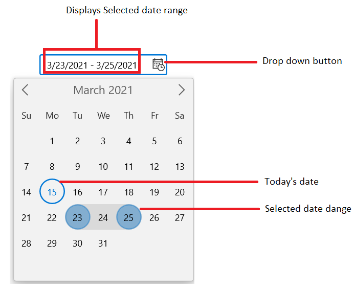
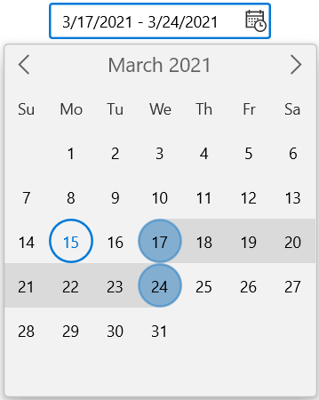
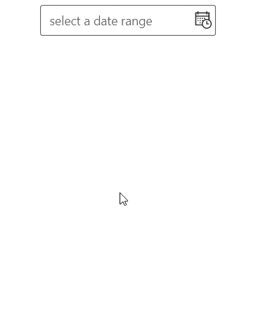

# Getting Started with WinUI Calendar DateRange Picker

This section explains the steps required to add the [WinUI Calendar DateRange Picker](https://www.syncfusion.com/winui-controls/calendar-daterangepicker) control and its date range selection options. 

## Structure of Calendar DateRange Picker control

## Creating an application with WinUI Calendar DateRange Picker

In this walkthrough, you will create a WinUI application that contains the `Calendar DateRange Picker` control.

## Adding control manually in XAML

To add `Calendar DateRange Picker` control manually in XAML , follow the below steps.

1. Create a [WinUI 3 desktop app for C# and .NET 5](https://docs.microsoft.com/en-us/windows/apps/winui/winui3/get-started-winui3-for-desktop) or [WinUI 3 app in UWP for C#](https://docs.microsoft.com/en-us/windows/apps/winui/winui3/get-started-winui3-for-uwp).
2.  Download and refer the following NuGet in the project.

    * [Syncfusion.Calendar.WinUI](https://www.nuget.org/packages/Syncfusion.Calendar.WinUI)

3. Import the control namespace `Syncfusion.UI.Xaml.Calendar` in XAML page.
4. Initialize the `Calendar DateRange Picker` control.




<Page
    x:Class="GettingStarted.MainPage"
    xmlns="http://schemas.microsoft.com/winfx/2006/xaml/presentation"
    xmlns:x="http://schemas.microsoft.com/winfx/2006/xaml"
    xmlns:local="using:GettingStarted"
    xmlns:d="http://schemas.microsoft.com/expression/blend/2008"
    xmlns:mc="http://schemas.openxmlformats.org/markup-compatibility/2006"
    xmlns:calendar="using:Syncfusion.UI.Xaml.Calendar"
    mc:Ignorable="d"
    Background="{ThemeResource ApplicationPageBackgroundThemeBrush}">
    <Grid Name="grid">
        <!--Adding Calendar DateRange Picker control -->
        <calendar:SfCalendarDateRangePicker Name="sfCalendarDateRangePicker"/>
    </Grid>
</Page>




## Adding control manually in C#

To add `Calendar DateRange Picker` control manually in C# , follow the below steps.

1. Create a [WinUI 3 desktop app for C# and .NET 5](https://docs.microsoft.com/en-us/windows/apps/winui/winui3/get-started-winui3-for-desktop) or [WinUI 3 app in UWP for C#](https://docs.microsoft.com/en-us/windows/apps/winui/winui3/get-started-winui3-for-uwp).
2.  Download and refer the following NuGet in the project.

    * [Syncfusion.Calendar.WinUI](https://www.nuget.org/packages/Syncfusion.Calendar.WinUI)

3. Import the control namespace `Syncfusion.UI.Xaml.Calendar` in C# page.
4. Initialize the `Calendar DateRange Picker` control.




namespace GettingStarted
{
    /// 

    /// An empty page that can be used on its own or navigated to within a Frame.
    /// 

    public sealed partial class MainPage : Page
    {
        public MainPage()
        {
            this.InitializeComponent();
            // Creating an instance of the Calendar control
            SfCalendarDateRangePicker sfCalendarDateRangePicker = new SfCalendarDateRangePicker();

            grid.Children.Add(sfCalendarDateRangePicker);
        }
    }
}




## Select the date range programmatically

You can set or change the selected date range programmatically by using [`SelectedRange`](https://help.syncfusion.com/cr/winui/Syncfusion.UI.Xaml.Calendar.SfCalendarDateRangePicker.html#Syncfusion_UI_Xaml_Calendar_SfCalendarDateRangePicker_SelectedRange) property. By default, the `SelectedRange` property value is **null**.




SfCalendarDateRangePicker sfCalendarDateRangePicker= new SfCalendarDateRangePicker();
sfCalendarDateRangePicker.SelectedRange = new DateTimeOffsetRange(new DateTimeOffset(new DateTime(2021, 03,17)), new DateTimeOffset(new DateTime(2021, 03, 24)));




## Select date range interactively

You can change the selected date range interactively by selecting from dropdown calendar. You can get the selected date range from the `SelectedRange` property.




<calendar:SfCalendarDateRangePicker Name="sfCalendarDateRangePicker" />




SfCalendarDateRangePicker sfCalendarDateRangePicker= new SfCalendarDateRangePicker();




## Setting watermark text

You can prompt the user with any information by using the [`PlaceHolderText`](https://help.syncfusion.com/cr/winui/Syncfusion.UI.Xaml.Calendar.SfCalendarDateRangePicker.html#Syncfusion_UI_Xaml_Calendar_SfCalendarDateRangePicker_PlaceHolderText) property. This watermark text will be displayed only when the `SelectedRange` property value is **null**. The default value of `PlaceHolderText` property is **Select a date range**.




<calendar:SfCalendarDateRangePicker PlaceHolderText="Select the Date"
                               SelectedRange="{x:Null}"
                               Name="sfCalendarDateRangePicker" />




SfCalendarDateRangePicker sfCalendarDateRangePicker= new SfCalendarDateRangePicker();
sfCalendarDateRangePicker.PlaceHolderText = "Select the Date";
sfCalendarDateRangePicker.SelectedRange = null;




## Selection changed notification

You will be notified when selected range is changed in `Calendar DateRange Picker` by using [`SelectedDateRangeChanged`](https://help.syncfusion.com/cr/winui/Syncfusion.UI.Xaml.Calendar.SfCalendarDateRangePicker.html#Syncfusion_UI_Xaml_Calendar_SfCalendarDateRangePicker_SelectedDateRangeChanged) event. The `SelectedDateRangeChanged` event contains the old and new start value of range in `RangeStartNewValue` and `RangeStartOldValue` properties and old and new end value of range in `RangeEndNewValue` and `RangeEndOldValue` properties.

* `RangeStartOldValue` - Gets a date which is previously selected as start value in range.
* `RangeStartNewValue` - Gets a date which is currently selected as start value in range.
* `RangeEndOldValue` - Gets a date which is previously selected as end value in range.
* `RangeEndNewValue` - Gets a date which is currently selected as end value in range.




<calendar:SfCalendarDateRangePicker SelectedDateChanged="SfCalendarDateRangePicker_SelectedDateChanged" 
                               Name="sfCalendarDateRangePicker"/>




SfCalendarDateRangePicker sfCalendarDateRangePicker = new SfCalendarDateRangePicker();
sfCalendarDateRangePicker.SelectedDateChanged += SfCalendarDateRangePicker_SelectedDateChanged;




You can handle the event as shown below.




private void SfCalendarDateRangePicker_SelectedDateChanged(object sender, SelectedDateChangedEventArgs e)
{
    var StartOldValue = e.RangeStartOldValue;
    var StartNewValue = e.RangeStartNewValue;
    var EndOldValue = e.RangeEndOldValue;
    var EndNewValue = e.RangeEndNewValue;
}




## Hide the dropdown button

You can hide the dropdown button in `Calendar DateRange Picker` by setting the [`ShowDropDownButton`](https://help.syncfusion.com/cr/winui/Syncfusion.UI.Xaml.Editors.SfDropDownBase.html#Syncfusion_UI_Xaml_Editors_SfDropDownBase_ShowDropDownButton) property value as **false**. The default value of `ShowDropDownButton` property is **true**.

N> When the dropdown button is hidden, you can still open the dropdown calendar using **ALT + down** keyboard shortcut.




<calendar:SfCalendarDateRangePicker ShowDropDownButton="False" 
                               x:Name="sfCalendarDateRangePicker"/>




SfCalendarDateRangePicker sfCalendarDateRangePicker = new SfCalendarDateRangePicker();
sfCalendarDateRangePicker.ShowDropDownButton = false;




## Show the submit buttons

You can show the submit buttons in dropdown of `Calendar DateRange Picker` by setting the [`ShowSubmitButtons`](https://help.syncfusion.com/cr/winui/Syncfusion.UI.Xaml.Editors.SfDropDownBase.html#Syncfusion_UI_Xaml_Editors_SfDropDownBase_ShowSubmitButtons) property value as true. The default value of `ShowSubmitButtons` property is **false**.

N> When the submit buttons are hidden, you can change the `SelectedRange` property value by simply selecting a date range.




<calendar:SfCalendarDateRangePicker ShowSubmitButtons="True" 
                               x:Name="sfCalendarDateRangePicker"/>




SfCalendarDateRangePicker sfCalendarDateRangePicker = new SfCalendarDateRangePicker();
sfCalendarDateRangePicker.ShowSubmitButtons = true;




## Restrict date range selection

You can restrict users from:
* Selecting date range within a specific minimum and maximum range using [`MinDate`](https://help.syncfusion.com/cr/winui/Syncfusion.UI.Xaml.Calendar.SfCalendarDateRangePicker.html#Syncfusion_UI_Xaml_Calendar_SfCalendarDateRangePicker_MinDate) and [`MaxDate`](https://help.syncfusion.com/cr/winui/Syncfusion.UI.Xaml.Calendar.SfCalendarDateRangePicker.html#Syncfusion_UI_Xaml_Calendar_SfCalendarDateRangePicker_MaxDate) properties.
* Selecting date range from blocked dates using [`BlackoutDates`](https://help.syncfusion.com/cr/winui/Syncfusion.UI.Xaml.Calendar.SfCalendarDateRangePicker.html#Syncfusion_UI_Xaml_Calendar_SfCalendarDateRangePicker_BlackoutDates) property.
* Selecting date range from specifically blocked set of dates (example : blocking weekend dates) using [`ItemPrepared`](https://help.syncfusion.com/cr/winui/Syncfusion.UI.Xaml.Calendar.SfCalendarDateRangePicker.html#Syncfusion_UI_Xaml_Calendar_SfCalendarDateRangePicker_ItemPrepared) event. 

For further reference [click here](restrict-daterange-selection).

## Navigation in dropdown

* You can navigate between month, year, decade and century views in `Calendar DateRange Picker` control.
* You can also restrict the users to navigate between specific views only (month and year selection for credit card) using [`MinDisplayMode`](https://help.syncfusion.com/cr/winui/Syncfusion.UI.Xaml.Calendar.SfCalendarDateRangePicker.html#Syncfusion_UI_Xaml_Calendar_SfCalendarDateRangePicker_MinDisplayMode) and [`MaxDisplayMode`](https://help.syncfusion.com/cr/winui/Syncfusion.UI.Xaml.Calendar.SfCalendarDateRangePicker.html#Syncfusion_UI_Xaml_Calendar_SfCalendarDateRangePicker_MaxDisplayMode) properties.

    

For further reference [click here](navigation).
