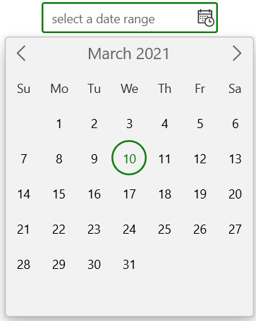

# WinUI Calendar DatePicker Overview

The WinUI [CalendarDateRangePicker](https://help.syncfusion.com/cr/winui/Syncfusion.UI.Xaml.Calendar.SfCalendarDateRangePicker.html) control provides an intuitive, touch-friendly interface to quickly select a date from a drop-down calendar. It supports different date formats. Date selection can be restricted by specifying minimum and maximum dates. Specific dates can also disabled from selection. In addition, it supports editing with validation and built-in watermark text display.

### Normal view:

### Expanded view:

## Key Features

* `CalendarDateRangePicker` supports different Culture and Language types.
* The drop-down portion used for selecting the date range and it can be customized.
* The Control displays the selected date range value in a various formats.
* Options to change the direction of month while navigation.
* Drop-down display area in `CalendarDateRangePicker` control is limited using abbreviated days and months.
* Supports blocking a certain dates from selection and user interaction.