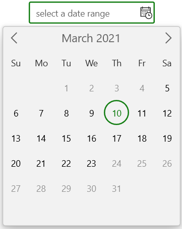
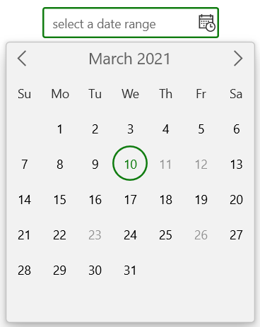
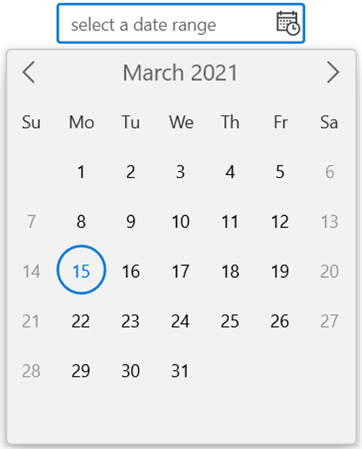
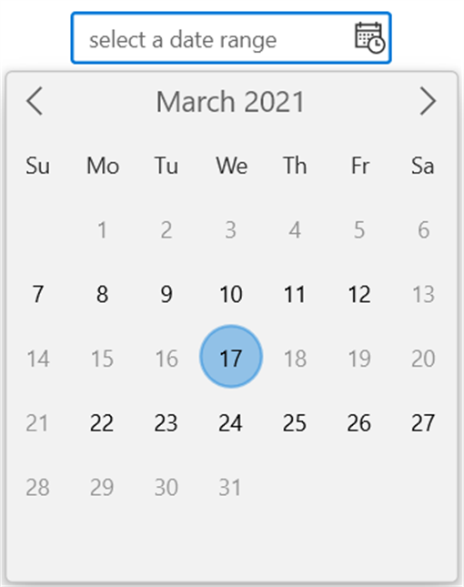

# Restrict or limit date range selection in Calendar DateRange Picker

## Limit available dates

You can allow the users to select a date range within the particular range by specifying [`MinDate`](https://help.syncfusion.com/cr/winui/Syncfusion.UI.Xaml.Calendar.SfCalendarDateRangePicker.html#Syncfusion_UI_Xaml_Calendar_SfCalendarDateRangePicker_MinDate) and [`MaxDate`](https://help.syncfusion.com/cr/winui/Syncfusion.UI.Xaml.Calendar.SfCalendarDateRangePicker.html#Syncfusion_UI_Xaml_Calendar_SfCalendarDateRangePicker_MaxDate) properties. The default value of `MinDate` property is **1/1/1920** and `MaxDate` property is **12/31/2120**.

N> Dates that appear outside minimum and maximum date range will be disabled (blackout).




<calendar:Calendar x:Name="sfCalendarDateRangePicker"/>




SfCalendarDateRangePicker sfCalendarDateRangePicker = new SfCalendarDateRangePicker();
sfCalendarDateRangePicker.MinDate = new DateTimeOffset(new DateTime(2021, 03, 06));
sfCalendarDateRangePicker.MaxDate = new DateTimeOffset(new DateTime(2021, 03, 24));




N> When `MinDisplayMode` property value is **Year** and `MinDate` value is **15/01/2021**, selecting the month of minimum date will set the starting date value from the minimum date i.e.. from *January 15, 2021*.

N> The `MinDate` property value should not be greater than the `MaxDate` property value.

## Disable dates using BlackoutDates

You can block particular dates from the date range selection, using the [`BlackoutDates`](https://help.syncfusion.com/cr/winui/Syncfusion.UI.Xaml.Calendar.SfCalendarDateRangePicker.html#Syncfusion_UI_Xaml_Calendar_SfCalendarDateRangePicker_BlackoutDates) collection property. The default value of `BlackoutDates` property is **null**.




public class ViewModel
{       
    public DateTimeOffsetCollection BlockedDates { get; set; }
    public ViewModel()
    {
        BlockedDates = new DateTimeOffsetCollection();
        BlockedDates.Add(new DateTimeOffset(new DateTime(2021, 1, 17)));
        BlockedDates.Add(new DateTimeOffset(new DateTime(2021, 1, 4)));
        BlockedDates.Add(new DateTimeOffset(new DateTime(2021, 2, 5)));
        BlockedDates.Add(new DateTimeOffset(new DateTime(2021, 2, 6)));
        BlockedDates.Add(new DateTimeOffset(new DateTime(2021, 1, 9)));
        BlockedDates.Add(new DateTimeOffset(new DateTime(2021, 3, 11)));
        BlockedDates.Add(new DateTimeOffset(new DateTime(2021, 3, 12)));
        BlockedDates.Add(new DateTimeOffset(new DateTime(2021, 3, 23)));
        BlockedDates.Add(new DateTimeOffset(new DateTime(2021, 3, 26)));
        BlockedDates.Add(new DateTimeOffset(new DateTime(2021, 4, 14)));
        BlockedDates.Add(new DateTimeOffset(new DateTime(2021, 1, 18)));
        BlockedDates.Add(new DateTimeOffset(new DateTime(2021, 5, 19)));
        BlockedDates.Add(new DateTimeOffset(new DateTime(2021, 1, 26)));
        BlockedDates.Add(new DateTimeOffset(new DateTime(2021, 6, 29)));
        BlockedDates.Add(new DateTimeOffset(new DateTime(2021, 1, 31)));
        BlockedDates.Add(new DateTimeOffset(new DateTime(2021, 1, 27)));
    }
}







<calendar:SfCalendarDateRangePicker BlackoutDates="{Binding BlockedDates}" 
                     x:Name="sfCalendarDateRangePicker">
    <calendar:SfCalendarDateRangePicker.DataContext>
        <local:ViewModel/>
    </calendar:SfCalendarDateRangePicker.DataContext>
</calendar:SfCalendarDateRangePicker>




sfCalendarDateRangePicker.DataContext = new ViewModel();
sfCalendarDateRangePicker.BlackoutDates = (sfCalendarDateRangePicker.DataContext as ViewModel).BlockedDates;




## Disable dates dynamically (All weekend days)

You can prevent the users from selecting any dates or days (example: all weekend days) by handling the [`ItemPrepared`](https://help.syncfusion.com/cr/winui/Syncfusion.UI.Xaml.Calendar.SfCalendarDateRangePicker.html#Syncfusion_UI_Xaml_Calendar_SfCalendarDateRangePicker_ItemPrepared) event and setting [`ItemInfo.IsBlackout`](https://help.syncfusion.com/cr/winui/Syncfusion.UI.Xaml.Calendar.CalendarItemInfo.html#Syncfusion_UI_Xaml_Calendar_CalendarItemInfo_IsBlackout) property value as **true** for those specific dates.

N> You can also change the text to be displayed for specific days or dates in dropdown calendar using `ItemInfo.DisplayText` property.  




<calendar:SfCalendarDateRangePicker x:Name="sfCalendarDateRangePicker"
                                    ItemPrepared="SfCalendarDateRangePicker_ItemPrepared"/>




SfCalendarDateRangePicker sfCalendarDateRangePicker = new SfCalendarDateRangePicker();
sfCalendarDateRangePicker.ItemPrepared += SfCalendarDateRangePicker_ItemPrepared;




You can handle the event as follows:




private void SfCalendarDateRangePicker_ItemPrepared(object sender, ItemPreparedEventArgs e)
{
    //Block all weekend days
    if (e.ItemInfo.ItemType == CalendarItemType.Day &&
        (e.ItemInfo.Date.DayOfWeek == DayOfWeek.Saturday ||
        e.ItemInfo.Date.DayOfWeek == DayOfWeek.Sunday))
    {
        e.ItemInfo.IsBlackout = true;
    }
}




You can also change the text to be displayed for specific days or dates in `Calendar DateRange Picker` using [ItemInfo.DisplayText](https://help.syncfusion.com/cr/winui/Syncfusion.UI.Xaml.Calendar.CalendarItemInfo.html#Syncfusion_UI_Xaml_Calendar_CalendarItemInfo_DisplayText) property. 




private void SfCalendarDateRangePicker_ItemPrepared(object sender, ItemPreparedEventArgs e)
{
    //Block all weekend days
    if (e.ItemInfo.ItemType == CalendarItemType.Day &&
        (e.ItemInfo.Date.DayOfWeek == DayOfWeek.Saturday ||
        e.ItemInfo.Date.DayOfWeek == DayOfWeek.Sunday))
    {
        e.ItemInfo.IsBlackout = true;
        e.ItemInfo.DisplayText = "X";
    }
}




N> Blackout dates will not be added in `SelectedRange` property even though it is highlighted in dropdown calendar.

## Limit duration of selected range

You can limit the duration of selected range in `Calendar DateRange Picker` value by using [`MinDatesCountInRange`](https://help.syncfusion.com/cr/winui/Syncfusion.UI.Xaml.Calendar.SfCalendarDateRangePicker.html#Syncfusion_UI_Xaml_Calendar_SfCalendarDateRangePicker_MinDatesCountInRange) and [`MaxDatesCountInRange`](https://help.syncfusion.com/cr/winui/Syncfusion.UI.Xaml.Calendar.SfCalendarDateRangePicker.html#Syncfusion_UI_Xaml_Calendar_SfCalendarDateRangePicker_MaxDatesCountInRange) properties. By default, the value of `MinDatesCountInRange` value is **0** and `MaxDatesCountInRange` value is **null**.




SfCalendarDateRangePicker sfCalendarDateRangePicker = new SfCalendarDateRangePicker();
sfCalendarDateRangePicker.MaxDatesCountInRange = 10;
sfCalendarDateRangePicker.MinDatesCountInRange = 5;




When `MinDisplayMode` value is **Year** then `MinDaysCountInRange` value should be at most **28** to select a date range in year view. The `MinDaysCountInRange` value should be updated based on `MinDisplayMode` property value for range selection in respective views. 




<calendar:SfCalendarDateRangePicker x:Name="sfCalendarDateRangePicker" MinDisplayMode="Year" />




sfCalendarDateRangePicker.MinDatesCountInRange = 28;




