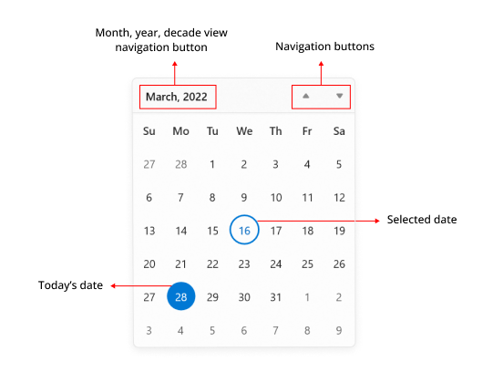
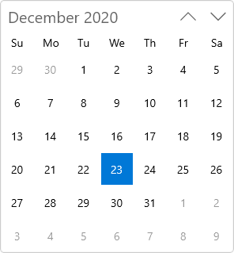
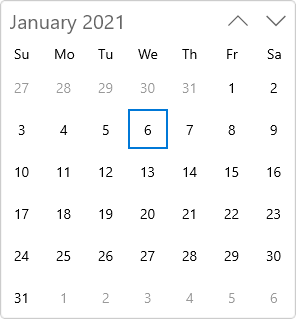
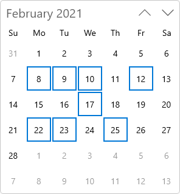
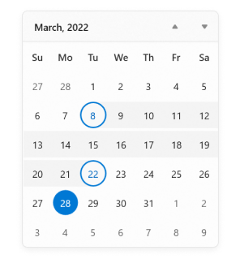

# Getting Started with WinUI Calendar (SfCalendar)

This section explains the steps required to add the [WinUI Calendar](https://www.syncfusion.com/winui-controls/calendar) control and its date selection options. This section covers only basic features needed to get started with Syncfusion `Calendar` control.

## Structure of Calendar control

## Creating an application with WinUI Calendar

In this walkthrough, you will create a WinUI application that contains the `Calendar` control.

## Adding control manually in XAML

To add `Calendar` control manually in XAML , follow the below steps.

1. Create a [WinUI 3 desktop app for C# and .NET 5](https://docs.microsoft.com/en-us/windows/apps/winui/winui3/get-started-winui3-for-desktop).
2. Download and refer the following NuGet in the project.

    * [Syncfusion.Calendar.WinUI](https://www.nuget.org/packages/Syncfusion.Calendar.WinUI)

3. Import the control namespace `Syncfusion.UI.Xaml.Calendar` in XAML page.
4. Initialize the `Calendar` control.




<Page
    x:Class="GettingStarted.MainPage"
    xmlns="http://schemas.microsoft.com/winfx/2006/xaml/presentation"
    xmlns:x="http://schemas.microsoft.com/winfx/2006/xaml"
    xmlns:local="using:GettingStarted"
    xmlns:d="http://schemas.microsoft.com/expression/blend/2008"
    xmlns:mc="http://schemas.openxmlformats.org/markup-compatibility/2006"
    xmlns:calendar="using:Syncfusion.UI.Xaml.Calendar"
    mc:Ignorable="d"
    Background="{ThemeResource ApplicationPageBackgroundThemeBrush}">
    <Grid Name="grid">
        <!--Adding Calendar control -->
        <calendar:SfCalendar Name="sfCalendar"/>
    </Grid>
</Page>




## Adding control manually in C#

To add the `Calendar` control manually in C#, follow the below steps.

1. Create a [WinUI 3 desktop app for C# and .NET 5](https://docs.microsoft.com/en-us/windows/apps/winui/winui3/get-started-winui3-for-desktop) or [WinUI 3 app in UWP for C#](https://docs.microsoft.com/en-us/windows/apps/winui/winui3/get-started-winui3-for-uwp).
2. Download and refer the following NuGet in the project.

    * [Syncfusion.Calendar.WinUI](https://www.nuget.org/packages/Syncfusion.Calendar.WinUI)

3. Import the `Calendar` namespace `Syncfusion.UI.Xaml.Calendar` in C# page.
4. Initialize the `Calendar` control.




using Syncfusion.UI.Xaml.Calendar;

namespace GettingStarted
{
    /// 

    /// An empty page that can be used on its own or navigated to within a Frame.
    /// 

    public sealed partial class MainPage : Page
    {
        public MainPage()
        {
            this.InitializeComponent();
            // Creating an instance of the Calendar control
            SfCalendar sfCalendar = new SfCalendar();

            grid.Children.Add(sfCalendar);
        }
    }
}




N> Download demo application from [GitHub](https://github.com/SyncfusionExamples/syncfusion-winui-tools-calendar-examples/tree/main/Samples/GettingStarted)

## Select a date

You can change the selected date interactively by clicking on the specific date or you can select programmatically by using [SelectedDate](https://help.syncfusion.com/cr/winui/Syncfusion.UI.Xaml.Calendar.SfCalendar.html#Syncfusion_UI_Xaml_Calendar_SfCalendar_SelectedDate) property. By default, `SelectedDate` property value is `null` and  `Calendar` control allows you to select single date at a time. 

If you want to restrict date selection or select multiple dates, set [`SelectionMode`](https://help.syncfusion.com/cr/winui/Syncfusion.UI.Xaml.Calendar.SfCalendar.html#Syncfusion_UI_Xaml_Calendar_SfCalendar_SelectionMode) property value from below values.

* **None** - Prevents from selecting a date.
* **Single** - Allows to select a single date.
* **Multiple** - Allows to select multiple dates.
* **Range** -  Allows to select range of dates.




SfCalendar sfCalendar= new SfCalendar();
sfCalendar.SelectedDate = new DateTimeOffset(new DateTime(2021, 01, 06));




N> Download demo application from [GitHub](https://github.com/SyncfusionExamples/syncfusion-winui-tools-calendar-examples/blob/main/Samples/Restriction)

## Select multiple dates

You can select one or multiple dates from different month, year or decade or century, by changing the [SelectionMode](https://help.syncfusion.com/cr/winui/Syncfusion.UI.Xaml.Calendar.SfCalendar.html#Syncfusion_UI_Xaml_Calendar_SfCalendar_SelectionMode) property value to **Multiple**. You can get the selected dates collection from the [SelectedDates](https://help.syncfusion.com/cr/winui/Syncfusion.UI.Xaml.Calendar.SfCalendar.html#Syncfusion_UI_Xaml_Calendar_SfCalendar_SelectedDates) property. By default, `SelectedDates` collection will be empty.

N> `SelectedDates` property collection will be empty if the `SelectionMode` value is **None**. 




<calendar:SfCalendar Name="sfCalendar" 
                     SelectionMode="Multiple" />




SfCalendar sfCalendar= new SfCalendar();
sfCalendar.SelectionMode = CalendarSelectionMode.Multiple;




N> Download demo application from [GitHub](https://github.com/SyncfusionExamples/syncfusion-winui-tools-calendar-examples/blob/main/Samples/Selection)

## Select a date range

You can select a range of dates in `Calendar` control by changing the [SelectionMode](https://help.syncfusion.com/cr/winui/Syncfusion.UI.Xaml.Calendar.SfCalendar.html#Syncfusion_UI_Xaml_Calendar_SfCalendar_SelectionMode) property value to **Range**. You can get the selected dates collection from the [SelectedDates](https://help.syncfusion.com/cr/winui/Syncfusion.UI.Xaml.Calendar.SfCalendar.html#Syncfusion_UI_Xaml_Calendar_SfCalendar_SelectedDates) property. By default, `SelectedDates` collection will be empty.

N> `SelectedDates` property collection will be empty if the `SelectionMode` value is  **None**. 




<calendar:SfCalendar Name="sfCalendar" 
                     SelectionMode="Range" />




SfCalendar sfCalendar= new SfCalendar();
sfCalendar.SelectionMode = CalendarSelectionMode.Range;




## Selection changed notification

You will be notified when selected date is changed in `Calendar` by using [SelectedDateChanged](https://help.syncfusion.com/cr/winui/Syncfusion.UI.Xaml.Calendar.SfCalendar.html#Syncfusion_UI_Xaml_Calendar_SfCalendar_SelectedDateChanged) event. The [SelectedDateChanged](https://help.syncfusion.com/cr/winui/Syncfusion.UI.Xaml.Calendar.SelectedDateChangedEventArgs.html) event contains the old and newly selected date in the [OldDate](https://help.syncfusion.com/cr/winui/Syncfusion.UI.Xaml.Calendar.SelectedDateChangedEventArgs.html#Syncfusion_UI_Xaml_Calendar_SelectedDateChangedEventArgs_OldDate), [NewDate](https://help.syncfusion.com/cr/winui/Syncfusion.UI.Xaml.Calendar.SelectedDateChangedEventArgs.html#Syncfusion_UI_Xaml_Calendar_SelectedDateChangedEventArgs_NewDate) properties.

* `OldDate` - Gets a date which was previously selected.
* `NewDate` - Gets a date which is currently selected.




<calendar:SfCalendar SelectedDateChanged="SfCalendar_SelectedDateChanged" 
                     Name="sfCalendar"/>




SfCalendar sfCalendar = new SfCalendar();
sfCalendar.SelectedDateChanged += SfCalendar_SelectedDateChanged;




You can handle the event as follows:




private void SfCalendar_SelectedDateChanged(object sender, SelectedDateChangedEventArgs e)
{
    var oldDate = e.OldDate;
    var newDate = e.NewDate;
}




## Restrict selection

You can restrict users from:
* Selecting single or multiple dates within a specific minimum and maximum range using [`MinDate`](https://help.syncfusion.com/cr/winui/Syncfusion.UI.Xaml.Calendar.SfCalendar.html#Syncfusion_UI_Xaml_Calendar_SfCalendar_MinDate) and [`MaxDate`](https://help.syncfusion.com/cr/winui/Syncfusion.UI.Xaml.Calendar.SfCalendar.html#Syncfusion_UI_Xaml_Calendar_SfCalendar_MaxDate) properties.
* Selecting a date or dates from blocked dates using [`BlackoutDates`](https://help.syncfusion.com/cr/winui/Syncfusion.UI.Xaml.Calendar.SfCalendar.html#Syncfusion_UI_Xaml_Calendar_SfCalendar_BlackoutDates) property.
* Selecting a date or dates from specifically blocked set of dates (example : blocking weekend dates) using [`ItemPrepared`](https://help.syncfusion.com/cr/winui/Syncfusion.UI.Xaml.Calendar.SfCalendar.html#Syncfusion_UI_Xaml_Calendar_SfCalendar_ItemPrepared) event. 

For further details refer [Restrict Date Selection](restrict-date-selection).

## Navigation between views

* You can navigate between month, year, decade and century views in `Calendar` control.
* You can also restrict the users to navigate between specific views only (month and year selection for credit card) using [`MinDisplayMode`](https://help.syncfusion.com/cr/winui/Syncfusion.UI.Xaml.Calendar.SfCalendar.html#Syncfusion_UI_Xaml_Calendar_SfCalendar_MinDisplayMode) and [`MaxDisplayMode`](https://help.syncfusion.com/cr/winui/Syncfusion.UI.Xaml.Calendar.SfCalendar.html#Syncfusion_UI_Xaml_Calendar_SfCalendar_MaxDisplayMode) properties.

    

* You can navigate within a view horizontally or vertically using [`NavigationDirection`](https://help.syncfusion.com/cr/winui/Syncfusion.UI.Xaml.Calendar.SfCalendar.html#Syncfusion_UI_Xaml_Calendar_SfCalendar_NavigationDirection) property. By default, navigation direction is vertical within a view either by mouse scrolling or by navigation buttons. 

For further details refer [Navigation](navigation).