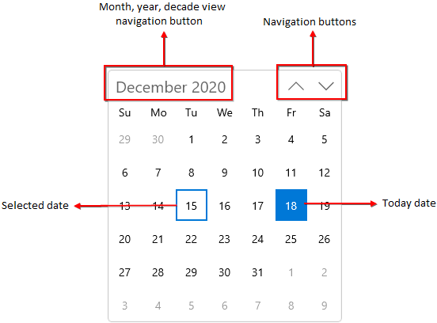
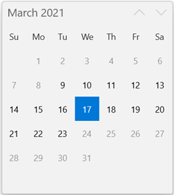
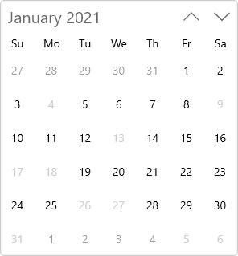
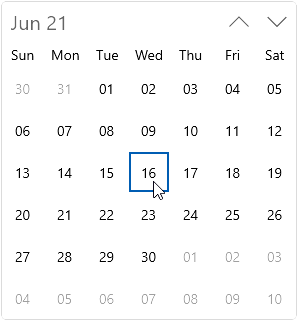
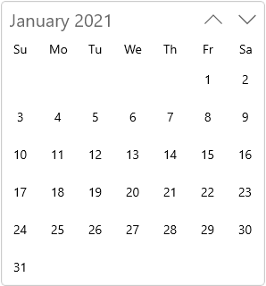
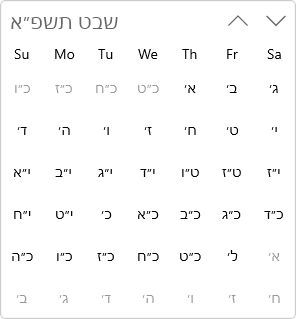
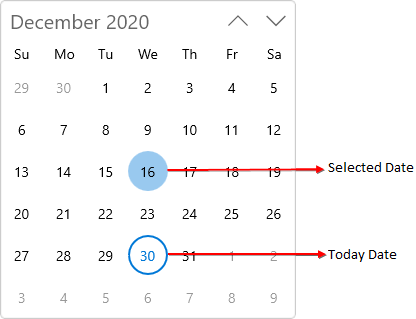

# Getting Started with WinUI Calendar (SfCalendar)

This section explains the steps required to add the [Calendar](https://help.syncfusion.com/cr/winui/Syncfusion.UI.Xaml.Calendar.SfCalendar.html) control and its date selection options. This section covers only basic features needed to get started with Syncfusion `Calendar` control.

## Structure of Calendar control

## Creating an application with WinUI Calendar

1. Create a simple project using the instructions given in the [Getting Started with your first WinUI app](https://docs.microsoft.com/en-us/windows/apps/winui/winui3/get-started-winui3-for-uwp) documentation.
2. Add reference to [Syncfusion.Calendar.WinUI](https://www.nuget.org/packages/Syncfusion.Calendar.WinUI) NuGet. 
3. Import the control namespace `Syncfusion.UI.Xaml.Calendar` in XAML or C# code.
4. Initialize the `SfCalendar` control.




<Page
    x:Class="GettingStarted.MainPage"
    xmlns="http://schemas.microsoft.com/winfx/2006/xaml/presentation"
    xmlns:x="http://schemas.microsoft.com/winfx/2006/xaml"
    xmlns:local="using:GettingStarted"
    xmlns:d="http://schemas.microsoft.com/expression/blend/2008"
    xmlns:mc="http://schemas.openxmlformats.org/markup-compatibility/2006"
    xmlns:calendar="using:Syncfusion.UI.Xaml.Calendar"
    mc:Ignorable="d"
    Background="{ThemeResource ApplicationPageBackgroundThemeBrush}">
    <Grid Name="grid">
        <!--Adding Calendar control -->
        <calendar:SfCalendar Name="sfCalendar"/>
    </Grid>
</Page>




using Syncfusion.UI.Xaml.Calendar;

namespace GettingStarted
{
    /// 

    /// An empty page that can be used on its own or navigated to within a Frame.
    /// 

    public sealed partial class MainPage : Page
    {
        public MainPage()
        {
            this.InitializeComponent();
            // Creating an instance of the Calendar control
            SfCalendar sfCalendar = new SfCalendar();

            grid.Children.Add(sfCalendar);
        }
    }
}




N> Download demo application from [GitHub](https://github.com/SyncfusionExamples/syncfusion-winui-tools-calendar-examples/blob/main/Samples/Getting_started)

## Select the date programmatically

You can set or change the selected date programmatically by using [SelectedDate](https://help.syncfusion.com/cr/winui/Syncfusion.UI.Xaml.Calendar.SfCalendar.html#Syncfusion_UI_Xaml_Calendar_SfCalendar_SelectedDate) property. If you not assign any value for the `SelectedDate` property, `Calendar` will automatically assign the current system date as `SelectedDate`.




<calendar:SfCalendar Name="sfCalendar" />




SfCalendar sfCalendar= new SfCalendar();
sfCalendar.SelectedDate = new DateTimeOffset(new DateTime(2021, 01, 06));




N> Download demo application from [GitHub](https://github.com/SyncfusionExamples/syncfusion-winui-tools-calendar-examples/blob/main/Samples/Restriction)

## Select multiple dates

By default, `Calendar` control allows you to select single date at a time. If you want to select multiple dates from different month, year or decade or from century, use the [SelectionMode](https://help.syncfusion.com/cr/winui/Syncfusion.UI.Xaml.Calendar.SfCalendar.html#Syncfusion_UI_Xaml_Calendar_SfCalendar_SelectionMode) property value as `Multiple`. You can gets the selected dates from the [SelectedDates](https://help.syncfusion.com/cr/winui/Syncfusion.UI.Xaml.Calendar.SfCalendar.html#Syncfusion_UI_Xaml_Calendar_SfCalendar_SelectedDates) collection.




<calendar:SfCalendar Name="sfCalendar" 
                     SelectionMode="Multiple" />




SfCalendar sfCalendar= new SfCalendar();
sfCalendar.SelectionMode = CalendarSelectionMode.Multiple;




N> Download demo application from [GitHub](https://github.com/SyncfusionExamples/syncfusion-winui-tools-calendar-examples/blob/main/Samples/Selection)

## Restrict date selection

You can restrict the users from selecting a date within the particular range by specifying [MinDate](https://help.syncfusion.com/cr/winui/Syncfusion.UI.Xaml.Calendar.SfCalendar.html#Syncfusion_UI_Xaml_Calendar_SfCalendar_MinDate) and [MaxDate](https://help.syncfusion.com/cr/winui/Syncfusion.UI.Xaml.Calendar.SfCalendar.html#Syncfusion_UI_Xaml_Calendar_SfCalendar_MaxDate) properties in `Calendar` control. The default value of `MinDate` property is `1/1/1920 12:00:00 AM +00:00` and `MaxDate` property is `12/31/2120 11:59:59 PM +00:00`.




SfCalendar sfCalendar = new SfCalendar();
sfCalendar.MinDate = new DateTimeOffset(new DateTime(2021, 01, 5));
sfCalendar.MaxDate = new DateTimeOffset(new DateTime(2021, 01, 27));




N> Download demo application from [GitHub](https://github.com/SyncfusionExamples/syncfusion-winui-tools-calendar-examples/blob/main/Samples/Restriction)

## Block dates using BlackoutDates

If you want to block particular dates from the date selection, add that dates into the [BlackoutDates](https://help.syncfusion.com/cr/winui/Syncfusion.UI.Xaml.Calendar.SfCalendar.html#Syncfusion_UI_Xaml_Calendar_SfCalendar_BlackoutDates) collection. You can add more block out date ranges to the `BlackoutDates` collection. The default value of `BlackoutDates` property is `null`.




public class ViewModel
{       
    public DateTimeOffsetCollection BlockedDates { get; set; }
    public ViewModel()
    {
        BlockedDates = new DateTimeOffsetCollection();
        BlockedDates.Add(new DateTimeOffset(new DateTime(2021, 1, 17)));
        BlockedDates.Add(new DateTimeOffset(new DateTime(2021, 1, 4)));
        BlockedDates.Add(new DateTimeOffset(new DateTime(2021, 2, 5)));
        BlockedDates.Add(new DateTimeOffset(new DateTime(2021, 2, 6)));
        BlockedDates.Add(new DateTimeOffset(new DateTime(2021, 1, 9)));
        BlockedDates.Add(new DateTimeOffset(new DateTime(2021, 3, 11)));
        BlockedDates.Add(new DateTimeOffset(new DateTime(2021, 1, 13)));
        BlockedDates.Add(new DateTimeOffset(new DateTime(2021, 4, 14)));
        BlockedDates.Add(new DateTimeOffset(new DateTime(2021, 1, 18)));
        BlockedDates.Add(new DateTimeOffset(new DateTime(2021, 5, 19)));
        BlockedDates.Add(new DateTimeOffset(new DateTime(2021, 1, 26)));
        BlockedDates.Add(new DateTimeOffset(new DateTime(2021, 6, 29)));
        BlockedDates.Add(new DateTimeOffset(new DateTime(2021, 1, 31)));
        BlockedDates.Add(new DateTimeOffset(new DateTime(2021, 1, 27)));
    }
}







<calendar:SfCalendar BlackoutDates="{Binding BlockedDates}" 
                     x:Name="sfCalendar">
    <calendar:SfCalendar.DataContext>
        <local:ViewModel/>
    </calendar:SfCalendar.DataContext>
</calendar:SfCalendar>




sfCalendar.DataContext = new ViewModel();
sfCalendar.BlackoutDates = (sfCalendar.DataContext as ViewModel).BlockedDates;




N> Download demo application from [GitHub](https://github.com/SyncfusionExamples/syncfusion-winui-tools-calendar-examples/blob/main/Samples/BlockedDates)

## Disable/block all weekends

You can prevent the users from selecting weekend days or any other dates by handling the [ItemPrepared](https://help.syncfusion.com/cr/winui/Syncfusion.UI.Xaml.Calendar.SfCalendar.html#Syncfusion_UI_Xaml_Calendar_SfCalendar_ItemPrepared) event and setting [ItemInfo.IsBlackout](https://help.syncfusion.com/cr/winui/Syncfusion.UI.Xaml.Calendar.CalendarItemPreparedEventArgs.html#Syncfusion_UI_Xaml_Calendar_CalendarItemPreparedEventArgs_ItemInfo) property value as `true` for that specific dates.




<calendar:SfCalendar x:Name="sfCalendar" ItemPrepared="SfCalendar_ItemPrepared"/>




SfCalendar sfCalendar = new SfCalendar();
sfCalendar.ItemPrepared += SfCalendar_ItemPrepared;




You can handle the event as follows:




private void SfCalendar_ItemPrepared(object sender, CalendarItemPreparedEventArgs e)
{
    //Block all weekend days
    if (e.ItemInfo.ItemType == CalendarItemType.Day &&
        (e.ItemInfo.Date.DayOfWeek == DayOfWeek.Saturday ||
        e.ItemInfo.Date.DayOfWeek == DayOfWeek.Sunday))
    {
        e.ItemInfo.IsBlackout = true;
    }
}




N> Download demo application from [GitHub](https://github.com/SyncfusionExamples/syncfusion-winui-tools-calendar-examples/blob/main/Samples/Formatting)

## Custom UI for specific cell in Calendar

You can change the UI of specific cells in `Calendar` by using the [CalendarItem.ContentTemplate](https://help.syncfusion.com/cr/winui/Syncfusion.UI.Xaml.Calendar.CalendarItem.html) property. The `DataContext` of `CalendarItem.ContentTemplate` is `Calendar`. 




public class CustomCalendarItemTemplateSelector : DataTemplateSelector
{
    public CustomCalendarItemTemplateSelector()
    {
        SpecialDates = new Dictionary<DateTimeOffset, string>();
        SpecialDates.Add(DateTimeOffset.Now.AddMonths(-1).AddDays(1), "BirthDay");
        SpecialDates.Add(DateTimeOffset.Now.AddMonths(-1).AddDays(5), "Gift");
        SpecialDates.Add(DateTimeOffset.Now.AddMonths(-1).AddDays(-2), "Award");
        SpecialDates.Add(DateTimeOffset.Now.AddDays(1), "Gift");
        SpecialDates.Add(DateTimeOffset.Now.AddDays(9), "BirthDay");
        SpecialDates.Add(DateTimeOffset.Now.AddDays(-4), "Award");
        SpecialDates.Add(DateTimeOffset.Now.AddMonths(1).AddDays(1), "Award");
        SpecialDates.Add(DateTimeOffset.Now.AddMonths(1).AddDays(3), "BirthDay");
        SpecialDates.Add(DateTimeOffset.Now.AddMonths(1).AddDays(-5), "Gift");
    }

    private Dictionary<DateTimeOffset, string> SpecialDates { get; set; }

    public DataTemplate DefaultTemplate { get; set; }
    public DataTemplate BirthdayTemplate { get; set; }
    public DataTemplate GiftTemplate { get; set; }
    public DataTemplate AwardTemplate { get; set; }

    protected override DataTemplate SelectTemplateCore(object item, DependencyObject container)
    {
        if (item != null)
        {
            DateTimeOffset calendarItem = (DateTimeOffset)item;
            DateTimeOffset dateTimeOffset = SpecialDates.Keys.FirstOrDefault(x => x.Date == calendarItem.Date);

            if (dateTimeOffset != DateTimeOffset.MinValue)
            {
                string template = this.SpecialDates[dateTimeOffset];

                switch (template)
                {
                    case "BirthDay":
                        return BirthdayTemplate;
                    case "Gift":
                        return GiftTemplate;
                    case "Award":
                        return AwardTemplate;
                }
            }
            return DefaultTemplate;
        }
        return base.SelectTemplateCore(item, container);
    }
}







    <Page.Resources>
        <x:String x:Key="birthday">M24.188005,24.530994C24.999008,24.530994 25.657011,25.188997 25.657011,26 25.657011,26.811003 24.999008,27.469006 24.188005,27.469006 23.377003,27.469006 22.719,26.811003 22.719,26 22.719,25.188997 23.377003,24.530994 24.188005,24.530994z M16.000006,24.530994C16.811008,24.530994 17.469011,25.188997 17.469011,26 17.469011,26.811003 16.811008,27.469006 16.000006,27.469006 15.189002,27.469006 14.530999,26.811003 14.530999,26 14.530999,25.188997 15.189002,24.530994 16.000006,24.530994z M7.813005,24.405994C8.6240082,24.405994 9.282011,25.063997 9.282011,25.875 9.282011,26.686003 8.6240082,27.344006 7.813005,27.344006 7.0020018,27.344006 6.3439994,26.686003 6.3439994,25.875 6.3439994,25.063997 7.0020018,24.405994 7.813005,24.405994z M3,22.5C2.4490051,22.5,2,22.949005,2,23.5L2,29.5 30,29.5 30,23.5C30,22.949005,29.550995,22.5,29,22.5z M5,14.5C4.4489999,14.5,4,14.949,4,15.5L4,20.5 28,20.5 28,15.5C28,14.949,27.551001,14.5,27,14.5L16,14.5z M16,8.5C16.552,8.5,17,8.948,17,9.5L17,12.5 27,12.5C28.653999,12.5,30,13.846,30,15.5L30,20.672067 30.030354,20.68236C31.178461,21.103616,32,22.207819,32,23.5L32,30.5C32,31.052002,31.552002,31.5,31,31.5L1,31.5C0.44799805,31.5,0,31.052002,0,30.5L0,23.5C0,22.207819,0.82153827,21.103616,1.969646,20.68236L2,20.672067 2,15.5C2,13.846,3.346,12.5,5,12.5L15,12.5 15,9.5C15,8.948,15.448,8.5,16,8.5z M16.019098,0C16.450115,1.7290001 18.144182,3.5890007 18.144182,4.7290001 18.219185,6.1879997 17.684164,7 16.019098,7 14.354033,7 13.856012,6.0419998 13.856012,4.7290001 13.856012,3.323 14.56604,1.3330002 16.019098,0z</x:String>
        <x:String x:Key="gift">M14.072999,21.71989L14.173005,21.71989 23.954012,21.71989 23.954012,30.402982C23.954012,31.300994,23.255007,31.999997,22.356997,31.999997L14.072999,31.999997z M1.2980041,21.71989L11.178987,21.71989 11.178987,31.999997 2.8949892,31.999997C1.9960022,31.999997,1.2980041,31.300994,1.2980041,30.402982z M19.661989,3.2556945C19.06299,3.2556945,14.072999,7.3477336,12.975007,8.545744L12.975007,8.8447515C13.674012,8.6447526 15.670015,7.1477343 17.267,6.1497227 19.162996,5.0517112 19.962008,3.7546926 19.661989,3.2556945z M5.5889899,3.2556945C5.3899848,3.7546926 6.1879889,5.0517112 7.984986,6.2497221 9.4819957,7.2477342 11.578004,8.6447526 12.277009,8.9447509L12.277009,8.6447526C11.178987,7.3477336,6.287995,3.2556945,5.5889899,3.2556945z M17.864281,0.00017286225C18.476668,-0.0068490629 19.175909,0.19928326 19.962008,0.76066515 22.756014,2.6566814 22.656008,4.2536984 22.656008,5.2517105 22.157015,7.447733 19.463015,8.4457446 16.868014,8.9447509L23.355013,8.9447509C24.252993,8.9447509,24.951998,9.6427566,24.951998,10.541768L24.951998,13.235797C24.951998,13.834803,24.553011,14.433808,24.053988,14.633815L24.053988,19.723867 14.173005,19.723867 14.173005,9.3437568 13.574006,9.3437568 13.075013,9.3437568 12.675996,9.3437568 12.277009,9.3437568 11.578004,9.3437568 11.477998,9.3437568 11.178987,9.3437568 11.178987,19.723867 1.2980041,19.723867 1.2980041,14.732815C0.59899889,14.533815,-2.3291432E-07,13.934802,0,13.136797L0,10.441769C-2.3291432E-07,9.5437566,0.69900499,8.8447515,1.5969848,8.8447515L8.4840099,8.8447515C5.8890082,8.545744 3.0939943,7.447733 2.6950075,5.2517105 2.6950075,4.353706 2.5950014,2.7566885 5.3899848,0.76066515 6.0889899,0.261659 6.7869879,0.061659901 7.385987,0.061660053 8.9830028,0.061659901 10.080995,1.4586705 10.480012,1.8586761 10.878999,2.2576827 12.076997,4.452706 12.675996,6.6487285 13.274995,4.452706 14.471986,2.2576827 14.871003,1.8586761 15.301535,1.4281411 16.29929,0.018116923 17.864281,0.00017286225z</x:String>
        <x:String x:Key="award">M6.4050484,19.617198L3.7509956,25.34103 6.5209923,24.451031 7.7069907,27.094029 10.305956,21.486943 10.209199,21.463142C8.8243089,21.103976,7.5456314,20.475896,6.431808,19.637838z M20.198464,18.975471L19.810075,19.313839C18.872342,20.092266,17.802781,20.71557,16.640677,21.144267L16.418594,21.22308 18.634039,27.072047 19.967047,24.487023 22.674016,25.519068z M12.916001,5.5320349C9.9759998,5.5320349 7.5829983,7.9410334 7.5829983,10.903033 7.5829983,13.865032 9.9759998,16.274031 12.916001,16.274031 15.857003,16.274031 18.250004,13.865032 18.250004,10.903033 18.250004,7.9410334 15.857003,5.5320349 12.916001,5.5320349z M12.916001,3.5320349C16.960003,3.5320349 20.250005,6.8390341 20.250005,10.903033 20.250005,14.968032 16.960003,18.274031 12.916001,18.274031 8.8729992,18.274031 5.5829973,14.968032 5.5829973,10.903033 5.5829973,6.8390341 8.8729992,3.5320349 12.916001,3.5320349z M12.91602,2.0000057C8.0390205,2.0000057 4.0710211,5.9940157 4.0710211,10.903028 4.0710211,15.81304 8.0390205,19.80705 12.91602,19.80705 17.79302,19.80705 21.761019,15.81304 21.761019,10.903028 21.761019,5.9940157 17.79302,2.0000057 12.91602,2.0000057z M12.91602,0C18.89502,0 23.761019,4.8920126 23.761019,10.903028 23.761019,13.251471 23.018526,15.429016 21.757237,17.210832L21.674238,17.325164 21.711064,17.311053 26.135013,28.99606 20.926031,27.007045 18.356024,31.999053 14.455157,21.696701 14.295179,21.719278C13.843446,21.777196 13.383129,21.807055 12.91602,21.807055 12.822598,21.807055 12.729448,21.805861 12.636584,21.803486L12.375046,21.793458 7.6759906,31.926026 5.4279938,26.921029 0,28.665028 4.8565531,18.189458 4.5508928,17.834802C3.0024042,15.949165 2.0710211,13.533284 2.0710211,10.903028 2.0710211,4.8920126 6.9370208,0 12.91602,0z</x:String>
        <DataTemplate x:Key="defaultTemplate"/>
        <DataTemplate x:Key="birthdayTemplate">
            <Grid>
                <Path 
                    Data="{StaticResource birthday}"
                    Stretch="Uniform"
                    Fill="{ThemeResource SystemBaseHighColor}"
                    Width="18"
                    Height="18"
                    Margin="3"
                    VerticalAlignment="Top"
                    HorizontalAlignment="Right"/>
            </Grid>
        </DataTemplate>
        <DataTemplate x:Key="giftTemplate">
            <Grid>
                <Path 
                    Data="{StaticResource gift}"
                    Stretch="Uniform"
                    Fill="{ThemeResource SystemBaseHighColor}"
                    Width="18"
                    Height="18"
                    Margin="3"
                    VerticalAlignment="Top"
                    HorizontalAlignment="Right"/>
            </Grid>
        </DataTemplate>
        <DataTemplate x:Key="awardTemplate">
            <Grid>
                <Path 
                    Data="{StaticResource award}"
                    Stretch="Uniform"
                    Fill="{ThemeResource SystemBaseHighColor}"
                    Width="18"
                    Height="18"
                    Margin="3"
                    VerticalAlignment="Top"
                    HorizontalAlignment="Right"/>
            </Grid>
        </DataTemplate>
    </Page.Resources>
    <Grid>
        <calendar:SfCalendar>
            <calendar:SfCalendar.Resources>
                <local:CustomCalendarItemTemplateSelector x:Key="selector"
                    BirthdayTemplate="{StaticResource birthdayTemplate}"
                    GiftTemplate="{StaticResource giftTemplate}"
                    AwardTemplate="{StaticResource awardTemplate}"
                    DefaultTemplate="{StaticResource defaultTemplate}"/>
                
            </calendar:SfCalendar.Resources>
        </calendar:SfCalendar>
    </Grid>




N> Download demo application from [GitHub](https://github.com/SyncfusionExamples/syncfusion-winui-tools-calendar-examples/blob/main/Samples/CustomUI)

## Selected date changed notification

You will be notified when selected date changed in `Calendar` by using [SelectedDateChanged](https://help.syncfusion.com/cr/winui/Syncfusion.UI.Xaml.Calendar.SfCalendar.html#Syncfusion_UI_Xaml_Calendar_SfCalendar_SelectedDateChanged) event. The [SelectedDateChanged](https://help.syncfusion.com/cr/winui/Syncfusion.UI.Xaml.Calendar.SelectedDateChangedEventArgs.html) event contains the old and newly selected date in the [OldDate](https://help.syncfusion.com/cr/winui/Syncfusion.UI.Xaml.Calendar.SelectedDateChangedEventArgs.html#Syncfusion_UI_Xaml_Calendar_SelectedDateChangedEventArgs_OldDate), [NewDate](https://help.syncfusion.com/cr/winui/Syncfusion.UI.Xaml.Calendar.SelectedDateChangedEventArgs.html#Syncfusion_UI_Xaml_Calendar_SelectedDateChangedEventArgs_NewDate) properties.

* `OldDate` - Gets a date which is previously selected.
* `NewDate` - Gets a date which is currently selected.




<calendar:SfCalendar SelectedDateChanged="SfCalendar_SelectedDateChanged" 
                     Name="sfCalendar"/>




SfCalendar sfCalendar = new SfCalendar();
sfCalendar.SelectedDateChanged += SfCalendar_SelectedDateChanged;




You can handle the event as follows:




private void SfCalendar_SelectedDateChanged(object sender, SelectedDateChangedEventArgs e)
{
    var oldDate = e.OldDate;
    var newDate = e.NewDate;
}




## Date formatting

You can use different date formats such as abbreviated or full name for a day, month, week names or header name of month and year by using the [DateFormat](https://help.syncfusion.com/cr/winui/Syncfusion.UI.Xaml.Calendar.SfCalendar.html#Syncfusion_UI_Xaml_Calendar_SfCalendar_DateFormat), [MonthFormat](https://help.syncfusion.com/cr/winui/Syncfusion.UI.Xaml.Calendar.SfCalendar.html#Syncfusion_UI_Xaml_Calendar_SfCalendar_MonthFormat), [DayOfWeekFormat](https://help.syncfusion.com/cr/winui/Syncfusion.UI.Xaml.Calendar.SfCalendar.html#Syncfusion_UI_Xaml_Calendar_SfCalendar_DayOfWeekFormat) and [HeaderFormatInMonthView](https://help.syncfusion.com/cr/winui/Syncfusion.UI.Xaml.Calendar.SfCalendar.html#Syncfusion_UI_Xaml_Calendar_SfCalendar_HeaderFormatInMonthView) properties.




<calendar:SfCalendar DateFormat="{}{day.integer(2)}"
                     MonthFormat="{}{month.full}"
                     DayOfWeekFormat="{}{dayofweek.abbreviated(3)}"
                     HeaderFormatInMonthView="{}{month.abbreviated} {year.abbreviated}‎"
                     x:Name="sfCalendar"/>




SfCalendar sfCalendar = new SfCalendar();
sfCalendar.DateFormat = "{day.integer(2)}";
sfCalendar.MonthFormat = "{month.full}";
sfCalendar.DayOfWeekFormat = "{dayofweek.abbreviated(3)}";
sfCalendar.HeaderFormatInMonthView = "{month.abbreviated} {year.abbreviated}‎";




N> Download demo application from [GitHub](https://github.com/SyncfusionExamples/syncfusion-winui-tools-calendar-examples/blob/main/Samples/Formatting)

## Navigate between views

You can select a date from different year, decade, or century easily by navigating to year, decade, or century view. Initially month view is loaded. If you want to change the initial view, use [DisplayMode](https://help.syncfusion.com/cr/winui/Syncfusion.UI.Xaml.Calendar.SfCalendar.html#Syncfusion_UI_Xaml_Calendar_SfCalendar_DisplayMode) property.

You can restrict navigation within a minimum and maximum views by using [MinDisplayMode](https://help.syncfusion.com/cr/winui/Syncfusion.UI.Xaml.Calendar.SfCalendar.html#Syncfusion_UI_Xaml_Calendar_SfCalendar_MinDisplayMode) and [MaxDisplayMode](https://help.syncfusion.com/cr/winui/Syncfusion.UI.Xaml.Calendar.SfCalendar.html#Syncfusion_UI_Xaml_Calendar_SfCalendar_MaxDisplayMode) properties. This will be useful when your date range is smaller and you don’t want to show century view.




<calendar:SfCalendar x:Name="sfCalendar"
                     MinDisplayMode="Month"
                     MaxDisplayMode="Century"
                     DisplayMode="Month"/>




SfCalendar sfCalendar = new SfCalendar();
sfCalendar.MinDisplayMode = CalendarDisplayMode.Month;
sfCalendar.MaxDisplayMode = CalendarDisplayMode.Century;
sfCalendar.DisplayMode = CalendarDisplayMode.Month;




N> Download demo application from [GitHub](https://github.com/SyncfusionExamples/syncfusion-winui-tools-calendar-examples/blob/main/Samples/Restriction)

## First day of week

By default, Sunday is shown as the first day of the week. If you want to change the first day of week, use the [FirstDayOfWeek](https://help.syncfusion.com/cr/winui/Syncfusion.UI.Xaml.Calendar.SfCalendar.html#Syncfusion_UI_Xaml_Calendar_SfCalendar_FirstDayOfWeek) property value. The default value of `FirstDayOfWeek` property is `Sunday`.




<calendar:SfCalendar x:Name="sfCalendar" 
                     FirstDayOfWeek="Monday"/>




SfCalendar sfCalendar = new SfCalendar();
sfCalendar.FirstDayOfWeek = DayOfWeek.Monday;




N> Download demo application from [GitHub](https://github.com/SyncfusionExamples/syncfusion-winui-tools-calendar-examples/blob/main/Samples/Selection)

## Number of weeks in a view

If you want to increase or decrease the number of weeks shown in a month view, use the [NumberOfWeeksInView](https://help.syncfusion.com/cr/winui/Syncfusion.UI.Xaml.Calendar.SfCalendar.html#Syncfusion_UI_Xaml_Calendar_SfCalendar_NumberOfWeeksInView) property. The default value of `NumberOfWeeksInView` property is `6`.




<calendar:SfCalendar NumberOfWeeksInView="3"
                     x:Name="sfCalendar"/>




SfCalendar sfCalendar = new SfCalendar();
sfCalendar.NumberOfWeeksInView = 3;




N> Download demo application from [GitHub](https://github.com/SyncfusionExamples/syncfusion-winui-tools-calendar-examples/blob/main/Samples/Selection)

## Hide days that is out of scope

By default, out of scope days are disabled. If you want to hide the days that are out of the scope of current view, use the [OutOfScopeVisibility](https://help.syncfusion.com/cr/winui/Syncfusion.UI.Xaml.Calendar.SfCalendar.html#Syncfusion_UI_Xaml_Calendar_SfCalendar_OutOfScopeVisibility) property value as `Hidden`. The default value of `OutOfScopeVisibility` property is `Disabled`.




<calendar:SfCalendar OutOfScopeVisibility="Hidden"
                     x:Name="sfCalendar"/>




SfCalendar sfCalendar = new SfCalendar();
sfCalendar.OutOfScopeVisibility = OutOfScopeVisibility.Hidden;




N> Download demo application from [GitHub](https://github.com/SyncfusionExamples/syncfusion-winui-tools-calendar-examples/blob/main/Samples/Restriction)

## Calendar types

The `Calendar` control supports nine different calendar types, such as Gregorian, Julian, Hebrew, etc. You can change the calendar type by using [CalendarIdentifier](https://help.syncfusion.com/cr/winui/Syncfusion.UI.Xaml.Calendar.SfCalendar.html#Syncfusion_UI_Xaml_Calendar_SfCalendar_CalendarIdentifier) property. The default value of `CalendarIdentifier` property is `GregorianCalendar`.




<calendar:SfCalendar CalendarIdentifier="HebrewCalendar"
                     x:Name="sfCalendar"/>




SfCalendar sfCalendar = new SfCalendar();
sfCalendar.CalendarIdentifier = "HebrewCalendar";




N> Download demo application from [GitHub](https://github.com/SyncfusionExamples/syncfusion-winui-tools-calendar-examples/blob/main/Samples/Formatting)

## Culture support

If you want to localize the calendar, use the `Language` property. The default value of `Language` property is `en-US`.




<calendar:SfCalendar Language="fr"
                     x:Name="sfCalendar"/>




SfCalendar sfCalendar = new SfCalendar();
sfCalendar.Language = "fr";




N> Download demo application from [GitHub](https://github.com/SyncfusionExamples/syncfusion-winui-tools-calendar-examples/blob/main/Samples/Formatting)

## Today and selected date highlighting

You can highlight the today and selected date as rectangle, filled rectangle, circel and filled circle. You can use the [TodayHighlightMode](https://help.syncfusion.com/cr/winui/Syncfusion.UI.Xaml.Calendar.SfCalendar.html#Syncfusion_UI_Xaml_Calendar_SfCalendar_TodayHighlightMode) property to highlight the today date and use the [SelectionHighlightMode](https://help.syncfusion.com/cr/winui/Syncfusion.UI.Xaml.Calendar.SfCalendar.html#Syncfusion_UI_Xaml_Calendar_SfCalendar_SelectionHighlightMode) property to highlight the selected date. The default value of `TodayHighlightMode` proeprty is `FilledRectangle` and `SelectionHighlightMode` property is `Rectangle`.




<calendar:SfCalendar SelectionHighlightMode="FilledCircle"
                     TodayHighlightMode="Circle"
                     x:Name="sfCalendar"/>




SfCalendar sfCalendar = new SfCalendar();
sfCalendar.SelectionHighlightMode = CalendarItemHighlightMode.FilledCircle;
sfCalendar.TodayHighlightMode = CalendarItemHighlightMode.Circle;




N> Download demo application from [GitHub](https://github.com/SyncfusionExamples/syncfusion-winui-tools-calendar-examples/blob/main/Samples/Selection)

## Change flow direction

You can change the flow direction of the `Calendar` layout from right to left by setting the `FlowDirection` property value as `RightToLeft`. The default value of `FlowDirection` property is `LeftToRight`.




<calendar:SfCalendar FlowDirection="RightToLeft" 
                     x:Name="sfCalendar"/>




SfCalendar sfCalendar = new SfCalendar();
sfCalendar.FlowDirection = FlowDirection.RightToLeft;




N> Download demo application from [GitHub](https://github.com/SyncfusionExamples/syncfusion-winui-tools-calendar-examples/blob/main/Samples/Formatting)

