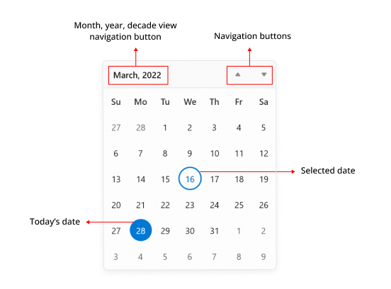
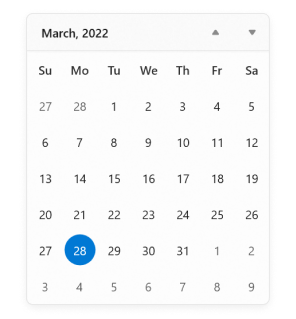
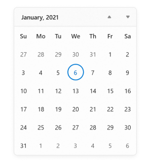
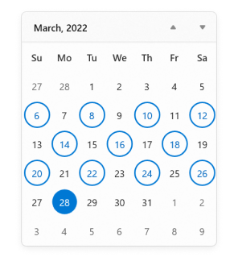
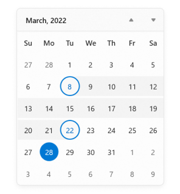
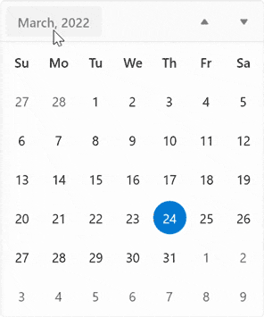

# Getting Started with WinUI Calendar (SfCalendar)

This section explains the steps required to add the [WinUI Calendar](https://www.syncfusion.com/winui-controls/calendar) control and its date selection options. This section covers only the basic features needed to get started with the Syncfusion `Calendar` control.

## Structure of Calendar control

## Creating an application with WinUI Calendar

In this walk-through, you will create a WinUI application that contains the `Calendar` control.

## Adding control manually in XAML

To add `Calendar` control manually in XAML, follow these steps:

1. Create a [WinUI 3 desktop app for C# and .NET 5](https://learn.microsoft.com/en-us/windows/apps/winui/winui3/create-your-first-winui3-app).
2. Download and refer to the following NuGet package in the project.

    * [Syncfusion.Calendar.WinUI](https://www.nuget.org/packages/Syncfusion.Calendar.WinUI)

3. Import the control namespace `Syncfusion.UI.Xaml.Calendar` in the XAML page.
4. Initialize the `Calendar` control.





<Window
    x:Class="GettingStarted.MainWindow"
    xmlns="http://schemas.microsoft.com/winfx/2006/xaml/presentation"
    xmlns:x="http://schemas.microsoft.com/winfx/2006/xaml"
    xmlns:local="using:GettingStarted"
    xmlns:d="http://schemas.microsoft.com/expression/blend/2008"
    xmlns:mc="http://schemas.openxmlformats.org/markup-compatibility/2006"
    xmlns:calendar="using:Syncfusion.UI.Xaml.Calendar"
    mc:Ignorable="d">
    <Grid Name="grid">
        <!--Adding Calendar control -->
        <calendar:SfCalendar Name="sfCalendar"/>
    </Grid>
</Window>




{{ codesnippet1 | OrderList_Indent_Level_1 }}

## Adding control manually in C#

To add the `Calendar` control manually in C#, follow these steps:

1. Create a [WinUI 3 desktop app for C# and .NET 5](https://learn.microsoft.com/en-us/windows/apps/winui/winui3/create-your-first-winui3-app).
2. Download and refer to the following NuGet package in the project.

    * [Syncfusion.Calendar.WinUI](https://www.nuget.org/packages/Syncfusion.Calendar.WinUI)

3. Import the `Calendar` namespace `Syncfusion.UI.Xaml.Calendar` in the C# page.
4. Initialize the `Calendar` control.





using Syncfusion.UI.Xaml.Calendar;

namespace GettingStarted
{
    /// 

    /// An empty window that can be used on its own or navigated to within a Frame.
    /// 

    public sealed partial class MainWindow : Window
    {
        public MainWindow()
        {
            this.InitializeComponent();
            // Creating an instance of the Calendar control
            SfCalendar sfCalendar = new SfCalendar();
            this.Content = sfCalendar;
        }
    }
}




{{ codesnippet2 | OrderList_Indent_Level_1 }}

N> Download demo application from [GitHub](https://github.com/SyncfusionExamples/syncfusion-winui-tools-calendar-examples/tree/main/Samples/GettingStarted).

## Select a date

You can change the selected date interactively by clicking on the specific date, or you can select it programmatically by using the [SelectedDate](https://help.syncfusion.com/cr/winui/Syncfusion.UI.Xaml.Calendar.SfCalendar.html#Syncfusion_UI_Xaml_Calendar_SfCalendar_SelectedDate) property. By default, the `SelectedDate` property value is `null`, and the `Calendar` control allows you to select a single date at a time. 

If you want to restrict date selection or select multiple dates, set the [`SelectionMode`](https://help.syncfusion.com/cr/winui/Syncfusion.UI.Xaml.Calendar.SfCalendar.html#Syncfusion_UI_Xaml_Calendar_SfCalendar_SelectionMode) property value to one of the following values:

* **None** - Prevents selecting a date.
* **Single** - Allows you to select a single date.
* **Multiple** - Allows you to select multiple dates.
* **Range** - Allows you to select a range of dates.




using Syncfusion.UI.Xaml.Calendar;

SfCalendar sfCalendar = new SfCalendar();
sfCalendar.SelectedDate = new DateTimeOffset(new DateTime(2021, 01, 06));




N> Download demo application from [GitHub](https://github.com/SyncfusionExamples/syncfusion-winui-tools-calendar-examples/blob/main/Samples/Restriction).

## Select multiple dates

You can select one or multiple dates from a different month, year, decade, or century by changing the [SelectionMode](https://help.syncfusion.com/cr/winui/Syncfusion.UI.Xaml.Calendar.SfCalendar.html#Syncfusion_UI_Xaml_Calendar_SfCalendar_SelectionMode) property value to **Multiple**. You can get the selected dates collection from the [SelectedDates](https://help.syncfusion.com/cr/winui/Syncfusion.UI.Xaml.Calendar.SfCalendar.html#Syncfusion_UI_Xaml_Calendar_SfCalendar_SelectedDates) property. By default, the `SelectedDates` collection will be empty.

N> The `SelectedDates` collection will be empty if the `SelectionMode` value is **None**. 




<Window
    ...
     xmlns:calendar="using:Syncfusion.UI.Xaml.Calendar">
    <calendar:SfCalendar Name="sfCalendar" 
                         SelectionMode="Multiple" />
</Window>




using Syncfusion.UI.Xaml.Calendar;

SfCalendar sfCalendar = new SfCalendar();
sfCalendar.SelectionMode = CalendarSelectionMode.Multiple;




N> Download demo application from [GitHub](https://github.com/SyncfusionExamples/syncfusion-winui-tools-calendar-examples/blob/main/Samples/Selection).

## Select a date range

You can select a range of dates in the `Calendar` control by changing the [SelectionMode](https://help.syncfusion.com/cr/winui/Syncfusion.UI.Xaml.Calendar.SfCalendar.html#Syncfusion_UI_Xaml_Calendar_SfCalendar_SelectionMode) property value to **Range**. You can get the selected dates collection from the [SelectedDates](https://help.syncfusion.com/cr/winui/Syncfusion.UI.Xaml.Calendar.SfCalendar.html#Syncfusion_UI_Xaml_Calendar_SfCalendar_SelectedDates) property. By default, the `SelectedDates` collection will be empty.

N> The `SelectedDates` collection will be empty if the `SelectionMode` value is **None**. 




<Window
    ...
     xmlns:calendar="using:Syncfusion.UI.Xaml.Calendar">
    <calendar:SfCalendar Name="sfCalendar" 
                         SelectionMode="Range" />
</Window>




using Syncfusion.UI.Xaml.Calendar;

SfCalendar sfCalendar = new SfCalendar();
sfCalendar.SelectionMode = CalendarSelectionMode.Range;




## Selection changed notification

You will be notified when the selected date is changed in the `Calendar` by using the [SelectedDateChanged](https://help.syncfusion.com/cr/winui/Syncfusion.UI.Xaml.Calendar.SfCalendar.html#Syncfusion_UI_Xaml_Calendar_SfCalendar_SelectedDateChanged) event. The [SelectedDateChangedEventArgs](https://help.syncfusion.com/cr/winui/Syncfusion.UI.Xaml.Calendar.SelectedDateChangedEventArgs.html) contains the old and newly selected date in the [OldDate](https://help.syncfusion.com/cr/winui/Syncfusion.UI.Xaml.Calendar.SelectedDateChangedEventArgs.html#Syncfusion_UI_Xaml_Calendar_SelectedDateChangedEventArgs_OldDate) and [NewDate](https://help.syncfusion.com/cr/winui/Syncfusion.UI.Xaml.Calendar.SelectedDateChangedEventArgs.html#Syncfusion_UI_Xaml_Calendar_SelectedDateChangedEventArgs_NewDate) properties.

* `OldDate` - Gets the date that was previously selected.
* `NewDate` - Gets the date that is currently selected.




<Window
    ...
     xmlns:calendar="using:Syncfusion.UI.Xaml.Calendar">
    <calendar:SfCalendar Name="sfCalendar"
                         SelectedDateChanged="SfCalendar_SelectedDateChanged">
    </calendar:SfCalendar>
</Window>




using Syncfusion.UI.Xaml.Calendar;

SfCalendar sfCalendar = new SfCalendar();
sfCalendar.SelectedDateChanged += SfCalendar_SelectedDateChanged;




You can handle the event as follows:




using Syncfusion.UI.Xaml.Calendar;

private void SfCalendar_SelectedDateChanged(object sender, SelectedDateChangedEventArgs e)
{
    var oldDate = e.OldDate;
    var newDate = e.NewDate;
}




## Restrict selection

You can restrict users from:
* Selecting single or multiple dates within a specific minimum and maximum range using the [`MinDate`](https://help.syncfusion.com/cr/winui/Syncfusion.UI.Xaml.Calendar.SfCalendar.html#Syncfusion_UI_Xaml_Calendar_SfCalendar_MinDate) and [`MaxDate`](https://help.syncfusion.com/cr/winui/Syncfusion.UI.Xaml.Calendar.SfCalendar.html#Syncfusion_UI_Xaml_Calendar_SfCalendar_MaxDate) properties.
* Selecting a date or dates from blocked dates using the [`BlackoutDates`](https://help.syncfusion.com/cr/winui/Syncfusion.UI.Xaml.Calendar.SfCalendar.html#Syncfusion_UI_Xaml_Calendar_SfCalendar_BlackoutDates) property.
* Selecting a date or dates from a specifically blocked set of dates (example: blocking weekend dates) using the [`ItemPrepared`](https://help.syncfusion.com/cr/winui/Syncfusion.UI.Xaml.Calendar.SfCalendar.html#Syncfusion_UI_Xaml_Calendar_SfCalendar_ItemPrepared) event. 

For more details, refer to [Restrict Date Selection](restrict-date-selection).

## Navigation between views

* You can navigate between month, year, decade, and century views in the `Calendar` control.
* You can also restrict users from navigating between specific views only (month and year selection for credit cards) by using the [`MinDisplayMode`](https://help.syncfusion.com/cr/winui/Syncfusion.UI.Xaml.Calendar.SfCalendar.html#Syncfusion_UI_Xaml_Calendar_SfCalendar_MinDisplayMode) and [`MaxDisplayMode`](https://help.syncfusion.com/cr/winui/Syncfusion.UI.Xaml.Calendar.SfCalendar.html#Syncfusion_UI_Xaml_Calendar_SfCalendar_MaxDisplayMode) properties.

* You can navigate within a view horizontally or vertically using the [`NavigationDirection`](https://help.syncfusion.com/cr/winui/Syncfusion.UI.Xaml.Calendar.SfCalendar.html#Syncfusion_UI_Xaml_Calendar_SfCalendar_NavigationDirection) property. By default, the navigation direction is vertical within a view, either by mouse scrolling or by navigation buttons. 

For more details, refer to [Navigation](navigation).