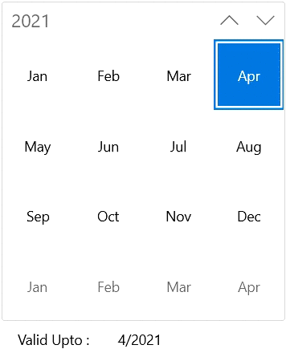

# Navigate between views in WinUI Calendar

You can easily navigate to the month, year, decade, or century views to select different dates by repeatedly clicking the header button. Initially month view is loaded. If you want to change the initial view, use [DisplayMode](https://help.syncfusion.com/cr/winui/Syncfusion.UI.Xaml.Calendar.SfCalendar.html#Syncfusion_UI_Xaml_Calendar_SfCalendar_DisplayMode) property.

## Bring a date into view

You can navigate to the month containing required date using `SetDisplayDate` method. To navigate to the required date of any month or year, pass the **DateTime** value in `SetDisplayDate` method argument.

N> `SetDisplayDate` method should be used after `Calendar` control is loaded.




<calendar:SfCalendar x:Name="calendar" 
                    Loaded="calendar_Loaded"
                    />




private void calendar_Loaded(object sender, RoutedEventArgs e)
{
    calendar.SetDisplayDate(new DateTimeOffset(new DateTime(2021, 01, 01)));
}




## Restrict navigation between views

You can restrict navigation within a minimum and maximum views by using [MinDisplayMode](https://help.syncfusion.com/cr/winui/Syncfusion.UI.Xaml.Calendar.SfCalendar.html#Syncfusion_UI_Xaml_Calendar_SfCalendar_MinDisplayMode) and [MaxDisplayMode](https://help.syncfusion.com/cr/winui/Syncfusion.UI.Xaml.Calendar.SfCalendar.html#Syncfusion_UI_Xaml_Calendar_SfCalendar_MaxDisplayMode) properties. This will be useful when your date range is smaller and you don’t want to show century view.




<calendar:SfCalendar x:Name="sfCalendar"
                     MinDisplayMode="Month"
                     MaxDisplayMode="Century"
                     DisplayMode="Month"/>




SfCalendar sfCalendar = new SfCalendar();
sfCalendar.MinDisplayMode = CalendarDisplayMode.Month;
sfCalendar.MaxDisplayMode = CalendarDisplayMode.Century;
sfCalendar.DisplayMode = CalendarDisplayMode.Month;




N> Download demo application from [GitHub](https://github.com/SyncfusionExamples/syncfusion-winui-tools-calendar-examples/blob/main/Samples/Restriction)

## Selection based on view restriction

You can restrict users to select date or dates within specific views (example : choosing valid date for credit card) in `Calendar` control using the `MinDisplayMode` and `MaxDisplayMode` properties.




<calendar:SfCalendar x:Name="sfCalendar" 
                             MinDisplayMode="Year"
                             MaxDisplayMode="Decade"
                             />




SfCalendar sfCalendar = new SfCalendar();
sfCalendar.MinDisplayMode = CalendarDisplayMode.Year;
sfCalendar.MaxDisplayMode = CalendarDisplayMode.Decade;




## Scrolling within a view

You can navigate within a view using mouse scroll or by navigation button in `Calendar` control. The navigation direction animation can be changed by using the [`NavigationDirection`](https://help.syncfusion.com/cr/winui/Syncfusion.UI.Xaml.Calendar.SfCalendar.html#Syncfusion_UI_Xaml_Calendar_SfCalendar_NavigationDirection) property value. By default, the value of `NavigationDirection` property is `vertical`.




<calendar:SfCalendar x:Name="sfCalendar"
                     NavigationDirection="Horizontal"
                     />




SfCalendar sfCalendar = new SfCalendar();
sfCalendar.NavigationDirection = Orientation.Horizontal;




When the `NavigationDirection` property is `vertical`, you can navigate within views by mouse scroll or by navigation buttons. When the `NavigationDirection` property is `Horizontal`, you can navigate by navigation buttons only.

N> Download demo application from [GitHub](https://github.com/SyncfusionExamples/syncfusion-winui-tools-calendar-examples/blob/main/Samples/Restriction)