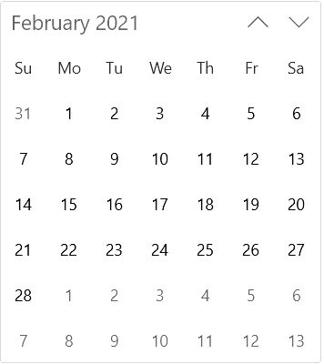
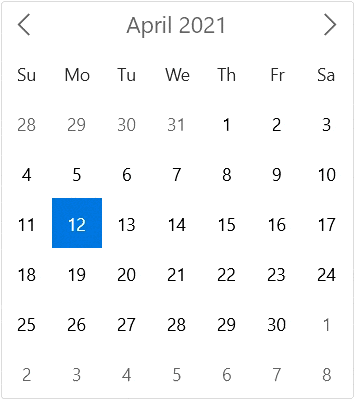

# Navigate between views in WinUI Calendar (SfCalendar)

You can easily navigate to the month, year, decade, or century views to select different dates by clicking the header button. Initially, month view is loaded. You can also change the view programmatically by using the [DisplayMode](https://help.syncfusion.com/cr/winui/Syncfusion.UI.Xaml.Calendar.SfCalendar.html#Syncfusion_UI_Xaml_Calendar_SfCalendar_DisplayMode) property.

## Bring a date into view

You can navigate to the month containing the required date using the [`SetDisplayDate`](https://help.syncfusion.com/cr/winui/Syncfusion.UI.Xaml.Calendar.SfCalendar.html#Syncfusion_UI_Xaml_Calendar_SfCalendar_SetDisplayDate_System_DateTimeOffset_) method. To navigate to the required date of any month or year, pass the **DateTime** value in `SetDisplayDate` method argument.




<calendar:SfCalendar x:Name="calendar" 
                    Loaded="calendar_Loaded"
                    />




private void calendar_Loaded(object sender, RoutedEventArgs e)
{
    calendar.SetDisplayDate(new DateTimeOffset(new DateTime(2021, 01, 01)));
}




## Restrict navigation between views

You can restrict navigation within a minimum and maximum views by using the [MinDisplayMode](https://help.syncfusion.com/cr/winui/Syncfusion.UI.Xaml.Calendar.SfCalendar.html#Syncfusion_UI_Xaml_Calendar_SfCalendar_MinDisplayMode) and [MaxDisplayMode](https://help.syncfusion.com/cr/winui/Syncfusion.UI.Xaml.Calendar.SfCalendar.html#Syncfusion_UI_Xaml_Calendar_SfCalendar_MaxDisplayMode) properties. This will be useful when your date range is smaller and you do not want to show a century view. By default, the value of `MinDisplayMode` is **Month** and `MaxDisplayMode` is **Century**.




<calendar:SfCalendar x:Name="sfCalendar"
                     MinDisplayMode="Month"
                     MaxDisplayMode="Decade"
                     DisplayMode="Month"/>




SfCalendar sfCalendar = new SfCalendar();
sfCalendar.MinDisplayMode = CalendarDisplayMode.Month;
sfCalendar.MaxDisplayMode = CalendarDisplayMode.Decade;
sfCalendar.DisplayMode = CalendarDisplayMode.Month;




N> Download demo application from [GitHub](https://github.com/SyncfusionExamples/syncfusion-winui-tools-calendar-examples/blob/main/Samples/Restriction).

## Selection based on view restriction

You can restrict users to select date or dates within specific views (example : choosing valid date for credit card) in `Calendar` control using the `MinDisplayMode` and `MaxDisplayMode` properties.




<calendar:SfCalendar x:Name="sfCalendar" 
                             MinDisplayMode="Year"
                             MaxDisplayMode="Decade"
                             />




SfCalendar sfCalendar = new SfCalendar();
sfCalendar.MinDisplayMode = CalendarDisplayMode.Year;
sfCalendar.MaxDisplayMode = CalendarDisplayMode.Decade;




## Scrolling within a view

You can navigate within a view using mouse scroll or by navigation button in `Calendar` control. The navigation direction animation can be changed by using the [`NavigationDirection`](https://help.syncfusion.com/cr/winui/Syncfusion.UI.Xaml.Calendar.SfCalendar.html#Syncfusion_UI_Xaml_Calendar_SfCalendar_NavigationDirection) property value. By default, the value of `NavigationDirection` property is **Vertical**.




<calendar:SfCalendar x:Name="sfCalendar"
                     NavigationDirection="Horizontal"
                     />




SfCalendar sfCalendar = new SfCalendar();
sfCalendar.NavigationDirection = Orientation.Horizontal;




When the `NavigationDirection` property is set to **Vertical**, you can navigate within views using mouse scroll or navigation buttons. When the `NavigationDirection` property is set to **Horizontal**, you can navigate only using navigation buttons.

N> Download demo application from [GitHub](https://github.com/SyncfusionExamples/syncfusion-winui-tools-calendar-examples/blob/main/Samples/Restriction).

## Navigation by keyboard

You can navigate between elements in the `Calendar` control using keyboard shortcuts or mouse interaction. The following are the list of keyboard shortcuts to navigate and select.

* **Tab** or **Shift+Tab** - To navigate between date cell and elements in header.
* **UpArrow**, **DownArrow**, **LeftArrow**, and **RightArrow** - To navigate between calendar date, month, or decade cells.
* **Space** or **Enter** - To select a cell.
* **Ctrl + UpArrow** and **ctrl + DownArrow** - To navigate between views (Example: Navigate from month to year view).
* **PageUp** and **PageDown** - To navigate within views (Example: Navigate between months).
* **Home** or **End** - To navigate to the first cells or last cell of current view.
