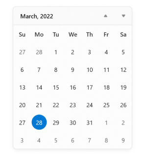

# WinUI Calendar (SfCalendar) Overview

The [WinUI Calendar](https://www.syncfusion.com/winui-controls/calendar) control allows users to view and interact with a calendar so that they can navigate by month, year, decade, or century. A user can select a single date or multiple dates or a range of dates. It supports different date formats and cells UI customization. Date selection can be restricted by specifying minimum and maximum dates. Specific dates can also disabled from selection.

## Control structure

## Key Features

* Calendar supports different culture and language types.
* Allows to change the direction of navigation within a view.
* Allows single, multiple and range of dates selection.
* Customize Calendar control display formats using abbreviated days and months.
* UI customization support for each cells.
* Supports highlighting special dates with icons.
* Supports blocking certain dates from selection and user interaction.