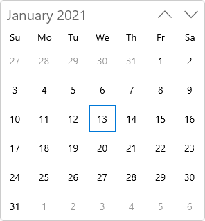

# WinUI Calendar (SfCalendar) Overview

The WinUI [Calendar](https://help.syncfusion.com/cr/winui/Syncfusion.UI.Xaml.Calendar.SfCalendar.html) control lets a user view and interact with a calendar that they can navigate by month, year, decade, or century. A user can select a single date or a range of dates. Its rich feature set includes functionalities such as date format, blackout dates, localization, and a custom template.

## Control structure

## Key Features

* Calendar supports different Culture and Language types.
* Options to change the direction of month while navigation.
* Allows to selection single and multiple date selection.
* Display area of Calendar control is limited using abbreviated days and months.
* UI customization support for a each cells.
* Supports highlighting special dates with icons.
* Supports blocking a certain dates from selection and user interaction.