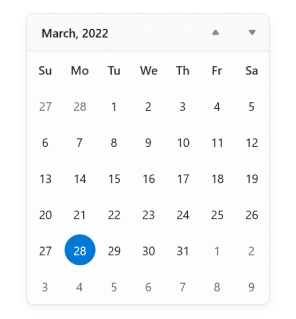

# About Syncfusion WinUI Calendar Control

The [WinUI Calendar](https://www.syncfusion.com/winui-controls/calendar) control allows users to view and interact with a calendar, allowing them to navigate by month, year, decade, or century. A user can select a single date, multiple dates, or a range of dates. It supports different date formats and cell UI customization. Date selection can be restricted by specifying minimum and maximum dates. Specific dates can also be disabled from selection.

## Control structure

## Key features

* The calendar supports different cultures and language types.
* Allows you to change the direction of navigation within a view.
* Allows single, multiple, and range of dates selection.
* Customize the Calendar control display formats using abbreviated days and months.
* UI customization support for each cell.
* Supports highlighting special dates with icons.
* Supports blocking certain dates from selection and user interaction.