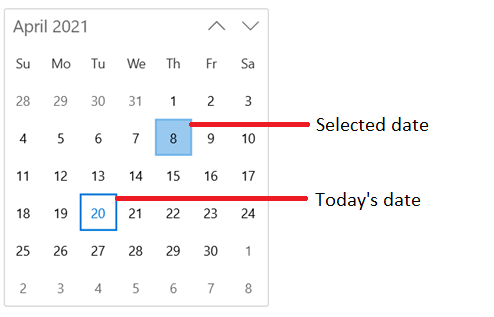

# Selection in WinUI Calendar (SfCalendar)

You can change the selected date interactively by clicking on the specific date or you can select programmatically. By default, `Calendar` control allows you to select single date at a time. 

If you want to restrict date selection or select multiple dates, set [`SelectionMode`](https://help.syncfusion.com/cr/winui/Syncfusion.UI.Xaml.Calendar.SfCalendar.html#Syncfusion_UI_Xaml_Calendar_SfCalendar_SelectionMode) property value from below values.

* **None** - Prevents from selecting a date.
* **Single** - Allows to select a single date.
* **Multiple** - Allows to select multiple dates.
* **Range** -  Allows to select range of dates.

## Single selection

You can select a single date interactively by clicking on specific date or by programmatically using [`SelectedDate`](https://help.syncfusion.com/cr/winui/Syncfusion.UI.Xaml.Calendar.SfCalendar.html#Syncfusion_UI_Xaml_Calendar_SfCalendar_SelectedDate) property.By default, value of `SelectedDate` property is **null** and `SelectedDates` collection is empty.




SfCalendar sfCalendar= new SfCalendar();
sfCalendar.SelectedDate = new DateTimeOffset(new DateTime(2021, 01, 06));




If [`SelectedDates`](https://help.syncfusion.com/cr/winui/Syncfusion.UI.Xaml.Calendar.SfCalendar.html#Syncfusion_UI_Xaml_Calendar_SfCalendar_SelectedDates) collection is used instead of `SelectedDate` property, the first date value in `SelectedDates` collection will be set as selected date and the same value changes upon selection by interaction.



<Page.DataContext>
    <local:ViewModel x:Name="viewModel" />
</Page.DataContext>
<Grid>
    <calendar:SfCalendar x:Name="calendar"
                        SelectionMode="Single" 
                        SelectedDates="{x:Bind viewModel.SelectedDates, Mode=TwoWay}"
                        />
</Grid>




public class ViewModel
{
    private DateTimeOffsetCollection selectedDates;

    public DateTimeOffsetCollection SelectedDates
    {
        get { return selectedDates; }
        set { selectedDates = value; }
    }

    public ViewModel()
    {
        SelectedDates = new DateTimeOffsetCollection();

        SelectedDates.Add(new DateTimeOffset(new DateTime(2020, 03, 10)));
        SelectedDates.Add(new DateTimeOffset(new DateTime(2020, 03, 14)));
        SelectedDates.Add(new DateTimeOffset(new DateTime(2020, 03, 15)));
        SelectedDates.Add(new DateTimeOffset(new DateTime(2020, 03, 21)));
        SelectedDates.Add(new DateTimeOffset(new DateTime(2020, 03, 24)));
    }
}




N> If `SelectedDate` property is used to select a date when `SelectionMode` property value is **Single**. The`SelectedDates` collection property will have only `SelectedDate` property value. 

## Multiple Selection

You can select one or multiple dates from different month or year or decade or century, by changing the [SelectionMode](https://help.syncfusion.com/cr/winui/Syncfusion.UI.Xaml.Calendar.SfCalendar.html#Syncfusion_UI_Xaml_Calendar_SfCalendar_SelectionMode) property value to `Multiple`. You can get the selected dates collection from the [SelectedDates](https://help.syncfusion.com/cr/winui/Syncfusion.UI.Xaml.Calendar.SfCalendar.html#Syncfusion_UI_Xaml_Calendar_SfCalendar_SelectedDates) property. By default,the value of `SelectedDate` property is **null** and `SelectedDates` collection is empty.

N> `SelectedDates` property collection will be empty, if the `SelectionMode` value is **None**. 




<calendar:SfCalendar Name="sfCalendar" 
                     SelectionMode="Multiple" />




SfCalendar sfCalendar= new SfCalendar();
sfCalendar.SelectionMode = CalendarSelectionMode.Multiple;




N> If `SelectedDate` property is used to select a date when `SelectionMode` property value is **Multiple**. The`SelectedDates` collection property will have only `SelectedDate` property value. 

N> The `SelectedDate` property value will be same as the first date value in `SelectedDates` collection and changes with it.

## Select a date range

You can select a range of dates in `Calendar` control by changing the [SelectionMode](https://help.syncfusion.com/cr/winui/Syncfusion.UI.Xaml.Calendar.SfCalendar.html#Syncfusion_UI_Xaml_Calendar_SfCalendar_SelectionMode) property value to `Range`. You can get the selected range of dates from the [SelectedRange](https://help.syncfusion.com/cr/winui/Syncfusion.UI.Xaml.Calendar.SfCalendar.html#Syncfusion_UI_Xaml_Calendar_SfCalendar_SelectedDates) property. By default, the value of `SelectedDate` property is **null** and `SelectedDates` collection is empty.

N> The `SelectedDates` collection will be empty and `SelectedDate` property value will be **null** when a date range is selected.




<calendar:SfCalendar Name="sfCalendar" 
                     SelectionMode="Range" />




SfCalendar sfCalendar= new SfCalendar();
sfCalendar.SelectionMode = CalendarSelectionMode.Range;




## Highlight today and selected dates

You can highlight the today and selected date using [SelectionHighlightMode](https://help.syncfusion.com/cr/winui/Syncfusion.UI.Xaml.Calendar.SfCalendar.html#Syncfusion_UI_Xaml_Calendar_SfCalendar_SelectionHighlightMode) property to update the background and border of the dates. The default value of `SelectionHighlightMode` property is **Outline**.




<calendar:SfCalendar SelectionHighlightMode="Filled"
                     x:Name="sfCalendar"/>




SfCalendar sfCalendar = new SfCalendar();
sfCalendar.SelectionHighlightMode = SelectionHighlightMode.Filled;




## Change shape of today and selected date

 You can customize the today and selected date cell shape using [SelectionShape](https://help.syncfusion.com/cr/winui/Syncfusion.UI.Xaml.Calendar.SfCalendar.html#Syncfusion_UI_Xaml_Calendar_SfCalendar_SelectionShape) property to customize the shape of date cells border. The default value of `SelectionShape` property is **Rectangle**.




<calendar:SfCalendar SelectionShape="Circle"
                     x:Name="sfCalendar"/>




SfCalendar sfCalendar = new SfCalendar();
sfCalendar.SelectionShape = SelectionShape.Circle;




N> Download demo application from [GitHub](https://github.com/SyncfusionExamples/syncfusion-winui-tools-calendar-examples/blob/main/Samples/Selection)

