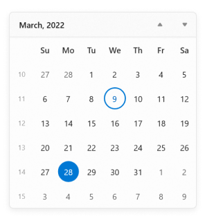
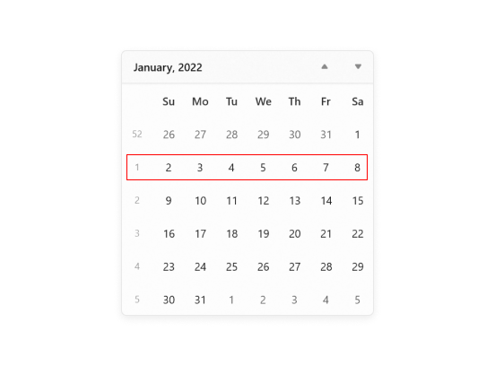
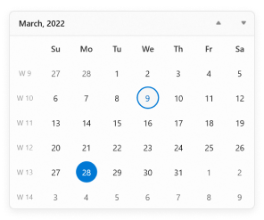

# Week number of the WinUI Calendar (SfCalendar)

This section describes the week numbers and the customization options available in the [Calendar](https://help.syncfusion.com/cr/winui/Syncfusion.UI.Xaml.Calendar.SfCalendar.html) control.

## Enable week numbers

You can show the week numbers for each week in the [Calendar](https://help.syncfusion.com/cr/winui/Syncfusion.UI.Xaml.Calendar.SfCalendar.html) control by setting the value of the [ShowWeekNumbers](https://help.syncfusion.com/cr/winui/Syncfusion.UI.Xaml.Calendar.SfCalendar.html#Syncfusion_UI_Xaml_Calendar_SfCalendar_ShowWeekNumbers) property to **true**. By default, the value of the `ShowWeekNumbers` property is **false**.

N> You can change the value of the [WeekNumberRule](https://help.syncfusion.com/cr/winui/Syncfusion.UI.Xaml.Calendar.SfCalendar.html#Syncfusion_UI_Xaml_Calendar_SfCalendar_WeekNumberRule) property with the [CalendarWeekRule](https://docs.microsoft.com/en-us/dotnet/api/system.globalization.calendarweekrule?view=net-5.0), and you can also add any prefix or suffix characters to **#** in the `WeekNumberFormat` property.




<Window
    ...
     xmlns:calendar="using:Syncfusion.UI.Xaml.Calendar">
    <calendar:SfCalendar HorizontalAlignment="Center" 
                         VerticalAlignment="Center"
                         ShowWeekNumbers="True"
                         />
</Window>




using Syncfusion.UI.Xaml.Calendar;

SfCalendar sfCalendar = new SfCalendar();
sfCalendar.ShowWeekNumbers = true;




## Week rule

You can change the rule for determining the first week of the year in the [Calendar](https://help.syncfusion.com/cr/winui/Syncfusion.UI.Xaml.Calendar.SfCalendar.html) control using the [WeekNumberRule](https://help.syncfusion.com/cr/winui/Syncfusion.UI.Xaml.Calendar.SfCalendar.html#Syncfusion_UI_Xaml_Calendar_SfCalendar_WeekNumberRule) property. The default value of the `WeekNumberRule` property is **FirstDay**. You can apply any one of the following rules to the `WeekNumberRule` property.

* **FirstDay** - Indicates that the first week of the year begins on the first day of the year and ends before the following designated first day of the week.

* **FirstFourDayWeek** - Indicates that the first week of the year is the first week with four or more days before the designated first day of the week.

* **FirstFullWeek** - Indicates that the first week of the year begins on the first occurrence of the designated first day of the week on or after the first day of the year.




<Window
    ...
     xmlns:calendar="using:Syncfusion.UI.Xaml.Calendar">
    <calendar:SfCalendar HorizontalAlignment="Center" 
                         VerticalAlignment="Center"
                         ShowWeekNumbers="True" 
                         WeekNumberRule="FirstFullWeek"
                         />
</Window>




using Syncfusion.UI.Xaml.Calendar;

SfCalendar sfCalendar = new SfCalendar();
sfCalendar.ShowWeekNumbers = true;
sfCalendar.WeekNumberRule = CalendarWeekRule.FirstFullWeek;




## Format week numbers

You can customize the format in which week numbers are displayed in the [Calendar](https://help.syncfusion.com/cr/winui/Syncfusion.UI.Xaml.Calendar.SfCalendar.html) control using the `WeekNumberFormat` property. The default value of the [WeekNumberFormat](https://help.syncfusion.com/cr/winui/Syncfusion.UI.Xaml.Calendar.SfCalendar.html#Syncfusion_UI_Xaml_Calendar_SfCalendar_WeekNumberFormat) property is **#**.

N> You can add any prefix or suffix characters to **#** in the `WeekNumberFormat` property to apply different custom formats.




<Window
    ...
     xmlns:calendar="using:Syncfusion.UI.Xaml.Calendar">
    <calendar:SfCalendar HorizontalAlignment="Center" 
                         VerticalAlignment="Center"
                         ShowWeekNumbers="True" 
                         WeekNumberRule="FirstFullWeek"
                         WeekNumberFormat = "W #" />
</Window>




using Syncfusion.UI.Xaml.Calendar;

SfCalendar sfCalendar = new SfCalendar();
sfCalendar.ShowWeekNumbers = true;
sfCalendar.WeekNumberRule = CalendarWeekRule.FirstFullWeek;
sfCalendar.WeekNumberFormat = "W #";




## Customize the week number and name of days of the week appearance

The [Calendar](https://help.syncfusion.com/cr/winui/Syncfusion.UI.Xaml.Calendar.SfCalendar.html) control allows you to customize the template of week numbers using the [WeekNumberTemplate](https://help.syncfusion.com/cr/winui/Syncfusion.UI.Xaml.Calendar.CalendarItemTemplateSelector.html#Syncfusion_UI_Xaml_Calendar_CalendarItemTemplateSelector_WeekNumberTemplate) property and the template of week name using the [WeekNameTemplate](https://help.syncfusion.com/cr/winui/Syncfusion.UI.Xaml.Calendar.CalendarItemTemplateSelector.html#Syncfusion_UI_Xaml_Calendar_CalendarItemTemplateSelector_WeekNameTemplate) property in the `CalendarItemTemplateSelector` class. 

In the following code, a `DataTemplate` is created for both the `WeekNumberTemplate` and `WeekNameTemplate` properties in the `CalendarItemTemplateSelector` class.




<Window
    ...
     xmlns:calendar="using:Syncfusion.UI.Xaml.Calendar">
    <Grid>
        <Grid.Resources>
            <DataTemplate x:Key="WeekNameAndNumberTemplate">
                <Viewbox >
                    <Grid>
                        <Ellipse Width="30" 
                                    Height="30" 
                                    Fill="WhiteSmoke"
                                    HorizontalAlignment="Center" VerticalAlignment="Center"
                                    Margin="1" />
                        <TextBlock Text="{Binding DisplayText}" 
                                    HorizontalAlignment="Center"
                                    VerticalAlignment="Center" 
                                    Foreground="DeepSkyBlue"/>
                    </Grid>
                </Viewbox>
            </DataTemplate>
        </Grid.Resources>
        <calendar:SfCalendar WeekNumberRule="FirstFourDayWeek"
                             ShowWeekNumbers="True">
            <calendar:SfCalendar.Resources>
                
            </calendar:SfCalendar.Resources>
        </calendar:SfCalendar>
    </Grid>
</Window>


