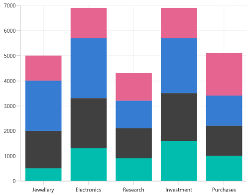
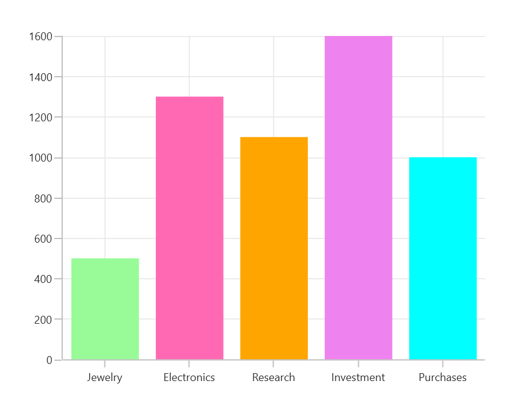

# Appearance in WinUI Chart (SfCartesianChart)

The appearance of [SfCartesianChart](https://help.syncfusion.com/cr/winui/Syncfusion.UI.Xaml.Charts.SfCartesianChart.html) can be customized by using the predefined palettes, custom palettes and gradient, which allows to enrich the application.

## Applying PaletteBrushes for Chart

By default, chart applies a set of predefined brushes to the series in a predefined order. [SfCartesianChart](https://help.syncfusion.com/cr/winui/Syncfusion.UI.Xaml.Charts.SfCartesianChart.html) provides [PaletteBrushes] property for applying various kinds of custom palettes brushes.

### Predefined PaletteBrushes

Currently, Chart supports only one predefined palette and it is the default palette for SfCartesianChart. The following screenshot shows the default appearance of multiple series.





<chart:SfCartesianChart x:Name="chart">

</chart:SfCartesianChart>





SfCartesianChart chart = new SfCartesianChart();

. . .
this.Content = chart;





### Custom PaletteBrushes

[SfCartesianChart](https://help.syncfusion.com/cr/winui/Syncfusion.UI.Xaml.Charts.SfCartesianChart.html) provides support to define own brushes for the chart with preferred order by using the [PaletteBrushes]() property, as shown in the following code example.

## Applying PaletteBrushes for Series

Cartesian chart provides support to set the palette to series for applying predefined brushes to the segment. The following code example shows you how to set the [PaletteBrushes]() for the series.





<chart:SfCartesianChart.Series>
    <chart:ColumnSeries ItemsSource="{Binding Data}"  
                        XBindingPath="Demand" 
                        YBindingPath="Year2010">
        <chart:ColumnSeries.PaletteBrushes>
            <BrushCollection>
                    <SolidColorBrush Color="#26c6da"/>
                    <SolidColorBrush Color="#00bcd4"/>
                    <SolidColorBrush Color="#00acc1"/>
                    <SolidColorBrush Color="#0097a7"/>
                    <SolidColorBrush Color="#00838f"/>
            </BrushCollection>
        </chart:ColumnSeries.PaletteBrushes>
    </chart:ColumnSeries>
</chart:SfCartesianChart.Series>





SfCartesianChart chart = new SfCartesianChart();
. . .
List<Brush> CustomBrushes = new List<Brush>();
CustomBrushes.Add(new SolidColorBrush(Color.FromArgb(255, 38, 198, 218)));
CustomBrushes.Add(new SolidColorBrush(Color.FromArgb(255, 0, 188, 212)));
CustomBrushes.Add(new SolidColorBrush(Color.FromArgb(255, 0, 172, 193)));
CustomBrushes.Add(new SolidColorBrush(Color.FromArgb(255, 0, 151, 167)));
CustomBrushes.Add(new SolidColorBrush(Color.FromArgb(255, 0, 131, 143)));

ColumnSeries series = new ColumnSeries()
{
    ItemsSource = new ViewModel().Data,
    XBindingPath = "Demand",
    YBindingPath = "Year2010",
    PaletteBrushes = CustomBrushes,
};
. . .
chart.Series.Add(series);
this.Content = chart;





## Applying Gradient

Gradient for the chart can be set by using the [PaletteBrushes]() property with the help of `LinearGradientBrush` or `RadialGradientBrush`.

The following code sample and screenshot illustrates how to apply the gradient brushes for the series using the [PaletteBrushes]() property.





 <chart:ColumnSeries ItemsSource="{Binding Data}"  
                                      XBindingPath="Demand" 
                                      YBindingPath="Year2010">
    <chart:ColumnSeries.PaletteBrushes>
        <BrushCollection>
                <LinearGradientBrush>
                    <GradientStop Offset="1" Color="#FFE7C7" />
                    <GradientStop Offset="0" Color="#FCB69F" />
                </LinearGradientBrush>
                <LinearGradientBrush>
                    <GradientStop Offset="1" Color="#fadd7d" />
                    <GradientStop Offset="0" Color="#fccc2d" />
                </LinearGradientBrush>
                <LinearGradientBrush>
                    <GradientStop Offset="1" Color="#DCFA97" />
                    <GradientStop Offset="0" Color="#96E6A1" />
                </LinearGradientBrush>
                <LinearGradientBrush>
                    <GradientStop Offset="1" Color="#DDD6F3" />
                    <GradientStop Offset="0" Color="#FAACA8" />
                </LinearGradientBrush>
                <LinearGradientBrush>
                    <GradientStop Offset="1" Color="#A8EAEE" />
                    <GradientStop Offset="0" Color="#7BB0F9" />
                </LinearGradientBrush>
        </chart:BrushCollection>
    </chart:ColumnSeries.PaletteBrushes>
</chart:ColumnSeries>





SfCartesianChart chart = new SfCartesianChart();
...
List<Brush> CustomBrushes = new List<Brush>();
LinearGradientBrush gradientColor1 = new LinearGradientBrush();
GradientStop stop1 = new GradientStop() { Offset = 1, Color = Color.FromRgb(255, 231, 199) };
GradientStop stop2 = new GradientStop() { Offset = 0, Color = Color.FromRgb(252, 182, 159) };
gradientColor1.GradientStops.Add(stop1);
gradientColor1.GradientStops.Add(stop2);
LinearGradientBrush gradientColor2 = new LinearGradientBrush();
stop1 = new GradientStop() { Offset = 1, Color = Color.FromRgb(250, 221, 125) };
stop2 = new GradientStop() { Offset = 0, Color = Color.FromRgb(252, 204, 45) };
gradientColor2.GradientStops.Add(stop1);
gradientColor2.GradientStops.Add(stop2);
...
CustomBrushes.Add(gradientColor1);
CustomBrushes.Add(gradientColor2);
...
ColumnSeries series = new ColumnSeries()
{
    ItemsSource = new ViewModel().Data,
    XBindingPath = "Demand",
    YBindingPath = "Year2010",
    PaletteBrushes = CustomBrushes,
};
chart.Series.Add(series);
. . .            
this.Content = chart;





The following code sample and screenshot illustrates how to apply the gradient color using the [Interior](https://help.syncfusion.com/cr/winui/Syncfusion.UI.Xaml.Charts.ChartSeriesBase.html#Syncfusion_UI_Xaml_Charts_ChartSeriesBase_Interior) property of series with `LinearGradientBrush`.





 <chart:SfCartesianChart.Series>
    <chart:ColumnSeries ItemsSource="{Binding Data}" 
                        XBindingPath="Demand" 
                        YBindingPath="Year2010">
        <chart:ColumnSeries.Interior>
            <LinearGradientBrush>
                <GradientStop Offset="1" Color="#A8EAEE" />
                <GradientStop Offset="0" Color="#7BB0F9" />
            </LinearGradientBrush>
        </chart:ColumnSeries.Interior>
    </chart:ColumnSeries>
</chart:SfCartesianChart.Series>





SfCartesianChart chart = new SfCartesianChart();
...
LinearGradientBrush gradientColor = new LinearGradientBrush();
GradientStop stop1 = new GradientStop() { Offset = 1, Color = Color.FromRgb(168, 234, 238) };
GradientStop stop2 = new GradientStop() { Offset = 0, Color = Color.FromRgb(123, 176, 249) };
gradientColor.GradientStops.Add(stop1);
gradientColor.GradientStops.Add(stop2);
...
ColumnSeries series = new ColumnSeries()
{
    ItemsSource = new ViewModel().Data,
    XBindingPath = "Demand",
    YBindingPath = "Year2010",
    Interior = gradientColor,
};
. . .            
this.Content = chart;





## Segment Color Binding

The color of the each segment can be set by binding their corresponding model property from the `ItemsSource` collection to its [SegmentColorPath](https://help.syncfusion.com/cr/winui/Syncfusion.UI.Xaml.Charts.ChartSeriesBase.html#Syncfusion_UI_Xaml_Charts_ChartSeriesBase_SegmentColorPath) property of series as follows.





<chart:ColumnSeries x:Name="chart" 
                ItemsSource="{Binding Data}" 
                XBindingPath="Demand"
                YBindingPath="Year2010"
                SegmentColorPath="SegmentColor">
</chart:ColumnSeries>





public class ViewModel
{
    public ObservableCollection<Model> Data { get; set; }

    public ViewModel()
    {
        Data = new ObservableCollection<Model>()
        {
            new Model(){ Demand = "Jewelry", Year2010 = 500 , SegmentColor = new SolidColorBrush(Color.FromArgb(255, 152, 251, 152))},
            new Model(){ Demand = "Electronics", Year2010 = 1300, SegmentColor = new SolidColorBrush(Color.FromArgb(255, 255, 105, 180))},
            new Model(){ Demand = "Research", Year2010 = 1100 , SegmentColor = new SolidColorBrush(Color.FromArgb(255, 255, 165, 0))},
            new Model(){ Demand = "Investment", Year2010 = 1600 , SegmentColor = new SolidColorBrush(Color.FromArgb(255, 238, 130, 238))},
            new Model(){ Demand = "Purchases", Year2010 = 1000 , SegmentColor = new SolidColorBrush(Color.FromArgb(255, 0, 255, 255))},

        };
    }
}

SfCartesianChart chart = new SfCartesianChart();
. . .
ColumnSeries series = new ColumnSeries()
{
    ItemsSource = viewModel.Data,
    XBindingPath = "Demand",
    YBindingPath = "Year2010",
    SegmentColorPath = "SegmentColor"
};
. . .            
this.Content = chart;





