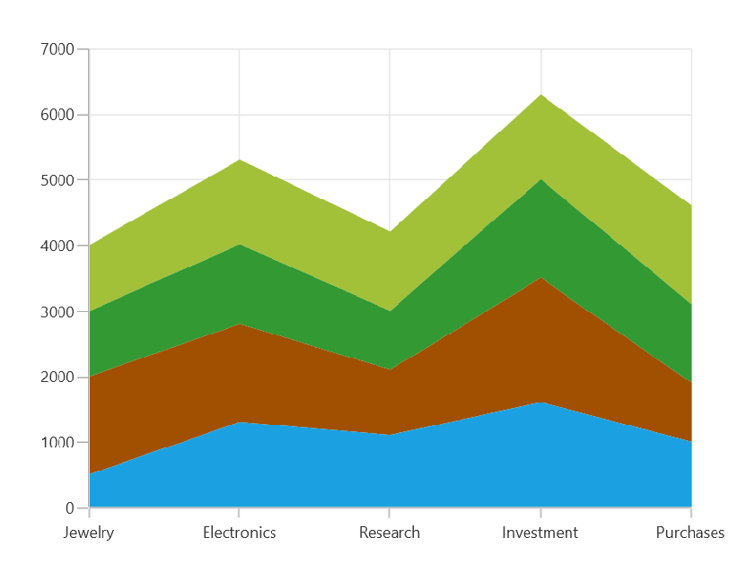
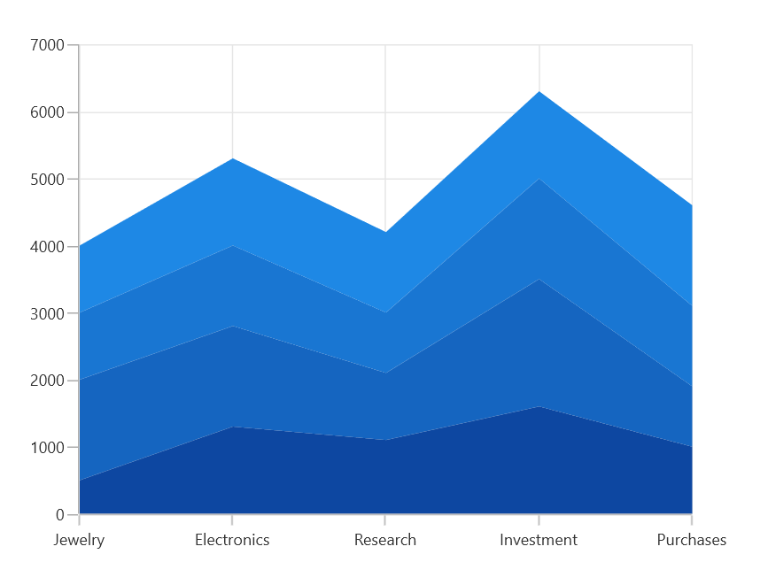
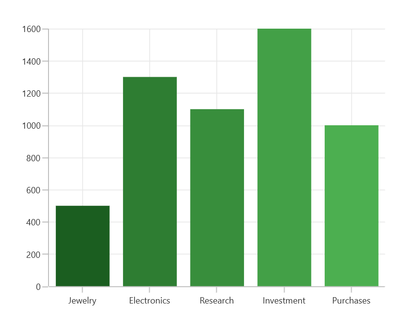
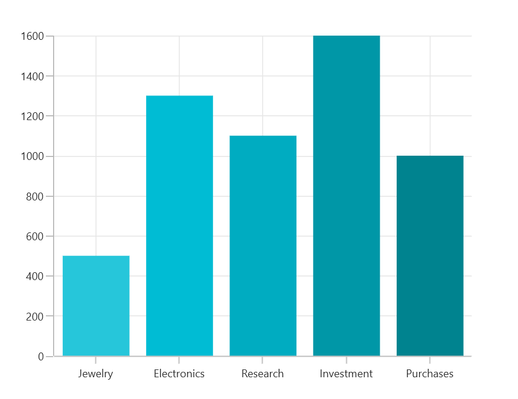
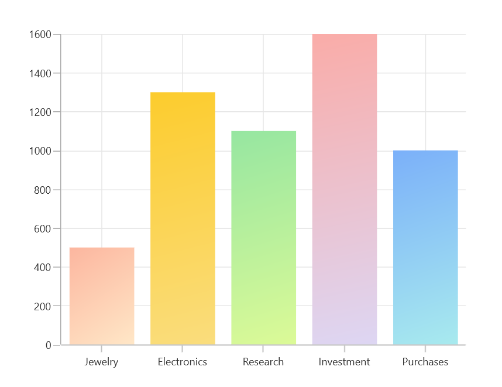
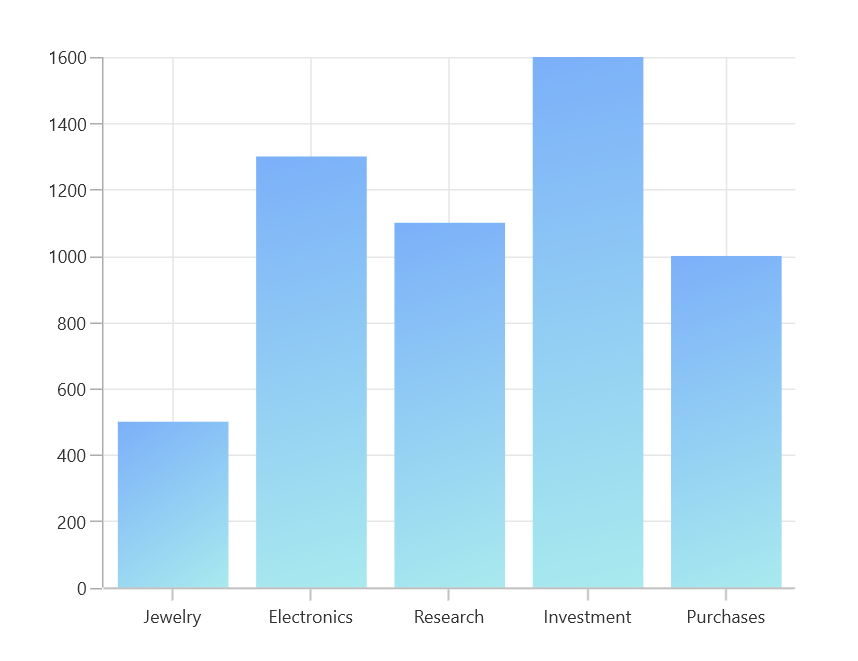

# Appearance in WinUI Cartesian Chart (SfCartesianChart)

The appearance of [SfCartesianChart]() can be customized by using the predefined palettes, custom palettes and gradient, which allows to enrich the application.

## Palettes

[SfCartesianChart]() provides options for applying various kinds of palettes. Some predefined palettes, such as.

* Metro
* AutumnBrights
* FloraHues
* Pineapple
* TomatoSpectrum
* RedChrome
* PurpleChrome
* BlueChrome
* GreenChrome
* Elite
* LightCandy
* SandyBeach

N> Elite, SandyBeach and LightCandy palettes are not supported in the bitmap series types.

### Applying palette

Each palette applies a set of predefined brushes to the series in a predefined order. [Metro]() palette is the default palette.

The following code example shows you how to set the [Metro]() palette for the cartesian chart.





<chart:SfCartesianChart x:Name="chart" Palette="Metro"
                ItemsSource="{Binding Data}" 
                XBindingPath="Category"
                YBindingPath="Value">

</chart:SfCartesianChart>





SfCartesianChart chart = new SfCartesianChart();
chart.Palette = ChartColorPalette.Metro;
. . .
this.Content = chart;





The following code example defined [`Palette`]() as [`BlueChrome`]().





<chart:SfCartesianChart x:Name="chart" Palette="BlueChrome"/>





SfCartesianChart chart = new SfCartesianChart();
chart.Palette = ChartColorPalette.BlueChrome;
. . .
this.Content = chart;





### Applying palette to segment

Cartesian chart provides support to set the palette to series for applying predefined brushes to the segment. The following code example shows you how to set the [Metro]() palette for the series.





<chart:ColumnSeries ItemsSource="{Binding Data}"  
                    XBindingPath="Demand" 
                    YBindingPath="Year2010" 
                    Palette="GreenChrome"/>





ColumnSeries series1 = new ColumnSeries()
{
    ItemsSource = new ViewModel().Data,
    XBindingPath = "Demand",
    YBindingPath = "Year2010",
    Palette = ChartColorPalette.GreenChrome
};





## Custom palette

[SfCartesianChart]() provides support to define own brushes for the chart with preferred order by using the [CustomBrushes]() property of [ChartColorModel]() and [Palette]() value as `Custom`, as shown in the following code example.





<chart:SfCartesianChart.Series>
    <chart:ColumnSeries ItemsSource="{Binding Data}"  
                        XBindingPath="Demand" 
                        YBindingPath="Year2010" 
                        Palette="Custom">
        <chart:ColumnSeries.ColorModel>
            <chart:ChartColorModel>
                <chart:ChartColorModel.CustomBrushes>
                    <SolidColorBrush Color="#26c6da"/>
                    <SolidColorBrush Color="#00bcd4"/>
                    <SolidColorBrush Color="#00acc1"/>
                    <SolidColorBrush Color="#0097a7"/>
                    <SolidColorBrush Color="#00838f"/>
                </chart:ChartColorModel.CustomBrushes>
            </chart:ChartColorModel>
        </chart:ColumnSeries.ColorModel>
    </chart:ColumnSeries>
</chart:SfCartesianChart.Series>





SfCartesianChart chart = new SfCartesianChart();
. . .
ChartColorModel colorModel = new ChartColorModel();
colorModel.CustomBrushes.Add(new SolidColorBrush(Color.FromArgb(255, 38, 198, 218)));
colorModel.CustomBrushes.Add(new SolidColorBrush(Color.FromArgb(255, 0, 188, 212)));
colorModel.CustomBrushes.Add(new SolidColorBrush(Color.FromArgb(255, 0, 172, 193)));
colorModel.CustomBrushes.Add(new SolidColorBrush(Color.FromArgb(255, 0, 151, 167)));
colorModel.CustomBrushes.Add(new SolidColorBrush(Color.FromArgb(255, 0, 131, 143)));

ColumnSeries series = new ColumnSeries()
{
    ItemsSource = new ViewModel().Data,
    XBindingPath = "Demand",
    YBindingPath = "Year2010",
    Palette = ChartColorPalette.Custom,
    ColorModel = colorModel
};
. . .
chart.Series.Add(series);
this.Content = chart;





## Applying gradient brushes

Gradient for the chart can be set by using the [`ColorModel`]() property of the cartesian chart with the help of `LinearGradientBrush` or `RadialGradientBrush`.

The following code sample and screenshot illustrates how to apply the gradient brushes for the chart using the [`ColorModel`]() property.





 <chart:ColumnSeries ItemsSource="{Binding Data}"  
                                      XBindingPath="Demand" 
                                      YBindingPath="Year2010" 
                                      Palette="Custom">
    <chart:ColumnSeries.ColorModel>
        <chart:ChartColorModel>
            <chart:ChartColorModel.CustomBrushes>
                <LinearGradientBrush>
                    <GradientStop Offset="1" Color="#FFE7C7" />
                    <GradientStop Offset="0" Color="#FCB69F" />
                </LinearGradientBrush>
                <LinearGradientBrush>
                    <GradientStop Offset="1" Color="#fadd7d" />
                    <GradientStop Offset="0" Color="#fccc2d" />
                </LinearGradientBrush>
                <LinearGradientBrush>
                    <GradientStop Offset="1" Color="#DCFA97" />
                    <GradientStop Offset="0" Color="#96E6A1" />
                </LinearGradientBrush>
                <LinearGradientBrush>
                    <GradientStop Offset="1" Color="#DDD6F3" />
                    <GradientStop Offset="0" Color="#FAACA8" />
                </LinearGradientBrush>
                <LinearGradientBrush>
                    <GradientStop Offset="1" Color="#A8EAEE" />
                    <GradientStop Offset="0" Color="#7BB0F9" />
                </LinearGradientBrush>
            </chart:ChartColorModel.CustomBrushes>
        </chart:ChartColorModel>
    </chart:ColumnSeries.ColorModel>
</chart:ColumnSeries>





SfCartesianChart chart = new SfCartesianChart();
...
ChartColorModel colorModel = new ChartColorModel();
LinearGradientBrush gradientColor1 = new LinearGradientBrush();
GradientStop stop1 = new GradientStop() { Offset = 1, Color = Color.FromRgb(255, 231, 199) };
GradientStop stop2 = new GradientStop() { Offset = 0, Color = Color.FromRgb(252, 182, 159) };
gradientColor1.GradientStops.Add(stop1);
gradientColor1.GradientStops.Add(stop2);
LinearGradientBrush gradientColor2 = new LinearGradientBrush();
stop1 = new GradientStop() { Offset = 1, Color = Color.FromRgb(250, 221, 125) };
stop2 = new GradientStop() { Offset = 0, Color = Color.FromRgb(252, 204, 45) };
gradientColor2.GradientStops.Add(stop1);
gradientColor2.GradientStops.Add(stop2);
...
colorModel.CustomBrushes.Add(gradientColor1);
colorModel.CustomBrushes.Add(gradientColor2);
...
ColumnSeries series = new ColumnSeries()
{
    ItemsSource = new ViewModel().Data,
    XBindingPath = "Demand",
    YBindingPath = "Year2010",
    Palette = ChartColorPalette.Custom,
    ColorModel = colorModel
};
chart.Series.Add(series);
. . .            
this.Content = chart;





The following code sample and screenshot illustrates how to apply the gradient color using the [Interior]() property of series with `LinearGradientBrush`.





 <chart:SfCartesianChart.Series>
    <chart:ColumnSeries ItemsSource="{Binding Data}" 
                        XBindingPath="Demand" 
                        YBindingPath="Year2010">
        <chart:ColumnSeries.Interior>
            <LinearGradientBrush>
                <GradientStop Offset="1" Color="#A8EAEE" />
                <GradientStop Offset="0" Color="#7BB0F9" />
            </LinearGradientBrush>
        </chart:ColumnSeries.Interior>
    </chart:ColumnSeries>
</chart:SfCartesianChart.Series>





SfCartesianChart chart = new SfCartesianChart();
...
LinearGradientBrush gradientColor = new LinearGradientBrush();
GradientStop stop1 = new GradientStop() { Offset = 1, Color = Color.FromRgb(168, 234, 238) };
GradientStop stop2 = new GradientStop() { Offset = 0, Color = Color.FromRgb(123, 176, 249) };
gradientColor.GradientStops.Add(stop1);
gradientColor.GradientStops.Add(stop2);
...
ColumnSeries series = new ColumnSeries()
{
    ItemsSource = new ViewModel().Data,
    XBindingPath = "Demand",
    YBindingPath = "Year2010",
    Interior = gradientColor,
};
. . .            
this.Content = chart;





## Segment color binding

The color of the each segment can be set by binding their corresponding model property from the `ItemsSource` collection to its [`ColorValuePath`]() property of series as follows.





<chart:ColumnSeries x:Name="chart" 
                ItemsSource="{Binding Data}" 
                XBindingPath="Demand"
                YBindingPath="Year2010"
                ColorValuePath="SegmentColor">
</chart:ColumnSeries>





public class ViewModel
{
    public ObservableCollection<Model> Data { get; set; }

    public ViewModel()
    {
        Data = new ObservableCollection<Model>()
        {
            new Model(){ Demand = "Jewelry", Year2010 = 500 , SegmentColor = new SolidColorBrush(Color.FromArgb(255, 152, 251, 152))},
            new Model(){ Demand = "Electronics", Year2010 = 1300, SegmentColor = new SolidColorBrush(Color.FromArgb(255, 255, 105, 180))},
            new Model(){ Demand = "Research", Year2010 = 1100 , SegmentColor = new SolidColorBrush(Color.FromArgb(255, 255, 165, 0))},
            new Model(){ Demand = "Investment", Year2010 = 1600 , SegmentColor = new SolidColorBrush(Color.FromArgb(255, 238, 130, 238))},
            new Model(){ Demand = "Purchases", Year2010 = 1000 , SegmentColor = new SolidColorBrush(Color.FromArgb(255, 0, 255, 255))},

        };
    }
}

SfCartesianChart chart = new SfCartesianChart();
. . .
ColumnSeries series = new ColumnSeries()
{
    ItemsSource = viewModel.Data,
    XBindingPath = "Demand",
    YBindingPath = "Year2010",
    SegmentColorPath = "SegmentColor"
};
. . .            
this.Content = chart;





