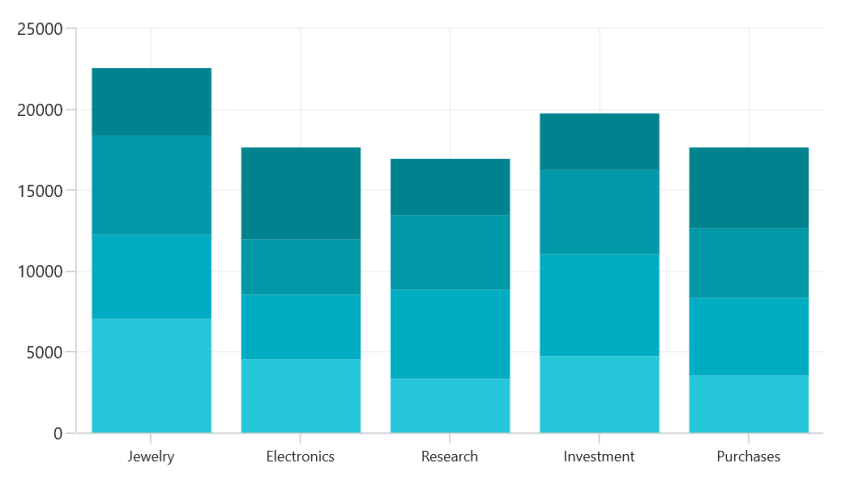

# Appearance in WinUI Chart (SfCartesianChart)

The appearance of [SfCartesianChart](https://help.syncfusion.com/cr/winui/Syncfusion.UI.Xaml.Charts.SfCartesianChart.html) can be customized using predefined brushes, custom brushes, and gradients, which enhance the application.

## Applying PaletteBrushes for Chart

By default, the chart applies a set of predefined brushes to the series in a specific order. [SfCartesianChart](https://help.syncfusion.com/cr/winui/Syncfusion.UI.Xaml.Charts.SfCartesianChart.html) provides the [PaletteBrushes](https://help.syncfusion.com/cr/winui/Syncfusion.UI.Xaml.Charts.SfCartesianChart.html#Syncfusion_UI_Xaml_Charts_SfCartesianChart_PaletteBrushes) property to apply various custom palettes.

### Predefined PaletteBrushes

Currently, the chart supports only one predefined palette, which is the default for SfCartesianChart. The screenshot below shows the default appearance of multiple series.





<chart:SfCartesianChart x:Name="chart">

</chart:SfCartesianChart>





SfCartesianChart chart = new SfCartesianChart();

. . .
this.Content = chart;





### Custom PaletteBrushes

[SfCartesianChart](https://help.syncfusion.com/cr/winui/Syncfusion.UI.Xaml.Charts.SfCartesianChart.html) allows you to define custom brushes for the chart in your preferred order using the [PaletteBrushes](https://help.syncfusion.com/cr/winui/Syncfusion.UI.Xaml.Charts.SfCartesianChart.html#Syncfusion_UI_Xaml_Charts_SfCartesianChart_PaletteBrushes) property, as shown in the code example below.





<chart:SfCartesianChart x:Name="chart" PaletteBrushes="{Binding CustomBrushes}">
. . .
</chart:SfCartesianChart>





SfCartesianChart chart = new SfCartesianChart();
List<Brush> CustomBrushes = new List<Brush>();
CustomBrushes.Add(new SolidColorBrush(Color.FromArgb(255, 38, 198, 218)));
CustomBrushes.Add(new SolidColorBrush(Color.FromArgb(255, 0, 172, 193)));
CustomBrushes.Add(new SolidColorBrush(Color.FromArgb(255, 0, 151, 167)));
CustomBrushes.Add(new SolidColorBrush(Color.FromArgb(255, 0, 131, 143)));

this.chart.PaletteBrushes = CustomBrushes;
. . .
this.Content = chart;





## Applying PaletteBrushes for Series

The Cartesian chart allows you to set a palette for series, applying predefined brushes to the segment. The following code demonstrates how to set the [PaletteBrushes](https://help.syncfusion.com/cr/winui/Syncfusion.UI.Xaml.Charts.ChartSeries.html#Syncfusion_UI_Xaml_Charts_ChartSeries_PaletteBrushes) for the series.





<chart:SfCartesianChart.Resources>
    <BrushCollection x:Key="customBrushes">
        <SolidColorBrush Color="#26c6da"/>
        <SolidColorBrush Color="#00bcd4"/>
        <SolidColorBrush Color="#00acc1"/>
        <SolidColorBrush Color="#0097a7"/>
        <SolidColorBrush Color="#00838f"/>
    </BrushCollection>
</chart:SfCartesianChart.Resources>

<chart:SfCartesianChart.Series>
    <chart:ColumnSeries ItemsSource="{Binding Data}"  
                        XBindingPath="Demand" 
                        YBindingPath="Year2010" 
                        PaletteBrushes="{StaticResource customBrushes}">        
    </chart:ColumnSeries>
</chart:SfCartesianChart.Series>





SfCartesianChart chart = new SfCartesianChart();
. . .
List<Brush> CustomBrushes = new List<Brush>();
CustomBrushes.Add(new SolidColorBrush(Color.FromArgb(255, 38, 198, 218)));
CustomBrushes.Add(new SolidColorBrush(Color.FromArgb(255, 0, 188, 212)));
CustomBrushes.Add(new SolidColorBrush(Color.FromArgb(255, 0, 172, 193)));
CustomBrushes.Add(new SolidColorBrush(Color.FromArgb(255, 0, 151, 167)));
CustomBrushes.Add(new SolidColorBrush(Color.FromArgb(255, 0, 131, 143)));

ColumnSeries series = new ColumnSeries()
{
    ItemsSource = new ViewModel().Data,
    XBindingPath = "Demand",
    YBindingPath = "Year2010",
    PaletteBrushes = CustomBrushes,
};
. . .
chart.Series.Add(series);
this.Content = chart;





## Applying Gradient

Gradients can be applied to the chart using the [PaletteBrushes](https://help.syncfusion.com/cr/winui/Syncfusion.UI.Xaml.Charts.ChartSeries.html#Syncfusion_UI_Xaml_Charts_ChartSeries_PaletteBrushes) property with `LinearGradientBrush` or `RadialGradientBrush`.

The following code sample and screenshot demonstrate how to apply gradient brushes to the series using the [PaletteBrushes](https://help.syncfusion.com/cr/winui/Syncfusion.UI.Xaml.Charts.ChartSeries.html#Syncfusion_UI_Xaml_Charts_ChartSeries_PaletteBrushes) property.





<chart:SfCartesianChart.Resources>
    <BrushCollection x:Key="customBrushes">
        <LinearGradientBrush>
            <GradientStop Offset="1" Color="#FFE7C7" />
            <GradientStop Offset="0" Color="#FCB69F" />
        </LinearGradientBrush>
        <LinearGradientBrush>
            <GradientStop Offset="1" Color="#fadd7d" />
            <GradientStop Offset="0" Color="#fccc2d" />
        </LinearGradientBrush>
        <LinearGradientBrush>
            <GradientStop Offset="1" Color="#DCFA97" />
            <GradientStop Offset="0" Color="#96E6A1" />
        </LinearGradientBrush>
        <LinearGradientBrush>
            <GradientStop Offset="1" Color="#DDD6F3" />
            <GradientStop Offset="0" Color="#FAACA8" />
        </LinearGradientBrush>
        <LinearGradientBrush>
            <GradientStop Offset="1" Color="#A8EAEE" />
            <GradientStop Offset="0" Color="#7BB0F9" />
        </LinearGradientBrush>
    </BrushCollection>
</chart:SfCartesianChart.Resources>

<chart:SfCartesianChart.Series>
    <chart:ColumnSeries ItemsSource="{Binding Data}"  
                        XBindingPath="Demand" 
                        YBindingPath="Year2010" 
                        PaletteBrushes="{StaticResource customBrushes}">        
    </chart:ColumnSeries>
</chart:SfCartesianChart.Series>





SfCartesianChart chart = new SfCartesianChart();
...
List<Brush> CustomBrushes = new List<Brush>();
LinearGradientBrush gradientColor1 = new LinearGradientBrush();
GradientStop stop1 = new GradientStop() 
{
    Offset = 1, 
    Color = Color.FromArgb(255, 255, 231, 199) 
};

GradientStop stop2 = new GradientStop() 
{
    Offset = 0, 
    Color = Color.FromArgb(255, 252, 182, 159)
};

gradientColor1.GradientStops.Add(stop1);
gradientColor1.GradientStops.Add(stop2);

LinearGradientBrush gradientColor2 = new LinearGradientBrush();
stop1 = new GradientStop() 
{
    Offset = 1, 
    Color = Color.FromArgb(255, 250, 221, 125) 
};

stop2 = new GradientStop() 
{
    Offset = 0, 
    Color = Color.FromArgb(255, 252, 204, 45) 
};

gradientColor2.GradientStops.Add(stop1);
gradientColor2.GradientStops.Add(stop2);

...
CustomBrushes.Add(gradientColor1);
CustomBrushes.Add(gradientColor2);
...
ColumnSeries series = new ColumnSeries()
{
    ItemsSource = new ViewModel().Data,
    XBindingPath = "Demand",
    YBindingPath = "Year2010",
    PaletteBrushes = CustomBrushes,
};
chart.Series.Add(series);
. . .            
this.Content = chart;





