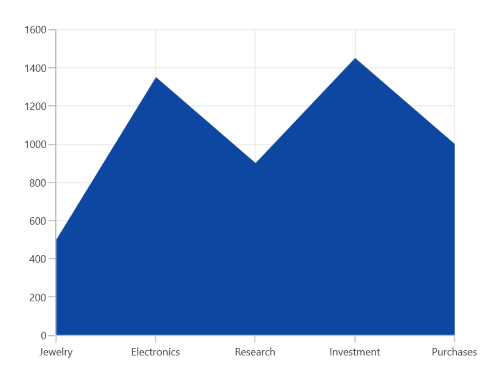
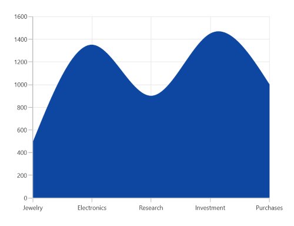
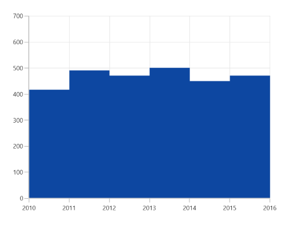

# Area Chart in WinUI Charts (SfCartesianChart)

## Area Chart

The [WinUI Area Chart](https://www.syncfusion.com/winui-controls/charts/winui-area-chart) is rendered by using a collection of line segments connected to form a closed loop area, filled with the specified color. To render a area chart, create an instance of [AreaSeries](https://help.syncfusion.com/cr/winui/Syncfusion.UI.Xaml.Charts.AreaSeries.html) and add it to the [Series](https://help.syncfusion.com/cr/winui/Syncfusion.UI.Xaml.Charts.SfCartesianChart.html#Syncfusion_UI_Xaml_Charts_SfCartesianChart_Series) collection property of the chart.





<chart:SfCartesianChart>
    
    <chart:SfCartesianChart.PrimaryAxis>
        <chart:CategoryAxis />
    </chart:SfCartesianChart.PrimaryAxis>

    <chart:SfCartesianChart.SecondaryAxis>
        <chart:NumericalAxis />
    </chart:SfCartesianChart.SecondaryAxis>   

    <chart:SfCartesianChart.Series>
        <chart:AreaSeries ItemsSource="{Binding Data}" XBindingPath="Demand" YBindingPath="Year2010"/>  
    </chart:SfCartesianChart.Series>

</chart:SfCartesianChart>





SfCartesianChart chart = new SfCartesianChart();
CategoryAxis primaryAxis = new CategoryAxis();
chart.PrimaryAxis = primaryAxis;
NumericalAxis secondaryAxis = new NumericalAxis();
chart.SecondaryAxis = secondaryAxis;

AreaSeries series = new AreaSeries()
{
    ItemsSource = new ViewModel().Data,
    XBindingPath = "Demand",
    YBindingPath = "Year2010",
};

chart.Series.Add(series);
this.Content = chart;





## Spline Area Chart

The [SplineAreaSeries](https://help.syncfusion.com/cr/winui/Syncfusion.UI.Xaml.Charts.SplineAreaSeries.html) connects a series of data points using smooth bezier line curves, with the underlying areas filled.





<chart:SfCartesianChart>

    <chart:SfCartesianChart.PrimaryAxis>
        <chart:CategoryAxis />
    </chart:SfCartesianChart.PrimaryAxis>

    <chart:SfCartesianChart.SecondaryAxis>
        <chart:NumericalAxis />
    </chart:SfCartesianChart.SecondaryAxis>
            
    <chart:SfCartesianChart.Series>
        <chart:SplineAreaSeries ItemsSource="{Binding Data}" XBindingPath="Demand" YBindingPath="Year2010"/>  
    </chart:SfCartesianChart.Series>

</chart:SfCartesianChart>





SfCartesianChart chart = new SfCartesianChart();
CategoryAxis primaryAxis = new CategoryAxis();
chart.PrimaryAxis = primaryAxis;
NumericalAxis secondaryAxis = new NumericalAxis();
chart.SecondaryAxis = secondaryAxis;

SplineAreaSeries series = new SplineAreaSeries()
{
    ItemsSource = new ViewModel().Data,
    XBindingPath = "Demand",
    YBindingPath = "Year2010",
};

chart.Series.Add(series);
this.Content = chart;





N> You can refer to our [WinUI Spline Area Chart](https://www.syncfusion.com/winui-controls/charts/winui-spline-area-chart) feature tour page for its groundbreaking feature representations. You can also explore our [WinUI Spline Area Chart example](https://github.com/syncfusion/winui-demos/blob/master/chart/Views/Basic%20Charts/SplineAreaChart.xaml) that shows how to easily configure with built-in support for creating stunning visual effects.

## Step Area Chart

The [StepAreaSeries](https://help.syncfusion.com/cr/winui/Syncfusion.UI.Xaml.Charts.StepAreaSeries.html) is similar to [AreaSeries](https://help.syncfusion.com/cr/winui/Syncfusion.UI.Xaml.Charts.AreaSeries.html), but it does not use the shortest distance to connect the two data points using bezier curves. Instead, this series uses vertical and horizontal lines to connect the data points in a series forming a step-like progression.





<chart:SfCartesianChart>

    <chart:SfCartesianChart.PrimaryAxis>
        <chart:CategoryAxis />
    </chart:SfCartesianChart.PrimaryAxis>

    <chart:SfCartesianChart.SecondaryAxis>
        <chart:NumericalAxis />
    </chart:SfCartesianChart.SecondaryAxis> 

    <chart:SfCartesianChart.Series>
        <chart:StepAreaSeries XBindingPath="XValue" YBindingPath="YValue" ItemsSource="{Binding Data}"/> 
    </chart:SfCartesianChart.Series>
    ...
</chart:SfCartesianChart>





SfCartesianChart chart = new SfCartesianChart();
CategoryAxis primaryAxis = new CategoryAxis();
chart.PrimaryAxis = primaryAxis;
NumericalAxis secondaryAxis = new NumericalAxis();
chart.SecondaryAxis = secondaryAxis;

StepAreaSeries series = new StepAreaSeries()
{
    ItemsSource = new ViewModel().Data,
    XBindingPath = "XValue",
    YBindingPath = "YValue",
};

chart.Series.Add(series);
this.Content = chart;





N> You can refer to our [WinUI Step Area Chart](https://www.syncfusion.com/winui-controls/charts/winui-step-area-chart) feature tour page for its groundbreaking feature representations. You can also explore our [WinUI Step Area Chart example](https://github.com/syncfusion/winui-demos/blob/master/chart/Views/Basic%20Charts/StepAreaChart.xaml) that shows how to easily configure with built-in support for creating stunning visual effects.