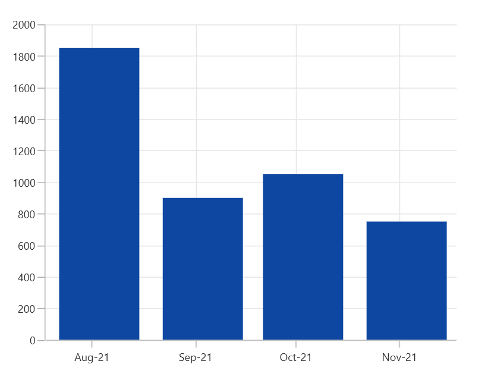
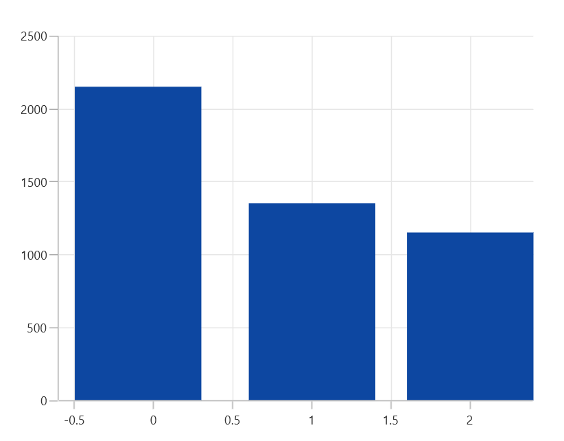
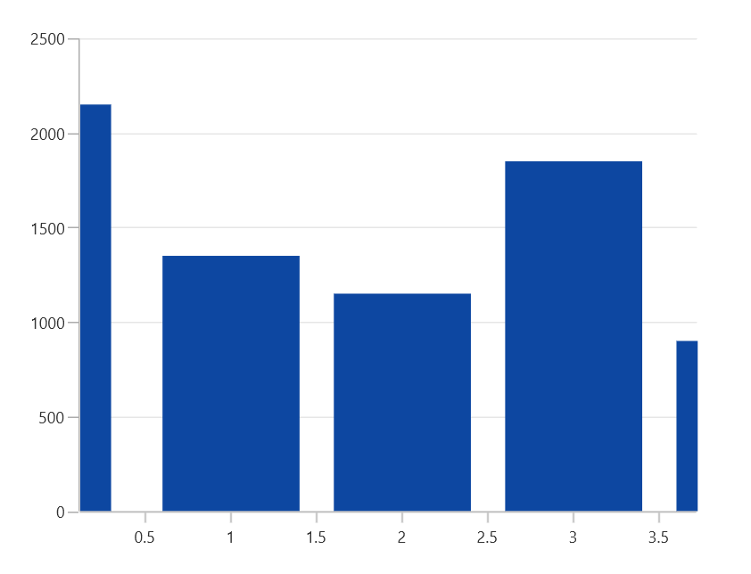

# Auto Scrolling in WinUI Chart (SfCartesianChart)

[AutoScrollingDelta](https://help.syncfusion.com/cr/winui/Syncfusion.UI.Xaml.Charts.ChartAxisBase2D.html#Syncfusion_UI_Xaml_Charts_ChartAxisBase2D_AutoScrollingDelta) is used to ensure whether the specified range of data is always visible in the cartesian chart. It always shows the recently added data points at the end, and the scrolling will be reset to the end of the range whenever a new point is added. 

### AutoScrollingDeltaType

In [DateTimeAxis](https://help.syncfusion.com/cr/winui/Syncfusion.UI.Xaml.Charts.DateTimeAxis.html), you can apply auto scrolling delta value in [Years](https://help.syncfusion.com/cr/winui/Syncfusion.UI.Xaml.Charts.DateTimeIntervalType.html#Syncfusion_UI_Xaml_Charts_DateTimeIntervalType_Years), [Months](https://help.syncfusion.com/cr/winui/Syncfusion.UI.Xaml.Charts.DateTimeIntervalType.html#Syncfusion_UI_Xaml_Charts_DateTimeIntervalType_Months), [Days](https://help.syncfusion.com/cr/winui/Syncfusion.UI.Xaml.Charts.DateTimeIntervalType.html#Syncfusion_UI_Xaml_Charts_DateTimeIntervalType_Days), [Hours](https://help.syncfusion.com/cr/winui/Syncfusion.UI.Xaml.Charts.DateTimeIntervalType.html#Syncfusion_UI_Xaml_Charts_DateTimeIntervalType_Hours), [Minutes](https://help.syncfusion.com/cr/winui/Syncfusion.UI.Xaml.Charts.DateTimeIntervalType.html#Syncfusion_UI_Xaml_Charts_DateTimeIntervalType_Minutes), [Seconds](https://help.syncfusion.com/cr/winui/Syncfusion.UI.Xaml.Charts.DateTimeIntervalType.html#Syncfusion_UI_Xaml_Charts_DateTimeIntervalType_Seconds) and [Milliseconds](https://help.syncfusion.com/cr/winui/Syncfusion.UI.Xaml.Charts.DateTimeIntervalType.html#Syncfusion_UI_Xaml_Charts_DateTimeIntervalType_Milliseconds) by setting the [AutoScrollingDeltaType](https://help.syncfusion.com/cr/winui/Syncfusion.UI.Xaml.Charts.DateTimeAxis.html#Syncfusion_UI_Xaml_Charts_DateTimeAxis_AutoScrollingDeltaType) property. The default value of this property is [Auto](https://help.syncfusion.com/cr/winui/Syncfusion.UI.Xaml.Charts.DateTimeIntervalType.html#Syncfusion_UI_Xaml_Charts_DateTimeIntervalType_Auto), and the delta will be calculated automatically based on range.

 



<chart:SfCartesianChart x:Name="chart" Palette="BlueChrome">
. . .
    <chart:SfCartesianChart.PrimaryAxis>
        <chart:DateTimeAxis AutoScrollingDelta = "3" LabelFormat="MMM-yy" AutoScrollingDeltaType = "Months"/>
    </chart:SfCartesianChart.PrimaryAxis>

    <chart:SfCartesianChart.SecondaryAxis>
        <chart:NumericalAxis />
    </chart:SfCartesianChart.SecondaryAxis>

    <chart:SfCartesianChart.Behaviors>
        <chart:ChartZoomPanBehavior />
    </chart:SfCartesianChart.Behaviors>
. . .
</chart:SfCartesianChart>





SfCartesianChart chart = new SfCartesianChart();
chart.Palette = ChartColorPalette.BlueChrome;

chart.PrimaryAxis = new DateTimeAxis()
{
    AutoScrollingDelta = 3,
    AutoScrollingDeltaType = DateTimeIntervalType.Months,
    LabelFormat = "MMM-yy"
};

chart.SecondaryAxis = new NumericalAxis();
ChartZoomPanBehavior zoomPanBehavior = new ChartZoomPanBehavior();
chart.Behaviors.Add(zoomPanBehavior);
. . .
this.Content = chart;





## AutoScrollingMode

The [AutoScrollingMode](https://help.syncfusion.com/cr/winui/Syncfusion.UI.Xaml.Charts.ChartAxisBase2D.html#Syncfusion_UI_Xaml_Charts_ChartAxisBase2D_AutoScrollingMode) property is used to determine whether the axis should be scrolled from the start position or end position. The default value of this property is [End](https://help.syncfusion.com/cr/winui/Syncfusion.UI.Xaml.Charts.ChartAutoScrollingMode.html#Syncfusion_UI_Xaml_Charts_ChartAutoScrollingMode_End).

 



<chart:SfCartesianChart x:Name="chart" Palette="BlueChrome">
. . .
    <chart:SfCartesianChart.PrimaryAxis>
        <chart:NumericalAxis AutoScrollingDelta="3" AutoScrollingMode="Start"/>
    </chart:SfCartesianChart.PrimaryAxis>

    <chart:SfCartesianChart.SecondaryAxis>
        <chart:NumericalAxis />
    </chart:SfCartesianChart.SecondaryAxis>

    <chart:SfCartesianChart.Behaviors>
        <chart:ChartZoomPanBehavior />
    </chart:SfCartesianChart.Behaviors>
. . .
</chart:SfCartesianChart>





SfCartesianChart chart = new SfCartesianChart();
chart.Palette = ChartColorPalette.BlueChrome;

chart.PrimaryAxis = new NumericalAxis()
{
    AutoScrollingDelta = 3,
    AutoScrollingMode = ChartAutoScrollingMode.Start
};

chart.SecondaryAxis = new NumericalAxis();
ChartZoomPanBehavior zoomPanBehavior = new ChartZoomPanBehavior();
chart.Behaviors.Add(zoomPanBehavior);
. . .
this.Content = chart;





## Auto interval calculation on zooming

[EnableAutoIntervalOnZooming](https://help.syncfusion.com/cr/winui/Syncfusion.UI.Xaml.Charts.ChartAxis.html#Syncfusion_UI_Xaml_Charts_ChartAxis_EnableAutoIntervalOnZooming) property is used to maintain the interval even it is in zooming state only if we set the interval to the axis. Default value of this property is true. While zooming based on the auto range padding the interval will be calculated.





<chart:SfCartesianChart x:Name="chart" Palette="BlueChrome">
. . .
    <chart:SfCartesianChart.PrimaryAxis>
        <chart:NumericalAxis ShowGridLines="False" ZoomFactor="0.5" ZoomPosition="0.1"/>
    </chart:SfCartesianChart.PrimaryAxis>

    <chart:SfCartesianChart.SecondaryAxis>
        <chart:NumericalAxis />
    </chart:SfCartesianChart.SecondaryAxis>

    <chart:SfCartesianChart.Behaviors>
        <chart:ChartZoomPanBehavior />
    </chart:SfCartesianChart.Behaviors>
. . .
</chart:SfCartesianChart>





SfCartesianChart chart = new SfCartesianChart();
chart.Palette = ChartColorPalette.BlueChrome;

chart.PrimaryAxis = new NumericalAxis()
{
    ZoomFactor = 0.5,
    ZoomPosition = 0.1,
    ShowGridLines = false,
};

chart.SecondaryAxis = new NumericalAxis();
ChartZoomPanBehavior zoomPanBehavior = new ChartZoomPanBehavior();
chart.Behaviors.Add(zoomPanBehavior);
. . .
this.Content = chart;





If you set [EnableAutoIntervalOnZooming](https://help.syncfusion.com/cr/winui/Syncfusion.UI.Xaml.Charts.ChartAxis.html#Syncfusion_UI_Xaml_Charts_ChartAxis_EnableAutoIntervalOnZooming) as False, the intervals will be calculated on the interval based on the axis while zooming.





<chart:SfCartesianChart x:Name="chart" Palette="BlueChrome">
. . .
    <chart:SfCartesianChart.PrimaryAxis>
        <chart:NumericalAxis Interval="1"
        ShowGridLines="False" ZoomFactor="0.5" ZoomPosition="0.1"
        EnableAutoIntervalOnZooming="False"/>
    </chart:SfCartesianChart.PrimaryAxis>

    <chart:SfCartesianChart.SecondaryAxis>
        <chart:NumericalAxis />
    </chart:SfCartesianChart.SecondaryAxis>

    <chart:SfCartesianChart.Behaviors>
        <chart:ChartZoomPanBehavior />
    </chart:SfCartesianChart.Behaviors>
. . .
</chart:SfCartesianChart>





SfCartesianChart chart = new SfCartesianChart();
chart.Palette = ChartColorPalette.BlueChrome;

chart.PrimaryAxis = new NumericalAxis()
{
    ZoomFactor = 0.5,
    ZoomPosition = 0.1,
    EnableAutoIntervalOnZooming = false,
    ShowGridLines = false,
    Interval = 1
};

chart.SecondaryAxis = new NumericalAxis();
ChartZoomPanBehavior zoomPanBehavior = new ChartZoomPanBehavior();
chart.Behaviors.Add(zoomPanBehavior);
. . .
this.Content = chart;





