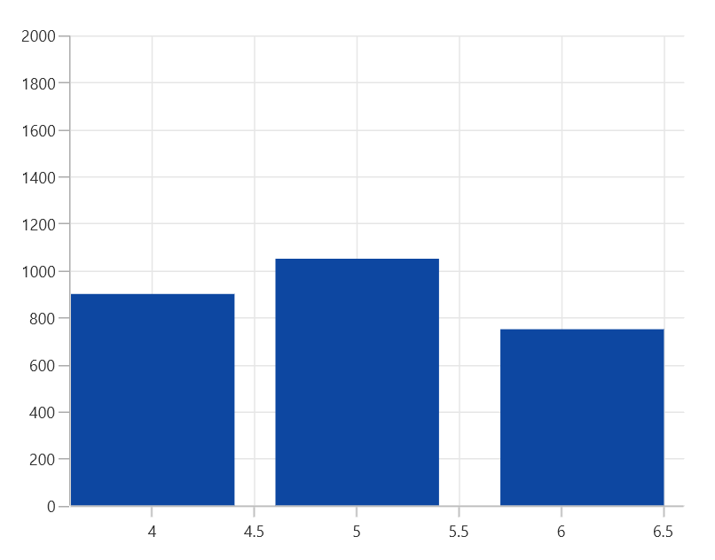

# Auto Scrolling in WinUI Chart (SfCartesianChart)

Axis provides support to auto scrolling the live data added in the chart with specific range of data visible at start or end.

## Auto Scrolling Delta

The [AutoScrollingDelta](https://help.syncfusion.com/cr/winui/Syncfusion.UI.Xaml.Charts.ChartAxisBase2D.html#Syncfusion_UI_Xaml_Charts_ChartAxisBase2D_AutoScrollingDelta) property is used to set the specified range of data visible in the chart. It always shows the recently added data points at the end, and the scrolling will be reset to the end of the range whenever a new point is added. 

 



<chart:SfCartesianChart x:Name="chart">
. . .
    <chart:SfCartesianChart.XAxes>
        <chart:NumericalAxis AutoScrollingDelta="3"/>
    </chart:SfCartesianChart.XAxes>

    <chart:SfCartesianChart.YAxes>
        <chart:NumericalAxis />
    </chart:SfCartesianChart.YAxes>

    <chart:SfCartesianChart.Behaviors>
        <chart:ChartZoomPanBehavior />
    </chart:SfCartesianChart.Behaviors>
. . .
</chart:SfCartesianChart>





SfCartesianChart chart = new SfCartesianChart();

NumericalAxis primaryAxis = new NumericalAxis()
{
    AutoScrollingDelta = 3,
};
chart.XAxes.Add(primaryAxis);

chart.YAxes.Add(new NumericalAxis());
ChartZoomPanBehavior zoomPanBehavior = new ChartZoomPanBehavior();
chart.Behaviors.Add(zoomPanBehavior);
. . .
this.Content = chart;





## Auto Scrolling Mode

The [AutoScrollingMode](https://help.syncfusion.com/cr/winui/Syncfusion.UI.Xaml.Charts.ChartAxisBase2D.html#Syncfusion_UI_Xaml_Charts_ChartAxisBase2D_AutoScrollingMode) property is used to determine whether the axis should be scrolled from the start position or end position. The default value of this property is [End](https://help.syncfusion.com/cr/winui/Syncfusion.UI.Xaml.Charts.ChartAutoScrollingMode.html#Syncfusion_UI_Xaml_Charts_ChartAutoScrollingMode_End).

 



<chart:SfCartesianChart x:Name="chart">
. . .
    <chart:SfCartesianChart.XAxes>
        <chart:NumericalAxis AutoScrollingDelta="3" AutoScrollingMode="Start"/>
    </chart:SfCartesianChart.XAxes>

    <chart:SfCartesianChart.YAxes>
        <chart:NumericalAxis />
    </chart:SfCartesianChart.YAxes>

    <chart:SfCartesianChart.Behaviors>
        <chart:ChartZoomPanBehavior />
    </chart:SfCartesianChart.Behaviors>
. . .
</chart:SfCartesianChart>





SfCartesianChart chart = new SfCartesianChart();

NumericalAxis primaryAxis = new NumericalAxis()
{
    AutoScrollingDelta = 3,
    AutoScrollingMode = ChartAutoScrollingMode.Start
};
chart.XAxes.Add(primaryAxis);

chart.YAxes.Add(new NumericalAxis());
ChartZoomPanBehavior zoomPanBehavior = new ChartZoomPanBehavior();
chart.Behaviors.Add(zoomPanBehavior);
. . .
this.Content = chart;





## Auto Scrolling Delta Type

In additional, the [AutoScrollingDeltaType](https://help.syncfusion.com/cr/winui/Syncfusion.UI.Xaml.Charts.DateTimeAxis.html#Syncfusion_UI_Xaml_Charts_DateTimeAxis_AutoScrollingDeltaType) property in the [DateTimeAxis](https://help.syncfusion.com/cr/winui/Syncfusion.UI.Xaml.Charts.DateTimeAxis.html) is used to apply the auto scrolling delta value in [Years](https://help.syncfusion.com/cr/winui/Syncfusion.UI.Xaml.Charts.DateTimeIntervalType.html#Syncfusion_UI_Xaml_Charts_DateTimeIntervalType_Years), [Months](https://help.syncfusion.com/cr/winui/Syncfusion.UI.Xaml.Charts.DateTimeIntervalType.html#Syncfusion_UI_Xaml_Charts_DateTimeIntervalType_Months), [Days](https://help.syncfusion.com/cr/winui/Syncfusion.UI.Xaml.Charts.DateTimeIntervalType.html#Syncfusion_UI_Xaml_Charts_DateTimeIntervalType_Days), [Hours](https://help.syncfusion.com/cr/winui/Syncfusion.UI.Xaml.Charts.DateTimeIntervalType.html#Syncfusion_UI_Xaml_Charts_DateTimeIntervalType_Hours), [Minutes](https://help.syncfusion.com/cr/winui/Syncfusion.UI.Xaml.Charts.DateTimeIntervalType.html#Syncfusion_UI_Xaml_Charts_DateTimeIntervalType_Minutes), [Seconds](https://help.syncfusion.com/cr/winui/Syncfusion.UI.Xaml.Charts.DateTimeIntervalType.html#Syncfusion_UI_Xaml_Charts_DateTimeIntervalType_Seconds) and [Milliseconds](https://help.syncfusion.com/cr/winui/Syncfusion.UI.Xaml.Charts.DateTimeIntervalType.html#Syncfusion_UI_Xaml_Charts_DateTimeIntervalType_Milliseconds). The default value of this property is [Auto](https://help.syncfusion.com/cr/winui/Syncfusion.UI.Xaml.Charts.DateTimeIntervalType.html#Syncfusion_UI_Xaml_Charts_DateTimeIntervalType_Auto), and the delta will be calculated automatically based on the data.

 



<chart:SfCartesianChart x:Name="chart">
. . .
    <chart:SfCartesianChart.XAxes>
        <chart:DateTimeAxis AutoScrollingDelta = "4" LabelFormat="MMM-yy" AutoScrollingDeltaType = "Months"/>
    </chart:SfCartesianChart.XAxes>

    <chart:SfCartesianChart.YAxes>
        <chart:NumericalAxis />
    </chart:SfCartesianChart.YAxes>

    <chart:SfCartesianChart.Behaviors>
        <chart:ChartZoomPanBehavior />
    </chart:SfCartesianChart.Behaviors>
. . .
</chart:SfCartesianChart>





SfCartesianChart chart = new SfCartesianChart();

DateTimeAxis primaryAxis = new DateTimeAxis()
{
    AutoScrollingDelta = 4,
    AutoScrollingDeltaType = DateTimeIntervalType.Months,
    LabelFormat = "MMM-yy"
};
chart.XAxes.Add(primaryAxis);

chart.YAxes.Add(new NumericalAxis());
ChartZoomPanBehavior zoomPanBehavior = new ChartZoomPanBehavior();
chart.Behaviors.Add(zoomPanBehavior);
. . .
this.Content = chart;





