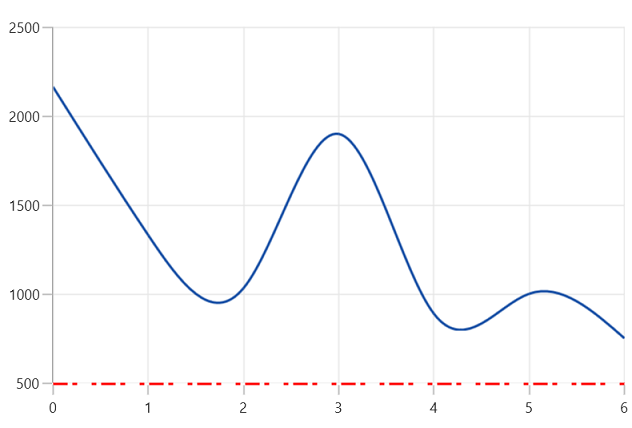
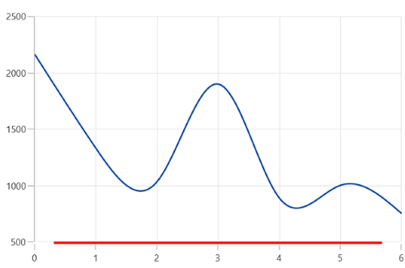

# Axis line in WinUI Chart (SfCartesianChart)

## Customization

You can customize the axis line style using the [AxisLineStyle](https://help.syncfusion.com/cr/winui/Syncfusion.UI.Xaml.Charts.ChartAxis.html#Syncfusion_UI_Xaml_Charts_ChartAxis_AxisLineStyle) property, as shown below.





<chart:SfCartesianChart>
    . . .
    <chart:SfCartesianChart.Resources>
        
    </chart:SfCartesianChart.Resources>
    . . .
    <chart:SfCartesianChart.XAxes>
        <chart:NumericalAxis AxisLineStyle="{StaticResource lineStyle}"/>
    </chart:SfCartesianChart.XAxes>
</chart:SfCartesianChart>





SfCartesianChart chart = new SfCartesianChart();
. . .
NumericalAxis primaryAxis = new NumericalAxis()
{
    AxisLineStyle = chart.Resources["lineStyle"] as Style 
};
chart.XAxes.Add(primaryAxis);





## Offset

The [AxisLineOffset](https://help.syncfusion.com/cr/winui/Syncfusion.UI.Xaml.Charts.ChartAxis.html#Syncfusion_UI_Xaml_Charts_ChartAxis_AxisLineOffset) property is used to add offset (padding) to the axis line. The default value is `0`.





<chart:SfCartesianChart>
    . . .
    <chart:SfCartesianChart.XAxes>
        <chart:NumericalAxis AxisLineOffset="25" AxisLineStyle="{StaticResource lineStyle}"/>
    </chart:SfCartesianChart.XAxes>
</chart:SfCartesianChart>





SfCartesianChart chart = new SfCartesianChart();
. . .
NumericalAxis primaryAxis = new NumericalAxis()
{
    AxisLineOffset = 25,
    AxisLineStyle = chart.Resources["lineStyle"] as Style
};
chart.XAxes.Add(primaryAxis);





