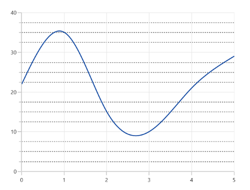

# Grid Lines in WinUI Chart (SfCartesianChart)

## Major Grid Lines

By default, major gridlines are automatically added to the [ChartAxis](https://help.syncfusion.com/cr/winui/Syncfusion.UI.Xaml.Charts.ChartAxis.html) in its defined intervals. The visibility of the gridlines can be controlled using the [ShowGridLines](https://help.syncfusion.com/cr/winui/Syncfusion.UI.Xaml.Charts.ChartAxis.html#Syncfusion_UI_Xaml_Charts_ChartAxis_ShowGridLines) property. The default value of [ShowGridLines](https://help.syncfusion.com/cr/winui/Syncfusion.UI.Xaml.Charts.ChartAxis.html#Syncfusion_UI_Xaml_Charts_ChartAxis_ShowGridLines) is true. 





<chart:SfCartesianChart>

<chart:SfCartesianChart.PrimaryAxis>
    <chart:NumericalAxis ShowGridLines="False"/>
</chart:SfCartesianChart.PrimaryAxis>

<chart:SfCartesianChart.SecondaryAxis>
    <chart:NumericalAxis />
</chart:SfCartesianChart.SecondaryAxis>
. . .
</chart:SfCartesianChart>





SfCartesianChart chart = new SfCartesianChart();
. . .
chart.PrimaryAxis = new NumericalAxis()
{
    ShowGridLines = false
};

chart.SecondaryAxis = new NumericalAxis();





### Customization

The [MajorGridLineStyle](https://help.syncfusion.com/cr/winui/Syncfusion.UI.Xaml.Charts.ChartAxis.html#Syncfusion_UI_Xaml_Charts_ChartAxis_MajorGridLineStyle) property in the chart axis is used to customize the appearance of major gridlines.





<chart:SfCartesianChart>
. . .
<chart:SfCartesianChart.Resources>
    
</chart:SfCartesianChart.Resources>
. . .
<chart:SfCartesianChart.PrimaryAxis>
    <chart:NumericalAxis MajorGridLineStyle="{StaticResource lineStyle}"/>
</chart:SfCartesianChart.PrimaryAxis>

<chart:SfCartesianChart.SecondaryAxis>
    <chart:NumericalAxis />
</chart:SfCartesianChart.SecondaryAxis>

</chart:SfCartesianChart>





SfCartesianChart chart = new SfCartesianChart();
. . .
chart.PrimaryAxis = new NumericalAxis()
{
    MajorGridLineStyle = chart.Resources["lineStyle"] as Style 
};

chart.SecondaryAxis = new NumericalAxis();





## Minor Grid Lines

Minor gridlines will be added automatically when the small tick lines is defined using the [SmallTicksPerInterval](https://help.syncfusion.com/cr/winui/Syncfusion.UI.Xaml.Charts.RangeAxisBase.html#Syncfusion_UI_Xaml_Charts_RangeAxisBase_SmallTicksPerInterval) property of chart axis.





<chart:SfCartesianChart>

<chart:SfCartesianChart.PrimaryAxis>
    <chart:NumericalAxis/>
</chart:SfCartesianChart.PrimaryAxis>

<chart:SfCartesianChart.SecondaryAxis>
    <chart:NumericalAxis SmallTicksPerInterval="3" />
</chart:SfCartesianChart.SecondaryAxis>
. . .
</chart:SfCartesianChart>





SfCartesianChart chart = new SfCartesianChart();
chart.PrimaryAxis = new NumericalAxis();
chart.SecondaryAxis = new NumericalAxis()
{
    SmallTicksPerInterval = 3,
};
. . .





### Customization

The [MinorGridLineStyle](https://help.syncfusion.com/cr/winui/Syncfusion.UI.Xaml.Charts.ChartAxis.html#Syncfusion_UI_Xaml_Charts_ChartAxis_MinorGridLineStyle) property in the chart axis is used to customize the appearance of minor gridlines.





<chart:SfCartesianChart>
. . .
<chart:SfCartesianChart.Resources>
    
</chart:SfCartesianChart.Resources>

<chart:SfCartesianChart.PrimaryAxis>
    <chart:NumericalAxis/>
</chart:SfCartesianChart.PrimaryAxis>

<chart:SfCartesianChart.SecondaryAxis>
    <chart:NumericalAxis SmallTicksPerInterval="3" MinorGridLineStyle="{StaticResource lineStyle}"/>
</chart:SfCartesianChart.SecondaryAxis>
. . .
</chart:SfCartesianChart>





SfCartesianChart chart = new SfCartesianChart();
chart.PrimaryAxis = new NumericalAxis();
chart.SecondaryAxis = new NumericalAxis()
{
    SmallTicksPerInterval = 3,
    MinorGridLineStyle = chart.Resources["lineStyle"] as Style 
};
. . .





