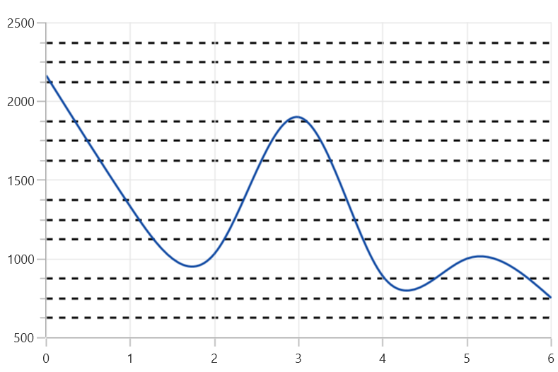

# Gridlines in WinUI Cartesian Chart

## Major gridlines

By default, gridlines are automatically added to the [ChartAxis]() in its defined intervals. SfChart supports customization of gridline. The visibility of the gridlines can be controlled using the [ShowGridLines]() property.

The following code example illustrates the [ShowGridLines]() property as false in the primary axis.





<chart:SfCartesianChart.PrimaryAxis>
    <chart:NumericalAxis ShowGridLines="False"/>
</chart:SfCartesianChart.PrimaryAxis>





chart.PrimaryAxis = new NumericalAxis()
{
    ShowGridLines = false
};





Style can also be applied to Major and Minor Gridlines using [MajorGridLineStyle]() and [MinorGridLineStyle]() properties.

**Major Gridline Style**





<chart:SfCartesianChart.Resources>
    
</chart:SfCartesianChart.Resources>
. . .
<chart:SfCartesianChart.PrimaryAxis>
    <chart:NumericalAxis MajorGridLineStyle="{StaticResource lineStyle}"/>
</chart:SfCartesianChart.PrimaryAxis>





chart.PrimaryAxis = new NumericalAxis()
{
    MajorGridLineStyle = chart.Resources["lineStyle"] as Style 
};





**Minor Gridline Style**

Minor gridlines will be added automatically when the small tick lines is defined inside the chart area.





<chart:SfCartesianChart.Resources>
    
</chart:SfCartesianChart.Resources>
. . .
<chart:SfCartesianChart.SecondaryAxis>
    <chart:NumericalAxis SmallTicksPerInterval="3" MinorGridLineStyle="{StaticResource lineStyle}" 
</chart:SfCartesianChart.SecondaryAxis>





chart.PrimaryAxis = new NumericalAxis()
{
    SmallTicksPerInterval = 3,
    MinorGridLineStyle = chart.Resources["lineStyle"] as Style 
};





