# Range padding in WinUI Chart (SfCartesianChart)

The [NumericalAxis](https://help.syncfusion.com/cr/winui/Syncfusion.UI.Xaml.Charts.NumericalAxis.html) and [DateTimeAxis](https://help.syncfusion.com/cr/winui/Syncfusion.UI.Xaml.Charts.DateTimeAxis.html) have a [RangePadding](https://help.syncfusion.com/cr/winui/Syncfusion.UI.Xaml.Charts.DateTimeAxis.html#Syncfusion_UI_Xaml_Charts_DateTimeAxis_RangePadding) property that can be used to add padding to the range of a chart’s axis.

## DateTimeRangePadding

The [RangePadding](https://help.syncfusion.com/cr/winui/Syncfusion.UI.Xaml.Charts.NumericalAxis.html) types available in the [DateTimeAxis](https://help.syncfusion.com/cr/winui/Syncfusion.UI.Xaml.Charts.DateTimeAxis.html) are: 

* Auto
* Additional
* None
* Round
* RoundStart
* RoundEnd
* PrependInterval
* AppendInterval

### Auto

By default the date time range padding is [`Auto`](https://help.syncfusion.com/cr/winui/Syncfusion.UI.Xaml.Charts.DateTimeRangePadding.html#Syncfusion_UI_Xaml_Charts_DateTimeRangePadding_Auto).

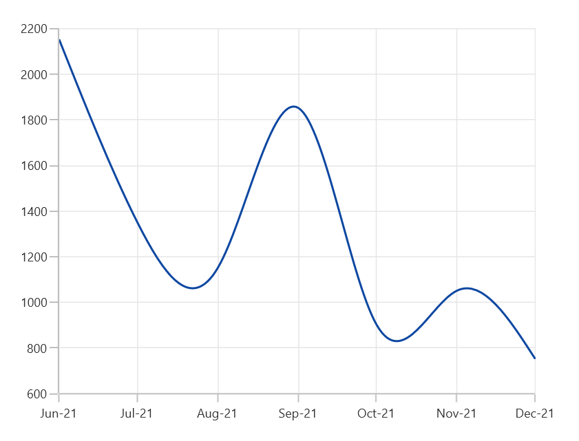

### Additional

When [RangePadding](https://help.syncfusion.com/cr/winui/Syncfusion.UI.Xaml.Charts.DateTimeAxis.html#Syncfusion_UI_Xaml_Charts_DateTimeAxis_RangePadding) for [DateTimeAxis](https://help.syncfusion.com/cr/winui/Syncfusion.UI.Xaml.Charts.DateTimeAxis.html), the DateTime interval of the axis is added as padding, as shown in the following screenshot.





<chart:SfCartesianChart Palette="BlueChrome">
. . .
    <chart:SfCartesianChart.PrimaryAxis>
        <chart:DateTimeAxis RangePadding="Additional" LabelFormat="MMM-yy"/>
    </chart:SfCartesianChart.PrimaryAxis>

    <chart:SfCartesianChart.SecondaryAxis>
        <chart:NumericalAxis />
    </chart:SfCartesianChart.SecondaryAxis>
. . .
</chart:SfCartesianChart>





SfCartesianChart chart = new SfCartesianChart();
chart.Palette = ChartColorPalette.BlueChrome;

chart.PrimaryAxis = new DateTimeAxis()
{
    RangePadding = DateTimeRangePadding.Additional,
    LabelFormat = "MMM-yy"
};

chart.SecondaryAxis = new NumericalAxis();
. . .
this.Content = chart;





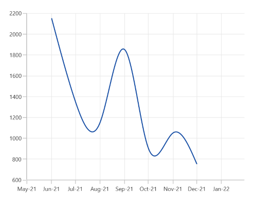

### Round

When [RangePadding](https://help.syncfusion.com/cr/winui/Syncfusion.UI.Xaml.Charts.DateTimeAxis.html#Syncfusion_UI_Xaml_Charts_DateTimeAxis_RangePadding) for [DateTimeAxis](https://help.syncfusion.com/cr/winui/Syncfusion.UI.Xaml.Charts.DateTimeAxis.html) is set to [Round](https://help.syncfusion.com/cr/winui/Syncfusion.UI.Xaml.Charts.DateTimeRangePadding.html#Syncfusion_UI_Xaml_Charts_DateTimeRangePadding_Round), the range of the chart axis is rounded off to the nearest possible DateTime value, as shown in the following screenshot.





<chart:SfCartesianChart Palette="BlueChrome">
. . .
    <chart:SfCartesianChart.PrimaryAxis>
        <chart:DateTimeAxis RangePadding="Round" LabelFormat="MMM-yy"/>
    </chart:SfCartesianChart.PrimaryAxis>

    <chart:SfCartesianChart.SecondaryAxis>
        <chart:NumericalAxis />
    </chart:SfCartesianChart.SecondaryAxis>
. . .
</chart:SfCartesianChart>





SfCartesianChart chart = new SfCartesianChart();
chart.Palette = ChartColorPalette.BlueChrome;

chart.PrimaryAxis = new DateTimeAxis()
{
    RangePadding = DateTimeRangePadding.Round,
    LabelFormat = "MMM-yy"
};

chart.SecondaryAxis = new NumericalAxis();
. . .
this.Content = chart;





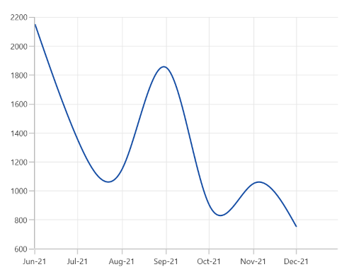

### None

When the [RangePadding](https://help.syncfusion.com/cr/winui/Syncfusion.UI.Xaml.Charts.DateTimeAxis.html#Syncfusion_UI_Xaml_Charts_DateTimeAxis_RangePadding) for a [DateTimeAxis](https://help.syncfusion.com/cr/winui/Syncfusion.UI.Xaml.Charts.DateTimeAxis.html) is [`None`](https://help.syncfusion.com/cr/winui/Syncfusion.UI.Xaml.Charts.DateTimeRangePadding.html#Syncfusion_UI_Xaml_Charts_DateTimeRangePadding_None).

The following screenshot demonstrates a chart’s x-axis with [RangePadding](https://help.syncfusion.com/cr/winui/Syncfusion.UI.Xaml.Charts.DateTimeAxis.html#Syncfusion_UI_Xaml_Charts_DateTimeAxis_RangePadding) set to `None`. 





<chart:SfCartesianChart Palette="BlueChrome">
. . .
    <chart:SfCartesianChart.PrimaryAxis>
        <chart:DateTimeAxis RangePadding="None" LabelFormat="MMM-yy"/>
    </chart:SfCartesianChart.PrimaryAxis>

    <chart:SfCartesianChart.SecondaryAxis>
        <chart:NumericalAxis />
    </chart:SfCartesianChart.SecondaryAxis>
. . .
</chart:SfCartesianChart>





SfCartesianChart chart = new SfCartesianChart();
chart.Palette = ChartColorPalette.BlueChrome;

chart.PrimaryAxis = new DateTimeAxis()
{
    RangePadding = DateTimeRangePadding.None,
    LabelFormat = "MMM-yy"
};

chart.SecondaryAxis = new NumericalAxis();
. . .
this.Content = chart;





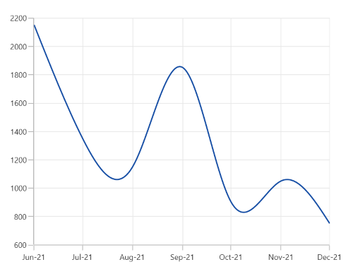

### RoundStart

When [RangePadding](https://help.syncfusion.com/cr/winui/Syncfusion.UI.Xaml.Charts.DateTimeAxis.html#Syncfusion_UI_Xaml_Charts_DateTimeAxis_RangePadding) for [DateTimeAxis](https://help.syncfusion.com/cr/winui/Syncfusion.UI.Xaml.Charts.DateTimeAxis.html) is set to [RoundStart](https://help.syncfusion.com/cr/winui/Syncfusion.UI.Xaml.Charts.DateTimeRangePadding.html#Syncfusion_UI_Xaml_Charts_DateTimeRangePadding_RoundStart), the range of the chart axis is rounded in the start off to the nearest possible DateTime value, as shown in the following screenshot.





<chart:SfCartesianChart Palette="BlueChrome">
. . .
    <chart:SfCartesianChart.PrimaryAxis>
        <chart:DateTimeAxis RangePadding="RoundStart" LabelFormat="MMM-yy"/>
    </chart:SfCartesianChart.PrimaryAxis>

    <chart:SfCartesianChart.SecondaryAxis>
        <chart:NumericalAxis />
    </chart:SfCartesianChart.SecondaryAxis>
. . .
</chart:SfCartesianChart>





SfCartesianChart chart = new SfCartesianChart();
chart.Palette = ChartColorPalette.BlueChrome;

chart.PrimaryAxis = new DateTimeAxis()
{
    RangePadding = DateTimeRangePadding.RoundStart,
    LabelFormat = "MMM-yy"
};

chart.SecondaryAxis = new NumericalAxis();
. . .
this.Content = chart;





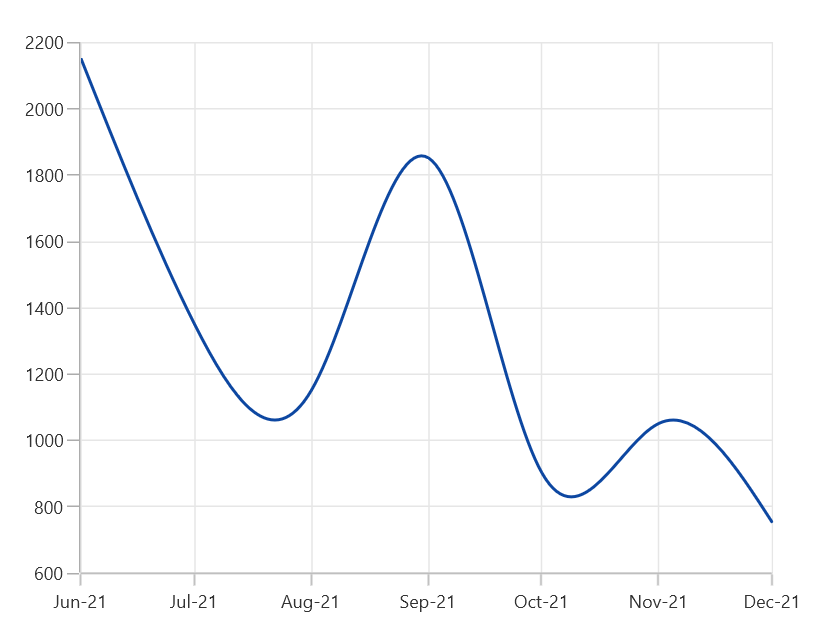

### RoundEnd

When [RangePadding](https://help.syncfusion.com/cr/winui/Syncfusion.UI.Xaml.Charts.DateTimeAxis.html#Syncfusion_UI_Xaml_Charts_DateTimeAxis_RangePadding) for [DateTimeAxis](https://help.syncfusion.com/cr/winui/Syncfusion.UI.Xaml.Charts.DateTimeAxis.html) is set to [RoundEnd](https://help.syncfusion.com/cr/winui/Syncfusion.UI.Xaml.Charts.DateTimeRangePadding.html#Syncfusion_UI_Xaml_Charts_DateTimeRangePadding_RoundEnd), the range of the chart axis is rounded in the end off to the nearest possible DateTime value, as shown in the following screenshot.



<chart:SfCartesianChart Palette="BlueChrome">
. . .
    <chart:SfCartesianChart.PrimaryAxis>
        <chart:DateTimeAxis RangePadding="RoundEnd" LabelFormat="MMM-yy"/>
    </chart:SfCartesianChart.PrimaryAxis>

    <chart:SfCartesianChart.SecondaryAxis>
        <chart:NumericalAxis />
    </chart:SfCartesianChart.SecondaryAxis>
. . .
</chart:SfCartesianChart>





SfCartesianChart chart = new SfCartesianChart();
chart.Palette = ChartColorPalette.BlueChrome;

chart.PrimaryAxis = new DateTimeAxis()
{
    RangePadding = DateTimeRangePadding.RoundEnd,
    LabelFormat = "MMM-yy"
};

chart.SecondaryAxis = new NumericalAxis();
. . .
this.Content = chart;





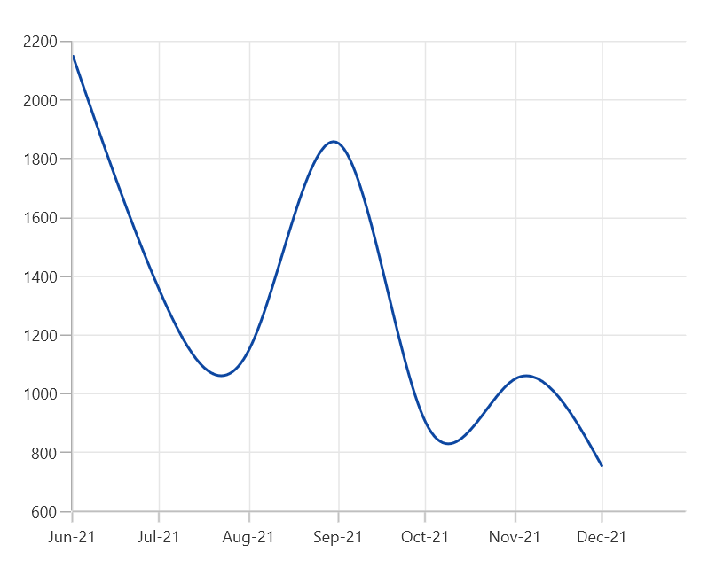

### PrependInterval

When [RangePadding](https://help.syncfusion.com/cr/winui/Syncfusion.UI.Xaml.Charts.DateTimeAxis.html#Syncfusion_UI_Xaml_Charts_DateTimeAxis_RangePadding) for [DateTimeAxis](https://help.syncfusion.com/cr/winui/Syncfusion.UI.Xaml.Charts.DateTimeAxis.html) is set to [PrependInterval](https://help.syncfusion.com/cr/winui/Syncfusion.UI.Xaml.Charts.DateTimeRangePadding.html#Syncfusion_UI_Xaml_Charts_DateTimeRangePadding_PrependInterval), the DateTime interval of the axis is added in the start as padding, as shown in the following screenshot.





<chart:SfCartesianChart Palette="BlueChrome">
. . .
    <chart:SfCartesianChart.PrimaryAxis>
        <chart:DateTimeAxis RangePadding="PrependInterval" LabelFormat="MMM-yy"/>
    </chart:SfCartesianChart.PrimaryAxis>

    <chart:SfCartesianChart.SecondaryAxis>
        <chart:NumericalAxis />
    </chart:SfCartesianChart.SecondaryAxis>
. . .
</chart:SfCartesianChart>





SfCartesianChart chart = new SfCartesianChart();
chart.Palette = ChartColorPalette.BlueChrome;

chart.PrimaryAxis = new DateTimeAxis()
{
    RangePadding = DateTimeRangePadding.PrependInterval,
    LabelFormat = "MMM-yy"
};

chart.SecondaryAxis = new NumericalAxis();
. . .
this.Content = chart;





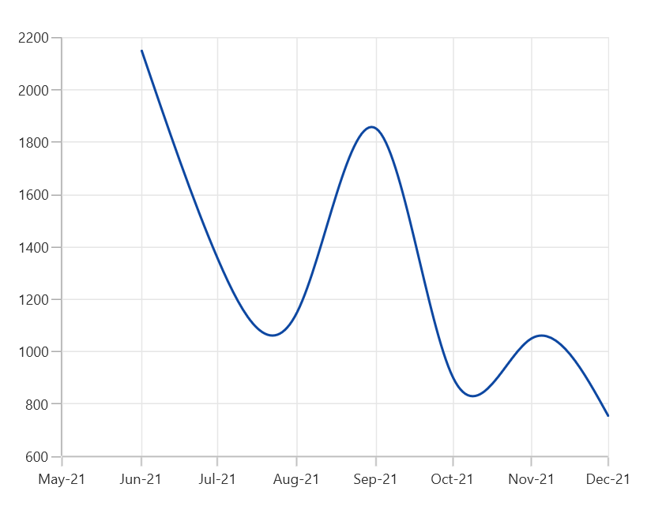

### AppendInterval

When [RangePadding](https://help.syncfusion.com/cr/winui/Syncfusion.UI.Xaml.Charts.DateTimeAxis.html#Syncfusion_UI_Xaml_Charts_DateTimeAxis_RangePadding) for [DateTimeAxis](https://help.syncfusion.com/cr/winui/Syncfusion.UI.Xaml.Charts.DateTimeAxis.html) is set to [AppendInterval](https://help.syncfusion.com/cr/winui/Syncfusion.UI.Xaml.Charts.DateTimeRangePadding.html#Syncfusion_UI_Xaml_Charts_DateTimeRangePadding_AppendInterval), the DateTime interval of the axis is added in the end as padding, as shown in the following screenshot.



<chart:SfCartesianChart Palette="BlueChrome">
. . .
    <chart:SfCartesianChart.PrimaryAxis>
        <chart:DateTimeAxis RangePadding="AppendInterval" LabelFormat="MMM-yy"/>
    </chart:SfCartesianChart.PrimaryAxis>

    <chart:SfCartesianChart.SecondaryAxis>
        <chart:NumericalAxis />
    </chart:SfCartesianChart.SecondaryAxis>
. . .
</chart:SfCartesianChart>





SfCartesianChart chart = new SfCartesianChart();
chart.Palette = ChartColorPalette.BlueChrome;

chart.PrimaryAxis = new DateTimeAxis()
{
    RangePadding = DateTimeRangePadding.AppendInterval,
    LabelFormat = "MMM-yy"
};

chart.SecondaryAxis = new NumericalAxis();
. . .
this.Content = chart;





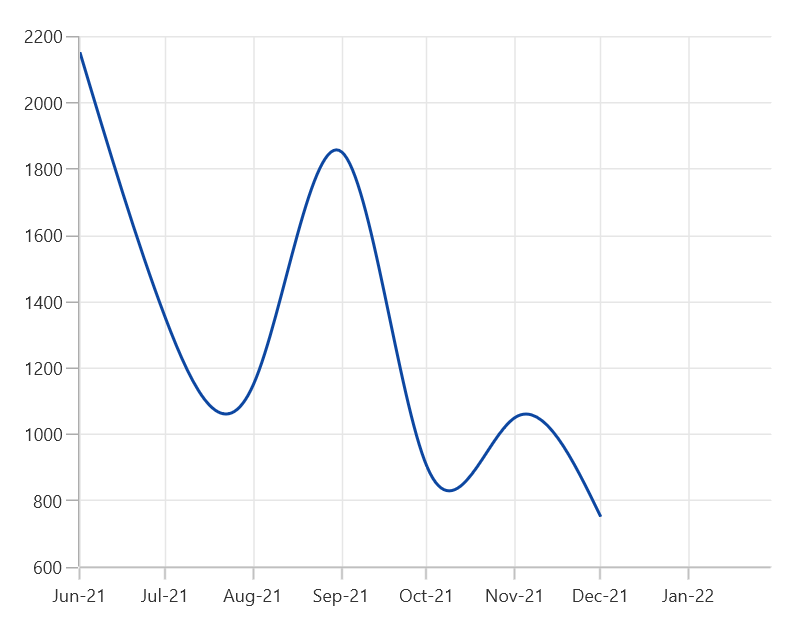

## NumericalRangePadding

The following types are available for [NumericalAxis](https://help.syncfusion.com/cr/winui/Syncfusion.UI.Xaml.Charts.NumericalAxis.html):

* Additional
* None
* Normal
* Round
* Auto
* RoundStart
* RoundEnd
* PrependInterval
* AppendInterval

### Round

By default, the default [RangePadding](https://help.syncfusion.com/cr/winui/Syncfusion.UI.Xaml.Charts.NumericalAxis.html#Syncfusion_UI_Xaml_Charts_NumericalAxis_RangePadding) value for [PrimaryAxis](https://help.syncfusion.com/cr/winui/Syncfusion.UI.Xaml.Charts.SfCartesianChart.html#Syncfusion_UI_Xaml_Charts_SfCartesianChart_PrimaryAxis) is [Auto](https://help.syncfusion.com/cr/winui/Syncfusion.UI.Xaml.Charts.NumericalPadding.html#Syncfusion_UI_Xaml_Charts_NumericalPadding_Auto) and for [SecondaryAxis](https://help.syncfusion.com/cr/winui/Syncfusion.UI.Xaml.Charts.SfCartesianChart.html#Syncfusion_UI_Xaml_Charts_SfCartesianChart_SecondaryAxis), the default value is [Round](https://help.syncfusion.com/cr/winui/Syncfusion.UI.Xaml.Charts.NumericalPadding.html#Syncfusion_UI_Xaml_Charts_NumericalPadding_Round).

The following screenshot illustrates a chart’s y-axis with [RangePadding](https://help.syncfusion.com/cr/winui/Syncfusion.UI.Xaml.Charts.NumericalAxis.html#Syncfusion_UI_Xaml_Charts_NumericalAxis_RangePadding) set to [Round](https://help.syncfusion.com/cr/winui/Syncfusion.UI.Xaml.Charts.NumericalPadding.html#Syncfusion_UI_Xaml_Charts_NumericalPadding_Round).





<chart:SfCartesianChart Palette="BlueChrome">
. . .
    <chart:SfCartesianChart.PrimaryAxis>
        <chart:NumericalAxis  RangePadding="Round"/>
    </chart:SfCartesianChart.PrimaryAxis>

    <chart:SfCartesianChart.SecondaryAxis>
        <chart:NumericalAxis />
    </chart:SfCartesianChart.SecondaryAxis>
. . .
</chart:SfCartesianChart>





SfCartesianChart chart = new SfCartesianChart();
chart.Palette = ChartColorPalette.BlueChrome;

chart.PrimaryAxis = new NumericalAxis()
{
    RangePadding = NumericalPadding.Round,
};

chart.SecondaryAxis = new NumericalAxis();
. . .
this.Content = chart;





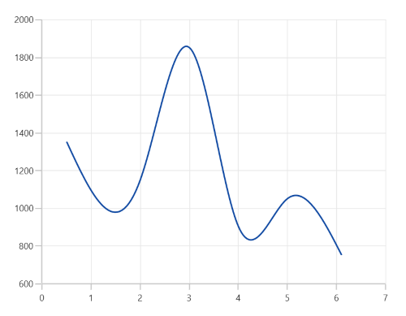

### Normal

[Normal](https://help.syncfusion.com/cr/winui/Syncfusion.UI.Xaml.Charts.NumericalPadding.html#Syncfusion_UI_Xaml_Charts_NumericalPadding_Normal) [RangePadding](https://help.syncfusion.com/cr/winui/Syncfusion.UI.Xaml.Charts.NumericalAxis.html#Syncfusion_UI_Xaml_Charts_NumericalAxis_RangePadding) for a [NumericalAxis](https://help.syncfusion.com/cr/winui/Syncfusion.UI.Xaml.Charts.NumericalAxis.html) is used mostly for the y-axis to have padding based on the Range calculation.

The following screenshot illustrates a chart’s y-axis with [RangePadding](https://help.syncfusion.com/cr/winui/Syncfusion.UI.Xaml.Charts.NumericalAxis.html#Syncfusion_UI_Xaml_Charts_NumericalAxis_RangePadding) set to [Normal](https://help.syncfusion.com/cr/winui/Syncfusion.UI.Xaml.Charts.NumericalPadding.html#Syncfusion_UI_Xaml_Charts_NumericalPadding_Normal).





<chart:SfCartesianChart Palette="BlueChrome">
. . .
    <chart:SfCartesianChart.PrimaryAxis>
        <chart:NumericalAxis  RangePadding="Normal"/>
    </chart:SfCartesianChart.PrimaryAxis>

    <chart:SfCartesianChart.SecondaryAxis>
        <chart:NumericalAxis />
    </chart:SfCartesianChart.SecondaryAxis>
. . .
</chart:SfCartesianChart>





SfCartesianChart chart = new SfCartesianChart();
chart.Palette = ChartColorPalette.BlueChrome;

chart.PrimaryAxis = new NumericalAxis()
{
    RangePadding = NumericalPadding.Normal,
};

chart.SecondaryAxis = new NumericalAxis();
. . .
this.Content = chart;





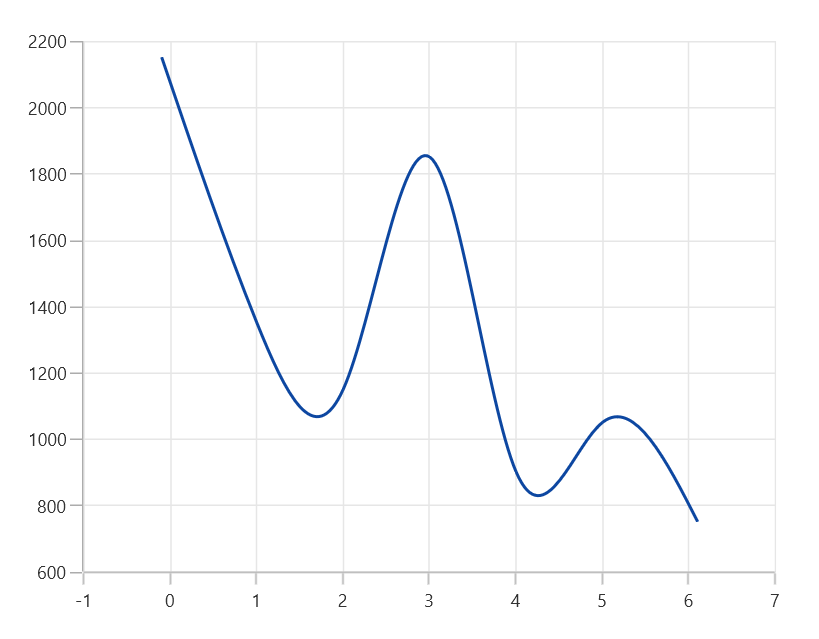

### Additional

If [RangePadding](https://help.syncfusion.com/cr/winui/Syncfusion.UI.Xaml.Charts.NumericalAxis.html#Syncfusion_UI_Xaml_Charts_NumericalAxis_RangePadding) for [NumericalAxis](https://help.syncfusion.com/cr/winui/Syncfusion.UI.Xaml.Charts.NumericalAxis.html) is set to [Additional](https://help.syncfusion.com/cr/winui/Syncfusion.UI.Xaml.Charts.NumericalPadding.html#Syncfusion_UI_Xaml_Charts_NumericalPadding_Additional), the interval of the axis is added as padding.

The following screenshot demonstrates a chart’s x-axis with [RangePadding](https://help.syncfusion.com/cr/winui/Syncfusion.UI.Xaml.Charts.NumericalAxis.html#Syncfusion_UI_Xaml_Charts_NumericalAxis_RangePadding) set to [Additional](https://help.syncfusion.com/cr/winui/Syncfusion.UI.Xaml.Charts.NumericalPadding.html#Syncfusion_UI_Xaml_Charts_NumericalPadding_Additional).





<chart:SfCartesianChart Palette="BlueChrome">
. . .
    <chart:SfCartesianChart.PrimaryAxis>
        <chart:NumericalAxis  RangePadding="Additional"/>
    </chart:SfCartesianChart.PrimaryAxis>

    <chart:SfCartesianChart.SecondaryAxis>
        <chart:NumericalAxis />
    </chart:SfCartesianChart.SecondaryAxis>
. . .
</chart:SfCartesianChart>





SfCartesianChart chart = new SfCartesianChart();
chart.Palette = ChartColorPalette.BlueChrome;

chart.PrimaryAxis = new NumericalAxis()
{
    RangePadding = NumericalPadding.Additional,
};

chart.SecondaryAxis = new NumericalAxis();
. . .
this.Content = chart;





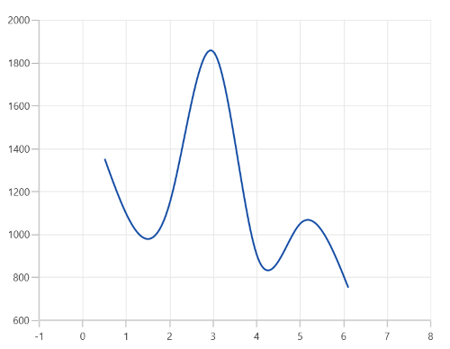

### None

The following screenshot demonstrates [RangePadding](https://help.syncfusion.com/cr/winui/Syncfusion.UI.Xaml.Charts.NumericalAxis.html#Syncfusion_UI_Xaml_Charts_NumericalAxis_RangePadding) as [None](https://help.syncfusion.com/cr/winui/Syncfusion.UI.Xaml.Charts.NumericalPadding.html#Syncfusion_UI_Xaml_Charts_NumericalPadding_None), where no padding is applied for the axis.





<chart:SfCartesianChart Palette="BlueChrome">
. . .
    <chart:SfCartesianChart.PrimaryAxis>
        <chart:NumericalAxis  RangePadding="None"/>
    </chart:SfCartesianChart.PrimaryAxis>

    <chart:SfCartesianChart.SecondaryAxis>
        <chart:NumericalAxis />
    </chart:SfCartesianChart.SecondaryAxis>
. . .
</chart:SfCartesianChart>





SfCartesianChart chart = new SfCartesianChart();
chart.Palette = ChartColorPalette.BlueChrome;

chart.PrimaryAxis = new NumericalAxis()
{
    RangePadding = NumericalPadding.None,
};

chart.SecondaryAxis = new NumericalAxis();
. . .
this.Content = chart;





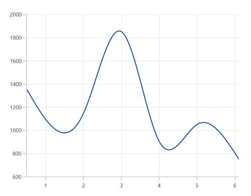

### RoundStart

If [RangePadding](https://help.syncfusion.com/cr/winui/Syncfusion.UI.Xaml.Charts.NumericalAxis.html#Syncfusion_UI_Xaml_Charts_NumericalAxis_RangePadding) for [NumericalAxis](https://help.syncfusion.com/cr/winui/Syncfusion.UI.Xaml.Charts.NumericalAxis.html) is set to [RoundStart](https://help.syncfusion.com/cr/winui/Syncfusion.UI.Xaml.Charts.NumericalPadding.html#Syncfusion_UI_Xaml_Charts_NumericalPadding_RoundStart), rounds the range of the chart axis in the start to the nearest possible value.

The following screenshot demonstrates a chart’s x-axis with [RangePadding](https://help.syncfusion.com/cr/winui/Syncfusion.UI.Xaml.Charts.NumericalAxis.html#Syncfusion_UI_Xaml_Charts_NumericalAxis_RangePadding) set to [RoundStart](https://help.syncfusion.com/cr/winui/Syncfusion.UI.Xaml.Charts.NumericalPadding.html#Syncfusion_UI_Xaml_Charts_NumericalPadding_RoundStart).





<chart:SfCartesianChart Palette="BlueChrome">
. . .
    <chart:SfCartesianChart.PrimaryAxis>
        <chart:NumericalAxis  RangePadding="RoundStart"/>
    </chart:SfCartesianChart.PrimaryAxis>

    <chart:SfCartesianChart.SecondaryAxis>
        <chart:NumericalAxis />
    </chart:SfCartesianChart.SecondaryAxis>
. . .
</chart:SfCartesianChart>





SfCartesianChart chart = new SfCartesianChart();
chart.Palette = ChartColorPalette.BlueChrome;

chart.PrimaryAxis = new NumericalAxis()
{
    RangePadding = NumericalPadding.RoundStart,
};

chart.SecondaryAxis = new NumericalAxis();
. . .
this.Content = chart;





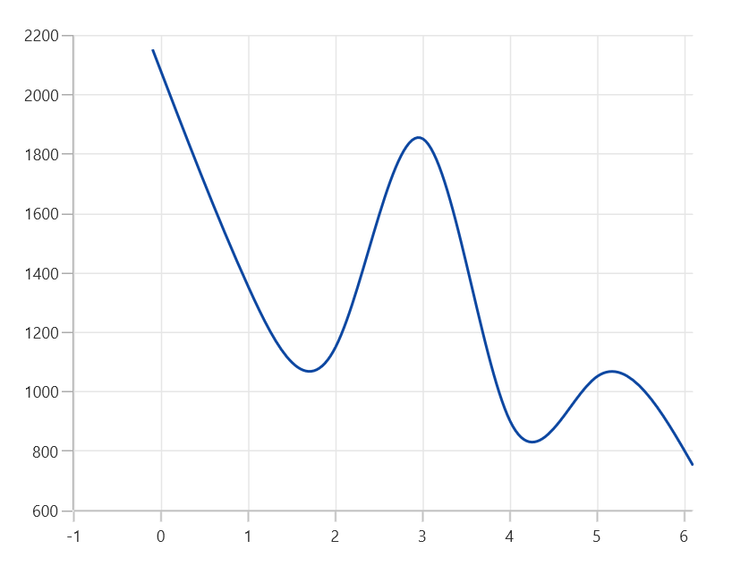

### RoundEnd

If [RangePadding](https://help.syncfusion.com/cr/winui/Syncfusion.UI.Xaml.Charts.NumericalAxis.html#Syncfusion_UI_Xaml_Charts_NumericalAxis_RangePadding) for [NumericalAxis](https://help.syncfusion.com/cr/winui/Syncfusion.UI.Xaml.Charts.NumericalAxis.html) is set to [RoundEnd](https://help.syncfusion.com/cr/winui/Syncfusion.UI.Xaml.Charts.NumericalPadding.html#Syncfusion_UI_Xaml_Charts_NumericalPadding_RoundEnd), rounds the range of the chart axis in the end to the nearest possible value.

The following screenshot demonstrates a chart’s x-axis with [RangePadding](https://help.syncfusion.com/cr/winui/Syncfusion.UI.Xaml.Charts.NumericalAxis.html#Syncfusion_UI_Xaml_Charts_NumericalAxis_RangePadding) set to [RoundEnd](https://help.syncfusion.com/cr/winui/Syncfusion.UI.Xaml.Charts.NumericalPadding.html#Syncfusion_UI_Xaml_Charts_NumericalPadding_RoundEnd).





<chart:SfCartesianChart Palette="BlueChrome">
. . .
    <chart:SfCartesianChart.PrimaryAxis>
        <chart:NumericalAxis  RangePadding="RoundEnd"/>
    </chart:SfCartesianChart.PrimaryAxis>

    <chart:SfCartesianChart.SecondaryAxis>
        <chart:NumericalAxis />
    </chart:SfCartesianChart.SecondaryAxis>
. . .
</chart:SfCartesianChart>





SfCartesianChart chart = new SfCartesianChart();
chart.Palette = ChartColorPalette.BlueChrome;

chart.PrimaryAxis = new NumericalAxis()
{
    RangePadding = NumericalPadding.RoundEnd,
};

chart.SecondaryAxis = new NumericalAxis();
. . .
this.Content = chart;





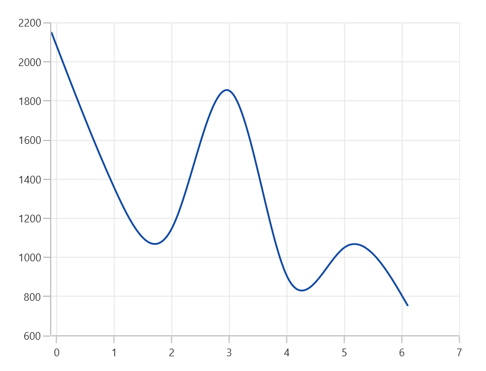

### PrependInterval

If [RangePadding](https://help.syncfusion.com/cr/winui/Syncfusion.UI.Xaml.Charts.NumericalAxis.html#Syncfusion_UI_Xaml_Charts_NumericalAxis_RangePadding) for [NumericalAxis](https://help.syncfusion.com/cr/winui/Syncfusion.UI.Xaml.Charts.NumericalAxis.html) is set to [PrependInterval](https://help.syncfusion.com/cr/winui/Syncfusion.UI.Xaml.Charts.NumericalPadding.html#Syncfusion_UI_Xaml_Charts_NumericalPadding_PrependInterval), the interval of the axis is added in the start as padding.

The following screenshot demonstrates a chart’s x-axis with [RangePadding](https://help.syncfusion.com/cr/winui/Syncfusion.UI.Xaml.Charts.NumericalAxis.html#Syncfusion_UI_Xaml_Charts_NumericalAxis_RangePadding) set to [PrependInterval](https://help.syncfusion.com/cr/winui/Syncfusion.UI.Xaml.Charts.NumericalPadding.html#Syncfusion_UI_Xaml_Charts_NumericalPadding_PrependInterval).





<chart:SfCartesianChart Palette="BlueChrome">
. . .
    <chart:SfCartesianChart.PrimaryAxis>
        <chart:NumericalAxis  RangePadding="PrependInterval"/>
    </chart:SfCartesianChart.PrimaryAxis>

    <chart:SfCartesianChart.SecondaryAxis>
        <chart:NumericalAxis />
    </chart:SfCartesianChart.SecondaryAxis>
. . .
</chart:SfCartesianChart>





SfCartesianChart chart = new SfCartesianChart();
chart.Palette = ChartColorPalette.BlueChrome;

chart.PrimaryAxis = new NumericalAxis()
{
    RangePadding = NumericalPadding.PrependInterval,
};

chart.SecondaryAxis = new NumericalAxis();
. . .
this.Content = chart;





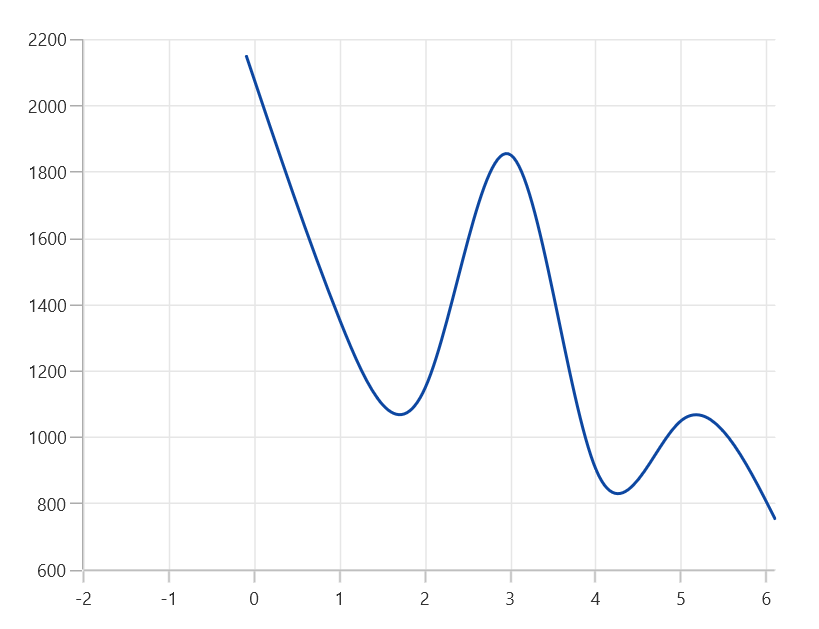

### AppendInterval

If [RangePadding](https://help.syncfusion.com/cr/winui/Syncfusion.UI.Xaml.Charts.NumericalAxis.html#Syncfusion_UI_Xaml_Charts_NumericalAxis_RangePadding) for [NumericalAxis](https://help.syncfusion.com/cr/winui/Syncfusion.UI.Xaml.Charts.NumericalAxis.html) is set to [AppendInterval](https://help.syncfusion.com/cr/winui/Syncfusion.UI.Xaml.Charts.NumericalPadding.html#Syncfusion_UI_Xaml_Charts_NumericalPadding_AppendInterval), the interval of the axis is added in the end as padding.

The following screenshot demonstrates a chart’s x-axis with [RangePadding](https://help.syncfusion.com/cr/winui/Syncfusion.UI.Xaml.Charts.NumericalAxis.html#Syncfusion_UI_Xaml_Charts_NumericalAxis_RangePadding) set to [AppendInterval](https://help.syncfusion.com/cr/winui/Syncfusion.UI.Xaml.Charts.NumericalPadding.html#Syncfusion_UI_Xaml_Charts_NumericalPadding_AppendInterval).





<chart:SfCartesianChart Palette="BlueChrome">
. . .
    <chart:SfCartesianChart.PrimaryAxis>
        <chart:NumericalAxis  RangePadding="AppendInterval"/>
    </chart:SfCartesianChart.PrimaryAxis>

    <chart:SfCartesianChart.SecondaryAxis>
        <chart:NumericalAxis />
    </chart:SfCartesianChart.SecondaryAxis>
. . .
</chart:SfCartesianChart>





SfCartesianChart chart = new SfCartesianChart();
chart.Palette = ChartColorPalette.BlueChrome;

chart.PrimaryAxis = new NumericalAxis()
{
    RangePadding = NumericalPadding.AppendInterval,
};

chart.SecondaryAxis = new NumericalAxis();
. . .
this.Content = chart;





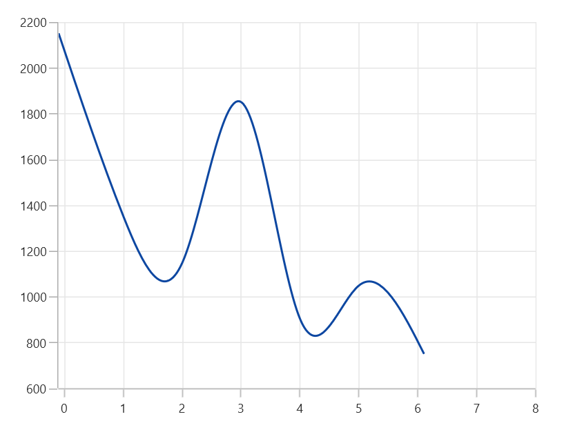
