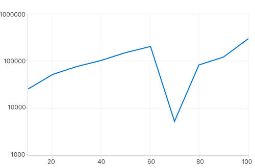
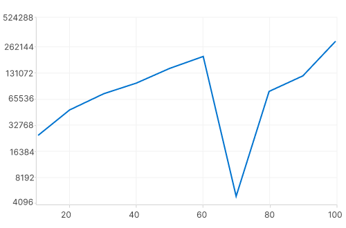

# Types of Axis in WinUI Chart (SfCartesianChart)

Cartesian chart supports the following types of chart axis.

* NumericalAxis
* CategoryAxis
* DateTimeAxis
* LogarithmicAxis

## Numerical Axis

[NumericalAxis](https://help.syncfusion.com/cr/winui/Syncfusion.UI.Xaml.Charts.NumericalAxis.html) is used to plot numerical values to the chart. [NumericalAxis](https://help.syncfusion.com/cr/winui/Syncfusion.UI.Xaml.Charts.NumericalAxis.html) can be added for both [XAxes](https://help.syncfusion.com/cr/winui/Syncfusion.UI.Xaml.Charts.SfCartesianChart.html#Syncfusion_UI_Xaml_Charts_SfCartesianChart_XAxes) and [YAxes](https://help.syncfusion.com/cr/winui/Syncfusion.UI.Xaml.Charts.SfCartesianChart.html#Syncfusion_UI_Xaml_Charts_SfCartesianChart_YAxes).





<chart:SfCartesianChart>
. . .
<chart:SfCartesianChart.XAxes>
    <chart:NumericalAxis/>
</chart:SfCartesianChart.XAxes>
<chart:SfCartesianChart.YAxes>
    <chart:NumericalAxis/>
</chart:SfCartesianChart.YAxes>

</chart:SfCartesianChart>





SfCartesianChart chart = new SfCartesianChart();
. . .
chart.XAxes.Add(new NumericalAxis());

chart.YAxes.Add(new NumericalAxis());





### Interval

Axis interval can be customized by using the [Interval](https://help.syncfusion.com/cr/winui/Syncfusion.UI.Xaml.Charts.NumericalAxis.html#Syncfusion_UI_Xaml_Charts_NumericalAxis_Interval) property. By default, interval will be calculated based on the minimum and maximum value of the provided data.





<chart:SfCartesianChart>
. . .
<chart:SfCartesianChart.XAxes>
    <chart:NumericalAxis Interval="10" />
</chart:SfCartesianChart.XAxes>
<chart:SfCartesianChart.YAxes>
    <chart:NumericalAxis/>
</chart:SfCartesianChart.YAxes>

</chart:SfCartesianChart>





SfCartesianChart chart = new SfCartesianChart();
. . .
NumericalAxis primaryAxis = new NumericalAxis()
{
    Interval = 10, 
};
chart.XAxes.Add(primaryAxis);

chart.YAxes.Add(new NumericalAxis());





### Customizing the Range

[Maximum](https://help.syncfusion.com/cr/winui/Syncfusion.UI.Xaml.Charts.NumericalAxis.html#Syncfusion_UI_Xaml_Charts_NumericalAxis_Maximum) and [Minimum](https://help.syncfusion.com/cr/winui/Syncfusion.UI.Xaml.Charts.NumericalAxis.html#Syncfusion_UI_Xaml_Charts_NumericalAxis_Minimum) properties of axis is used for setting the maximum and minimum value of the axis range respectively.

N> If  minimum or maximum value is set, the other value is calculated by default internally.





<chart:SfCartesianChart.YAxes>
    <chart:NumericalAxis Maximum="2750"
                         Minimum="250" 
			 Interval="250"/>
</chart:SfCartesianChart.YAxes>





NumericalAxis secondaryAxis = new NumericalAxis()
{
    Maximum = 2750,
    Minimum = 250,
    Interval = 250
};
chart.YAxes.Add(secondaryAxis);





## Category Axis

The [CategoryAxis](https://help.syncfusion.com/cr/winui/Syncfusion.UI.Xaml.Charts.CategoryAxis.html) is an indexed based axis that plots values based on the index of the data point collection. The points are equally spaced here.





<chart:SfCartesianChart>
. . .
<chart:SfCartesianChart.XAxes>
    <chart:CategoryAxis/>
</chart:SfCartesianChart.XAxes>

</chart:SfCartesianChart>





SfCartesianChart chart = new SfCartesianChart();
. . .
chart.XAxes.Add(new CategoryAxis());





### Label placement

The [LabelPlacement](https://help.syncfusion.com/cr/winui/Syncfusion.UI.Xaml.Charts.CategoryAxis.html#Syncfusion_UI_Xaml_Charts_CategoryAxis_LabelPlacement) property in [CategoryAxis](https://help.syncfusion.com/cr/winui/Syncfusion.UI.Xaml.Charts.CategoryAxis.html) is used to placed the axis labels based on ticks and between ticks. The default value of [LabelPlacement](https://help.syncfusion.com/cr/winui/Syncfusion.UI.Xaml.Charts.CategoryAxis.html#Syncfusion_UI_Xaml_Charts_CategoryAxis_LabelPlacement) is [OnTicks](https://help.syncfusion.com/cr/winui/Syncfusion.UI.Xaml.Charts.LabelPlacement.html#Syncfusion_UI_Xaml_Charts_LabelPlacement_OnTicks).





<chart:SfCartesianChart>
. . .
<chart:SfCartesianChart.XAxes>
    <chart:CategoryAxis LabelPlacement="BetweenTicks"/>
</chart:SfCartesianChart.XAxes>

</chart:SfCartesianChart>





SfCartesianChart chart = new SfCartesianChart();
. . .
CategoryAxis primaryAxis = new CategoryAxis()
{
    LabelPlacement = LabelPlacement.BetweenTicks
};
chart.XAxes.Add(primaryAxis);





### Interval

By default, the [CategoryAxis](https://help.syncfusion.com/cr/winui/Syncfusion.UI.Xaml.Charts.CategoryAxis.html) axis labels are display with fixed interval 1. It can customized by using the [Interval](https://help.syncfusion.com/cr/winui/Syncfusion.UI.Xaml.Charts.CategoryAxis.html#Syncfusion_UI_Xaml_Charts_CategoryAxis_Interval) property of axis.





<chart:SfCartesianChart>
. . .
<chart:SfCartesianChart.XAxes>
    <chart:CategoryAxis Interval="2" />
</chart:SfCartesianChart.XAxes>
<chart:SfCartesianChart.YAxes>
    <chart:NumericalAxis/>
</chart:SfCartesianChart.YAxes>

</chart:SfCartesianChart>





SfCartesianChart chart = new SfCartesianChart();
. . .
CategoryAxis primaryAxis = new CategoryAxis()
{
    Interval = 2, 
};
chart.XAxes.Add(primaryAxis);

chart.YAxes.Add(new NumericalAxis());





## DateTime Axis

[DateTimeAxis](https://help.syncfusion.com/cr/winui/Syncfusion.UI.Xaml.Charts.DateTimeAxis.html) is used to plot `DateTime` values. The [DateTimeAxis](https://help.syncfusion.com/cr/winui/Syncfusion.UI.Xaml.Charts.DateTimeAxis.html) is widely used to make financial charts in places like the Stock Market, where index plotting is done every day.





<chart:SfCartesianChart>
. . .
<chart:SfCartesianChart.XAxes>
    <chart:DateTimeAxis>
        <chart:DateTimeAxis.LabelStyle>
            <chart:LabelStyle LabelFormat="MMM-yy" />
        </chart:DateTimeAxis.LabelStyle>
    </chart:DateTimeAxis>
</chart:SfCartesianChart.XAxes>

</chart:SfCartesianChart>





SfCartesianChart chart = new SfCartesianChart();
. . .
DateTimeAxis primaryAxis = new DateTimeAxis()
{
    LabelStyle = new LabelStyle() { LabelFormat= "MMM-yy" }
};
chart.XAxes.Add(primaryAxis);





### Interval

In [DateTimeAxis](https://help.syncfusion.com/cr/winui/Syncfusion.UI.Xaml.Charts.DateTimeAxis.html), intervals can be customized by using the [Interval](https://help.syncfusion.com/cr/winui/Syncfusion.UI.Xaml.Charts.DateTimeAxis.html#Syncfusion_UI_Xaml_Charts_DateTimeAxis_Interval) and [IntervalType](https://help.syncfusion.com/cr/winui/Syncfusion.UI.Xaml.Charts.DateTimeAxis.html#Syncfusion_UI_Xaml_Charts_DateTimeAxis_IntervalType) properties. For example, setting [Interval](https://help.syncfusion.com/cr/winui/Syncfusion.UI.Xaml.Charts.DateTimeAxis.html#Syncfusion_UI_Xaml_Charts_DateTimeAxis_Interval) as 6 and [IntervalType](https://help.syncfusion.com/cr/winui/Syncfusion.UI.Xaml.Charts.DateTimeAxis.html#Syncfusion_UI_Xaml_Charts_DateTimeAxis_IntervalType) as [Months](https://help.syncfusion.com/cr/winui/Syncfusion.UI.Xaml.Charts.DateTimeIntervalType.html#Syncfusion_UI_Xaml_Charts_DateTimeIntervalType_Months) will consider 6 months as interval.





<chart:SfCartesianChart>
. . .
<chart:SfCartesianChart.XAxes>
    <chart:DateTimeAxis Interval="6" 
                        IntervalType="Months" >
        <chart:DateTimeAxis.LabelStyle>
            <chart:LabelStyle LabelFormat="MMM-yy" />
        </chart:DateTimeAxis.LabelStyle>
    </chart:DateTimeAxis>
</chart:SfCartesianChart.XAxes>
<chart:SfCartesianChart.YAxes>
    <chart:NumericalAxis/>
</chart:SfCartesianChart.YAxes>

</chart:SfCartesianChart>





SfCartesianChart chart = new SfCartesianChart();
. . .
DateTimeAxis primaryAxis = new DateTimeAxis()
{
    Interval = 6, 
    IntervalType = DateTimeIntervalType.Months,
    LabelStyle = new LabelStyle() { LabelFormat= "MMM-yy" }
};
chart.XAxes.Add(primaryAxis);

chart.YAxes.Add(new NumericalAxis());





### Customizing the Range

[Minimum](https://help.syncfusion.com/cr/winui/Syncfusion.UI.Xaml.Charts.DateTimeAxis.html#Syncfusion_UI_Xaml_Charts_DateTimeAxis_Minimum) and [Maximum](https://help.syncfusion.com/cr/winui/Syncfusion.UI.Xaml.Charts.DateTimeAxis.html#Syncfusion_UI_Xaml_Charts_DateTimeAxis_Maximum) properties behavior is same as in [NumericalAxis](https://help.syncfusion.com/cr/winui/Syncfusion.UI.Xaml.Charts.NumericalAxis.html) instead of setting numerical value, have to set date time values.





<chart:SfCartesianChart>
. . .
<chart:SfCartesianChart.XAxes>
    <chart:DateTimeAxis Minimum="2021/05/1" 
                        Maximum="2021/11/01" >
        <chart:DateTimeAxis.LabelStyle>
            <chart:LabelStyle LabelFormat="MMM-yy" />
        </chart:DateTimeAxis.LabelStyle>
    </chart:DateTimeAxis>
</chart:SfCartesianChart.XAxes>

</chart:SfCartesianChart>





SfCartesianChart chart = new SfCartesianChart();
. . .
DateTimeAxis primaryAxis = new DateTimeAxis()
{
    Minimum = new DateTime(2021,05,10),
    Maximum = new DateTime(2021,11,01),
    LabelStyle = new LabelStyle() { LabelFormat= "MMM-yy" }
};
chart.XAxes.Add(primaryAxis);





## Logarithmic Axis

The [LogarithmicAxis](https://help.syncfusion.com/cr/winui/Syncfusion.UI.Xaml.Charts.LogarithmicAxis.html) uses a logarithmic scale, ideal for visualizing data with large value differences. It can be applied to both the X and Y axes of a chart, allows customization of the logarithmic base, and dynamically calculates ranges to effectively display wide-ranging datasets.





<chart:SfCartesianChart>
. . .
<chart:SfCartesianChart.YAxes>
    <chart:LogarithmicAxis />
</chart:SfCartesianChart.YAxes>

</chart:SfCartesianChart>





SfCartesianChart chart = new SfCartesianChart();
. . .
LogarithmicAxis secondaryAxis = new LogarithmicAxis()
chart.YAxes.Add(secondaryAxis);





### Interval

The Axis interval can be customized using the [Interval](https://help.syncfusion.com/cr/winui/Syncfusion.UI.Xaml.Charts.LogarithmicAxis.html#Syncfusion_UI_Xaml_Charts_LogarithmicAxis_Interval) property of the axis. By default, the interval is calculated based on the minimum and maximum values of the provided data, with a default value of `1`.





<chart:SfCartesianChart>
. . .
<chart:SfCartesianChart.YAxes>
    <chart:LogarithmicAxis Interval="10" />
</chart:SfCartesianChart.YAxes>

</chart:SfCartesianChart>





SfCartesianChart chart = new SfCartesianChart();
. . .
LogarithmicAxis secondaryAxis = new LogarithmicAxis()
{
    Interval = 10,
};

chart.YAxes.Add(secondaryAxis);




### Customizing the Range

The range of the logarithmic axis can be customized using the [Minimum](https://help.syncfusion.com/cr/winui/Syncfusion.UI.Xaml.Charts.LogarithmicAxis.html#Syncfusion_UI_Xaml_Charts_LogarithmicAxis_Minimum) and [Maximum](https://help.syncfusion.com/cr/winui/Syncfusion.UI.Xaml.Charts.LogarithmicAxis.html#Syncfusion_UI_Xaml_Charts_LogarithmicAxis_Maximum) properties of the LogarithmicAxis. By default, the range is automatically calculated to align with the provided data.





<chart:SfCartesianChart>
. . .
<chart:SfCartesianChart.YAxes>
    <chart:LogarithmicAxis Minimum="100" Maximum="100000" />
</chart:SfCartesianChart.YAxes>

</chart:SfCartesianChart>





SfCartesianChart chart = new SfCartesianChart();
. . .
LogarithmicAxis secondaryAxis = new LogarithmicAxis()
{
    Minimum = 100,
    Maximum = 100000,
};

chart.YAxes.Add(secondaryAxis);




### Customizing the Logarithmic base

The logarithmic axis base can be customized using the [LogarithmicBase](https://help.syncfusion.com/cr/winui/Syncfusion.UI.Xaml.Charts.LogarithmicAxis.html#Syncfusion_UI_Xaml_Charts_LogarithmicAxis_LogarithmicBase) property. The default logarithmic base value is `10`.





<chart:SfCartesianChart>
. . .
<chart:SfCartesianChart.YAxes>
    <chart:LogarithmicAxis LogarithmicBase="2" />
</chart:SfCartesianChart.YAxes>

</chart:SfCartesianChart>





SfCartesianChart chart = new SfCartesianChart();
. . .
LogarithmicAxis secondaryAxis = new LogarithmicAxis()
{
    LogarithmicBase = 2,
};

chart.YAxes.Add(secondaryAxis);




## Inversed

Axis can be inverted by using the [IsInversed](https://help.syncfusion.com/cr/winui/Syncfusion.UI.Xaml.Charts.ChartAxis.html#Syncfusion_UI_Xaml_Charts_ChartAxis_IsInversed) property. The default value of this property is `False`.





<chart:SfCartesianChart>
. . .
<chart:SfCartesianChart.YAxes>
    <chart:NumericalAxis IsInversed="True"/>
</chart:SfCartesianChart.YAxes>

</chart:SfCartesianChart>





SfCartesianChart chart = new SfCartesianChart();
. . .
NumericalAxis secondaryAxis = new NumericalAxis();
secondaryAxis.IsInversed = true;
chart.YAxes.Add(secondaryAxis);





## Opposed Axis

Cartesian charts allow positioning the axis to opposite position by setting the [OpposedPosition](https://help.syncfusion.com/cr/winui/Syncfusion.UI.Xaml.Charts.ChartAxis.html#Syncfusion_UI_Xaml_Charts_ChartAxis_OpposedPosition) property. The default value of this property is `False.`





<chart:SfCartesianChart>
. . .
<chart:SfCartesianChart.YAxes>
    <chart:NumericalAxis OpposedPosition="True"/>
</chart:SfCartesianChart.YAxes>

</chart:SfCartesianChart>





SfCartesianChart chart = new SfCartesianChart();
. . .
NumericalAxis secondaryAxis = new NumericalAxis();
secondaryAxis.OpposedPosition = true;
chart.YAxes.Add(secondaryAxis);





## Multiple Axes

Cartesian charts provides support to arrange the multiple series inside the same chart area with specified x-axis and y-axis. There are two properties [XAxisName](https://help.syncfusion.com/cr/winui/Syncfusion.UI.Xaml.Charts.CartesianSeries.html#Syncfusion_UI_Xaml_Charts_CartesianSeries_XAxisName) and [YAxisName](https://help.syncfusion.com/cr/winui/Syncfusion.UI.Xaml.Charts.CartesianSeries.html#Syncfusion_UI_Xaml_Charts_CartesianSeries_YAxisName) in all the Cartesian series type, which is used to provide multiple axes support. These axes can be arranged in a stacking order or in a side by side pattern.

By default, all the series are plotted based on the 0th index axis of XAxes and YAxes.





<chart:SfCartesianChart>
    . . .
	<chart:SfCartesianChart.XAxes>
		<chart:DateTimeAxis ShowMajorGridLines="False" />
	</chart:SfCartesianChart.XAxes>

	<chart:SfCartesianChart.YAxes>
		<chart:NumericalAxis ShowMajorGridLines="False" />
		<chart:NumericalAxis Name="Series_YAxis" ShowMajorGridLines="False" />
	</chart:SfCartesianChart.YAxes>

    <chart:SfCartesianChart.Series>
        <chart:SfCartesianChart.Series>
            <chart:ColumnSeries ItemsSource="{Binding Data1}" 
                                XBindingPath="Date"
                                YBindingPath="Value"
				YAxisName="Series_YAxis">
            </chart:ColumnSeries>
            <chart:SplineSeries ItemsSource="{Binding Data}" 
                                XBindingPath="Date"
                                YBindingPath="Value"/>
    </chart:SfCartesianChart.Series>

</chart:SfCartesianChart>





SfCartesianChart chart = new SfCartesianChart();
. . .
DateTimeAxis primaryAxis = new DateTimeAxis()
{
    ShowMajorGridLines = false
};
chart.XAxes.Add(primaryAxis);

NumericalAxis secondaryAxis = new NumericalAxis()
{
    ShowMajorGridLines = false
};
secondaryAxis.Name = "Series_YAxis";
chart.YAxes.Add(secondaryAxis);

NumericalAxis secondaryAxis1 = new NumericalAxis();
chart.YAxes.Add(secondaryAxis1);

ColumnSeries series1 = new ColumnSeries()
{
    YAxisName = "Series_YAxis"
    ItemsSource = new ViewModel().Demands,
    XBindingPath = "Demand",
    YBindingPath = "Year2011"
};

SplineSeries series2 = new SplineSeries()
{
    ItemsSource = new ViewModel().Demands,
    XBindingPath = "Date",
    YBindingPath = "Year2011",
};

chart.Series.Add(series1);
chart.Series.Add(series2);





In the above image, the [ColumnSeries](https://help.syncfusion.com/cr/winui/Syncfusion.UI.Xaml.Charts.ColumnSeries.html) is plotted based on additional axes of YAxes collection, and [SplineSeries](https://help.syncfusion.com/cr/winui/Syncfusion.UI.Xaml.Charts.SplineSeries.html) is plotted based on axis of the collection’s 0th index.

## Events
### ActualRangeChanged

The [ActualRangeChanged](https://help.syncfusion.com/cr/winui/Syncfusion.UI.Xaml.Charts.ChartAxis.html#Syncfusion_UI_Xaml_Charts_ChartAxis_ActualRangeChanged) event is triggered when the actual range of the axis is changed. The argument contains the following information:

* [ActualMinimum](https://help.syncfusion.com/cr/winui/Syncfusion.UI.Xaml.Charts.ActualRangeChangedEventArgs.html#Syncfusion_UI_Xaml_Charts_ActualRangeChangedEventArgs_ActualMinimum) - used to get the actual minimum value of the axis.
* [ActualMaximum](https://help.syncfusion.com/cr/winui/Syncfusion.UI.Xaml.Charts.ActualRangeChangedEventArgs.html#Syncfusion_UI_Xaml_Charts_ActualRangeChangedEventArgs_ActualMaximum) - used to get the actual maximum value of the axis.

N> The actual range is changed by specifying the [ZoomPosition](https://help.syncfusion.com/cr/winui/Syncfusion.UI.Xaml.Charts.ChartAxis.html#Syncfusion_UI_Xaml_Charts_ChartAxis_ZoomPosition) and [ZoomFactor](https://help.syncfusion.com/cr/winui/Syncfusion.UI.Xaml.Charts.ChartAxis.html#Syncfusion_UI_Xaml_Charts_ChartAxis_ZoomFactor) properties or zooming the chart interactively.

### LabelCreated

The [LabelCreated](https://help.syncfusion.com/cr/winui/Syncfusion.UI.Xaml.Charts.ChartAxis.html#Syncfusion_UI_Xaml_Charts_ChartAxis_LabelCreated) event is triggered when the axis label is created. The argument contains the following information:

* [Label](https://help.syncfusion.com/cr/winui/Syncfusion.UI.Xaml.Charts.ChartAxisLabelEventArgs.html#Syncfusion_UI_Xaml_Charts_ChartAxisLabelEventArgs_Label) - Used to get or set the text of axis label.
* [Position](https://help.syncfusion.com/cr/winui/Syncfusion.UI.Xaml.Charts.ChartAxisLabelEventArgs.html#Syncfusion_UI_Xaml_Charts_ChartAxisLabelEventArgs_Position) - Used to get the position of label.
* [LabelStyle](https://help.syncfusion.com/cr/winui/Syncfusion.UI.Xaml.Charts.ChartAxisLabelEventArgs.html#Syncfusion_UI_Xaml_Charts_ChartAxisLabelEventArgs_LabelStyle) - Used to customize the appearance of axis labels.