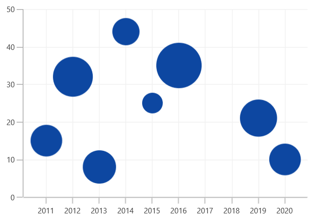

# Bubble Chart in WinUI Cartesian Chart (SfCartesianChart)

## Bubble Chart

The [`BubbleSeries`]() is represented by closely packed circles, whose areas are proportional to the quantities. The size of the bubble series is relative proportional to the value bind with the series using the [`Size`]()  property. You can set the constraints on this size using the [`MinimumRadius`]() and [`MaximumRadius`]() properties.

To render a bubble series, create an instance of [BubbleSeries]() and add to the [Series]() collection property of [SfCartesianChart]() as shown in the following code.





<chart:SfCartesianChart>
    ...
    <chart:BubbleSeries ItemsSource="{Binding Data}" XBindingPath="XValue" 
                        YBindingPath="YValue" Size="Size"
                        MinimumRadius="5" MaximumRadius="10"/>
    ...
<chart:SfCartesianChart>





SfCartesianChart chart = new SfCartesianChart();
...

BubbleSeries series = new BubbleSeries()
{
    ItemsSource = new ViewModel().Data,
    XBindingPath = "XValue",
    YBindingPath = "YValue",
    Size = "Size",
    MinimumRadius = 5,
    MaximumRadius = 10
};

chart.Series.Add(series);
...





## Show zero size bubbles

The zero size bubble segments can be enabled or disabled by using the [`ShowZeroBubbles`]() property. The defaule of this property is `True`.





<chart:SfCartesianChart>
    ...
    <chart:BubbleSeries ItemsSource="{Binding Data}" XBindingPath="XValue" 
                        YBindingPath="YValue" Size="Size"
                        ShowZeroBubbles="True"/>
    ...
<chart:SfCartesianChart>





SfCartesianChart chart = new SfCartesianChart();
...

BubbleSeries series = new BubbleSeries()
{
    ItemsSource = new ViewModel().Data,
    XBindingPath = "XValue",
    YBindingPath = "YValue",
    Size = "Size",
    ShowZeroBubbles = true,
};

chart.Series.Add(series);
...





The following code example and screenshots describes when [`ShowZeroBubbles`]() value is `false`.





<chart:SfCartesianChart>
    ...
    <chart:BubbleSeries ItemsSource="{Binding Data}" XBindingPath="XValue" 
                        YBindingPath="YValue" Size="Size"
                        ShowZeroBubbles="False"/>
    ...
<chart:SfCartesianChart>





SfCartesianChart chart = new SfCartesianChart();
...

BubbleSeries series = new BubbleSeries()
{
    ItemsSource = new ViewModel().Data,
    XBindingPath = "XValue",
    YBindingPath = "YValue",
    Size = "Size",
    ShowZeroBubbles = false,
};

chart.Series.Add(series);
...





