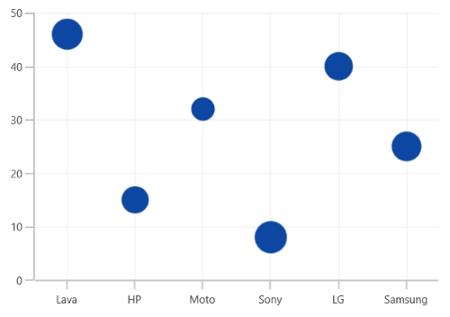

# Bubble Chart in WinUI Chart (SfCartesianChart)

## Bubble Chart

The [BubbleSeries](https://help.syncfusion.com/cr/winui/Syncfusion.UI.Xaml.Charts.BubbleSeries.html) is represented by closely packed circles, whose areas are proportional to the quantities. The size of the bubble series is relative proportional to the value bind with the series using the [Size](https://help.syncfusion.com/cr/winui/Syncfusion.UI.Xaml.Charts.BubbleSeries.html#Syncfusion_UI_Xaml_Charts_BubbleSeries_Size)  property. You can set the constraints on this size using the [MinimumRadius](https://help.syncfusion.com/cr/winui/Syncfusion.UI.Xaml.Charts.BubbleSeries.html#Syncfusion_UI_Xaml_Charts_BubbleSeries_MinimumRadius) and [MaximumRadius](https://help.syncfusion.com/cr/winui/Syncfusion.UI.Xaml.Charts.BubbleSeries.html#Syncfusion_UI_Xaml_Charts_BubbleSeries_MaximumRadius) properties.

To render a bubble series, create an instance of [BubbleSeries](https://help.syncfusion.com/cr/winui/Syncfusion.UI.Xaml.Charts.BubbleSeries.html) and add to the [Series](https://help.syncfusion.com/cr/winui/Syncfusion.UI.Xaml.Charts.SfCartesianChart.html#Syncfusion_UI_Xaml_Charts_SfCartesianChart_Series) collection property of [SfCartesianChart](https://help.syncfusion.com/cr/winui/Syncfusion.UI.Xaml.Charts.SfCartesianChart.html) as shown in the following code.





<chart:SfCartesianChart>
    
    <chart:SfCartesianChart.PrimaryAxis>
        <chart:CategoryAxis />
    </chart:SfCartesianChart.PrimaryAxis>

    <chart:SfCartesianChart.SecondaryAxis>
        <chart:NumericalAxis />
    </chart:SfCartesianChart.SecondaryAxis> 

    <chart:BubbleSeries ItemsSource="{Binding Data}" XBindingPath="XValue" YBindingPath="YValue" Size="Size" MinimumRadius="5" MaximumRadius="10"/>
    ...
<chart:SfCartesianChart>





SfCartesianChart chart = new SfCartesianChart();
CategoryAxis primaryAxis = new CategoryAxis();
chart.PrimaryAxis = primaryAxis;
NumericalAxis secondaryAxis = new NumericalAxis();
chart.SecondaryAxis = secondaryAxis;
. . .
BubbleSeries series = new BubbleSeries()
{
    ItemsSource = new ViewModel().Data,
    XBindingPath = "XValue",
    YBindingPath = "YValue",
    Size = "Size",
    MinimumRadius = 5,
    MaximumRadius = 10
};

chart.Series.Add(series);
...





## Show zero size bubbles

The zero size bubble segments can be enabled or disabled by using the [ShowZeroBubbles](https://help.syncfusion.com/cr/winui/Syncfusion.UI.Xaml.Charts.BubbleSeries.html#Syncfusion_UI_Xaml_Charts_BubbleSeries_ShowZeroBubbles) property. The default value of this property is `True`.





<chart:SfCartesianChart>

    <chart:SfCartesianChart.PrimaryAxis>
        <chart:CategoryAxis />
    </chart:SfCartesianChart.PrimaryAxis>

    <chart:SfCartesianChart.SecondaryAxis>
        <chart:NumericalAxis />
    </chart:SfCartesianChart.SecondaryAxis> 

    <chart:BubbleSeries ItemsSource="{Binding Data}" XBindingPath="XValue" YBindingPath="YValue" Size="Size" ShowZeroBubbles="True"/>
    ...
<chart:SfCartesianChart>





SfCartesianChart chart = new SfCartesianChart();
CategoryAxis primaryAxis = new CategoryAxis();
chart.PrimaryAxis = primaryAxis;
NumericalAxis secondaryAxis = new NumericalAxis();
chart.SecondaryAxis = secondaryAxis;
. . .
BubbleSeries series = new BubbleSeries()
{
    ItemsSource = new ViewModel().Data,
    XBindingPath = "XValue",
    YBindingPath = "YValue",
    Size = "Size",
    ShowZeroBubbles = true,
};

chart.Series.Add(series);
...









<chart:SfCartesianChart>
    
    <chart:SfCartesianChart.PrimaryAxis>
        <chart:CategoryAxis />
    </chart:SfCartesianChart.PrimaryAxis>

    <chart:SfCartesianChart.SecondaryAxis>
        <chart:NumericalAxis />
    </chart:SfCartesianChart.SecondaryAxis> 
    
    <chart:BubbleSeries ItemsSource="{Binding Data}" XBindingPath="XValue" 
                        YBindingPath="YValue" Size="Size"
                        ShowZeroBubbles="False"/>
    ...
<chart:SfCartesianChart>





SfCartesianChart chart = new SfCartesianChart();
CategoryAxis primaryAxis = new CategoryAxis();
chart.PrimaryAxis = primaryAxis;
NumericalAxis secondaryAxis = new NumericalAxis();
chart.SecondaryAxis = secondaryAxis;
. . .
BubbleSeries series = new BubbleSeries()
{
    ItemsSource = new ViewModel().Data,
    XBindingPath = "XValue",
    YBindingPath = "YValue",
    Size = "Size",
    ShowZeroBubbles = false,
};

chart.Series.Add(series);
...





