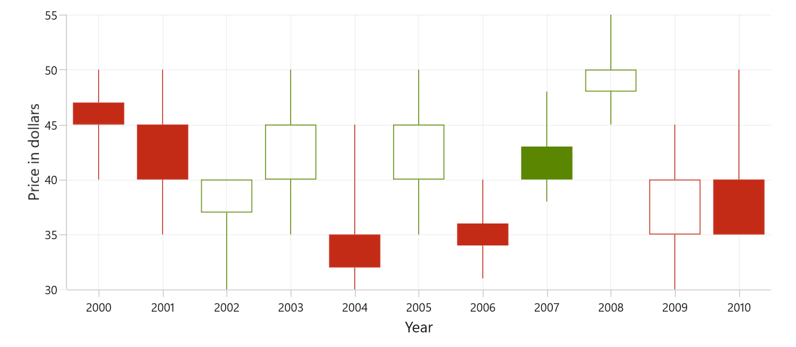
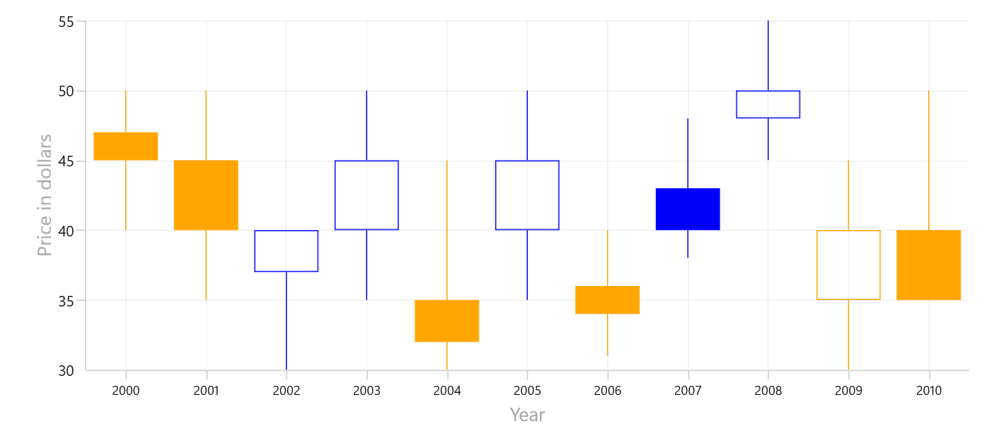
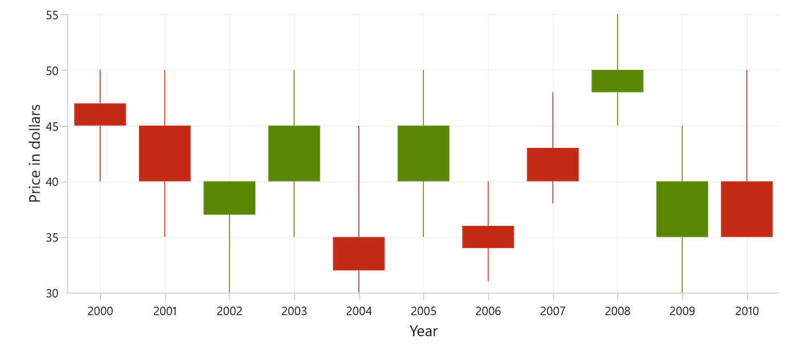
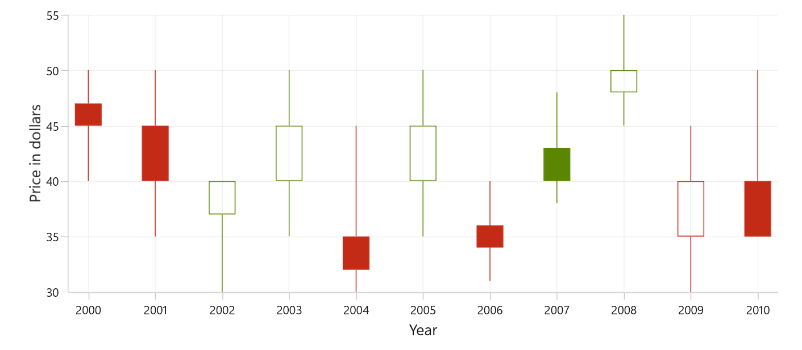

# Candle Chart in WinUI Chart

Candle charts are a type of financial chart used to represent the price movement of an asset over time. The chart is made up of a series of rectangular bars, called candlesticks, that represent a specific time, typically one day. To render a candle chart, create an instance of `CandleSeries`, and add it to the `Series` collection property of `SfCartesianChart`.

To plot a point on a candlestick chart, a collection of five values is required, including the X-value, open value, high value, low value, and close value. You can use the below collection





    <chart:SfCartesianChart>

        <chart:SfCartesianChart.XAxes>
            <chart:CategoryAxis/>
        </chart:SfCartesianChart.XAxes>

        <chart:SfCartesianChart.YAxes>
            <chart:NumericalAxis/>
        </chart:SfCartesianChart.YAxes> 

        <chart:CandleSeries ItemsSource="{Binding StockData}"
                            XBindingPath="Year"
                            Open="Open"
                            High="High"
                            Low="Low"
                            Close="Close"/>
    </chart:SfCartesianChart>





SfCartesianChart chart = new SfCartesianChart();

CategoryAxis primaryAxis = new CategoryAxis();
chart.XAxes.Add(primaryAxis);

NumericalAxis secondaryAxis = new NumericalAxis();
chart.YAxes.Add(secondaryAxis);

var series = new CandleSeries()
{
    ItemsSource = new ViewModel().StockData,
    XBindingPath = "Year",
    Open = "Open",
    High = "High",
    Low = "Low",
    Close = "Close",
};

chart.Series.Add(series);
this.Content = chart;





ObservableCollection<Model> StockData = new ObservableCollection<Model>();
StockData.Add(new Model { Year = "2000", High = 50, Low = 40, Open = 47, Close = 45 });
StockData.Add(new Model { Year = "2001", High = 50, Low = 35, Open = 45, Close = 40 });
StockData.Add(new Model { Year = "2002", High = 40, Low = 30, Open = 37, Close = 40 });
StockData.Add(new Model { Year = "2003", High = 50, Low = 35, Open = 40, Close = 45 });
StockData.Add(new Model { Year = "2004", High = 45, Low = 30, Open = 35, Close = 32 });
StockData.Add(new Model { Year = "2005", High = 50, Low = 35, Open = 40, Close = 45 });
StockData.Add(new Model { Year = "2006", High = 40, Low = 31, Open = 36, Close = 34 });
StockData.Add(new Model { Year = "2007", High = 48, Low = 38, Open = 43, Close = 40 });
StockData.Add(new Model { Year = "2008", High = 55, Low = 45, Open = 48, Close = 50 });
StockData.Add(new Model { Year = "2009", High = 45, Low = 30, Open = 35, Close = 40 });
StockData.Add(new Model { Year = "2010", High = 50, Low = 40, Open = 40, Close = 35 });





## Bull and Bear Color

Set `BullishBrush` for candles where the close is equal to or higher than the open (bullish/increasing periods), and `BearishBrush` for segments where the close is lower than the open (bearish/decreasing periods). If not specified, the series falls back to its default brush.





    <chart:SfCartesianChart>

        <chart:SfCartesianChart.XAxes>
            <chart:CategoryAxis/>
        </chart:SfCartesianChart.XAxes>

        <chart:SfCartesianChart.YAxes>
            <chart:NumericalAxis/>
        </chart:SfCartesianChart.YAxes>   

        <chart:CandleSeries ItemsSource="{Binding StockData}"
                            XBindingPath="Year"
                            Open="Open"
                            High="High"
                            Low="Low"
                            Close="Close"
                            BullishBrush="Blue"
                            BearishBrush="Yellow"/>

    </chart:SfCartesianChart>





SfCartesianChart chart = new SfCartesianChart();

CategoryAxis primaryAxis = new CategoryAxis();
chart.XAxes.Add(primaryAxis);

NumericalAxis secondaryAxis = new NumericalAxis();
chart.YAxes.Add(secondaryAxis);

CandleSeries series = new CandleSeries()
{
    ItemsSource = new ViewModel().StockData,
    XBindingPath = "Year",
    Open = "Open",
    High = "High",
    Low = "Low",
    Close = "Close",
    BullishBrush = Colors.Blue,
    BearishBrush = Colors.Yellow,
};

chart.Series.Add(series);
this.Content = chart;




## EnableSolidCandle

Use `EnableSolidCandle` to switch between filled and hollow candles. Default is `false`.
- When `EnableSolidCandle = false` (hollow mode), the fill state and color are determined by comparing the previous day close to the current day close:
  - previous day close > current day close → bearish (uses `BearishBrush`)
  - previous day close <= current day close → bullish (uses `BullishBrush`)
- When `EnableSolidCandle = true` (solid mode), candles are filled and colored by comparing the current day open and close:
  - current day close >= current day open → bullish (uses `BullishBrush`)
  - current day close < current day open → bearish (uses `BearishBrush`)





    <chart:SfCartesianChart>

        <chart:SfCartesianChart.XAxes>
            <chart:CategoryAxis/>
        </chart:SfCartesianChart.XAxes>

        <chart:SfCartesianChart.YAxes>
            <chart:NumericalAxis/>
        </chart:SfCartesianChart.YAxes>   

        <chart:CandleSeries ItemsSource="{Binding StockData}"
                            XBindingPath="Year"
                            Open="Open"
                            High="High"
                            Low="Low"
                            Close="Close"
                            EnableSolidCandle="True"/>

    </chart:SfCartesianChart>





SfCartesianChart chart = new SfCartesianChart();

CategoryAxis primaryAxis = new CategoryAxis();
chart.XAxes.Add(primaryAxis);

NumericalAxis secondaryAxis = new NumericalAxis();
chart.YAxes.Add(secondaryAxis);

CandleSeries series = new CandleSeries()
{
    ItemsSource = new ViewModel().StockData,
    XBindingPath = "Year",
    Open = "Open",
    High = "High",
    Low = "Low",
    Close = "Close",
    EnableSolidCandle = true,
};

chart.Series.Add(series);
this.Content = chart;





## Segment Width

The `SegmentWidth` property sets the width of each data point (candle) in the series. It accepts values between 0 and 1, the default value is 0.8. A value of 1.0 makes the candle occupy the full category width, while smaller values make the candle narrower.





    <chart:SfCartesianChart>

        <chart:SfCartesianChart.XAxes>
            <chart:CategoryAxis/>
        </chart:SfCartesianChart.XAxes>

        <chart:SfCartesianChart.YAxes>
            <chart:NumericalAxis/>
        </chart:SfCartesianChart.YAxes>   

        <chart:CandleSeries ItemsSource="{Binding StockData}"
                            XBindingPath="Year"
                            Open="Open"
                            High="High"
                            Low="Low"
                            Close="Close"
                            SegmentWidth="0.4"/>

    </chart:SfCartesianChart>





SfCartesianChart chart = new SfCartesianChart();

CategoryAxis primaryAxis = new CategoryAxis();
chart.XAxes.Add(primaryAxis);

NumericalAxis secondaryAxis = new NumericalAxis();
chart.YAxes.Add(secondaryAxis);

CandleSeries series = new CandleSeries()
{
    ItemsSource = new ViewModel().StockData,
    XBindingPath = "Year",
    Open = "Open",
    High = "High",
    Low = "Low",
    Close = "Close",
    SegmentWidth = 0.4,
};

chart.Series.Add(series);
this.Content = chart;





