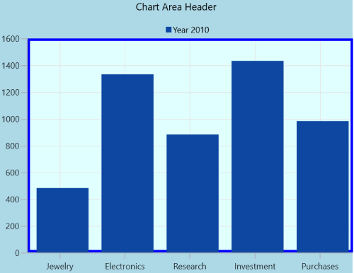

# Chart Area in WinUI Chart (SfCartesianChart)

SfCartesianChart provides the properties like [PlotAreaBorderBrush](https://help.syncfusion.com/cr/winui/Syncfusion.UI.Xaml.Charts.SfCartesianChart.html#Syncfusion_UI_Xaml_Charts_SfCartesianChart_PlotAreaBorderBrush), [PlotAreaBorderThickness](https://help.syncfusion.com/cr/winui/Syncfusion.UI.Xaml.Charts.SfCartesianChart.html#Syncfusion_UI_Xaml_Charts_SfCartesianChart_PlotAreaBorderThickness) and [PlotAreaBackground](https://help.syncfusion.com/cr/winui/Syncfusion.UI.Xaml.Charts.SfCartesianChart.html#Syncfusion_UI_Xaml_Charts_SfCartesianChart_PlotAreaBackground) for customizing the plot area.





<chart:SfCartesianChart Header="Chart Area Header"        PlotAreaBackground="LightCyan"  Background="LightBlue"   PlotAreaBorderBrush="Blue"  PlotAreaBorderThickness="3"  Palette="BlueChrome">
. . .
    <chart:SfCartesianChart.PrimaryAxis>
        <chart:CategoryAxis  />
    </chart:SfCartesianChart.PrimaryAxis>

    <chart:SfCartesianChart.SecondaryAxis>
        <chart:NumericalAxis />
    </chart:SfCartesianChart.SecondaryAxis>

    <chart:SfCartesianChart.Legend>
        <chart:ChartLegend/>
    </chart:SfCartesianChart.Legend>

    <chart:SfCartesianChart.Series>
        <chart:ColumnSeries ItemsSource="{Binding Data}" 
                            XBindingPath="Demand" 
                            YBindingPath="Year2010" 
                            Label="Year 2010">
        </chart:ColumnSeries>
    </chart:SfCartesianChart.Series>

</chart:SfCartesianChart>





SfCartesianChart chart = new SfCartesianChart();
chart.Header = "Chart Area Header";
chart.PlotAreaBackground = new SolidColorBrush(Colors.LightCyan);
chart.PlotAreaBorderBrush = new SolidColorBrush(Colors.Blue);
chart.Background = new SolidColorBrush(Colors.LightBlue);
chart.PlotAreaBorderThickness = new Thickness(3);
chart.Palette = ChartColorPalette.BlueChrome;

chart.PrimaryAxis = new CategoryAxis();
 = primaryAxis;
chart.SecondaryAxis = new NumericalAxis();

ChartLegend legend = new ChartLegend();
chart.Legend = legend;

ColumnSeries series = new ColumnSeries()
{
    ItemsSource = new ViewModel().Data,
    XBindingPath = "Demand",
    YBindingPath = "Year2010",
    Label = "Year 2010"
};

chart.Series.Add(series);
this.Content = chart;





