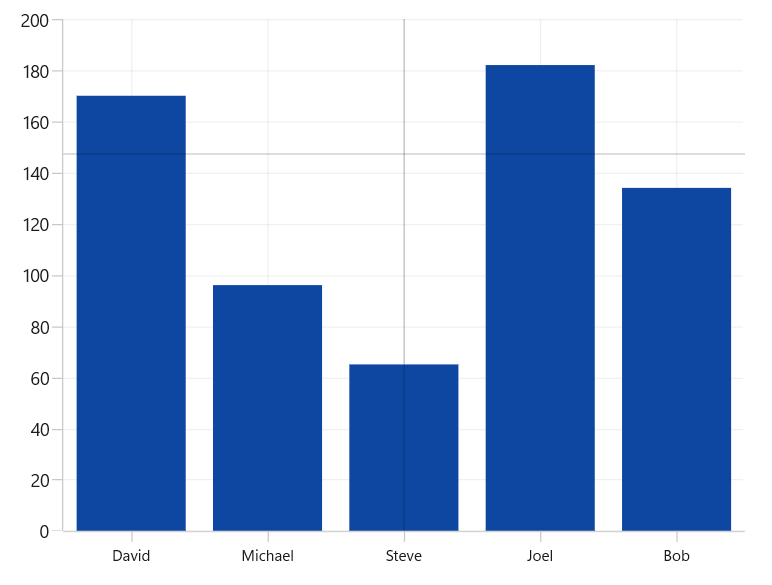
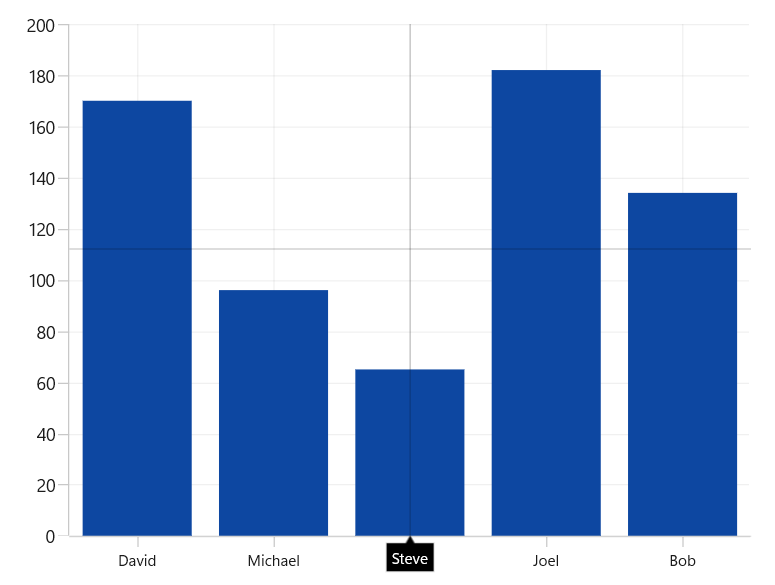
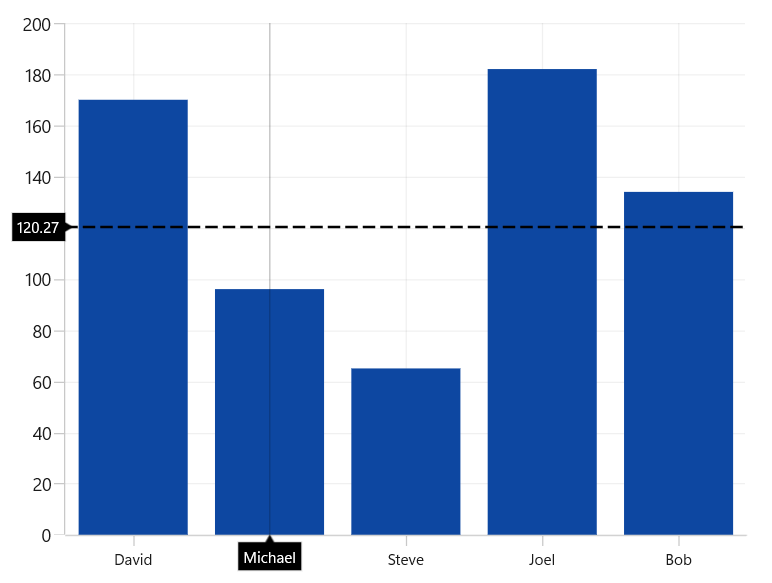
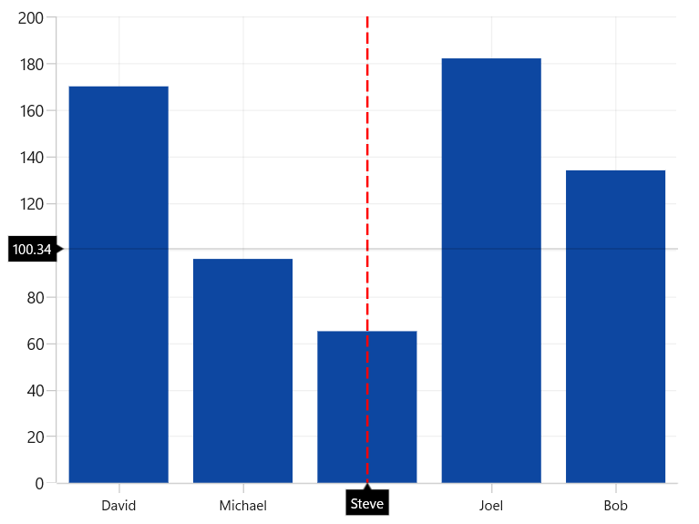
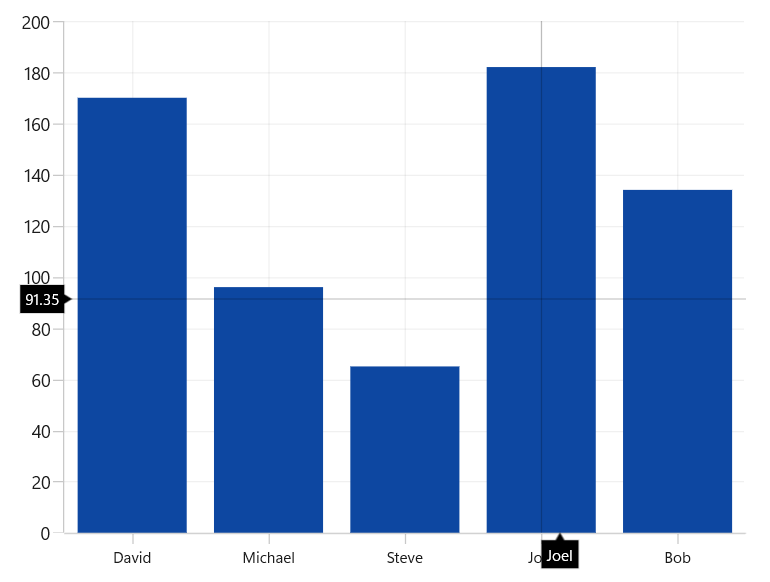
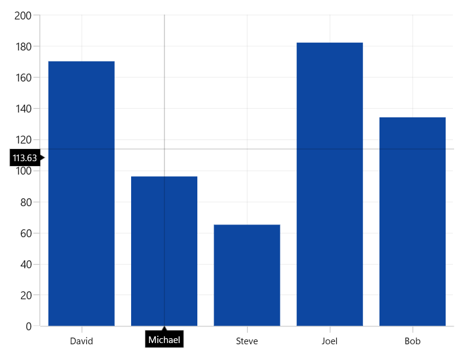
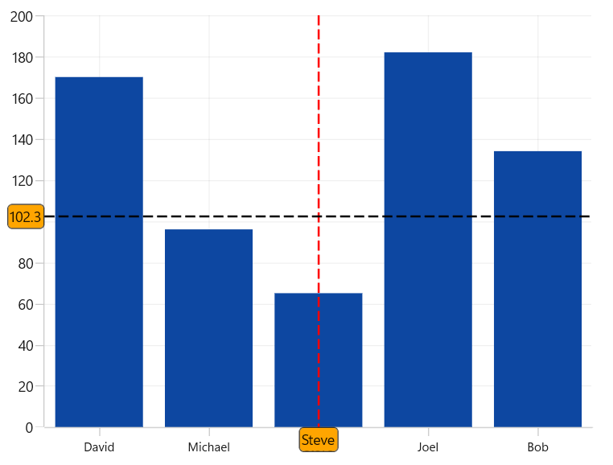

# Crosshair in WinUI Chart (SfCartesianChart)

ChartCrossHairBehavior allows you to view the data values at the current mouse pointer or touch contact point. By moving the crosshair lines horizontally, you can identify the corresponding X values, and by moving them vertically, you can identify the Y values.

## Define Crosshair

To add the crosshair in the chart, create an instance [ChartCrosshairBehavior](https://help.syncfusion.com/cr/winui/Syncfusion.UI.Xaml.Charts.ChartCrosshairBehavior.html) and set it to the [CrosshairBehavior](https://help.syncfusion.com/cr/winui/Syncfusion.UI.Xaml.Charts.SfCartesianChart.html#Syncfusion_UI_Xaml_Charts_SfCartesianChart_CrosshairBehavior) property of the chart.





<chart:SfCartesianChart>
    <chart:SfCartesianChart.CrosshairBehavior>
        <chart:ChartCrosshairBehavior/>
    </chart:SfCartesianChart.CrosshairBehavior>
    ...
</chart:SfCartesianChart>





SfCartesianChart chart = new SfCartesianChart();
. . .
ChartCrosshairBehavior behavior = new ChartCrosshairBehavior();
chart.CrosshairBehavior = behavior;
...





To view the crosshair label in the particular axis, you have to enable the [ShowTrackballLabel](https://help.syncfusion.com/cr/winui/Syncfusion.UI.Xaml.Charts.ChartAxis.html#Syncfusion_UI_Xaml_Charts_ChartAxis_ShowTrackballLabel) property in that axis as in the following code snippet.





<chart:SfCartesianChart>
    <chart:SfCartesianChart.XAxes>
        <chart:CategoryAxis ShowTrackballLabel="True"/>
    </chart:SfCartesianChart.XAxes>
    . . .
    <chart:SfCartesianChart.CrosshairBehavior>
        <chart:ChartCrosshairBehavior/>
    </chart:SfCartesianChart.CrosshairBehavior>
</chart:SfCartesianChart>





SfCartesianChart chart = new SfCartesianChart();
ChartCrosshairBehavior behavior = new ChartCrosshairBehavior();
chart.CrosshairBehavior = behavior;

CategoryAxis primaryAxis = new CategoryAxis()
{
    ShowTrackballLabel = true
};
chart.XAxes.Add(primaryAxis);
...





## Horizontal and Vertical Line style

When you add [ChartCrossHairBehavior](https://help.syncfusion.com/cr/winui/Syncfusion.UI.Xaml.Charts.ChartCrosshairBehavior.html) to a chart in WinUI, horizontal and vertical crosshair lines will appear to indicate the current pointer position. These lines help you track the corresponding X and Y values on the chart. You can customize the appearance of these lines using the [HorizontalLineStyle](https://help.syncfusion.com/cr/winui/Syncfusion.UI.Xaml.Charts.ChartCrosshairBehavior.html#Syncfusion_UI_Xaml_Charts_ChartCrosshairBehavior_HorizontalLineStyle) and [VerticalLineStyle](https://help.syncfusion.com/cr/winui/Syncfusion.UI.Xaml.Charts.ChartCrosshairBehavior.html#Syncfusion_UI_Xaml_Charts_ChartCrosshairBehavior_VerticalLineStyle) properties.

### HorizontalLineStyle

The following code snippet demonstrates how to customize the line style for the horizontal line in the crosshair.





<chart:SfCartesianChart x:Name="chart">
    <chart:SfCartesianChart.Resources>
        <ResourceDictionary>
            
        </ResourceDictionary>
    </chart:SfCartesianChart.Resources>

    <chart:SfCartesianChart.CrosshairBehavior>
        <chart:ChartCrosshairBehavior HorizontalLineStyle="{StaticResource horizontalLineStyle}"/>
    </chart:SfCartesianChart.CrosshairBehavior>
</chart:SfCartesianChart>





ChartCrossHairBehavior crosshair = new ChartCrossHairBehavior()
{
    HorizontalLineStyle = chart.Resources["horizontalLineStyle"] as Style
};

chart.Behaviors.Add(crosshair);





### VerticalLineStyle

The following code snippet demonstrates how to customize the line style for the vertical line in the crosshair.





<chart:SfCartesianChart x:Name="chart">
    <chart:SfCartesianChart.Resources>
        <ResourceDictionary>
            
        </ResourceDictionary>
    </chart:SfCartesianChart.Resources>

    <chart:SfCartesianChart.CrosshairBehavior>
        <chart:ChartCrosshairBehavior VerticalLineStyle="{StaticResource verticalLineStyle}"/>
    </chart:SfCartesianChart.CrosshairBehavior>
</chart:SfCartesianChart>





ChartCrossHairBehavior crosshair = new ChartCrossHairBehavior()
{
    VerticalLineStyle = chart.Resources["verticalLineStyle"] as Style
};

chart.Behaviors.Add(crosshair);





## Horizontal and Vertical Axis label

When you add [ChartCrossHairBehavior](https://help.syncfusion.com/cr/winui/Syncfusion.UI.Xaml.Charts.ChartCrosshairBehavior.html) to a chart in WinUI, horizontal and vertical crosshair lines will appear to indicate the current pointer position. Along these lines, axis labels are displayed to indicate the corresponding X and Y values. You can customize the appearance of these labels using the [HorizontalAxisLabelAlignment](https://help.syncfusion.com/cr/winui/Syncfusion.UI.Xaml.Charts.ChartCrosshairBehavior.html#Syncfusion_UI_Xaml_Charts_ChartCrosshairBehavior_HorizontalAxisLabelAlignment) and [VerticalAxisLabelAlignment](https://help.syncfusion.com/cr/winui/Syncfusion.UI.Xaml.Charts.ChartCrosshairBehavior.html#Syncfusion_UI_Xaml_Charts_ChartCrosshairBehavior_VerticalAxisLabelAlignment) properties.

Axis Label can be aligned by Near, Far, Center, Auto and None Options.

* `Auto` - Axis label is aligned in Near/Far positions based on the movement of vertical line.
* `Far` - Axis label is positioned far from the position of vertical line in cross hair.
* `Near` - Axis label is near to the position of crosshair line.
* `Center` - Axis label is aligned to the center of the line.

### HorizontalAxisLabelAlignment

The Horizontal axis label is displayed when the vertical line in contact with x axis.The label can be aligned using [HorizontalAxisLabelAlignment](https://help.syncfusion.com/cr/winui/Syncfusion.UI.Xaml.Charts.ChartCrosshairBehavior.html#Syncfusion_UI_Xaml_Charts_ChartCrosshairBehavior_HorizontalAxisLabelAlignment) property. By default the axis label will positioned in center.





<chart:SfCartesianChart.CrosshairBehavior>
    <chart:ChartCrosshairBehavior HorizontalAxisLabelAlignment="Far"/>
</chart:SfCartesianChart.CrosshairBehavior>





ChartCrossHairBehavior crosshair = new ChartCrossHairBehavior()
{
    HorizontalAxisLabelAlignment = ChartAlignment.Far
};

chart.Behaviors.Add(crosshair);





### VerticalAxisLabelAlignment

The Vertical axis label is displayed when the horizontal line in contact with x axis.The label can be aligned using [VerticalAxisLabelAlignment](https://help.syncfusion.com/cr/winui/Syncfusion.UI.Xaml.Charts.ChartCrosshairBehavior.html#Syncfusion_UI_Xaml_Charts_ChartCrosshairBehavior_VerticalAxisLabelAlignment) property. By default the axis label will positioned in `center`.





<chart:SfCartesianChart.CrosshairBehavior>
    <chart:ChartCrosshairBehavior VerticalAxisLabelAlignment="Far"/>
</chart:SfCartesianChart.CrosshairBehavior>





ChartCrossHairBehavior crosshair = new ChartCrossHairBehavior()
{
    VerticalAxisLabelAlignment = ChartAlignment.Far
};

chart.Behaviors.Add(crosshair);





## Template

The default appearance of the crosshair axis labels can be customized by using the [CrosshairLabelTemplate](https://help.syncfusion.com/cr/winui/Syncfusion.UI.Xaml.Charts.ChartAxis.html#Syncfusion_UI_Xaml_Charts_ChartAxis_CrosshairLabelTemplate) property of chart axis. The following example demonstrates how to set the CrosshairLabelTemplate.





<chart:SfCartesianChart>
. . .
    <chart:SfCartesianChart.Resources>
        <DataTemplate x:Key="xaxesCrossHairTemplate" x:DataType="chart:ChartPointInfo">
            <Border Background="Orange" CornerRadius="4" BorderThickness="1" BorderBrush="Black">
                <TextBlock Margin="2" Text="{Binding ValueX}"/>
            </Border>
        </DataTemplate>

        <DataTemplate x:Key="yaxesCrossHairTemplate" x:DataType="chart:ChartPointInfo">
            <Border Background="Orange" CornerRadius="4" BorderThickness="1" BorderBrush="Black">
                <TextBlock Margin="2" Text="{Binding ValueY}"/>
            </Border>
        </DataTemplate>
    </chart:SfCartesianChart.Resources>
    . . .

    <chart:SfCartesianChart.XAxes>
        <chart:CategoryAxis ShowTrackballLabel="True" CrosshairLabelTemplate="{StaticResource xaxesCrossHairTemplate}" />
    </chart:SfCartesianChart.XAxes>

    <chart:SfCartesianChart.YAxes>
        <chart:NumericalAxis ShowTrackballLabel="True" CrosshairLabelTemplate="{StaticResource yaxesCrossHairTemplate}"/>
    </chart:SfCartesianChart.YAxes>

    <chart:SfCartesianChart.CrosshairBehavior>
        <chart:ChartCrosshairBehavior />
    </chart:SfCartesianChart.CrosshairBehavior>
    ...
</chart:SfCartesianChart>





SfCartesianChart chart = new SfCartesianChart();
ChartCrosshairBehavior behavior = new ChartCrosshairBehavior();
chart.CrosshairBehavior = behavior;

CategoryAxis primaryAxis = new CategoryAxis()
{
    ShowTrackballLabel = true,
    CrosshairLabelTemplate = chart.Resources["xaxesCrossHairTemplate"] as DataTemplate
};
chart.XAxes.Add(primaryAxis);

NumericalAxis secondaryAxis = new NumericalAxis()
{
    ShowTrackballLabel = true,
    CrosshairLabelTemplate = chart.Resources["yaxesCrossHairTemplate"] as DataTemplate
};
chart.XAxes.Add(secondaryAxis);
...





