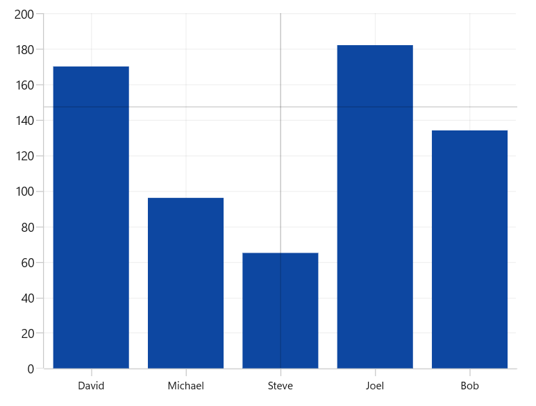
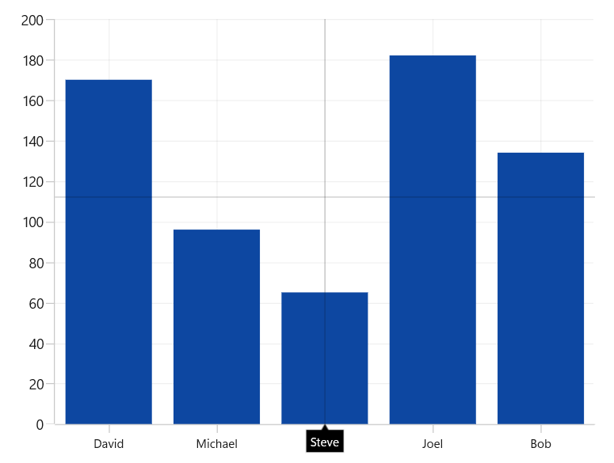
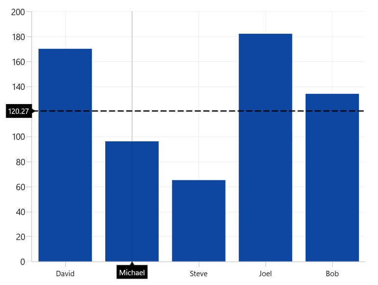
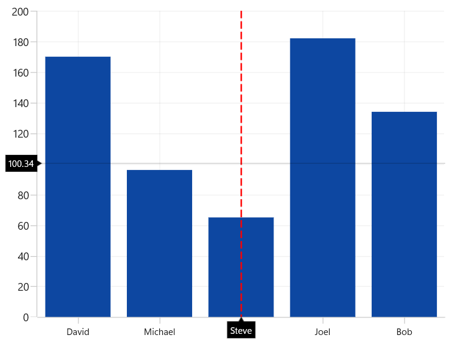
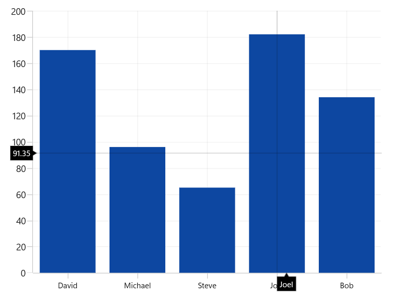
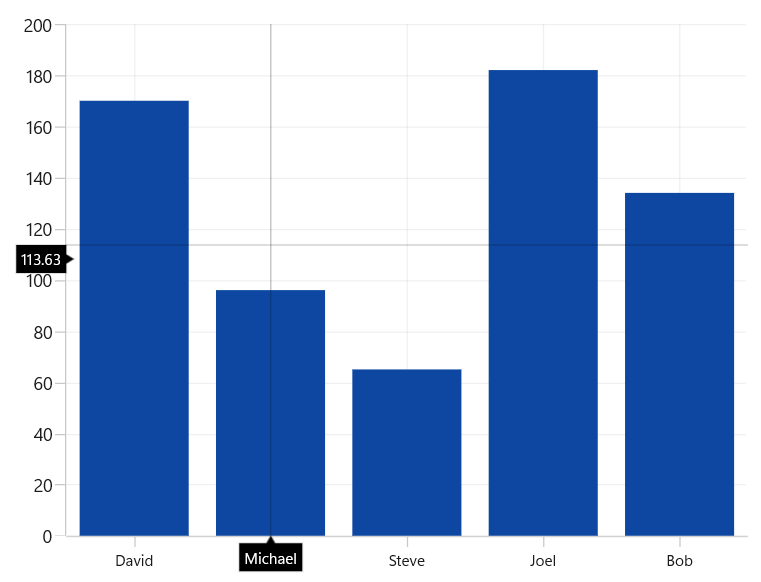
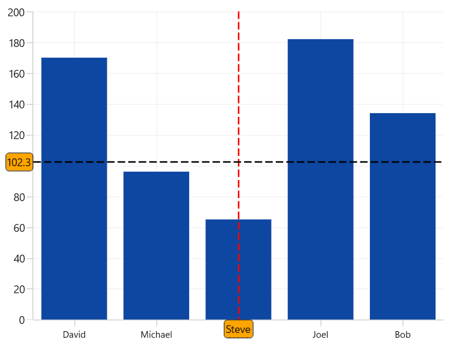

# Crosshair in WinUI Chart (SfCartesianChart)

The Chart crosshair behavior allows you to view the data values at the current mouse pointer or touch contact point. By moving the crosshair lines horizontally, you can identify the corresponding X values, and by moving them vertically, you can identify the Y values.

## Define crosshair

To add the crosshair in the chart, create an instance of [ChartCrosshairBehavior](https://help.syncfusion.com/cr/winui/Syncfusion.UI.Xaml.Charts.ChartCrosshairBehavior.html) and set it to the [CrosshairBehavior](https://help.syncfusion.com/cr/winui/Syncfusion.UI.Xaml.Charts.SfCartesianChart.html#Syncfusion_UI_Xaml_Charts_SfCartesianChart_CrosshairBehavior) property of the chart.





<chart:SfCartesianChart>
    <chart:SfCartesianChart.CrosshairBehavior>
        <chart:ChartCrosshairBehavior/>
    </chart:SfCartesianChart.CrosshairBehavior>

    <!-- Configure additional chart elements -->
</chart:SfCartesianChart>





SfCartesianChart chart = new SfCartesianChart();

// Configure additional chart elements
ChartCrosshairBehavior behavior = new ChartCrosshairBehavior();
chart.CrosshairBehavior = behavior;





To view the crosshair label in a particular axis, you have to enable the [ShowTrackballLabel](https://help.syncfusion.com/cr/winui/Syncfusion.UI.Xaml.Charts.ChartAxis.html#Syncfusion_UI_Xaml_Charts_ChartAxis_ShowTrackballLabel) property in that axis as in the following code snippet.





<chart:SfCartesianChart>
    <chart:SfCartesianChart.XAxes>
        <chart:CategoryAxis ShowTrackballLabel="True"/>
    </chart:SfCartesianChart.XAxes>

    <!-- Configure additional chart elements -->
    <chart:SfCartesianChart.CrosshairBehavior>
        <chart:ChartCrosshairBehavior/>
    </chart:SfCartesianChart.CrosshairBehavior>
</chart:SfCartesianChart>





SfCartesianChart chart = new SfCartesianChart();

// Configure additional chart elements
ChartCrosshairBehavior behavior = new ChartCrosshairBehavior();
chart.CrosshairBehavior = behavior;

CategoryAxis primaryAxis = new CategoryAxis()
{
    ShowTrackballLabel = true
};

chart.XAxes.Add(primaryAxis);





## Horizontal and vertical line style

When you add [ChartCrossHairBehavior](https://help.syncfusion.com/cr/winui/Syncfusion.UI.Xaml.Charts.ChartCrosshairBehavior.html) to a chart in WinUI, horizontal and vertical crosshair lines will appear to indicate the current pointer position. These lines help you track the corresponding X and Y values on the chart. You can customize the appearance of these lines using the [HorizontalLineStyle](https://help.syncfusion.com/cr/winui/Syncfusion.UI.Xaml.Charts.ChartCrosshairBehavior.html#Syncfusion_UI_Xaml_Charts_ChartCrosshairBehavior_HorizontalLineStyle) and [VerticalLineStyle](https://help.syncfusion.com/cr/winui/Syncfusion.UI.Xaml.Charts.ChartCrosshairBehavior.html#Syncfusion_UI_Xaml_Charts_ChartCrosshairBehavior_VerticalLineStyle) properties.

**Horizontal line style**

The following code snippet demonstrates how to customize the line style for the horizontal line in the crosshair.





<chart:SfCartesianChart x:Name="chart">
    <chart:SfCartesianChart.Resources>
        <ResourceDictionary>
            
        </ResourceDictionary>
    </chart:SfCartesianChart.Resources>

    <chart:SfCartesianChart.CrosshairBehavior>
        <chart:ChartCrosshairBehavior HorizontalLineStyle="{StaticResource horizontalLineStyle}"/>
    </chart:SfCartesianChart.CrosshairBehavior>
</chart:SfCartesianChart>





// The 'horizontalLineStyle' resource is defined in XAML Resources and referenced here.
ChartCrossHairBehavior crosshair = new ChartCrossHairBehavior()
{
    HorizontalLineStyle = chart.Resources["horizontalLineStyle"] as Style
};

chart.Behaviors.Add(crosshair);





**Vertical line style**

The following code snippet demonstrates how to customize the line style for the vertical line in the crosshair.





<chart:SfCartesianChart x:Name="chart">
    <chart:SfCartesianChart.Resources>
        <ResourceDictionary>
            
        </ResourceDictionary>
    </chart:SfCartesianChart.Resources>

    <chart:SfCartesianChart.CrosshairBehavior>
        <chart:ChartCrosshairBehavior VerticalLineStyle="{StaticResource verticalLineStyle}"/>
    </chart:SfCartesianChart.CrosshairBehavior>
</chart:SfCartesianChart>





// The 'verticalLineStyle' resource is defined in XAML Resources and referenced here.
ChartCrossHairBehavior crosshair = new ChartCrossHairBehavior()
{
    VerticalLineStyle = chart.Resources["verticalLineStyle"] as Style
};

chart.Behaviors.Add(crosshair);





## Horizontal and vertical axis label

The horizontal axis label appears when the vertical line intersects the X-axis, and the vertical axis label appears when the horizontal line intersects the Y-axis. These labels can be customized using the [HorizontalAxisLabelAlignment](https://help.syncfusion.com/cr/winui/Syncfusion.UI.Xaml.Charts.ChartCrosshairBehavior.html#Syncfusion_UI_Xaml_Charts_ChartCrosshairBehavior_HorizontalAxisLabelAlignment) and [VerticalAxisLabelAlignment](https://help.syncfusion.com/cr/winui/Syncfusion.UI.Xaml.Charts.ChartCrosshairBehavior.html#Syncfusion_UI_Xaml_Charts_ChartCrosshairBehavior_VerticalAxisLabelAlignment) properties. By default, the axis label will be positioned in the center.

Axis label can be aligned by Near, Far, Center, and Auto options.

* `Auto` - Axis label is aligned in Near/Far positions based on the movement of vertical line.
* `Far` - Axis label is positioned far from the position of vertical line in cross hair.
* `Near` - Axis label is near to the position of crosshair line.
* `Center` - Axis label is aligned to the center of the line.

**Horizontal axis label alignment**

The following code snippet demonstrates how to customize the horizontal axis label alignment in the crosshair.





<chart:SfCartesianChart.CrosshairBehavior>
    <chart:ChartCrosshairBehavior HorizontalAxisLabelAlignment="Far"/>
</chart:SfCartesianChart.CrosshairBehavior>





ChartCrossHairBehavior crosshair = new ChartCrossHairBehavior()
{
    HorizontalAxisLabelAlignment = ChartAlignment.Far
};

chart.Behaviors.Add(crosshair);





**Vertical axis label alignment**

The following code snippet demonstrates how to customize the vertical axis label alignment in the crosshair.





<chart:SfCartesianChart.CrosshairBehavior>
    <chart:ChartCrosshairBehavior VerticalAxisLabelAlignment="Far"/>
</chart:SfCartesianChart.CrosshairBehavior>





ChartCrossHairBehavior crosshair = new ChartCrossHairBehavior()
{
    VerticalAxisLabelAlignment = ChartAlignment.Far
};

chart.Behaviors.Add(crosshair);





## Template

The default appearance of the crosshair axis labels can be customized by using the [CrosshairLabelTemplate](https://help.syncfusion.com/cr/winui/Syncfusion.UI.Xaml.Charts.ChartAxis.html#Syncfusion_UI_Xaml_Charts_ChartAxis_CrosshairLabelTemplate) property of the chart axis. The following example demonstrates how to set the crosshair label template.





<chart:SfCartesianChart>

    <!-- Configure additional chart elements -->
    <chart:SfCartesianChart.Resources>
        <DataTemplate x:Key="xaxesCrossHairTemplate" x:DataType="chart:ChartPointInfo">
            <Border Background="Orange" CornerRadius="4" BorderThickness="1" BorderBrush="Black">
                <TextBlock Margin="2" Text="{Binding ValueX}"/>
            </Border>
        </DataTemplate>

        <DataTemplate x:Key="yaxesCrossHairTemplate" x:DataType="chart:ChartPointInfo">
            <Border Background="Orange" CornerRadius="4" BorderThickness="1" BorderBrush="Black">
                <TextBlock Margin="2" Text="{Binding ValueY}"/>
            </Border>
        </DataTemplate>
    </chart:SfCartesianChart.Resources>

    <chart:SfCartesianChart.XAxes>
        <chart:CategoryAxis ShowTrackballLabel="True" CrosshairLabelTemplate="{StaticResource xaxesCrossHairTemplate}" />
    </chart:SfCartesianChart.XAxes>

    <chart:SfCartesianChart.YAxes>
        <chart:NumericalAxis ShowTrackballLabel="True" CrosshairLabelTemplate="{StaticResource yaxesCrossHairTemplate}"/>
    </chart:SfCartesianChart.YAxes>

    <chart:SfCartesianChart.CrosshairBehavior>
        <chart:ChartCrosshairBehavior/>
    </chart:SfCartesianChart.CrosshairBehavior>

</chart:SfCartesianChart>





SfCartesianChart chart = new SfCartesianChart();

ChartCrosshairBehavior behavior = new ChartCrosshairBehavior();
chart.CrosshairBehavior = behavior;

// The 'xaxesCrossHairTemplate' resource is defined in XAML Resources and referenced here.
CategoryAxis primaryAxis = new CategoryAxis()
{
    ShowTrackballLabel = true,
    CrosshairLabelTemplate = chart.Resources["xaxesCrossHairTemplate"] as DataTemplate
};
chart.XAxes.Add(primaryAxis);

// The 'yaxesCrossHairTemplate' resource is defined in XAML Resources and referenced here.
NumericalAxis secondaryAxis = new NumericalAxis()
{
    ShowTrackballLabel = true,
    CrosshairLabelTemplate = chart.Resources["yaxesCrossHairTemplate"] as DataTemplate
};
chart.XAxes.Add(secondaryAxis);





N> The binding context for `CrosshairLabelTemplate` is [ChartPointInfo](https://help.syncfusion.com/cr/winui/Syncfusion.UI.Xaml.Charts.ChartPointInfo.html), which provides the necessary data for the crosshair labels.

## See Also

* [How to export chart as image in WinUI Chart (SfCartesianChart)](https://support.syncfusion.com/kb/article/18644)
* [How to display more information in the Tooltip of WinUI Chart (SfCartesianChart)](https://support.syncfusion.com/kb/article/12711)
