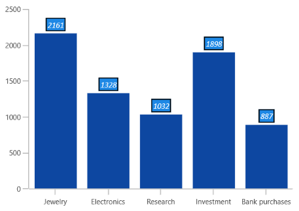
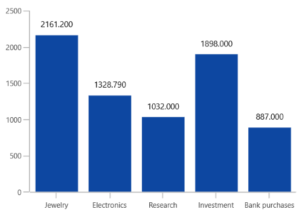
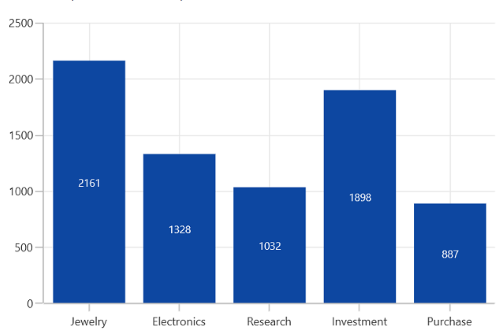
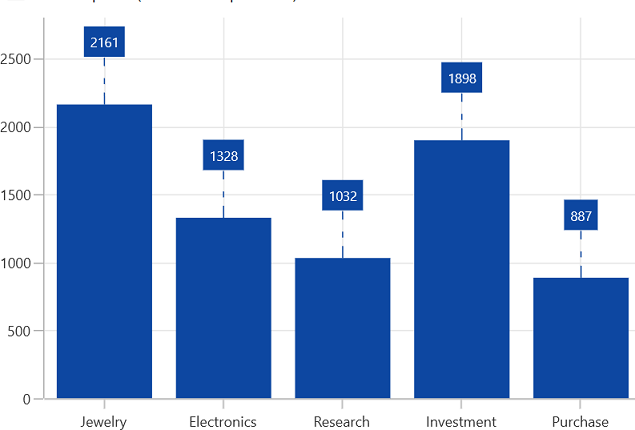
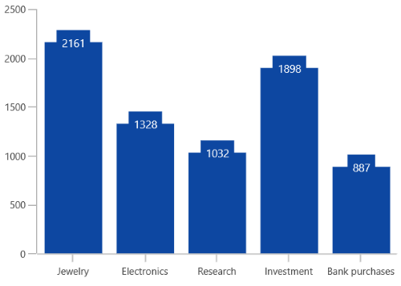

# Data Label in WinUI Chart (SfCartesianChart)

Data labels are used to display values related to a chart segment. Values from data point(x, y) or other custom properties from a data source can be displayed. 

Each data label can be represented by the following:

* Label - displays the segment label content at the (X, Y) point.
* Connector line - used to connect the (X, Y) point and the label element.

## Enable Data Label 

The [ShowDataLabels](https://help.syncfusion.com/cr/winui/Syncfusion.UI.Xaml.Charts.DataMarkerSeries.html#Syncfusion_UI_Xaml_Charts_DataMarkerSeries_ShowDataLabels) property of series is used to enable the data labels.





<chart:SfCartesianChart>
. . .
<chart:SfCartesianChart.Series>
    <chart:ColumnSeries ItemsSource="{Binding Data}" 
                     XBindingPath="Category"
                     YBindingPath="Value" ShowDataLabels="True">
    </chart:ColumnSeries>
</chart:SfCartesianChart.Series>

</chart:SfCartesianChart>





SfCartesianChart chart = new SfCartesianChart();
. . .
ColumnSeries series = new ColumnSeries()
{
    ItemsSource = viewModel.Data,
    XBindingPath = "Category",
    YBindingPath = "Value",
    ShowDataLabels = true
};

chart.Series.Add(series);





 

## Context

To customize the content of data labels, need to define [DataLabelSettings](https://help.syncfusion.com/cr/winui/Syncfusion.UI.Xaml.Charts.CartesianSeries.html#Syncfusion_UI_Xaml_Charts_CartesianSeries_DataLabelSettings) of series and set [Context](https://help.syncfusion.com/cr/winui/Syncfusion.UI.Xaml.Charts.ChartDataLabelSettings.html#Syncfusion_UI_Xaml_Charts_ChartDataLabelSettings_Context) property of [CartesianDataLabelSettings](https://help.syncfusion.com/cr/winui/Syncfusion.UI.Xaml.Charts.CartesianDataLabelSettings.html) to define the value to be displayed as label content.





<chart:SfCartesianChart>
. . .
<chart:ColumnSeries ShowDataLabels="True">
    <chart:ColumnSeries.DataLabelSettings>
        <chart:CartesianDataLabelSettings Context="YValue"/>
    </chart:ColumnSeries.DataLabelSettings>
</chart:ColumnSeries>

</chart:SfCartesianChart>





SfCartesianChart chart = new SfCartesianChart();
ColumnSeries series = new ColumnSeries();
. . .
series.DataLabelSettings = new CartesianDataLabelSettings()
{
    Context = LabelContext.YValue
};

chart.Series.Add(series);





## Customization

The following properties are used to customize the data label.

* [BorderBrush](https://help.syncfusion.com/cr/winui/Syncfusion.UI.Xaml.Charts.ChartDataLabelSettings.html#Syncfusion_UI_Xaml_Charts_ChartDataLabelSettings_BorderBrush)- used to change the border color.
* [BorderThickness](https://help.syncfusion.com/cr/winui/Syncfusion.UI.Xaml.Charts.ChartDataLabelSettings.html#Syncfusion_UI_Xaml_Charts_ChartDataLabelSettings_BorderThickness)- used to change the thickness of the border.
* [Margin](https://help.syncfusion.com/cr/winui/Syncfusion.UI.Xaml.Charts.ChartDataLabelSettings.html#Syncfusion_UI_Xaml_Charts_ChartDataLabelSettings_Margin)- used to change the margin size for label.
* [FontStyle](https://help.syncfusion.com/cr/winui/Syncfusion.UI.Xaml.Charts.ChartDataLabelSettings.html#Syncfusion_UI_Xaml_Charts_ChartDataLabelSettings_FontStyle)-  used to change font style of the label.
* [FontSize](https://help.syncfusion.com/cr/winui/Syncfusion.UI.Xaml.Charts.ChartDataLabelSettings.html#Syncfusion_UI_Xaml_Charts_ChartDataLabelSettings_FontSize)-  used to change font size of the label.
* [Foreground](https://help.syncfusion.com/cr/winui/Syncfusion.UI.Xaml.Charts.ChartDataLabelSettings.html#Syncfusion_UI_Xaml_Charts_ChartDataLabelSettings_Foreground)- used to change the text color of the label.
* [FontFamily](https://help.syncfusion.com/cr/winui/Syncfusion.UI.Xaml.Charts.ChartDataLabelSettings.html#Syncfusion_UI_Xaml_Charts_ChartDataLabelSettings_FontFamily)-  used to change the font family of the label.
* [Background](https://help.syncfusion.com/cr/winui/Syncfusion.UI.Xaml.Charts.ChartDataLabelSettings.html#Syncfusion_UI_Xaml_Charts_ChartDataLabelSettings_Background)- used to change the label background color.





<chart:SfCartesianChart>
. . .
<chart:ColumnSeries ShowDataLabels="True">
<chart:ColumnSeries.DataLabelSettings>
    <chart:CartesianDataLabelSettings Position="Outer" Foreground="White" 
                                      FontSize="11" FontFamily="Calibri" 
                                      BorderBrush="Black" BorderThickness="1" 
                                      Margin="1" FontStyle="Italic" Background="#1E88E5" />
</chart:ColumnSeries.DataLabelSettings>

</chart:ColumnSeries>
</chart:SfCartesianChart>





SfCartesianChart chart = new SfCartesianChart();
ColumnSeries series = new ColumnSeries();
. . .
series.DataLabelSettings = new CartesianDataLabelSettings()
{
    Position = DataLabelPosition.Outer,
    Foreground = new SolidColorBrush(Colors.White),
    BorderBrush = new SolidColorBrush(Colors.Black),
    Background = new SolidColorBrush(Colors.LightBlue),
    BorderThickness = new Thickness(1),
    Margin = new Thickness(1),
    FontStyle = FontStyle.Italic,
    FontFamily = new FontFamily("Calibri"),
    FontSize = 11
};

chart.Series.Add(series);





## Template

The appearance of the data label can be customized using the [ContentTemplate](https://help.syncfusion.com/cr/winui/Syncfusion.UI.Xaml.Charts.ChartDataLabelSettings.html#Syncfusion_UI_Xaml_Charts_ChartDataLabelSettings_ContentTemplate) property of [CartesianDataLabelSettings](https://help.syncfusion.com/cr/winui/Syncfusion.UI.Xaml.Charts.CartesianDataLabelSettings.html) as in the below code example:





<chart:SfCartesianChart>
. . .
<chart:SfCartesianChart.Resources>
    <DataTemplate x:Key="dataLabelTemplate">
        <StackPanel Orientation="Vertical">
            <Path Grid.Row="0"  Stretch="Uniform" Fill="#1E88E5"                              
               Width="15" Height="15" Margin="0,0,0,0"                              
               RenderTransformOrigin="0.5,0.5"
               Data="M22.5,15.8899993896484L37.5,                                
               30.8899993896484 7.5,30.8899993896484 22.5,15.8899993896484z">
                <Path.RenderTransform>
                    <TransformGroup>
                        <TransformGroup.Children>
                            <RotateTransform Angle="0" />
                            <ScaleTransform ScaleX="1" ScaleY="1" />
                        </TransformGroup.Children>
                    </TransformGroup>
                </Path.RenderTransform>
            </Path>
            <TextBlock Grid.Row="1" Text="{Binding}" FontSize="11" Foreground="Black"></TextBlock>
        </StackPanel>
    </DataTemplate>
</chart:SfCartesianChart.Resources>
. . . 
<chart:ColumnSeries ShowDataLabels="True">
    <chart:ColumnSeries.DataLabelSettings>
        <chart:CartesianDataLabelSettings Position="Outer" ContentTemplate="{StaticResource dataLabelTemplate}"/>
    </chart:ColumnSeries.DataLabelSettings>
. . .
</chart:ColumnSeries>

</chart:SfCartesianChart>





SfCartesianChart chart = new SfCartesianChart();
ColumnSeries series = new ColumnSeries();
. . .
series.DataLabelSettings = new CartesianDataLabelSettings()
{
    Position = DataLabelPosition.Outer,
    ContentTemplate = chart.Resources["dataLabelTemplate"] as DataTemplate
};

chart.Series.Add(series);





## Format

The [Format](https://help.syncfusion.com/cr/winui/Syncfusion.UI.Xaml.Charts.ChartDataLabelSettings.html#Syncfusion_UI_Xaml_Charts_ChartDataLabelSettings_Format) property can be used to format the data labels.




<chart:SfCartesianChart>
. . .
<chart:ColumnSeries ShowDataLabels="True">
    <chart:ColumnSeries.DataLabelSettings>
        <chart:CartesianDataLabelSettings Background="Transparent" Position="Outer" Format="#.000" />
    </chart:ColumnSeries.DataLabelSettings>

</chart:ColumnSeries>
</chart:SfCartesianChart>





SfCartesianChart chart = new SfCartesianChart();
ColumnSeries series = new ColumnSeries();
. . .
series.DataLabelSettings = new CartesianDataLabelSettings()
{
    Format = "#.000",
	Position = DataLabelPosition.Outer
	Background = new SolidColorBrush(Colors.Transparent),
};

chart.Series.Add(series);





## Rotation

The [Rotation](https://help.syncfusion.com/cr/winui/Syncfusion.UI.Xaml.Charts.ChartDataLabelSettings.html#Syncfusion_UI_Xaml_Charts_ChartDataLabelSettings_Rotation) property is used to define the angle to which the label has to rotate.





<chart:SfCartesianChart>
. . .
<chart:ColumnSeries ShowDataLabels="True">
    <chart:ColumnSeries.DataLabelSettings>
        <chart:CartesianDataLabelSettings Rotation="45" Position="Outer" />
    </chart:ColumnSeries.DataLabelSettings>
</chart:ColumnSeries>
</chart:SfCartesianChart>




SfCartesianChart chart = new SfCartesianChart();
ColumnSeries series = new ColumnSeries();
. . .
series.DataLabelSettings = new CartesianDataLabelSettings()
{
    Rotation = 45,
    Position = DataLabelPosition.Outer,
};

chart.Series.Add(series);





## Alignment

The alignment of data labels inside the series is defined by using the [BarLabelAlignment](https://help.syncfusion.com/cr/winui/Syncfusion.UI.Xaml.Charts.CartesianDataLabelSettings.html#Syncfusion_UI_Xaml_Charts_CartesianDataLabelSettings_BarLabelAlignment) property. 

* [Top](https://help.syncfusion.com/cr/winui/Syncfusion.UI.Xaml.Charts.BarLabelAlignment.html#Syncfusion_UI_Xaml_Charts_BarLabelAlignment_Top) - Positions the data label at the top edge point of a chart segment.
* [Middle](https://help.syncfusion.com/cr/winui/Syncfusion.UI.Xaml.Charts.BarLabelAlignment.html#Syncfusion_UI_Xaml_Charts_BarLabelAlignment_Middle) - Positions the data label at the center point of a chart segment.
* [Bottom](https://help.syncfusion.com/cr/winui/Syncfusion.UI.Xaml.Charts.BarLabelAlignment.html#Syncfusion_UI_Xaml_Charts_BarLabelAlignment_Bottom) - Positions the data label at the bottom edge point of a chart segment.

N> This behavior varies based on the chart series type.





<chart:SfCartesianChart>
. . .
<chart:ColumnSeries ShowDataLabels="True">
    <chart:ColumnSeries.DataLabelSettings>
        <chart:CartesianDataLabelSettings BarLabelAlignment="Middle"/>
    </chart:ColumnSeries.DataLabelSettings>
</chart:ColumnSeries>
</chart:SfCartesianChart>





SfCartesianChart chart = new SfCartesianChart();
ColumnSeries series = new ColumnSeries();
. . .
series.DataLabelSettings = new CartesianDataLabelSettings()
{
    BarLabelAlignment = BarLabelAlignment.Middle,
};

chart.Series.Add(series);





Also, you can define the label alignment using  [HorizontalAlignment](https://help.syncfusion.com/cr/winui/Syncfusion.UI.Xaml.Charts.ChartDataLabelSettings.html#Syncfusion_UI_Xaml_Charts_ChartDataLabelSettings_HorizontalAlignment) and [VerticalAlignment](https://help.syncfusion.com/cr/winui/Syncfusion.UI.Xaml.Charts.ChartDataLabelSettings.html#Syncfusion_UI_Xaml_Charts_ChartDataLabelSettings_VerticalAlignment) properties.

## Position

Other than the above alignment options, Chart providing additional customization option to position the data labels. 

The [Position](https://help.syncfusion.com/cr/winui/Syncfusion.UI.Xaml.Charts.CartesianDataLabelSettings.html#Syncfusion_UI_Xaml_Charts_CartesianDataLabelSettings_Position) property is used to position the data labels at `Center`, `Inner` and `Outer` position of the actual data point position. By default, labels are positioned based on the series types for better readability.

## Connector Line

Connector line is used to connect label and data point using a line. [ShowConnectorLine](https://help.syncfusion.com/cr/winui/Syncfusion.UI.Xaml.Charts.ChartDataLabelSettings.html#Syncfusion_UI_Xaml_Charts_ChartDataLabelSettings_ShowConnectorLine) property of [CartesianDataLabelSettings](https://help.syncfusion.com/cr/winui/Syncfusion.UI.Xaml.Charts.CartesianDataLabelSettings.html) is used to enable the connector line in the chart. 

The connector line can be customized using the below properties.

* [ConnectorHeight](https://help.syncfusion.com/cr/winui/Syncfusion.UI.Xaml.Charts.ChartDataLabelSettings.html#Syncfusion_UI_Xaml_Charts_ChartDataLabelSettings_ConnectorHeight) - used to set height for connector line.
* [ConnectorLineStyle](https://help.syncfusion.com/cr/winui/Syncfusion.UI.Xaml.Charts.ChartDataLabelSettings.html#Syncfusion_UI_Xaml_Charts_ChartDataLabelSettings_ConnectorLineStyle) - used to customize the style of line.





<chart:SfCartesianChart>
. . .

<chart:SfCartesianChart.Resources>
    
</chart:SfCartesianChart.Resources>
. . .
<chart:ColumnSeries ShowDataLabels="True">
    <chart:ColumnSeries.DataLabelSettings>
        <chart:CartesianDataLabelSettings Position="Outer" 
                                          ConnectorHeight="40"
                                          ShowConnectorLine="True"
                                          ConnectorLineStyle="{StaticResource lineStyle}" />
    </chart:ColumnSeries.DataLabelSettings>
</chart:ColumnSeries>

</chart:SfCartesianChart>





SfCartesianChart chart = new SfCartesianChart();
ColumnSeries series = new ColumnSeries();
. . .
series.DataLabelSettings = new CartesianDataLabelSettings()
{
    Position = DataLabelPosition.Outer,
    ConnectorHeight = 40,
    ConnectorLineStyle = chart.Resources["LineStyle"] as Style,
};

chart.Series.Add(series);





## Applying Series Interior

[UseSeriesPalette](https://help.syncfusion.com/cr/winui/Syncfusion.UI.Xaml.Charts.ChartDataLabelSettings.html#Syncfusion_UI_Xaml_Charts_ChartDataLabelSettings_UseSeriesPalette) property is used to set the interior of the series to the data marker background. 





<chart:SfCartesianChart>
. . .
<chart:ColumnSeries ShowDataLabels="True">
    <chart:ColumnSeries.DataLabelSettings>
        <chart:CartesianDataLabelSettings  UseSeriesPalette="True"/>
    </chart:ColumnSeries.DataLabelSettings>
</chart:ColumnSeries>

</chart:SfCartesianChart>





SfCartesianChart chart = new SfCartesianChart();
ColumnSeries series = new ColumnSeries();
. . .
series.DataLabelSettings = new CartesianDataLabelSettings()
{
    UseSeriesPalette = true,
};

chart.Series.Add(series);





