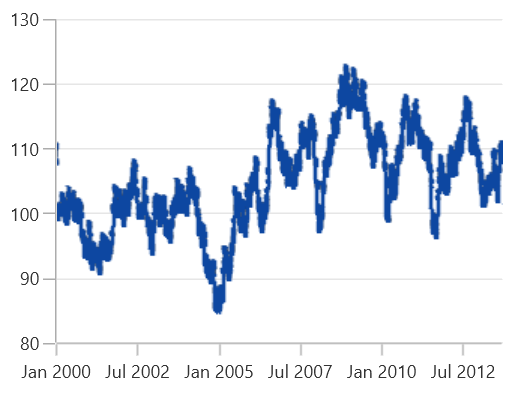

# Fast Line Chart in WinUI Cartesian Chart

## Fast Line

The [FastLineSeries]() is a special kind of line series that can render a collection with huge number of datapoints using the polyline segment. 





<chart:SfCartesianChart.Series>
    <chart:FastLineSeries ItemsSource="{Binding Data}" XBindingPath="XValue" YBindingPath="YValue"/>
</chart:SfCartesianChart.Series>





FastLineSeries series = new FastLineSeries()
{
    ItemsSource = new ViewModel().Data,
    XBindingPath = "XValue",
    YBindingPath = "YValue",
};

chart.Series.Add(series);





## Fast Line Bitmap

[FastLineBitmapSeries]() displays a series of line segments, rendered using `WriteableBitmap`. The advantage of FastLineBitmapSeries is, it renders a million data point in a fraction of seconds.

The following code example shows how to use the fast line bitmap series.





<chart:SfCartesianChart.Series>
    <chart:FastLineBitmapSeries ItemsSource="{Binding Data}" XBindingPath="XValue" YBindingPath="YValue"/>
</chart:SfCartesianChart.Series>





FastLineBitmapSeries series = new FastLineBitmapSeries()
{
    ItemsSource = new ViewModel().Data,
    XBindingPath = "XValue",
    YBindingPath = "YValue"
};

chart.Series.Add(series);





N> As it was rendered using bitmap, there might be some jagged lines at the edges. This is can be reduced using the [`EnableAntiAliasing`](https://help.syncfusion.com/cr/winui/Syncfusion.UI.Xaml.Charts.FastLineBitmapSeries.html#Syncfusion_UI_Xaml_Charts_FastLineBitmapSeries_EnableAntiAliasing) property.





<chart:SfCartesianChart.Series>
    <chart:FastLineBitmapSeries EnableAntiAliasing="True" ItemsSource="{Binding Data}" XBindingPath="XValue" YBindingPath="YValue"/>
</chart:SfCartesianChart.Series>





FastLineBitmapSeries series = new FastLineBitmapSeries()
{
    ItemsSource = new ViewModel().Data,
    XBindingPath = "XValue",
    YBindingPath = "YValue",
    EnableAntiAliasing = true
};

chart.Series.Add(series);





