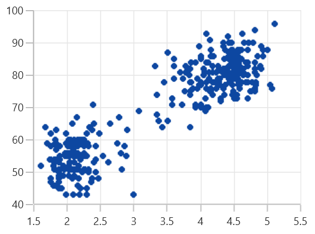

# Fast Scatter Chart in WinUI (SfCartesianChart)

A fast scatter chart is a special kind of series that can render a collection with huge number of data points using `WriteableBitmap`. [FastScatterBitmapSeries]() is used to render high number of scatter points. 

The [ScatterHeight]() and [ScatterWidth]() properties are used to change the height and width of scatter segments. [ShapeType]() is used to change the rendering shape of fast scatter bitmap series. 

The available shapes are 
* `Cross` 
* `Diamond` 
* `Ellipse` 
* `Hexagon` 
* `InvertedTriangle` 
* `Pentagon` 
* `Plus`
* `Rectangle`
* `Triangle`





<chart:SfCartesianChart>

    <chart:SfCartesianChart.PrimaryAxis>
        <chart:NumericalAxis />
    </chart:SfCartesianChart.PrimaryAxis>

    <chart:SfCartesianChart.SecondaryAxis>
        <chart:NumericalAxis />
    </chart:SfCartesianChart.SecondaryAxis> 

    <chart:SfCartesianChart.Series>
        <chart:FastScatterBitmapSeries ItemsSource="{Binding Data}" XBindingPath="XValue" YBindingPath="YValue" ScatterHeight="7" ScatterWidth="7"/>
    </chart:SfCartesianChart.Series>

</chart:SfCartesianChart>





SfCartesianChart chart = new SfCartesianChart();
NumericalAxis primaryAxis = new NumericalAxis();
chart.PrimaryAxis = primaryAxis;
NumericalAxis secondaryAxis = new NumericalAxis();
chart.SecondaryAxis = secondaryAxis;

FastScatterBitmapSeries series = new FastScatterBitmapSeries()
{
    ItemsSource = new ViewModel().Data,
    XBindingPath = "XValue",
    YBindingPath = "YValue",
    ScatterHeight = 7,
    ScatterWidth = 7
};

chart.Series.Add(series);





