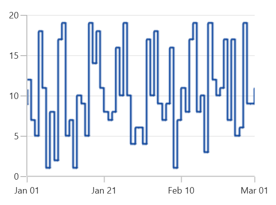

# Fast StepLine Chart in WinUI Chart (SfCartesianChart)

A fast stepline bitmap series is a special kind of series that can render a collection with huge number of data points using `WriteableBitmap`. [FastStepLineBitmapSeries]() is the high performance version of step line series.





<chart:SfCartesianChart>
. . .
    <chart:SfCartesianChart.Series>
        <chart:FastStepLineBitmapSeries ItemsSource="{Binding Data}" XBindingPath="XValue" YBindingPath="YValue" />
    </chart:SfCartesianChart.Series>
</chart:SfCartesianChart>





SfCartesianChart chart = new SfCartesianChart();
FastStepLineBitmapSeries series = new FastStepLineBitmapSeries()
{
    ItemsSource = new ViewModel().Data,
    XBindingPath = "XValue",
    YBindingPath = "YValue"
};

chart.Series.Add(series);





The anti aliasing mode can be enabled using the [EnableAntiAliasing]() property of FastStepLineBitmapSeries as shown in the following code sample.





<chart:SfCartesianChart>
. . .
    <chart:SfCartesianChart.Series>
        <chart:FastStepLineBitmapSeries EnableAntiAliasing="True" ItemsSource="{Binding Data}" XBindingPath="XValue" YBindingPath="YValue" />
    </chart:SfCartesianChart.Series>
</chart:SfCartesianChart>





SfCartesianChart chart = new SfCartesianChart();
. . .
FastStepLineBitmapSeries series = new FastStepLineBitmapSeries()
{
    ItemsSource = new ViewModel().Data,
    XBindingPath = "XValue",
    YBindingPath = "YValue",
    EnableAntiAliasing = true
};

chart.Series.Add(series);





