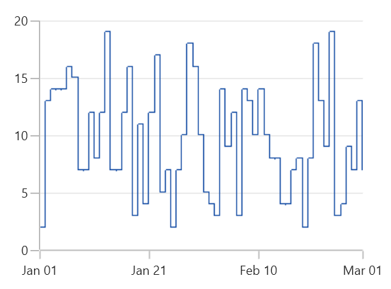
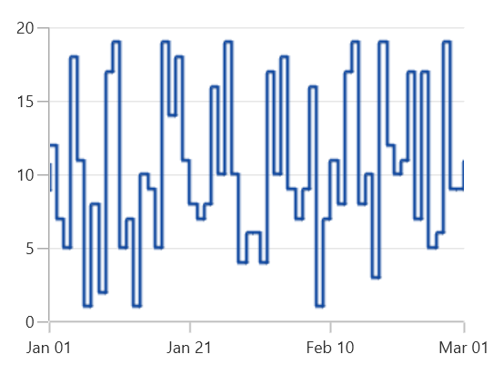

# Fast step line series in WinUI chart

A fast stepline bitmap series is a special kind of series that can render a collection with a huge number of data points using `WriteableBitmap`. [FastStepLineBitmapSeries](https://help.syncfusion.com/cr/winui/Syncfusion.UI.Xaml.Charts.FastStepLineBitmapSeries.html) is the high performance version of the step line series.





<chart:SfCartesianChart>
    <chart:SfCartesianChart.XAxes>
        <chart:DateTimeAxis/>
    </chart:SfCartesianChart.XAxes>

    <chart:SfCartesianChart.YAxes>
        <chart:NumericalAxis/>
    </chart:SfCartesianChart.YAxes>

    <chart:SfCartesianChart.Series>
        <chart:FastStepLineBitmapSeries 
            EnableAntiAliasing="True" 
            ItemsSource="{Binding Data}" 
            XBindingPath="XValue" 
            YBindingPath="YValue"/>
    </chart:SfCartesianChart.Series>
</chart:SfCartesianChart>





SfCartesianChart chart = new SfCartesianChart();

DateTimeAxis xAxis = new DateTimeAxis();
chart.XAxes.Add(xAxis);

NumericalAxis yAxis = new NumericalAxis();
chart.YAxes.Add(yAxis);

FastStepLineBitmapSeries series = new FastStepLineBitmapSeries()
{
    ItemsSource = new ViewModel().Data,
    XBindingPath = "XValue",
    YBindingPath = "YValue"
};

chart.Series.Add(series);





### Anti-aliasing

The anti-aliasing mode can be enabled using the [EnableAntiAliasing](https://help.syncfusion.com/cr/winui/Syncfusion.UI.Xaml.Charts.FastStepLineBitmapSeries.html#Syncfusion_UI_Xaml_Charts_FastStepLineBitmapSeries_EnableAntiAliasing) property of [FastStepLineBitmapSeries](https://help.syncfusion.com/cr/winui/Syncfusion.UI.Xaml.Charts.FastStepLineBitmapSeries.html) as shown in the following code sample.





<chart:SfCartesianChart>
    <chart:SfCartesianChart.XAxes>
        <chart:DateTimeAxis/>
    </chart:SfCartesianChart.XAxes>

    <chart:SfCartesianChart.YAxes>
        <chart:NumericalAxis/>
    </chart:SfCartesianChart.YAxes>

    <chart:SfCartesianChart.Series>
        <chart:FastStepLineBitmapSeries 
            EnableAntiAliasing="True" 
            ItemsSource="{Binding Data}" 
            XBindingPath="XValue" 
            YBindingPath="YValue"/>
    </chart:SfCartesianChart.Series>
</chart:SfCartesianChart>





SfCartesianChart chart = new SfCartesianChart();

DateTimeAxis xAxis = new DateTimeAxis();
chart.XAxes.Add(xAxis);
NumericalAxis yAxis = new NumericalAxis();
chart.YAxes.Add(yAxis);

// Configure additional chart elements
FastStepLineBitmapSeries series = new FastStepLineBitmapSeries()
{
    ItemsSource = new ViewModel().Data,
    XBindingPath = "XValue",
    YBindingPath = "YValue",
    EnableAntiAliasing = true
};

chart.Series.Add(series);





## See also

* [How to create a WinUI Line Chart (SfCartesianChart)](https://support.syncfusion.com/kb/article/12018)
