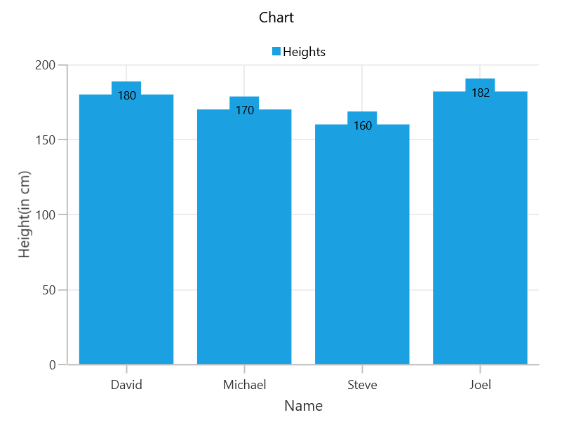

# Getting Started with WinUI Cartesian Chart

This section explains you the steps required to populate the Chart with data, header, add data labels, legend and tooltips to the Chart. This section covers only the minimal features that you need to learn to get started with the Chart.

## Creating an application with WinUI Cartesian Chart
1. Create a [WinUI 3 desktop app for C# and .NET 5](https://docs.microsoft.com/en-us/windows/apps/winui/winui3/get-started-winui3-for-desktop) or [WinUI 3 app in UWP for C#](https://docs.microsoft.com/en-us/windows/apps/winui/winui3/get-started-winui3-for-uwp).
2.	Add reference to [Syncfusion.Chart.WinUI](https://www.nuget.org/packages/Syncfusion.Chart.WinUI/) NuGet. 
3.	Import the control namespace `Syncfusion.UI.Xaml.Charts`  in XAML or C# to initialize the control.
4.	Initialize SfChart control.

 



<Page
    . . .
    
    xmlns:chart="using:Syncfusion.UI.Xaml.Charts">
    
    <Grid>
        <chart:SfCartesianChart/>
    </Grid>
</Page>
 


 

using Syncfusion.UI.Xaml.Charts;

namespace SfChart_GettingStarted
{
    public sealed partial class MainPage : Page
    {
        public MainPage()
        {
            InitializeComponent();
            
            SfCartesianChart chart = new SfCartesianChart();      
            Root_Chart.Children.Add(chart);
        }
    }   
}





## Initialize chart axis
`Cartesian Chart` supports default axes, so that these axes ([PrimaryAxis]() and [SecondaryAxis]()) will get generated automatically based upon the data bind to the chart.

Axes will be explicitly specified for it's customization purpose. The initialization of an empty chart with two axes as shown below,

 

 

<chart:SfCartesianChart>

    <chart:SfCartesianChart.PrimaryAxis>
        <chart:CategoryAxis/>
    </chart:SfCartesianChart.PrimaryAxis>

    <chart:SfCartesianChart.SecondaryAxis>
        <chart:NumericalAxis/>
    </chart:SfCartesianChart.SecondaryAxis>
    
</chart:SfCartesianChart>



 

SfCartesianChart chart = new SfCartesianChart();
CategoryAxis primaryAxis = new CategoryAxis();
chart.PrimaryAxis = primaryAxis;
NumericalAxis secondaryAxis = new NumericalAxis();
chart.SecondaryAxis = secondaryAxis;



 

Run the project and check if you get following output to make sure you have configured your project properly to add chart.

## Initialize view model

Now, let us define a simple data model that represents a data point in chart.

  



public class Person   
{   
    public string Name { get; set; }

    public double Height { get; set; }
}

 

 

Next, create a view model class and initialize a list of `Person` objects as follows.

  



public class ViewModel  
{
      public List<Person> Data { get; set; }      

      public ViewModel()       
      {
            Data = new List<Person>()
            {
                new Person { Name = "David", Height = 180 },
                new Person { Name = "Michael", Height = 170 },
                new Person { Name = "Steve", Height = 160 },
                new Person { Name = "Joel", Height = 182 }
            }; 
       }
 }

 

 

Set the `ViewModel` instance as the `DataContext` of your window; this is done to bind properties of `ViewModel` to  the chart.
 
N> Add namespace of `ViewModel` class to your XAML Page if you prefer to set `DataContext` in XAML.

 

 

<Page
    x:Class="SfChart_GettingStarted.MainPage"
    xmlns="http://schemas.microsoft.com/winfx/2006/xaml/presentation"
    xmlns:x="http://schemas.microsoft.com/winfx/2006/xaml"
    xmlns:model="using:SfChart_GettingStarted"
    xmlns:d="http://schemas.microsoft.com/expression/blend/2008"
    xmlns:syncfusion="using:Syncfusion.UI.Xaml.Charts"
    xmlns:mc="http://schemas.openxmlformats.org/markup-compatibility/2006"
    mc:Ignorable="d" Height="350" Width="525"
    Background="{ThemeResource ApplicationPageBackgroundThemeBrush}">

    <Page.DataContext>
        <model:ViewModel></local:ViewModel>
    </Page.DataContext>
</Page>



 

this.DataContext = new ViewModel();



 

## Populate Cartesian chart with data

As we are going to visualize the comparison of heights in the data model, add [ColumnSeries]() to [Series]() property of chart, and then bind the `Data` property of the above `ViewModel` to the `ColumnSeries.ItemsSource` as follows.

N> You need to set [XBindingPath]() and [YBindingPath]() properties, so that chart would fetch values from the respective properties in the data model to plot the series.

   



<chart:SfCartesianChart>
    <chart:SfCartesianChart.PrimaryAxis>
        <chart:CategoryAxis Header="Name"/>
    </chart:SfCartesianChart.PrimaryAxis>
    <chart:SfCartesianChart.SecondaryAxis>
        <chart:NumericalAxis Header="Height(in cm)"/>
    </chart:SfCartesianChart.SecondaryAxis>
    <chart:ColumnSeries ItemsSource="{Binding Data}"
                        XBindingPath="Name" 
                        YBindingPath="Height">
    </chart:ColumnSeries>
</chart:SfCartesianChart>





SfCartesianChart chart = new SfCartesianChart();

//Adding horizontal axis to the chart 
CategoryAxis primaryAxis = new CategoryAxis();
primaryAxis.Header = "Name";   
chart.PrimaryAxis = primaryAxis;

//Adding vertical axis to the chart 
NumericalAxis secondaryAxis = new NumericalAxis();
secondaryAxis.Header = "Height(in cm)";  
chart.SecondaryAxis = secondaryAxis;

//Initialize the two series for SfChart
ColumnSeries series = new ColumnSeries();

series.ItemsSource = (new ViewModel()).Data;
series.XBindingPath = "Name";            
series.YBindingPath = "Height";         
            
//Adding Series to the Chart Series Collection
chart.Series.Add(series);



 

## Add title

The header of the chart acts as the title to provide quick information to the user about the data being plotted in the chart. You can set title using the [Header]() property of chart as follows.

 



<Grid>
   <chart:SfCartesianChart Header="Chart"> 
   </chart:SfCartesianChart>
</Grid>



 

SfCartesianChart chart = new SfCartesianChart();
chart.Header = "Chart";



  

## Enable data Labels

You can add data labels to improve the readability of the chart and it can be enabled using [DataLabel]() property of [ChartSeries](). By default, there is no label displayed, you have to set [ShowDataLabels]() property of series to True.

 



<chart:SfCartesianChart>
    . . . 
    <chart:ColumnSeries ShowDataLabels="True">
    </chart:ColumnSeries>

</chart:SfCartesianChart>



 

SfCartesianChart chart = new SfCartesianChart();
. . .
ColumnSeries series = new ColumnSeries();
series.ShowDataLabels = true;
chart.Series.Add(series);



  

## Enable legend

The legend provides information about the data point displayed in the Cartesian chart. The [Legend]() property of the chart was used to enable it.

 



<chart:SfCartesianChart >
    . . .
    <chart:SfCartesianChart.Legend>
        <chart:ChartLegend/>
    </chart:SfCartesianChart.Legend>
    . . .
</chart:SfCartesianChart>



 

SfCartesianChart chart = new SfCartesianChart();
chart.Legend = new ChartLegend (); 



  

Additionally, you need to set label for each series using the [Label]() property of ChartSeries, which will be displayed in corresponding legend.

 



<chart:SfCartesianChart>
. . .
    <chart:ColumnSeries Label="Heights"
                        ItemsSource="{Binding Data}"
                        XBindingPath="Name" 
                        YBindingPath="Height">
    </chart:ColumnSeries>
</chart:SfCartesianChart>



 

ColumnSeries series = new ColumnSeries (); 
series.ItemsSource = (new ViewModel()).Data;
series.XBindingPath = "Name"; 
series.YBindingPath = "Height"; 
series.Label = "Heights";



  

## Enable tooltip

Tooltips are used to show information about the segment, when you click the segment. You can enable tooltip by setting series [ShowTooltip]() property to true.

 



<chart:SfCartesianChart>
	...
   <syncfusion:ColumnSeries ShowTooltip="True" ItemsSource="{Binding Data}" XBindingPath="Name" YBindingPath="Height"/>
	...
</chart:SfCartesianChart> 



 

ColumnSeries series = new ColumnSeries();
series.ItemsSource = (new ViewModel()).Data;
series.XBindingPath = "Name";          
series.YBindingPath = "Height";
series.ShowTooltip = true;





The following code example gives you the complete code of above configurations.

 


<Page
    x:Class="SfChart_GettingStarted.MainPage"
    xmlns="http://schemas.microsoft.com/winfx/2006/xaml/presentation"
    xmlns:x="http://schemas.microsoft.com/winfx/2006/xaml"
    xmlns:d="http://schemas.microsoft.com/expression/blend/2008"
    xmlns:chart="using:Syncfusion.UI.Xaml.Charts"
    xmlns:mc="http://schemas.openxmlformats.org/markup-compatibility/2006"
    mc:Ignorable="d" Height="350" Width="525"
    Background="{ThemeResource ApplicationPageBackgroundThemeBrush}">
    <Page.DataContext>
        <local:ViewModel></local:ViewModel>
    </Page.DataContext>

    <Grid>
        <chart:SfCartesianChart Header="Chart">

            <!--Adding Legend to the SfChart-->
            <chart:SfCartesianChart.Legend>
                <chart:ChartLegend DockPosition="Bottom"/>
            </chart:SfCartesianChart.Legend>

            <!--Initialize the horizontal axis for SfChart-->
            <chart:SfCartesianChart.PrimaryAxis>
                <chart:CategoryAxis Header="Name"/>
            </chart:SfCartesianChart.PrimaryAxis>
            <chart:SfCartesianChart.SecondaryAxis>
                <chart:NumericalAxis Header="Height(in cm)"/>
            </chart:SfCartesianChart.SecondaryAxis>
            
            <!--Initialize the series for SfChart-->
            <chart:ColumnSeries Label="Heights" ShowTooltip="True"
                                ShowDataLabels="True"
                                ItemsSource="{Binding Data}"
                                XBindingPath="Name" 
                                YBindingPath="Height">
            </chart:ColumnSeries>
        </chart:SfCartesianChart>
    </Grid>
</Page>
 


 

using Syncfusion.UI.Xaml.Charts;

namespace SfChart_GettingStarted
{
    public sealed partial class MainPage : Page
    {
        public MainPage()
        {
            InitializeComponent();
            
            SfCartesianChart chart = new SfCartesianChart() { Header = "Chart", Height = 300, Width = 500 };

            //Adding horizontal axis to the chart 
            CategoryAxis primaryAxis = new CategoryAxis();
            primaryAxis.Header = "Name";
            primaryAxis.FontSize = 14;
            chart.PrimaryAxis = primaryAxis;

            //Adding vertical axis to the chart 
            NumericalAxis secondaryAxis = new NumericalAxis();
            secondaryAxis.Header = "Height(in cm)";
            secondaryAxis.FontSize = 14;
            chart.SecondaryAxis = secondaryAxis;

            //Adding Legends for the chart
            ChartLegend legend = new ChartLegend();
            chart.Legend = legend;

            //Initializing column series
            ColumnSeries series = new ColumnSeries();
            series.ItemsSource = (new ViewModel()).Data;
            series.XBindingPath = "Name";            
            series.YBindingPath = "Height";
            series.ShowTooltip = true;
            series.Label = "Heights"; 
            series.ShowDataLabels = true;

            //Adding Series to the Chart Series Collection
            chart.Series.Add(series);
            this.Content = chart;
        }
    }   
}





The following chart is created as a result of the previous codes.

N> Download demo application from [GitHub]()

