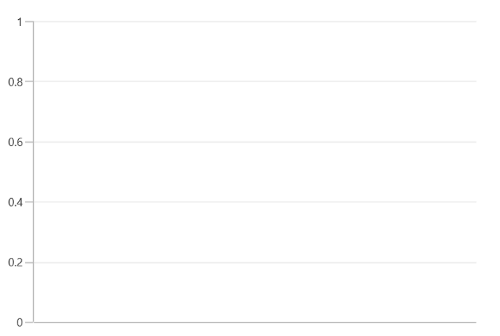
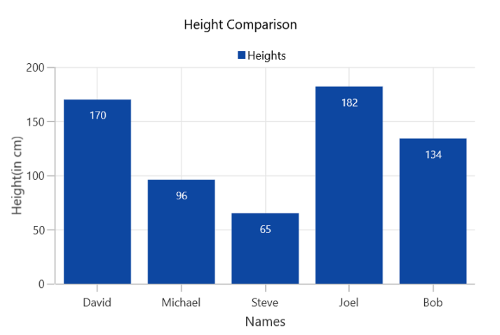

# Getting Started with WinUI Chart (SfCartesianChart)

This section explains how to populate the Cartesian chart with data, a header, data labels, a legend and tooltips, as well as the essential aspects for getting started with the chart.

## Creating an application with WinUI Chart

1. Create a [WinUI 3 desktop app for C# and .NET 5](https://docs.microsoft.com/en-us/windows/apps/winui/winui3/get-started-winui3-for-desktop) or [WinUI 3 app in UWP for C#](https://docs.microsoft.com/en-us/windows/apps/winui/winui3/get-started-winui3-for-uwp).
2. Add reference to [Syncfusion.Chart.WinUI](https://www.nuget.org/packages/Syncfusion.Chart.WinUI/) NuGet. 
3. To initialize the control, import the control namespace `Syncfusion.UI.Xaml.Charts` in XAML or C#.
4. Initialize [SfCartesianChart](https://help.syncfusion.com/cr/winui/Syncfusion.UI.Xaml.Charts.SfCartesianChart.html) control.

 



<Window
    . . .
    
    xmlns:chart="using:Syncfusion.UI.Xaml.Charts">
    
    <Grid>
        <chart:SfCartesianChart/>
    </Grid>
</Window>
 




using Syncfusion.UI.Xaml.Charts;

namespace SfChart_GettingStarted
{
    public sealed partial class MainPage : Window
    {
        public MainPage()
        {
            InitializeComponent();
            
            SfCartesianChart chart = new SfCartesianChart();      
            Root_Chart.Children.Add(chart);
        }
    }   
}





## Initialize View Model

Now, let us define a simple data model that represents a data point in chart.

  



public class Person   
{   
    public string Name { get; set; }

    public double Height { get; set; }
}

 

 

Next, create a view model class and initialize a list of `Person` objects as follows.

  



public class ViewModel  
{
    var date = new DateTime(2021, 06, 01);

    Data = new List<Person>()
    {
        new Person { Name = "David", Height = 170 },
        new Person { Name = "Michael", Height = 96 },
        new Person { Name = "Steve", Height = 65 },
        new Person { Name = "Joel", Height = 182 },
        new Person { Name = "Bob", Height = 134 }
    };
}

 

 

Set the `ViewModel` instance as the `DataContext` of your window; this is done to bind properties of `ViewModel` to  the chart.
 
N> Add namespace of `ViewModel` class to your XAML Page if you prefer to set `DataContext` in XAML.

 

 

<Window
    x:Class="SfChart_GettingStarted.MainPage"
    xmlns="http://schemas.microsoft.com/winfx/2006/xaml/presentation"
    xmlns:x="http://schemas.microsoft.com/winfx/2006/xaml"
    xmlns:model="using:SfChart_GettingStarted"
    xmlns:d="http://schemas.microsoft.com/expression/blend/2008"
    xmlns:chart="using:Syncfusion.UI.Xaml.Charts"
    xmlns:mc="http://schemas.openxmlformats.org/markup-compatibility/2006"
    mc:Ignorable="d" Height="350" Width="525"
    Background="{ThemeResource ApplicationPageBackgroundThemeBrush}">

    <Window.DataContext>
        <model:ViewModel></local:ViewModel>
    </Window.DataContext>
</Window>



 

this.DataContext = new ViewModel();



 

## Initialize Chart Axis

[ChartAxis](https://help.syncfusion.com/cr/winui/Syncfusion.UI.Xaml.Charts.ChartAxis.html) is used to locate the data points inside the chart area. The [PrimaryAxis](https://help.syncfusion.com/cr/winui/Syncfusion.UI.Xaml.Charts.SfCartesianChart.html#Syncfusion_UI_Xaml_Charts_SfCartesianChart_PrimaryAxis) and [SecondaryAxis](https://help.syncfusion.com/cr/winui/Syncfusion.UI.Xaml.Charts.SfCartesianChart.html#Syncfusion_UI_Xaml_Charts_SfCartesianChart_SecondaryAxis) properties of the chart is used to initialize the axis for the chart.

 

 

<chart:SfCartesianChart>

    <chart:SfCartesianChart.PrimaryAxis>
        <chart:CategoryAxis/>
    </chart:SfCartesianChart.PrimaryAxis>

    <chart:SfCartesianChart.SecondaryAxis>
        <chart:NumericalAxis/>
    </chart:SfCartesianChart.SecondaryAxis>
    
</chart:SfCartesianChart>



 

SfCartesianChart chart = new SfCartesianChart();
CategoryAxis primaryAxis = new CategoryAxis();
chart.PrimaryAxis = primaryAxis;
NumericalAxis secondaryAxis = new NumericalAxis();
chart.SecondaryAxis = secondaryAxis;



 

Run the project and check if you get following output to make sure you have configured your project properly to add chart.

## Populate Chart with Data

As we are going to visualize the comparison of heights in the data model, add [ColumnSeries](https://help.syncfusion.com/cr/winui/Syncfusion.UI.Xaml.Charts.ColumnSeries.html) to [Series](https://help.syncfusion.com/cr/winui/Syncfusion.UI.Xaml.Charts.SfCartesianChart.html#Syncfusion_UI_Xaml_Charts_SfCartesianChart_Series) property of chart, and then bind the `Data` property of the above `ViewModel` to the `ColumnSeries.ItemsSource` as follows.

N> You need to set [XBindingPath](https://help.syncfusion.com/cr/winui/Syncfusion.UI.Xaml.Charts.ChartSeriesBase.html#Syncfusion_UI_Xaml_Charts_ChartSeriesBase_XBindingPath) and [YBindingPath](https://help.syncfusion.com/cr/winui/Syncfusion.UI.Xaml.Charts.XyDataSeries.html?tabs=tabid-1#Syncfusion_UI_Xaml_Charts_XyDataSeries_YBindingPath) properties, so that chart would fetch values from the respective properties in the data model to plot the series.

   



<chart:SfCartesianChart>
    <chart:SfCartesianChart.PrimaryAxis>
        <chart:CategoryAxis Header="Name"/>
    </chart:SfCartesianChart.PrimaryAxis>
    <chart:SfCartesianChart.SecondaryAxis>
        <chart:NumericalAxis Header="Height(in cm)"/>
    </chart:SfCartesianChart.SecondaryAxis>
    <chart:ColumnSeries ItemsSource="{Binding Data}"
                        XBindingPath="Name" 
                        YBindingPath="Height">
    </chart:ColumnSeries>
</chart:SfCartesianChart>





SfCartesianChart chart = new SfCartesianChart();

//Adding horizontal axis to the chart 
CategoryAxis primaryAxis = new CategoryAxis();
primaryAxis.Header = "Name";   
chart.PrimaryAxis = primaryAxis;

//Adding vertical axis to the chart 
NumericalAxis secondaryAxis = new NumericalAxis();
secondaryAxis.Header = "Height(in cm)";  
chart.SecondaryAxis = secondaryAxis;

//Initialize the two series for SfChart
ColumnSeries series = new ColumnSeries();

series.ItemsSource = (new ViewModel()).Data;
series.XBindingPath = "Name";            
series.YBindingPath = "Height";         
            
//Adding Series to the Chart Series Collection
chart.Series.Add(series);



 

## Add Title

The title of the chart provide quick information to the user about the data being plotted in the chart. The [Header](https://help.syncfusion.com/cr/winui/Syncfusion.UI.Xaml.Charts.ChartBase.html#Syncfusion_UI_Xaml_Charts_ChartBase_Header) property is used to set title for the chart as follows.

 



<Grid>
   <chart:SfCartesianChart Header="Height Comparison"> 
   </chart:SfCartesianChart>
</Grid>





SfCartesianChart chart = new SfCartesianChart();
chart.Header = "Height Comparison";



  

## Enable Data Labels

The [ShowDataLabels](https://help.syncfusion.com/cr/winui/Syncfusion.UI.Xaml.Charts.DataMarkerSeries.html#Syncfusion_UI_Xaml_Charts_DataMarkerSeries_ShowDataLabels) property of series can be used to enable the data labels to improve the readability of the chart. The label visibility is set to `False` by default.

 



<chart:SfCartesianChart>
    . . . 
    <chart:ColumnSeries ShowDataLabels="True">
    </chart:ColumnSeries>

</chart:SfCartesianChart>





SfCartesianChart chart = new SfCartesianChart();
. . .
ColumnSeries series = new ColumnSeries();
series.ShowDataLabels = true;
chart.Series.Add(series);



  

## Enable Legend

The legend provides information about the data point displayed in the chart. The [Legend](https://help.syncfusion.com/cr/winui/Syncfusion.UI.Xaml.Charts.ChartBase.html#Syncfusion_UI_Xaml_Charts_ChartBase_Legend) property of the chart was used to enable it.

 



<chart:SfCartesianChart >
    . . .
    <chart:SfCartesianChart.Legend>
        <chart:ChartLegend/>
    </chart:SfCartesianChart.Legend>
    . . .
</chart:SfCartesianChart>





SfCartesianChart chart = new SfCartesianChart();
chart.Legend = new ChartLegend (); 



  

N> Additionally, set label for each series using the [Label](https://help.syncfusion.com/cr/winui/Syncfusion.UI.Xaml.Charts.ChartSeriesBase.html#Syncfusion_UI_Xaml_Charts_ChartSeriesBase_Label) property of chart series, which will be displayed in corresponding legend.

 



<chart:SfCartesianChart>
. . .
    <chart:ColumnSeries Label="Heights"
                        ItemsSource="{Binding Data}"
                        XBindingPath="Name" 
                        YBindingPath="Height">
    </chart:ColumnSeries>
</chart:SfCartesianChart>





ColumnSeries series = new ColumnSeries (); 
series.ItemsSource = (new ViewModel()).Data;
series.XBindingPath = "Name"; 
series.YBindingPath = "Height"; 
series.Label = "Heights";



  

## Enable Tooltip

Tooltips are used to show information about the segment, when hovers on the segment. Enable tooltip by setting series [ShowTooltip](https://help.syncfusion.com/cr/winui/Syncfusion.UI.Xaml.Charts.ChartSeriesBase.html#Syncfusion_UI_Xaml_Charts_ChartSeriesBase_ShowTooltip) property to true.

 



<chart:SfCartesianChart>
	...
   <chart:ColumnSeries ShowTooltip="True" ItemsSource="{Binding Data}" XBindingPath="Name" YBindingPath="Height"/>
	...
</chart:SfCartesianChart> 





ColumnSeries series = new ColumnSeries();
series.ItemsSource = (new ViewModel()).Data;
series.XBindingPath = "Name";          
series.YBindingPath = "Height";
series.ShowTooltip = true;





The following code example gives you the complete code of above configurations.

 



<Window
    x:Class="SfChart_GettingStarted.MainPage"
    xmlns="http://schemas.microsoft.com/winfx/2006/xaml/presentation"
    xmlns:x="http://schemas.microsoft.com/winfx/2006/xaml"
    xmlns:d="http://schemas.microsoft.com/expression/blend/2008"
    xmlns:chart="using:Syncfusion.UI.Xaml.Charts"
    xmlns:mc="http://schemas.openxmlformats.org/markup-compatibility/2006"
    mc:Ignorable="d" Height="350" Width="525"
    Background="{ThemeResource ApplicationPageBackgroundThemeBrush}">

    <chart:SfCartesianChart Header="Height Comparison">
        <chart:SfCartesianChart.Legend>
            <chart:ChartLegend/>
        </chart:SfCartesianChart.Legend>
        <chart:SfCartesianChart.DataContext>
            <Model:ChartViewModel/>
        </chart:SfCartesianChart.DataContext>
        
        <!--Initialize the horizontal axis for SfChart-->
        <chart:SfCartesianChart.PrimaryAxis>
            <chart:CategoryAxis Header="Names"/>
        </chart:SfCartesianChart.PrimaryAxis>
        <chart:SfCartesianChart.SecondaryAxis>
            <chart:NumericalAxis Header="Height(in cm)"/>
        </chart:SfCartesianChart.SecondaryAxis>

        <!--Initialize the series for SfChart-->
        <chart:ColumnSeries Label="Heights" ShowTooltip="True"
                                ShowDataLabels="True"
                                ItemsSource="{Binding Data}"
                                XBindingPath="Name" 
                                YBindingPath="Height">
            <chart:ColumnSeries.DataLabelSettings>
                <chart:CartesianDataLabelSettings Position="Inner"/>
            </chart:ColumnSeries.DataLabelSettings>
        </chart:ColumnSeries>
    </chart:SfCartesianChart>
</Window>
 




using Syncfusion.UI.Xaml.Charts;

namespace SfChart_GettingStarted
{
    public sealed partial class MainPage : Window
    {
        public MainPage()
        {
            InitializeComponent();
            
            SfCartesianChart chart = new SfCartesianChart() { Header = "Height Comparison", Height = 300, Width = 500 };

            //Adding horizontal axis to the Cartesian chart 
            CategoryAxis primaryAxis = new CategoryAxis();
            primaryAxis.Header = "Name";
            primaryAxis.FontSize = 14;
            chart.PrimaryAxis = primaryAxis;

            //Adding vertical axis to the Cartesian chart 
            NumericalAxis secondaryAxis = new NumericalAxis();
            secondaryAxis.Header = "Height(in cm)";
            secondaryAxis.FontSize = 14;
            chart.SecondaryAxis = secondaryAxis;

            //Adding Legends for the Cartesian chart
            ChartLegend legend = new ChartLegend();
            chart.Legend = legend;

            //Initializing column series
            ColumnSeries series = new ColumnSeries();
            series.ItemsSource = (new ViewModel()).Data;
            series.XBindingPath = "Name";            
            series.YBindingPath = "Height";
            series.ShowTooltip = true;
            series.Label = "Heights"; 
            series.ShowDataLabels = true;
            series.DataLabelSettings = new CartesianDataLabelSettings()
            {
                Position = DataLabelPosition.Inner,
            };

            //Adding Series to the Cartesian chart Series Collection
            chart.Series.Add(series);
            this.Content = chart;
        }
    }   
}





The following chart is created as a result of the previous codes.

N> Download demo application from [GitHub](https://github.com/SyncfusionExamples/GettingStartedChartWinUI/tree/main/CartesianChartGettingStarted)
