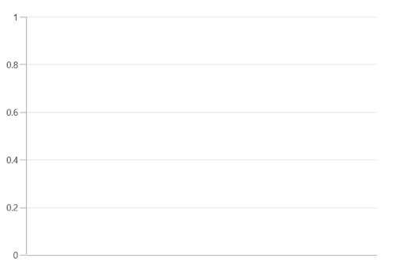
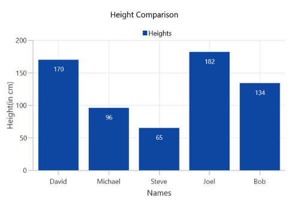

# Getting Started with WinUI Cartesian Chart (SfCartesianChart)

This section explains how to populate the Cartesian chart with data, a header, data labels, a legend and tooltips, as well as the essential aspects for getting started with the chart.

## Creating an application with WinUI Chart

1. Create a [WinUI 3 desktop app for C# and .NET 5](https://learn.microsoft.com/en-us/windows/apps/winui/winui3/create-your-first-winui3-app).
2. Add reference to [Syncfusion.Chart.WinUI](https://www.nuget.org/packages/Syncfusion.Chart.WinUI/) NuGet. 
3. To initialize the control, import the control namespace `Syncfusion.UI.Xaml.Charts` in XAML or C#.
4. Initialize [SfCartesianChart](https://help.syncfusion.com/cr/winui/Syncfusion.UI.Xaml.Charts.SfCartesianChart.html?) control.


 



<!-- Existing XAML attributes (e.g., x:Class, xmlns, mc:Ignorable) omitted for brevity -->
<Window
    xmlns:chart="using:Syncfusion.UI.Xaml.Charts">
    
    <Grid x:Name="grid">
        <chart:SfCartesianChart/>
    </Grid>
</Window>
 




using Syncfusion.UI.Xaml.Charts;

namespace SfChart_GettingStarted
{
    public sealed partial class MainWindow : Window
    {
        public MainWindow()
        {
            InitializeComponent();
            SfCartesianChart chart = new SfCartesianChart();      
            grid.Children.Add(chart);
        }
    }   
}





{{ codesnippet1 | OrderList_Indent_Level_1 }}

## Initialize View Model

Define a simple data model that represents a data point in chart.

  



public class Person   
{   
    public string Name { get; set; }
    public double Height { get; set; }
}

 

 

Next, create a view model class and initialize a list of `Person` objects as follows.

  



public class ViewModel
{
    public List<Person> Data { get; set; }
    public ViewModel()
    {
        Data = new List<Person>()
        {
            new Person { Name = "David", Height = 170 },
            new Person { Name = "Michael", Height = 96 },
            new Person { Name = "Steve", Height = 65 },
            new Person { Name = "Joel", Height = 182 },
            new Person { Name = "Bob", Height = 134 }
        };
    }
}

 

 

Set the `ViewModel` instance as the `DataContext` of the chart to bind its properties.
 
N> Add namespace of `ViewModel` class to your XAML Page if you prefer to set `DataContext` in XAML.

 

 

<Window
    x:Class="SfChart_GettingStarted.MainWindow"
    xmlns="http://schemas.microsoft.com/winfx/2006/xaml/presentation"
    xmlns:x="http://schemas.microsoft.com/winfx/2006/xaml"
    xmlns:model="using:SfChart_GettingStarted"
    xmlns:d="http://schemas.microsoft.com/expression/blend/2008"
    xmlns:chart="using:Syncfusion.UI.Xaml.Charts"
    xmlns:mc="http://schemas.openxmlformats.org/markup-compatibility/2006"
    mc:Ignorable="d" Height="350" Width="525"
    Background="{ThemeResource ApplicationPageBackgroundThemeBrush}">

    <Grid x:Name="grid">
	    <Grid.DataContext>
	        <model:ViewModel/>
	    </Grid.DataContext>
    </Grid>	
</Window>



 

grid.DataContext = new ViewModel();



 

## Initialize Chart Axis

[ChartAxis](https://help.syncfusion.com/cr/winui/Syncfusion.UI.Xaml.Charts.ChartAxis.html?) is used to locate the data points inside the chart area. The [XAxes](https://help.syncfusion.com/cr/winui/Syncfusion.UI.Xaml.Charts.SfCartesianChart.html#Syncfusion_UI_Xaml_Charts_SfCartesianChart_XAxes) and [YAxes](https://help.syncfusion.com/cr/winui/Syncfusion.UI.Xaml.Charts.SfCartesianChart.html#Syncfusion_UI_Xaml_Charts_SfCartesianChart_YAxes) collection of the chart is used to initialize the axis for the chart.

 

 

<chart:SfCartesianChart>
    <chart:SfCartesianChart.XAxes>
        <chart:CategoryAxis/>
    </chart:SfCartesianChart.XAxes>

    <chart:SfCartesianChart.YAxes>
        <chart:NumericalAxis/>
    </chart:SfCartesianChart.YAxes>
</chart:SfCartesianChart>



 

SfCartesianChart chart = new SfCartesianChart();

CategoryAxis xAxis = new CategoryAxis();
chart.XAxes.Add(xAxis);

NumericalAxis yAxis = new NumericalAxis();
chart.YAxes.Add(yAxis);



 

Run the project and check if you get the following output to make sure you have configured your project properly to add chart.

## Populate Chart with Data

As we are going to visualize the comparison of heights in the data model, add [ColumnSeries](https://help.syncfusion.com/cr/winui/Syncfusion.UI.Xaml.Charts.ColumnSeries.html?tabs=tabid-1%2Ctabid-8%2Ctabid-6%2Ctabid-28) to [Series](https://help.syncfusion.com/cr/winui/Syncfusion.UI.Xaml.Charts.SfCartesianChart.html#Syncfusion_UI_Xaml_Charts_SfCartesianChart_Series) property of chart, and then bind the `Data` property of the above `ViewModel` to the `ColumnSeries.ItemsSource` as follows.

N> You need to set [XBindingPath](https://help.syncfusion.com/cr/winui/Syncfusion.UI.Xaml.Charts.ChartSeries.html#Syncfusion_UI_Xaml_Charts_ChartSeries_XBindingPath) and [YBindingPath](https://help.syncfusion.com/cr/winui/Syncfusion.UI.Xaml.Charts.XyDataSeries.html#Syncfusion_UI_Xaml_Charts_XyDataSeries_YBindingPath) properties, so that the chart will fetch values from the respective properties in the data model to plot the series.

   



<chart:SfCartesianChart>
    <chart:SfCartesianChart.XAxes>
        <chart:CategoryAxis Header="Name"/>
    </chart:SfCartesianChart.XAxes>
    
    <chart:SfCartesianChart.YAxes>
        <chart:NumericalAxis Header="Height(in cm)"/>
    </chart:SfCartesianChart.YAxes>
    
    <chart:ColumnSeries 
        ItemsSource="{Binding Data}"
        XBindingPath="Name" 
        YBindingPath="Height">
    </chart:ColumnSeries>
</chart:SfCartesianChart>





SfCartesianChart chart = new SfCartesianChart();

//Adding horizontal axis to the chart 
CategoryAxis xAxis = new CategoryAxis();
xAxis.Header = "Name";
chart.XAxes.Add(xAxis);

//Adding vertical axis to the chart 
NumericalAxis yAxis = new NumericalAxis();
yAxis.Header = "Height(in cm)";
chart.YAxes.Add(yAxis);

//Initialize the series for SfChart
ColumnSeries series = new ColumnSeries();

series.ItemsSource = (new ViewModel()).Data;
series.XBindingPath = "Name";
series.YBindingPath = "Height";

//Adding Series to the Chart Series Collection
chart.Series.Add(series);



 

## Add Title

The title of the chart provides quick information to the user about the data being plotted in the chart. The [Header](https://help.syncfusion.com/cr/winui/Syncfusion.UI.Xaml.Charts.ChartBase.html?tabs=tabid-5%2Ctabid-7%2Ctabid-1%2Ctabid-3#Syncfusion_UI_Xaml_Charts_ChartBase_Header) property is used to set title for the chart as follows.

 



<Grid>
   <chart:SfCartesianChart Header="Height Comparison"> 
   </chart:SfCartesianChart>
</Grid>





SfCartesianChart chart = new SfCartesianChart();
chart.Header = "Height Comparison";



  

## Enable Data Labels

The [ShowDataLabels](https://help.syncfusion.com/cr/winui/Syncfusion.UI.Xaml.Charts.ChartSeries.html#Syncfusion_UI_Xaml_Charts_ChartSeries_ShowDataLabels) property of series can be used to enable the data labels to improve the readability of the chart. The label visibility is set to `False` by default.

 



<chart:SfCartesianChart>
    <!-- Existing chart configuration omitted for brevity -->
    <chart:ColumnSeries ShowDataLabels="True">
    </chart:ColumnSeries>
    <!-- Existing chart configuration omitted for brevity -->
</chart:SfCartesianChart>





SfCartesianChart chart = new SfCartesianChart();
// Previous chart configuration (axes, data binding, etc.) omitted for brevity
ColumnSeries series = new ColumnSeries();
series.ShowDataLabels = true;
chart.Series.Add(series);



  

## Enable Legend

The legend provides information about the data point displayed in the chart. The [Legend](https://help.syncfusion.com/cr/winui/Syncfusion.UI.Xaml.Charts.ChartBase.html?tabs=tabid-5%2Ctabid-7%2Ctabid-1%2Ctabid-3#Syncfusion_UI_Xaml_Charts_ChartBase_Legend) property of the chart was used to enable it.

 



<chart:SfCartesianChart>
    <!-- Existing chart configuration omitted for brevity -->
    <chart:SfCartesianChart.Legend>
        <chart:ChartLegend/>
    </chart:SfCartesianChart.Legend>
    <!-- Existing chart configuration omitted for brevity -->
</chart:SfCartesianChart>





SfCartesianChart chart = new SfCartesianChart();
chart.Legend = new ChartLegend(); 



  

N> Additionally, set a label for each series using the [Label](https://help.syncfusion.com/cr/winui/Syncfusion.UI.Xaml.Charts.ChartSeries.html#Syncfusion_UI_Xaml_Charts_ChartSeries_Label) property of chart series, which will be displayed in corresponding legend.

 



<chart:SfCartesianChart>
    <!-- Existing chart configuration omitted for brevity -->
    <chart:ColumnSeries
        Label="Heights"
        ItemsSource="{Binding Data}"
        XBindingPath="Name" 
        YBindingPath="Height">
    </chart:ColumnSeries>
    <!-- Existing chart configuration omitted for brevity -->
</chart:SfCartesianChart>





ColumnSeries series = new ColumnSeries(); 
series.ItemsSource = (new ViewModel()).Data;
series.XBindingPath = "Name"; 
series.YBindingPath = "Height"; 
series.Label = "Heights";



  

## Enable Tooltip

Tooltips are used to show information about the segment, when the user hovers over the segment. Enable tooltip by setting the series [EnableTooltip](https://help.syncfusion.com/cr/winui/Syncfusion.UI.Xaml.Charts.ChartSeries.html#Syncfusion_UI_Xaml_Charts_ChartSeries_EnableTooltip) property to true.

 



<chart:SfCartesianChart>
    <!-- Existing chart configuration omitted for brevity -->
    <chart:ColumnSeries 
        EnableTooltip="True" 
        ItemsSource="{Binding Data}" 
        XBindingPath="Name" 
        YBindingPath="Height"/>
    <!-- Existing chart configuration omitted for brevity -->
</chart:SfCartesianChart>





ColumnSeries series = new ColumnSeries();
series.ItemsSource = (new ViewModel()).Data;
series.XBindingPath = "Name";          
series.YBindingPath = "Height";
series.EnableTooltip = true;





## Full Example

The following code example gives you the complete code of above configurations.

 



<Window
    x:Class="SfChart_GettingStarted.MainWindow"
    xmlns="http://schemas.microsoft.com/winfx/2006/xaml/presentation"
    xmlns:x="http://schemas.microsoft.com/winfx/2006/xaml"
    xmlns:d="http://schemas.microsoft.com/expression/blend/2008"
    xmlns:chart="using:Syncfusion.UI.Xaml.Charts"
    xmlns:mc="http://schemas.openxmlformats.org/markup-compatibility/2006"
    mc:Ignorable="d" Height="350" Width="525"
    xmlns:model="using:SfChart_GettingStarted"
    Background="{ThemeResource ApplicationPageBackgroundThemeBrush}">

    <chart:SfCartesianChart Header="Height Comparison">
        <chart:SfCartesianChart.Legend>
            <chart:ChartLegend/>
        </chart:SfCartesianChart.Legend>

        <chart:SfCartesianChart.DataContext>
            <model:ViewModel/>
        </chart:SfCartesianChart.DataContext>

        <!--Initialize the axis for chart-->
        <chart:SfCartesianChart.XAxes>
            <chart:CategoryAxis Header="Names"/>
        </chart:SfCartesianChart.XAxes>

        <chart:SfCartesianChart.YAxes>
            <chart:NumericalAxis Header="Height(in cm)"/>
        </chart:SfCartesianChart.YAxes>

        <!--Initialize the series for chart-->
        <chart:ColumnSeries
            Label="Heights"
	        EnableTooltip="True"
            ShowDataLabels="True"
            ItemsSource="{Binding Data}"
            XBindingPath="Name" 
            YBindingPath="Height">
            <chart:ColumnSeries.DataLabelSettings>
                <chart:CartesianDataLabelSettings Position="Inner"/>
            </chart:ColumnSeries.DataLabelSettings>
        </chart:ColumnSeries>
    </chart:SfCartesianChart>
</Window>
 




using CartesianChart_CS;
using Microsoft.UI.Xaml;
using Syncfusion.UI.Xaml.Charts;

namespace SfChart_GettingStarted
{
    public sealed partial class MainWindow : Window
    {
        public MainWindow()
        {
            InitializeComponent();

            SfCartesianChart chart = new SfCartesianChart()
            {
                Header = "Height Comparison",
                Height = 300,
                Width = 500
            };

            //Adding horizontal axis to the chart 
            CategoryAxis xAxis = new CategoryAxis();
            xAxis.Header = "Name";
            xAxis.FontSize = 14;
            chart.XAxes.Add(xAxis);

            //Adding vertical axis to the chart 
            NumericalAxis yAxis = new NumericalAxis();
            yAxis.Header = "Height(in cm)";
            yAxis.FontSize = 14;
            chart.YAxes.Add(yAxis);

            //Adding legend for the chart
            ChartLegend legend = new ChartLegend();
            chart.Legend = legend;

            //Initializing column series
            ColumnSeries series = new ColumnSeries();
            series.ItemsSource = (new ViewModel()).Data;
            series.XBindingPath = "Name";
            series.YBindingPath = "Height";
            series.EnableTooltip = true;
            series.Label = "Heights";
            series.ShowDataLabels = true;
            series.DataLabelSettings = new CartesianDataLabelSettings()
            {
                Position = DataLabelPosition.Inner,
            };

            //Adding series to the chart series collection
            chart.Series.Add(series);
            this.Content = chart;
        }
    }
}





The following chart is created as a result of the previous codes.

N> Download demo application from [GitHub](https://github.com/SyncfusionExamples/GettingStartedChartWinUI/tree/main/CartesianChartGettingStarted). Looking for the full WinUI Charts component overview, features, pricing, and documentation? Visit the [WinUI Charts](https://www.syncfusion.com/winui-controls/cartesian-charts) page.
