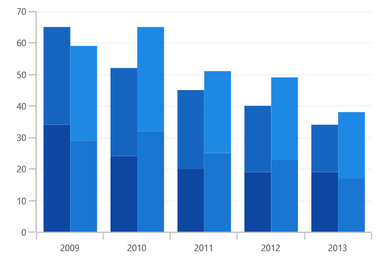

# Grouping Stacked in WinUI Cartesian Chart (SfCartesianChart)

You can group the stacked similar series using [`GroupName`]() property of stacked series. The stacked series which contains the same [`GroupName`]() will be stacked in a single group.

The following code example shows how to group the stacked series.





<chart:SfCartesianChart>
    ...
    <chart:StackedColumnSeries GroupName="Group1" XBindingPath="Year" 
            YBindingPath="Quarter1" ItemsSource="{Binding AnnualDetails}"/>

    <chart:StackedColumnSeries GroupName="Group1" XBindingPath="Year" 
            YBindingPath="Quarter2" ItemsSource="{Binding AnnualDetails}"/>

    <chart:StackedColumnSeries GroupName="Group2" XBindingPath="Year"
            YBindingPath="Quarter3" ItemsSource="{Binding AnnualDetails}"/>

    <chart:StackedColumnSeries GroupName="Group2" XBindingPath="Year"
            YBindingPath="Quarter4" ItemsSource="{Binding AnnualDetails}"/>

</chart:SfCartesianChart>





SfPolarChart chart = new SfPolarChart();
...

StackedColumnSeries series1 = new StackedColumnSeries()
{
    ItemsSource = new ViewModel().AnnualDetails,
    XBindingPath = "Year",
    YBindingPath = "Quarter1",
    GroupName = "Group1",
};

StackedColumnSeries series2 = new StackedColumnSeries()
{
    ItemsSource = new ViewModel().AnnualDetails,
    XBindingPath = "Year",
    YBindingPath = "Quarter2",
    GroupName = "Group1",
};

StackedColumnSeries series3 = new StackedColumnSeries()
{
    ItemsSource = new ViewModel().AnnualDetails,
    XBindingPath = "Year",
    YBindingPath = "Quarter3",
    GroupName = "Group2",
};

StackedColumnSeries series4 = new StackedColumnSeries()
{
    ItemsSource = new ViewModel().AnnualDetails,
    XBindingPath = "Year",
    YBindingPath = "Quarter4",
    GroupName = "Group2",
};

chart.Series.Add(series1);
chart.Series.Add(series2);
chart.Series.Add(series3);
chart.Series.Add(series4);
...





