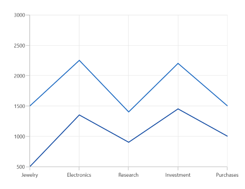
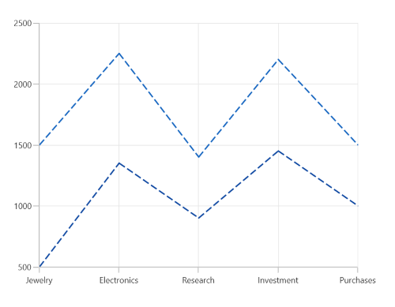
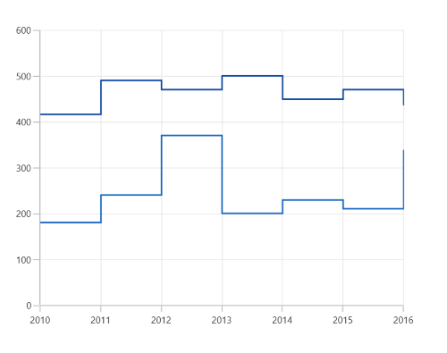
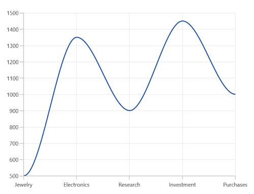

# Line Chart in WinUI Chart (SfCartesianChart)

## Line Chart

Line chart is used to represent the data trends at equal intervals by connecting points on a plot with straight lines. To render a line chart, create an instance of [LineSeries](https://help.syncfusion.com/cr/winui/Syncfusion.UI.Xaml.Charts.LineSeries.html), and add it to the [Series](https://help.syncfusion.com/cr/winui/Syncfusion.UI.Xaml.Charts.SfCartesianChart.html#Syncfusion_UI_Xaml_Charts_SfCartesianChart_Series) collection property of [SfCartesianChart](https://help.syncfusion.com/cr/winui/Syncfusion.UI.Xaml.Charts.SfCartesianChart.html).





<chart:SfCartesianChart>

    <chart:SfCartesianChart.PrimaryAxis>
        <chart:CategoryAxis />
    </chart:SfCartesianChart.PrimaryAxis>

    <chart:SfCartesianChart.SecondaryAxis>
        <chart:NumericalAxis />
    </chart:SfCartesianChart.SecondaryAxis>  

    <chart:SfCartesianChart.Series>
        <chart:LineSeries XBindingPath="Demand" ItemsSource="{Binding Data}" YBindingPath="Year2010"/>
        <chart:LineSeries XBindingPath="Demand" ItemsSource="{Binding Data}" YBindingPath="Year2011"/>
    </chart:SfCartesianChart.Series>

</chart:SfCartesianChart>





SfCartesianChart chart = new SfCartesianChart();
CategoryAxis primaryAxis = new CategoryAxis();
chart.PrimaryAxis = primaryAxis;
NumericalAxis secondaryAxis = new NumericalAxis();
chart.SecondaryAxis = secondaryAxis;

LineSeries series1 = new LineSeries()
{
    ItemsSource = new ViewModel().Data,
    XBindingPath = "Demand",
    YBindingPath = "Year2010",
};

LineSeries series2 = new LineSeries()
{
    ItemsSource = new ViewModel().Data,
    XBindingPath = "Demand",
    YBindingPath = "Year2011",

};

chart.Series.Add(series1);
chart.Series.Add(series2);

this.Content = chart;





### Dashed line

The [StrokeDashArray](https://help.syncfusion.com/cr/winui/Syncfusion.UI.Xaml.Charts.LineSeries.html#Syncfusion_UI_Xaml_Charts_LineSeries_StrokeDashArray) property of [LineSeries](https://help.syncfusion.com/cr/winui/Syncfusion.UI.Xaml.Charts.LineSeries.html) is used to render the line series with dashes. Odd value is considered as rendering size and even value is considered as gap.





<chart:SfCartesianChart>

    <chart:SfCartesianChart.PrimaryAxis>
        <chart:CategoryAxis />
    </chart:SfCartesianChart.PrimaryAxis>

    <chart:SfCartesianChart.SecondaryAxis>
        <chart:NumericalAxis />
    </chart:SfCartesianChart.SecondaryAxis>  

    <chart:SfCartesianChart.Series>
        <chart:LineSeries XBindingPath="Demand" ItemsSource="{Binding Data}" YBindingPath="Year2010" StrokeDashArray="5,2"/>
        <chart:LineSeries XBindingPath="Demand" ItemsSource="{Binding Data}" YBindingPath="Year2011" StrokeDashArray="5,2"/>
    </chart:SfCartesianChart.Series>

</chart:SfCartesianChart>





SfCartesianChart chart = new SfCartesianChart();
CategoryAxis primaryAxis = new CategoryAxis();
chart.PrimaryAxis = primaryAxis;
NumericalAxis secondaryAxis = new NumericalAxis();
chart.SecondaryAxis = secondaryAxis;

DoubleCollection doubleCollection = new DoubleCollection();
doubleCollection.Add(5);
doubleCollection.Add(2);
. . .
LineSeries series1 = new LineSeries()
{
    ItemsSource = new ViewModel().Data,
    XBindingPath = "Demand",
    YBindingPath = "Year2010",
    StrokeDashArray = doubleCollection

};

LineSeries series2 = new LineSeries()
{
    ItemsSource = new ViewModel().Data,
    XBindingPath = "Demand",
    YBindingPath = "Year2011",
    StrokeDashArray = doubleCollection
};

chart.Series.Add(series1);
chart.Series.Add(series2);

this.Content = chart;





## Step Line Chart 

The [StepLineSeries](https://help.syncfusion.com/cr/winui/Syncfusion.UI.Xaml.Charts.StepLineSeries.html) plots horizontal and vertical lines to connect the data points resulting in a step-like progression.





<chart:SfCartesianChart>

    <chart:SfCartesianChart.PrimaryAxis>
        <chart:CategoryAxis />
    </chart:SfCartesianChart.PrimaryAxis>

    <chart:SfCartesianChart.SecondaryAxis>
        <chart:NumericalAxis />
    </chart:SfCartesianChart.SecondaryAxis>  

    <chart:SfCartesianChart.Series>
        <chart:StepLineSeries ItemsSource="{Binding Data}" XBindingPath="XValue" YBindingPath="YValue"/>
        <chart:StepLineSeries ItemsSource="{Binding Data}" XBindingPath="XValue" YBindingPath="YValue1"/>
    </chart:SfCartesianChart.Series>

</chart:SfCartesianChart>





SfCartesianChart chart = new SfCartesianChart();
CategoryAxis primaryAxis = new CategoryAxis();
chart.PrimaryAxis = primaryAxis;
NumericalAxis secondaryAxis = new NumericalAxis();
chart.SecondaryAxis = secondaryAxis;

StepLineSeries series1 = new StepLineSeries();
series1.ItemsSource = new ViewModel().Data;
series1.XBindingPath = "XValue";
series1.YBindingPath = "YValue";
chart.Series.Add(series);

StepLineSeries series2 = new StepLineSeries();
series2.ItemsSource = new ViewModel().Data;
series2.XBindingPath = "XValue";
series2.YBindingPath = "YValue1";
chart.Series.Add(series2);

this.Content = chart;





## Spline Chart 

The [SplineSeries](https://help.syncfusion.com/cr/winui/Syncfusion.UI.Xaml.Charts.SplineSeries.html) resembles line series, but instead of connecting the data points with line segments, the data points are connected by smooth bezier curves.





<chart:SfCartesianChart>

    <chart:SfCartesianChart.PrimaryAxis>
        <chart:CategoryAxis />
    </chart:SfCartesianChart.PrimaryAxis>

    <chart:SfCartesianChart.SecondaryAxis>
        <chart:NumericalAxis />
    </chart:SfCartesianChart.SecondaryAxis>  

    <chart:SfCartesianChart.Series>
        <chart:SplineSeries XBindingPath="Demand" ItemsSource="{Binding Data}" YBindingPath="Year2010"/>
        <chart:SplineSeries XBindingPath="Demand" ItemsSource="{Binding Data}" YBindingPath="Year2011"/>
    </chart:SfCartesianChart.Series>

</chart:SfCartesianChart>





SfCartesianChart chart = new SfCartesianChart();
CategoryAxis primaryAxis = new CategoryAxis();
chart.PrimaryAxis = primaryAxis;
NumericalAxis secondaryAxis = new NumericalAxis();
chart.SecondaryAxis = secondaryAxis;

SplineSeries series1 = new SplineSeries()
{
    ItemsSource = new ViewModel().Data,
    XBindingPath = "Demand",
    YBindingPath = "Year2010",
};

SplineSeries series2 = new SplineSeries()
{
    ItemsSource = new ViewModel().Data,
    XBindingPath = "Demand",
    YBindingPath = "Year2011",
};

chart.Series.Add(series1);
chart.Series.Add(series2);

this.Content = chart;





### Spline rendering types

The [SplineType](https://help.syncfusion.com/cr/winui/Syncfusion.UI.Xaml.Charts.SplineSeries.html#Syncfusion_UI_Xaml_Charts_SplineSeries_SplineType) allows you to change the spline curve in series. By default, the value of [SplineType](https://help.syncfusion.com/cr/winui/Syncfusion.UI.Xaml.Charts.SplineSeries.html#Syncfusion_UI_Xaml_Charts_SplineSeries_SplineType) is `Natural`.

The following types are used in SplineSeries:

* `Natural`
* `Monotonic`
* `Cardinal`
* `Clamped`





<chart:SfCartesianChart>

    <chart:SfCartesianChart.PrimaryAxis>
        <chart:CategoryAxis />
    </chart:SfCartesianChart.PrimaryAxis>

    <chart:SfCartesianChart.SecondaryAxis>
        <chart:NumericalAxis />
    </chart:SfCartesianChart.SecondaryAxis>  

    <chart:SfCartesianChart.Series>
        <chart:SplineSeries XBindingPath="Demand" ItemsSource="{Binding Data}" YBindingPath="Year2010" SplineType="Cardinal"/>
    </chart:SfCartesianChart.Series>

</chart:SfCartesianChart>





SfCartesianChart chart = new SfCartesianChart();
CategoryAxis primaryAxis = new CategoryAxis();
chart.PrimaryAxis = primaryAxis;
NumericalAxis secondaryAxis = new NumericalAxis();
chart.SecondaryAxis = secondaryAxis;

SplineSeries series = new SplineSeries()
{
    ItemsSource = new ViewModel().Data,
    XBindingPath = "Demand",
    YBindingPath = "Year2010",
    SplineType = SplineType.Cardinal
};

chart.Series.Add(series);

this.Content = chart;





