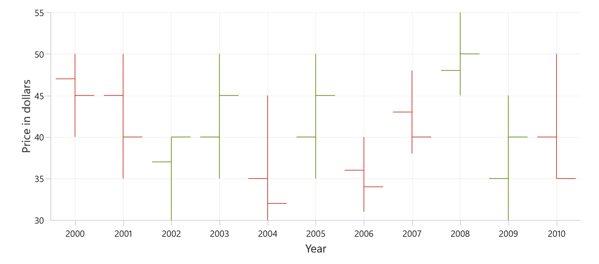
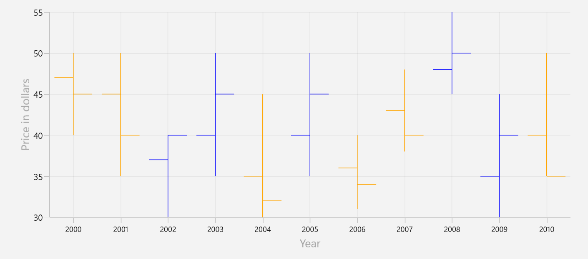
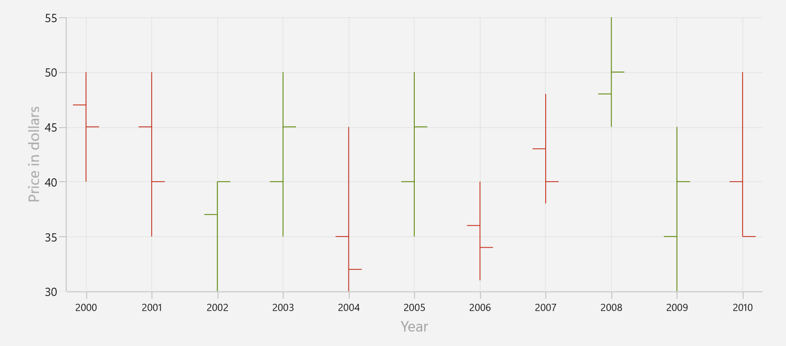

# OHLC Chart in WinUI Chart

OHLC (Open-High-Low-Close) charts are the type of financial charts used to represent the price movement of an asset over a specific period. OHLC charts consist of four data points: the opening price, the high price, the low price, and the closing price for each period. To render an OHLC chart, create an instance of [HiLoOpenCloseSeries](https://help.syncfusion.com/cr/winui/Syncfusion.UI.Xaml.Charts.HiLoOpenCloseSeries.html), and add it to the [Series](https://help.syncfusion.com/cr/winui/Syncfusion.UI.Xaml.Charts.ChartSeries.html) collection property of [SfCartesianChart](https://help.syncfusion.com/cr/winui/Syncfusion.UI.Xaml.Charts.SfCartesianChart.html).

To plot a point on a candlestick chart, a collection of five values is required, including the X-value, open value, high value, low value, and close value. You can use the below collection




ObservableCollection<Model> StockData = new ObservableCollection<Model>();
StockData.Add(new Model { Year = "2000", High = 50, Low = 40, Open = 47, Close = 45 });
StockData.Add(new Model { Year = "2001", High = 50, Low = 35, Open = 45, Close = 40 });
StockData.Add(new Model { Year = "2002", High = 40, Low = 30, Open = 37, Close = 40 });
StockData.Add(new Model { Year = "2003", High = 50, Low = 35, Open = 40, Close = 45 });
StockData.Add(new Model { Year = "2004", High = 45, Low = 30, Open = 35, Close = 32 });
StockData.Add(new Model { Year = "2005", High = 50, Low = 35, Open = 40, Close = 45 });
StockData.Add(new Model { Year = "2006", High = 40, Low = 31, Open = 36, Close = 34 });
StockData.Add(new Model { Year = "2007", High = 48, Low = 38, Open = 43, Close = 40 });
StockData.Add(new Model { Year = "2008", High = 55, Low = 45, Open = 48, Close = 50 });
StockData.Add(new Model { Year = "2009", High = 45, Low = 30, Open = 35, Close = 40 });
StockData.Add(new Model { Year = "2010", High = 50, Low = 40, Open = 40, Close = 35 });




Set ItemsSource to your data collection and map XBindingPath and Open/High/Low/Close.





<chart:SfCartesianChart>

    <chart:SfCartesianChart.XAxes>
        <chart:CategoryAxis/>
    </chart:SfCartesianChart.XAxes>

    <chart:SfCartesianChart.YAxes>
        <chart:NumericalAxis/>
    </chart:SfCartesianChart.YAxes> 

    <chart:HiLoOpenCloseSeries  ItemsSource="{Binding StockData}"
                                XBindingPath="Year"
                                Open="Open"
                                High="High"
                                Low="Low"
                                Close="Close"/>
</chart:SfCartesianChart>





SfCartesianChart chart = new SfCartesianChart();

CategoryAxis primaryAxis = new CategoryAxis();
chart.XAxes.Add(primaryAxis);

NumericalAxis secondaryAxis = new NumericalAxis();
chart.YAxes.Add(secondaryAxis);

var series = new HiLoOpenCloseSeries()
{
    ItemsSource = new ViewModel().StockData,
    XBindingPath = "Year",
    Open = "Open",
    High = "High",
    Low = "Low",
    Close = "Close",
};

chart.Series.Add(series);
this.Content = chart;





## Bull and Bear Color

Use [BullishBrush](https://help.syncfusion.com/cr/winui/Syncfusion.UI.Xaml.Charts.FinancialSeriesBase.html#Syncfusion_UI_Xaml_Charts_FinancialSeriesBase_BullishBrush) to set the brush for OHLC segments where the close is equal to or higher than the open (bullish/increasing periods), and [BearishBrush](https://help.syncfusion.com/cr/winui/Syncfusion.UI.Xaml.Charts.FinancialSeriesBase.html#Syncfusion_UI_Xaml_Charts_FinancialSeriesBase_BearishBrush) for segments where the close is lower than the open (bearish/decreasing periods). If not specified, the series falls back to its default brush.





<chart:SfCartesianChart>

    <chart:SfCartesianChart.XAxes>
        <chart:CategoryAxis/>
    </chart:SfCartesianChart.XAxes>

    <chart:SfCartesianChart.YAxes>
        <chart:NumericalAxis/>
    </chart:SfCartesianChart.YAxes> 

    <chart:HiLoOpenCloseSeries  ItemsSource="{Binding StockData}"
                                XBindingPath="Year"
                                Open="Open"
                                High="High"
                                Low="Low"
                                Close="Close"
                                BullishBrush="Blue"
                                BearishBrush="Orange"/>
</chart:SfCartesianChart>





SfCartesianChart chart = new SfCartesianChart();

CategoryAxis primaryAxis = new CategoryAxis();
chart.XAxes.Add(primaryAxis);

NumericalAxis secondaryAxis = new NumericalAxis();
chart.YAxes.Add(secondaryAxis);

var series = new HiLoOpenCloseSeries()
{
    ItemsSource = new ViewModel().StockData,
    XBindingPath = "Year",
    Open = "Open",
    High = "High",
    Low = "Low",
    Close = "Close",
    BullishBrush = new SolidColorBrush(Colors.Blue),
    BearishBrush = new SolidColorBrush(Colors.Orange),
};

chart.Series.Add(series);
this.Content = chart;




## Segment Width

The [SegmentWidth](https://help.syncfusion.com/cr/winui/Syncfusion.UI.Xaml.Charts.FinancialSeriesBase.html#Syncfusion_UI_Xaml_Charts_FinancialSeriesBase_SegmentWidth) property sets the width of each data point (segment) in the series. It accepts values between 0 and 1, the default is 0.8. A value of 1.0 makes the segment occupy the full category width, while smaller values make the segment narrower.





<chart:SfCartesianChart>

    <chart:SfCartesianChart.XAxes>
        <chart:CategoryAxis/>
    </chart:SfCartesianChart.XAxes>

    <chart:SfCartesianChart.YAxes>
        <chart:NumericalAxis/>
    </chart:SfCartesianChart.YAxes> 

    <chart:HiLoOpenCloseSeries  ItemsSource="{Binding StockData}"
                                XBindingPath="Year"
                                Open="Open"
                                High="High"
                                Low="Low"
                                Close="Close"
                                SegmentWidth="0.4"/>
</chart:SfCartesianChart>





SfCartesianChart chart = new SfCartesianChart();

CategoryAxis primaryAxis = new CategoryAxis();
chart.XAxes.Add(primaryAxis);

NumericalAxis secondaryAxis = new NumericalAxis();
chart.YAxes.Add(secondaryAxis);

var series = new HiLoOpenCloseSeries()
{
    ItemsSource = new ViewModel().StockData,
    XBindingPath = "Year",
    Open = "Open",
    High = "High",
    Low = "Low",
    Close = "Close",
    SegmentWidth = 0.4
};

chart.Series.Add(series);
this.Content = chart;




