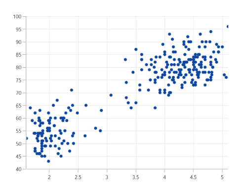

# Scatter Chart in WinUI Charts (SfCartesianChart)

The scatter chart is similar to bubble chart, where each data point being represented by a circle with equal size.

## Scatter Chart

To render a scatter chart, create an instance of [ScatterSeries](), and add it to the [Series]() collection property of [SfCartesianChart](). The segment size can be defined by using the [ScatterHeight]() and [ScatterWidth]() properties.





<chart:SfCartesianChart>

    <chart:SfCartesianChart.PrimaryAxis>
        <chart:NumericalAxis />
    </chart:SfCartesianChart.PrimaryAxis>

    <chart:SfCartesianChart.SecondaryAxis>
        <chart:NumericalAxis />
    </chart:SfCartesianChart.SecondaryAxis>  
                
    <chart:SfCartesianChart.Series>
        <chart:ScatterSeries ScatterHeight="7" ScatterWidth="7" ItemsSource="{Binding Data}" XBindingPath="XValue" YBindingPath="YValue"/>
    </chart:SfCartesianChart.Series>

</chart:SfCartesianChart>





SfCartesianChart chart = new SfCartesianChart();
NumericalAxis primaryAxis = new NumericalAxis();
chart.PrimaryAxis = primaryAxis;
NumericalAxis secondaryAxis = new NumericalAxis();
chart.SecondaryAxis = secondaryAxis;

ScatterSeries series = new ScatterSeries()
{
    ItemsSource = new ViewModel().Data,
    XBindingPath = "XValue",
    YBindingPath = "YValue",
    ScatterHeight = 7,
    ScatterWidth = 7,
};

chart.Series.Add(series);
this.Content = chart;





