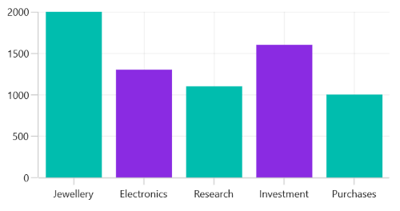

# Selection in WinUI Chart (SfCartesianChart)

Cartesian chart supports selection that allows to select a segment or series in the chart by using [SelectionBehavior](https://help.syncfusion.com/cr/winui/Syncfusion.UI.Xaml.Charts.SfCartesianChart.html#Syncfusion_UI_Xaml_Charts_SfCartesianChart_SelectionBehavior) property. 

## Properties

The Selection feature can be configured using the following properties:

* [Type](https://help.syncfusion.com/cr/winui/Syncfusion.UI.Xaml.Charts.ChartSelectionBehavior.html#Syncfusion_UI_Xaml_Charts_ChartSelectionBehavior_Type) - Gets or Sets the [ChartSelectionType](https://help.syncfusion.com/cr/winui/Syncfusion.UI.Xaml.Charts.ChartSelectionType.html) Enum value for the Selection Behavior.     
The following `ChartSelectionType` can be achieved during Selection:
    * Single - Allows to select a single segment or series.
    * SingleDeselect -  Allows to select and deselect a single segment or series.
    * Multiple - Allows to select multiple segments or series.
    * None - Restricts the segment or series selection.
* [SelectionBrush](https://help.syncfusion.com/cr/winui/Syncfusion.UI.Xaml.Charts.ChartSelectionBehavior.html#Syncfusion_UI_Xaml_Charts_ChartSelectionBehavior_SelectionBrush) - Gets or Sets  the SelectionBrush color value for Selection Behavior.
* [SelectedIndex](https://help.syncfusion.com/cr/winui/Syncfusion.UI.Xaml.Charts.ChartSelectionBehavior.html#Syncfusion_UI_Xaml_Charts_ChartSelectionBehavior_SelectedIndex) - Gets or Sets  the index value of the segment that should be selected during the Selection.
* [SelectedIndexes](https://help.syncfusion.com/cr/winui/Syncfusion.UI.Xaml.Charts.ChartSelectionBehavior.html#Syncfusion_UI_Xaml_Charts_ChartSelectionBehavior_SelectedIndexes) - Gets or Sets  the list of indexes of the segments that should be selected during the Selection.

## Enable DataPoint Selection

To enable the datapoint selection in chart, create an instance of [DataPointSelectionBehavior](https://help.syncfusion.com/cr/winui/Syncfusion.UI.Xaml.Charts.DataPointSelectionBehavior.html) and set it to the [SelectionBehavior](https://help.syncfusion.com/cr/winui/Syncfusion.UI.Xaml.Charts.ChartSeries.html#Syncfusion_UI_Xaml_Charts_ChartSeries_SelectionBehavior) property of chart series. And also need to set the [SelectionBrush](https://help.syncfusion.com/cr/winui/Syncfusion.UI.Xaml.Charts.ChartSelectionBehavior.html#Syncfusion_UI_Xaml_Charts_ChartSelectionBehavior_SelectionBrush) property to highlight the segment in the chart.





<chart:SfCartesianChart>
. . .
    
    <chart:ColumnSeries ItemsSource="{Binding Data}" 
                        XBindingPath="Demand"
                        YBindingPath="Year2010">
		<chart:ColumnSeries.SelectionBehavior>
		    <chart:DataPointSelectionBehavior SelectionBrush="Red"/>
		</chart:ColumnSeries.SelectionBehavior>
	</chart:ColumnSeries>				
</chart:SfCartesianChart>





SfCartesianChart chart = new SfCartesianChart();
. . .

ColumnSeries series = new ColumnSeries()
{
    ItemsSource = new ViewModel().Data,
    XBindingPath = "Demand",
    YBindingPath = "Year2010"
};

DataPointSelectionBehavior selection = new DataPointSelectionBehavior();
selection.SelectionBrush = new SolidColorBrush(Colors.Red);
series.SelectionBehavior = selection;

chart.Series.Add(series);
this.Content = chart;





## Segment Selection in Linear Series

In linear type series the segment selection can be viewed by changing the data label interior.

The following code example demonstrates the spline series segment selection by changing the data label interior.





<chart:SfCartesianChart>
. . .
    
    <chart:SplineSeries ItemsSource="{Binding Data}" 
                        XBindingPath="Demand"
                        YBindingPath="Year2010"
                        ShowDataLabels="True">
		<chart:SplineSeries.SelectionBehavior>
		    <chart:DataPointSelectionBehavior
						SelectionBrush="Red"/>
		</chart:SplineSeries.SelectionBehavior>
	</chart:SplineSeries>				
</chart:SfCartesianChart>





SfCartesianChart chart = new SfCartesianChart();
. . .

SplineSeries series = new SplineSeries()
{
    ItemsSource = new ViewModel().Data,
    XBindingPath = "Demand",
    YBindingPath = "Year2010"
    ShowDataLabels="True" 
};

DataPointSelectionBehavior selection = new DataPointSelectionBehavior();
selection.SelectionBrush = new SolidColorBrush(Colors.Red);
series.SelectionBehavior = selection;

chart.Series.Add(series);
this.Content = chart;





## Enable Series Selection

Series selection is used to highlight a particular series when using multiple series. Series selection is enabled by create an instance of [SeriesSelectionBehavior](https://help.syncfusion.com/cr/winui/Syncfusion.UI.Xaml.Charts.SeriesSelectionBehavior.html) and set it to the [SelectionBehavior](https://help.syncfusion.com/cr/winui/Syncfusion.UI.Xaml.Charts.SfCartesianChart.html#Syncfusion_UI_Xaml_Charts_SfCartesianChart_SelectionBehavior) property of [SfCartesianChart](https://help.syncfusion.com/cr/winui/Syncfusion.UI.Xaml.Charts.SfCartesianChart.html). The [SelectionBrush](https://help.syncfusion.com/cr/winui/Syncfusion.UI.Xaml.Charts.ChartSelectionBehavior.html#Syncfusion_UI_Xaml_Charts_ChartSelectionBehavior_SelectionBrush) property is used to set the brush color to highlight the series.





<chart:SfCartesianChart>
. . .
    <chart:SfCartesianChart.SelectionBehavior>
	    <chart:SeriesSelectionBehavior
					SelectionBrush="Red"/>
	</chart:SfCartesianChart.SelectionBehavior>	
. . .
</chart:SfCartesianChart>





SfCartesianChart chart = new SfCartesianChart();
. . .
SeriesSelectionBehavior selection = new SeriesSelectionBehavior();
selection.SelectionBrush = new SolidColorBrush(Colors.Red);
chart.SelectionBehavior = selection;
. . .
this.Content = chart;





## Multi-selection

Cartesian chart provides support to select single or multiple segments/series by using the [Type](https://help.syncfusion.com/cr/winui/Syncfusion.UI.Xaml.Charts.ChartSelectionBehavior.html#Syncfusion_UI_Xaml_Charts_ChartSelectionBehavior_Type) property. [Type](https://help.syncfusion.com/cr/winui/Syncfusion.UI.Xaml.Charts.ChartSelectionBehavior.html#Syncfusion_UI_Xaml_Charts_ChartSelectionBehavior_Type) property with [Multiple](https://help.syncfusion.com/cr/winui/Syncfusion.UI.Xaml.Charts.ChartSelectionType.html#Syncfusion_UI_Xaml_Charts_ChartSelectionType_Multiple) value is used to select multiple segments/series. By default, the [Type](https://help.syncfusion.com/cr/winui/Syncfusion.UI.Xaml.Charts.ChartSelectionBehavior.html#Syncfusion_UI_Xaml_Charts_ChartSelectionBehavior_Type) value is [Single](https://help.syncfusion.com/cr/winui/Syncfusion.UI.Xaml.Charts.ChartSelectionType.html#Syncfusion_UI_Xaml_Charts_ChartSelectionType_Single).





<chart:SfCartesianChart>
. . .
    
    <chart:SfCartesianChart.Series>
        <chart:ColumnSeries ItemsSource="{Binding Data}"  
                            XBindingPath="Demand"
                            YBindingPath="Year2010">
            <chart:ColumnSeries.SelectionBehavior>
                <chart:DataPointSelectionBehavior
							SelectionBrush="Red" 
						    Type="Multiple"/>
            </chart:ColumnSeries.SelectionBehavior>
        </chart:ColumnSeries>				
    </chart:SfCartesianChart.Series>

</chart:SfCartesianChart>





SfCartesianChart chart = new SfCartesianChart();
. . .

ColumnSeries series = new ColumnSeries()
{
    ItemsSource = new ViewModel().Data,
    XBindingPath = "Demand",
    YBindingPath = "Year2010"
};

DataPointSelectionBehavior selection = new DataPointSelectionBehavior();
selection.SelectionBrush = new SolidColorBrush(Colors.Red);
selection.Type = ChartSelectionType.Multiple;
series.SelectionBehavior = selection;

chart.Series.Add(series);
this.Content = chart;





The following code snippet demonstrates multiple series selection.





<chart:SfCartesianChart>
. . .
    <chart:SfCartesianChart.SelectionBehavior>
        <chart:SeriesSelectionBehavior SelectionBrush="Red"
                                       Type="Multiple"/>
    </chart:SfCartesianChart.SelectionBehavior>	
. . .
</chart:SfCartesianChart>





SfCartesianChart chart = new SfCartesianChart();
. . .
SeriesSelectionBehavior selection = new SeriesSelectionBehavior();
selection.SelectionBrush = new SolidColorBrush(Colors.Red);
selection.Type = ChartSelectionType.Multiple;
chart.SelectionBehavior = selection;
. . .
this.Content = chart;





## Selection on initial rendering

### SelectedIndex

Cartesian chart provides support to select a point programmatically on a chart using the [SelectedIndex](https://help.syncfusion.com/cr/winui/Syncfusion.UI.Xaml.Charts.ChartSelectionBehavior.html#Syncfusion_UI_Xaml_Charts_ChartSelectionBehavior_SelectedIndex) property of [DataPointSelectionBehavior](https://help.syncfusion.com/cr/winui/Syncfusion.UI.Xaml.Charts.DataPointSelectionBehavior.html).





<chart:SfCartesianChart>
. . .   
    <chart:SfCartesianChart.Series>
        <chart:ColumnSeries ItemsSource="{Binding Data}" 
                            XBindingPath="Demand"
                            YBindingPath="Year2010">
            <chart:ColumnSeries.SelectionBehavior>
                <chart:DataPointSelectionBehavior
							SelectedIndex="3" 
						    SelectionBrush="Red"/>
            </chart:ColumnSeries.SelectionBehavior>
        </chart:ColumnSeries>	
    </chart:SfCartesianChart.Series>

</chart:SfCartesianChart>





SfCartesianChart chart = new SfCartesianChart();
. . .

ColumnSeries series = new ColumnSeries()
{
    ItemsSource = new ViewModel().Data,
    XBindingPath = "Demand",
    YBindingPath = "Year2010"
};

DataPointSelectionBehavior selection = new DataPointSelectionBehavior();
selection.SelectionBrush = new SolidColorBrush(Colors.Red);
selection.SelectedIndex = 3;
series.SelectionBehavior = selection;

chart.Series.Add(series);
this.Content = chart;





Select a series programmatically on a chart using the [SelectedIndex](https://help.syncfusion.com/cr/winui/Syncfusion.UI.Xaml.Charts.ChartSelectionBehavior.html#Syncfusion_UI_Xaml_Charts_ChartSelectionBehavior_SelectedIndex) property of the [SeriesSelectionBehavior](https://help.syncfusion.com/cr/winui/Syncfusion.UI.Xaml.Charts.SeriesSelectionBehavior.html).





<chart:SfCartesianChart>
. . .
    <chart:SfCartesianChart.SelectionBehavior>
        <chart:SeriesSelectionBehavior
					SelectionBrush="Red" 
				    SelectedIndex="1"/>
    </chart:SfCartesianChart.SelectionBehavior>	
. . .
</chart:SfCartesianChart>





SfCartesianChart chart = new SfCartesianChart();
. . .
SeriesSelectionBehavior selection = new SeriesSelectionBehavior();
selection.SelectionBrush = new SolidColorBrush(Colors.Red);
selection.SelectedIndex = 1;
chart.SelectionBehavior = selection;
. . .
this.Content = chart;





### SelectedIndexes

Cartesian chart provides support to select multiple points programmatically on a chart using the [SelectedIndexes](https://help.syncfusion.com/cr/winui/Syncfusion.UI.Xaml.Charts.ChartSelectionBehavior.html#Syncfusion_UI_Xaml_Charts_ChartSelectionBehavior_SelectedIndexes) property of [DataPointSelectionBehavior](https://help.syncfusion.com/cr/winui/Syncfusion.UI.Xaml.Charts.DataPointSelectionBehavior.html).





<chart:SfCartesianChart>
. . .
    <chart:ColumnSeries ItemsSource="{Binding Data}" 
                        XBindingPath="Demand"
                        YBindingPath="Year2010">
            <chart:ColumnSeries.SelectionBehavior>
                <chart:DataPointSelectionBehavior
							SelectionBrush="BlueViolet" 
						    Type="Multiple" 
						    SelectedIndexes="{Binding SelectedIndexes}" />
            </chart:ColumnSeries.SelectionBehavior>
    </chart:ColumnSeries>
</chart:SfCircularChart>





SfCircularChart chart = new SfCircularChart();
. . .
ColumnSeries series = new ColumnSeries()
{
    ItemsSource = new ViewModel().Data,
    XBindingPath = "Demand",
    YBindingPath = "Year2010"
};

DataPointSelectionBehavior selection = new DataPointSelectionBehavior()
{
	SelectionBrush = new SolidColorBrush(Colors.BlueViolet),
    Type = ChartSelectionType.Multiple,
    SelectedIndexes = new List<int>() { 1, 3 }
};

series.SelectionBehavior = selection;
chart.Series.Add(series);





## Events

The following selection events are available in the [ChartSelectionBehavior](https://help.syncfusion.com/cr/winui/Syncfusion.UI.Xaml.Charts.ChartSelectionBehavior.html).

### SelectionChanging

The [SelectionChanging](https://help.syncfusion.com/cr/winui/Syncfusion.UI.Xaml.Charts.ChartSelectionBehavior.html#Syncfusion_UI_Xaml_Charts_ChartSelectionBehavior_SelectionChanging) event occurs before the data point or series is being selected. This is a cancelable event. The [ChartSelectionChangingEventArgs](https://help.syncfusion.com/cr/winui/Syncfusion.UI.Xaml.Charts.ChartSelectionChangingEventArgs.html) contains the following information.

* [NewIndexes](https://help.syncfusion.com/cr/winui/Syncfusion.UI.Xaml.Charts.ChartSelectionChangingEventArgs.html#Syncfusion_UI_Xaml_Charts_ChartSelectionChangingEventArgs_NewIndexes) - Gets the collection of selected data point or series index. Here, NewIndexes[0] is the current selected index.
* [OldIndexes](https://help.syncfusion.com/cr/winui/Syncfusion.UI.Xaml.Charts.ChartSelectionChangingEventArgs.html#Syncfusion_UI_Xaml_Charts_ChartSelectionChangingEventArgs_OldIndexes) - Gets the collection of previous selected data point or series index. Here, OldIndexes[0] is the current unselected index.
* [Cancel](https://docs.microsoft.com/en-us/dotnet/api/system.componentmodel.canceleventargs.cancel?view=net-6.0) - Gets or sets a value that indicates whether the selection should be canceled.

### SelectionChanged

The [SelectionChanged](https://help.syncfusion.com/cr/winui/Syncfusion.UI.Xaml.Charts.ChartSelectionBehavior.html#Syncfusion_UI_Xaml_Charts_ChartSelectionBehavior_SelectionChanged) event occurs after a data point or series has been selected. The [ChartSelectionChangedEventArgs](https://help.syncfusion.com/cr/winui/Syncfusion.UI.Xaml.Charts.ChartSelectionChangedEventArgs.html) contains the following information.

* [NewIndexes](https://help.syncfusion.com/cr/winui/Syncfusion.UI.Xaml.Charts.ChartSelectionChangedEventArgs.html#Syncfusion_UI_Xaml_Charts_ChartSelectionChangedEventArgs_NewIndexes) - Gets the collection of selected data point or series index. Here, NewIndexes[0] is the current selected index.
* [OldIndexes](https://help.syncfusion.com/cr/winui/Syncfusion.UI.Xaml.Charts.ChartSelectionChangedEventArgs.html#Syncfusion_UI_Xaml_Charts_ChartSelectionChangedEventArgs_OldIndexes) - Gets the collection of previous selected data point or series index. Here, OldIndexes[0] is the current unselected index.
