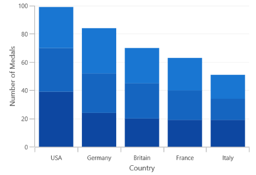
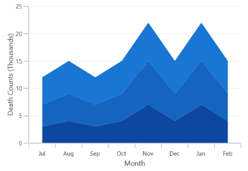

# Stacked Charts in WinUI Chart (SfCartesianChart)

## Stacked Column Chart

The [StackedColumnSeries](https://help.syncfusion.com/cr/winui/Syncfusion.UI.Xaml.Charts.StackedColumnSeries.html) resembles multiple of column series and each series is vertically stacked one above the other. When there is only one series, then it is [ColumnSeries](https://help.syncfusion.com/cr/winui/Syncfusion.UI.Xaml.Charts.ColumnSeries.html). 





<chart:SfCartesianChart>
    
    <chart:SfCartesianChart.PrimaryAxis>
        <chart:CategoryAxis LabelPlacement="BetweenTicks"/>
    </chart:SfCartesianChart.PrimaryAxis>

    <chart:SfCartesianChart.SecondaryAxis>
        <chart:NumericalAxis />
    </chart:SfCartesianChart.SecondaryAxis>  

    <chart:StackedColumnSeries XBindingPath="CountryName"    
            YBindingPath="GoldMedals" ItemsSource="{Binding MedalDetails}"/>

    <chart:StackedColumnSeries XBindingPath="CountryName" 
            YBindingPath="SilverMedals" ItemsSource="{Binding MedalDetails}"/> 

    <chart:StackedColumnSeries XBindingPath="CountryName" 
            YBindingPath="BronzeMedals" ItemsSource="{Binding MedalDetails}"/>
    ...
</chart:SfCartesianChart>




SfCartesianChart chart = new SfCartesianChart();
ViewModel viewModel = new ViewModel();
CategoryAxis primaryAxis = new CategoryAxis();
primaryAxis.LabelPlacement = LabelPlacement.BetweenTicks;
chart.PrimaryAxis = primaryAxis;
NumericalAxis secondaryAxis = new NumericalAxis();
chart.SecondaryAxis = secondaryAxis;

StackedColumnSeries series1 = new StackedColumnSeries()
{
    ItemsSource = viewModel.MedalDetails,
    XBindingPath = "CountryName",
    YBindingPath ="GoldMedals",
};

StackedColumnSeries series2 = new StackedColumnSeries()
{
    ItemsSource = viewModel.MedalDetails,
    XBindingPath = "CountryName",
    YBindingPath = "SilverMedals",
};

StackedColumnSeries series3 = new StackedColumnSeries()
{
    ItemsSource = viewModel.MedalDetails,
    XBindingPath = "CountryName",
    YBindingPath = "BronzeMedals",
};

chart.Series.Add(series1);
chart.Series.Add(series2);
chart.Series.Add(series3);
...





N> You can refer to our [WinUI Stacked Column Chart](https://www.syncfusion.com/winui-controls/charts/winui-stacked-column-chart) feature tour page for its groundbreaking feature representations. You can also explore our [WinUI Stacked Column Chart example](https://github.com/syncfusion/winui-demos/blob/master/chart/Views/Stacking%20Charts/StackingColumnChart.xaml) that shows how to easily configure with built-in support for creating stunning visual effects.

## Stacked Line Chart

The [StackedLineSeries](https://help.syncfusion.com/cr/winui/Syncfusion.UI.Xaml.Charts.StackedLineSeries.html) resembles multiple of line series and each series is vertically stacked one above the other. When there is only one series, then it is [LineSeries](https://help.syncfusion.com/cr/winui/Syncfusion.UI.Xaml.Charts.LineSeries.html). 





<chart:SfCartesianChart>
    
    <chart:SfCartesianChart.PrimaryAxis>
        <chart:CategoryAxis LabelPlacement="BetweenTicks"/>
    </chart:SfCartesianChart.PrimaryAxis>

    <chart:SfCartesianChart.SecondaryAxis>
        <chart:NumericalAxis />
    </chart:SfCartesianChart.SecondaryAxis>  

    <chart:StackedLineSeries  
            XBindingPath="MonthlyExpenses"    
            YBindingPath="Father" 
            ItemsSource="{Binding Data}"/>

    <chart:StackedLineSeries
            XBindingPath="MonthlyExpenses" 
            YBindingPath="Mother"
            ItemsSource="{Binding Data}"/> 

    <chart:StackedLineSeries 
            XBindingPath="MonthlyExpenses" 
            YBindingPath="Son"
            ItemsSource="{Binding Data}" />
    ...
</chart:SfCartesianChart>





SfCartesianChart chart = new SfCartesianChart();
ViewModel viewModel = new ViewModel();
CategoryAxis primaryAxis = new CategoryAxis();
primaryAxis.LabelPlacement = LabelPlacement.BetweenTicks;
chart.PrimaryAxis = primaryAxis;
NumericalAxis secondaryAxis = new NumericalAxis();
chart.SecondaryAxis = secondaryAxis;

StackedLineSeries series1 = new StackedLineSeries()
{
    ItemsSource = viewModel.Data,
    XBindingPath = "MonthlyExpenses",
    YBindingPath ="Father",
};

StackedLineSeries series2 = new StackedLineSeries()
{
    ItemsSource = viewModel.Data,
    XBindingPath = "MonthlyExpenses",
    YBindingPath = "Mother",
};

StackedLineSeries series3 = new StackedLineSeries()
{
    ItemsSource = viewModel.Data,
    XBindingPath = "MonthlyExpenses",
    YBindingPath = "Son",
};

chart.Series.Add(series1);
chart.Series.Add(series2);
chart.Series.Add(series3);
...





N> You can refer to our [WinUI Stacked Line Chart](https://www.syncfusion.com/winui-controls/charts/winui-stacked-line-chart) feature tour page for its groundbreaking feature representations. You can also explore our [WinUI Stacked Line Chart example](https://github.com/syncfusion/winui-demos/blob/master/chart/Views/Stacking%20Charts/StackingLineChart.xaml) that shows how to easily configure with built-in support for creating stunning visual effects.

## Stacked Area Chart

The [StackedAreaSeries](https://help.syncfusion.com/cr/winui/Syncfusion.UI.Xaml.Charts.StackedAreaSeries.html) is representing the multiple of area series are stacked vertically one above the other. 





<chart:SfCartesianChart>
    
    <chart:SfCartesianChart.PrimaryAxis>
        <chart:CategoryAxis LabelPlacement="BetweenTicks"/>
    </chart:SfCartesianChart.PrimaryAxis>

    <chart:SfCartesianChart.SecondaryAxis>
        <chart:NumericalAxis />
    </chart:SfCartesianChart.SecondaryAxis>  

    <chart:StackedAreaSeries XBindingPath="Month" 
        YBindingPath="Bus" ItemsSource="{Binding Accidents}" />

    <chart:StackedAreaSeries XBindingPath="Month"         
        YBindingPath="Car" ItemsSource="{Binding Accidents}" />

    <chart:StackedAreaSeries XBindingPath="Month"                 
        YBindingPath="Truck" ItemsSource="{Binding Accidents}" />
    ...
</chart:SfCartesianChart>





SfCartesianChart chart = new SfCartesianChart();
ViewModel viewModel = new ViewModel();
CategoryAxis primaryAxis = new CategoryAxis();
primaryAxis.LabelPlacement = LabelPlacement.BetweenTicks;
chart.PrimaryAxis = primaryAxis;
NumericalAxis secondaryAxis = new NumericalAxis();
chart.SecondaryAxis = secondaryAxis;

StackedAreaSeries series1 = new StackedAreaSeries()
{
    ItemsSource = viewModel.Accidents,
    XBindingPath = "Month",
    YBindingPath = "Bus",
};

StackedAreaSeries series2 = new StackedAreaSeries()
{
    ItemsSource = viewModel.Accidents,
    XBindingPath = "Month",
    YBindingPath = "Car",
};

StackedAreaSeries series3 = new StackedAreaSeries()
{
    ItemsSource = viewModel.Accidents,
    XBindingPath = "Month",
    YBindingPath = "Truck",
};

chart.Series.Add(series1);
chart.Series.Add(series2);
chart.Series.Add(series3);
...





N> You can refer to our [WinUI Stacked Area Chart](https://www.syncfusion.com/winui-controls/charts/winui-stacked-area-chart) feature tour page for its groundbreaking feature representations. You can also explore our [WinUI Stacked Area Chart example](https://github.com/syncfusion/winui-demos/blob/master/chart/Views/Stacking%20Charts/StackingAreaChart.xaml) that shows how to easily configure with built-in support for creating stunning visual effects.