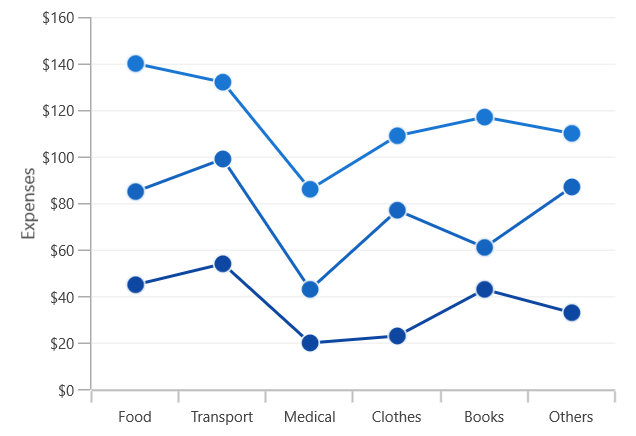
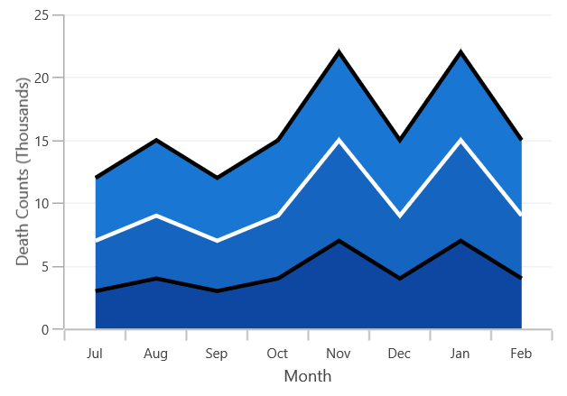

# Stacked in WinUI Cartesian Chart (SfCartesianChart)

## Stacked line

[`StackedLineSeries`]() resembles multiple types of series of the [`LineSeries`](). Each series is vertically stacked one above the other. When there is only one series, then it is [`LineSeries`](). 

The following code example illustrates how to use [`StackedLineSeries`]():





<chart:SfCartesianChart>
    ...

    <chart:StackedLineSeries  
            XBindingPath="MonthlyExpenses"    
            YBindingPath="Father" 
            ItemsSource="{Binding Data}"/>

    <chart:StackedLineSeries
            XBindingPath="MonthlyExpenses" 
            YBindingPath="Mother"
            ItemsSource="{Binding Data}"/> 

    <chart:StackedLineSeries 
            XBindingPath="MonthlyExpenses" 
            YBindingPath="Son"
            ItemsSource="{Binding Data}" />
    ...
</chart:SfCartesianChart>





SfCartesianChart chart = new SfCartesianChart();
...
StackedLineSeries series1 = new StackedLineSeries()
{
    ItemsSource = new ViewModel().Data,
    XBindingPath = "MonthlyExpenses",
    YBindingPath ="Father",
};

StackedLineSeries series2 = new StackedLineSeries()
{
    ItemsSource = new ViewModel().Data,
    XBindingPath = "MonthlyExpenses",
    YBindingPath = "Mother",
};

StackedLineSeries series3 = new StackedLineSeries()
{
    ItemsSource = new ViewModel().Data,
    XBindingPath = "MonthlyExpenses",
    YBindingPath = "Son",
};

chart.Series.Add(series1);
chart.Series.Add(series2);
chart.Series.Add(series3);
...





## Stacked column

[`StackedColumnSeries`]() resembles multiple types of ColumnSeries. Each series is vertically stacked one above the other. When there is only one series, then it is ColumnSeries. 

The following code example illustrates how to use StackedColumnSeries:





<chart:SfCartesianChart>
    ...
    <chart:StackedColumnSeries XBindingPath="CountryName"    
            YBindingPath="GoldMedals" ItemsSource="{Binding MedalDetails}"/>

    <chart:StackedColumnSeries XBindingPath="CountryName" 
            YBindingPath="SilverMedals" ItemsSource="{Binding MedalDetails}"/> 

    <chart:StackedColumnSeries XBindingPath="CountryName" 
            YBindingPath="BronzeMedals" ItemsSource="{Binding MedalDetails}"/>
    ...
</chart:SfCartesianChart>




SfCartesianChart chart = new SfCartesianChart();
...
StackedColumnSeries series1 = new StackedColumnSeries()
{
    ItemsSource = new ViewModel().MedalDetails,
    XBindingPath = "CountryName",
    YBindingPath ="GoldMedals",
};

StackedColumnSeries series2 = new StackedColumnSeries()
{
    ItemsSource = new ViewModel().MedalDetails,
    XBindingPath = "CountryName",
    YBindingPath = "SilverMedals",
};

StackedColumnSeries series3 = new StackedColumnSeries()
{
    ItemsSource = new ViewModel().MedalDetails,
    XBindingPath = "CountryName",
    YBindingPath = "BronzeMedals",
};

chart.Series.Add(series1);
chart.Series.Add(series2);
chart.Series.Add(series3);
...





## Stacked bar

[`StackedBarSeries`]() is a multiple series type of BarSeries. Each BarSeries is then stacked horizontally, side by side to each other. When there exists only one series, it resembles a simple BarSeries. 





<chart:SfCartesianChart>
    ...
    <chart:StackedBarSeries XBindingPath="CountryName"        
            YBindingPath="GoldMedals" ItemsSource="{Binding MedalDetails}">
    </chart:StackedBarSeries>

    <chart:StackedBarSeries XBindingPath="CountryName" 
            YBindingPath="SilverMedals" ItemsSource="{Binding MedalDetails}">
    </chart:StackedBarSeries>

    <chart:StackedBarSeries XBindingPath="CountryName" 
            YBindingPath="BronzeMedals" ItemsSource="{Binding MedalDetails}">
    </chart:StackedBarSeries>
</chart:SfCartesianChart>




SfCartesianChart chart = new SfCartesianChart();
...
StackedBarSeries series1 = new StackedBarSeries()
{
    ItemsSource = new ViewModel().MedalDetails,
    XBindingPath = "CountryName",
    YBindingPath = "GoldMedals",
};

StackedBarSeries series2 = new StackedBarSeries()
{
    ItemsSource = new ViewModel().MedalDetails,
    XBindingPath = "CountryName",
    YBindingPath = "SilverMedals",
};

StackedBarSeries series3 = new StackedBarSeries()
{
    ItemsSource = new ViewModel().MedalDetails,
    XBindingPath = "CountryName",
    YBindingPath = "BronzeMedals",
};

chart.Series.Add(series1);
chart.Series.Add(series2);
chart.Series.Add(series3);
...





## Stacked area

[`StackedAreaSeries`]() is representing areas stacked vertically one above the other. 





<chart:SfCartesianChart>
    ...
    <chart:StackedAreaSeries XBindingPath="Month" 
        YBindingPath="Bus" ItemsSource="{Binding Accidents}" />

    <chart:StackedAreaSeries XBindingPath="Month"         
        YBindingPath="Car" ItemsSource="{Binding Accidents}" />

    <chart:StackedAreaSeries XBindingPath="Month"                 
        YBindingPath="Truck" ItemsSource="{Binding Accidents}" />
    ...
</chart:SfCartesianChart>





SfCartesianChart chart = new SfCartesianChart();
...
StackedAreaSeries series1 = new StackedAreaSeries()
{
    ItemsSource = new ViewModel().Accidents,
    XBindingPath = "Month",
    YBindingPath = "Bus",
};

StackedAreaSeries series2 = new StackedAreaSeries()
{
    ItemsSource = new ViewModel().Accidents,
    XBindingPath = "Month",
    YBindingPath = "Car",
};

StackedAreaSeries series3 = new StackedAreaSeries()
{
    ItemsSource = new ViewModel().Accidents,
    XBindingPath = "Month",
    YBindingPath = "Truck",
};

chart.Series.Add(series1);
chart.Series.Add(series2);
chart.Series.Add(series3);
...





You can draw open curve like Area using this [`IsClosed`]() property.





<chart:SfCartesianChart>
    ...
    <chart:StackedAreaSeries Stroke="Black" StrokeThickness="3"
            IsClosed="False" XBindingPath="Month" 
            YBindingPath="Bus" ItemsSource="{Binding Accidents}"/>

    <chart:StackedAreaSeries Stroke="White" StrokeThickness="3"
            IsClosed="False" XBindingPath="Month"             
            YBindingPath="Car" ItemsSource="{Binding Accidents}"/>

    <chart:StackedAreaSeries Stroke="Black" StrokeThickness="3"  
            IsClosed="False" XBindingPath="Month" 
            YBindingPath="Truck" ItemsSource="{Binding Accidents}"/>
</chart:SfCartesianChart>





SfCartesianChart chart = new SfCartesianChart();
...
StackedAreaSeries series1 = new StackedAreaSeries()
{
    ItemsSource = new ViewModel().Accidents,
    XBindingPath = "Month",
    YBindingPath = "Bus",
    Stroke = new SolidColorBrush(Colors.Black),
    StrokeThickness = 3,
    IsClosed = false,
};

StackedAreaSeries series2 = new StackedAreaSeries()
{
    ItemsSource = new ViewModel().Accidents,
    XBindingPath = "Month",
    YBindingPath = "Car",
    Stroke = new SolidColorBrush(Colors.White),
    StrokeThickness = 3,
    IsClosed = false,
};

StackedAreaSeries series3 = new StackedAreaSeries()
{
    ItemsSource = new ViewModel().Accidents,
    XBindingPath = "Month",
    YBindingPath = "Truck",
    Stroke = new SolidColorBrush(Colors.Black),
    StrokeThickness = 3,
    IsClosed = false,
};

chart.Series.Add(series1);
chart.Series.Add(series2);
chart.Series.Add(series3);
...





