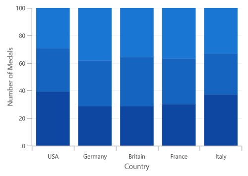
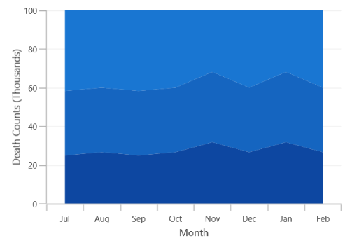

# Stacked 100 Charts in WinUI Chart (SfCartesianChart)

## Stacked Column 100 Chart

The [`StackedColumn100Series`]() resembles [StackedColumnSeries]() but the cumulative portion of each stacked element always comes to a total of 100%. 





<chart:SfCartesianChart>
    
    <chart:SfCartesianChart.PrimaryAxis>
        <chart:CategoryAxis />
    </chart:SfCartesianChart.PrimaryAxis>

    <chart:SfCartesianChart.SecondaryAxis>
        <chart:NumericalAxis />
    </chart:SfCartesianChart.SecondaryAxis>  

    <chart:StackedColumn100Series XBindingPath="CountryName" 
            YBindingPath="GoldMedals" ItemsSource="{Binding MedalDetails}"/>

    <chart:StackedColumn100Series XBindingPath="CountryName"
            YBindingPath="SilverMedals" ItemsSource="{Binding MedalDetails}"/>

    <chart:StackedColumn100Series XBindingPath="CountryName" 
            YBindingPath="BronzeMedals" ItemsSource="{Binding MedalDetails}"/>
    ...
</chart:SfCartesianChart>





SfCartesianChart chart = new SfCartesianChart();
ViewModel viewModel = new ViewModel();
CategoryAxis primaryAxis = new CategoryAxis();
chart.PrimaryAxis = primaryAxis;
NumericalAxis secondaryAxis = new NumericalAxis();
chart.SecondaryAxis = secondaryAxis;

StackedColumn100Series series1 = new StackedColumn100Series()
{
    ItemsSource = viewModel.MedalDetails,
    XBindingPath = "CountryName",
    YBindingPath = "GoldMedals",
};

StackedColumn100Series series2 = new StackedColumn100Series()
{
    ItemsSource = viewModel.MedalDetails,
    XBindingPath = "CountryName",
    YBindingPath = "SilverMedals",
};

StackedColumn100Series series3 = new StackedColumn100Series()
{
    ItemsSource = viewModel.MedalDetails,
    XBindingPath = "CountryName",
    YBindingPath = "BronzeMedals",
};

chart.Series.Add(series1);
chart.Series.Add(series2);
chart.Series.Add(series3);
...





## Stacked Line 100 Chart

The [`StackedLine100Series`]() resembles [`StackedLineSeries`]() but the cumulative portion of each stacked element always comes to a total of 100%. 





<chart:SfCartesianChart>
    
    <chart:SfCartesianChart.PrimaryAxis>
        <chart:CategoryAxis />
    </chart:SfCartesianChart.PrimaryAxis>

    <chart:SfCartesianChart.SecondaryAxis>
        <chart:NumericalAxis />
    </chart:SfCartesianChart.SecondaryAxis>  

    <chart:StackedLine100Series ItemsSource="{Binding Data}" 
            XBindingPath="MonthlyExpenses" 
            YBindingPath="Father" />

    <chart:StackedLine100Series ItemsSource="{Binding Data}"
            XBindingPath="MonthlyExpenses"  
            YBindingPath="Mother" />

    <chart:StackedLine100Series ItemsSource="{Binding Data}"
            XBindingPath="MonthlyExpenses" 
            YBindingPath="Son"/>
    ...
<chart:SfCartesianChart>





SfCartesianChart chart = new SfCartesianChart();
ViewModel viewModel = new ViewModel();
CategoryAxis primaryAxis = new CategoryAxis();
chart.PrimaryAxis = primaryAxis;
NumericalAxis secondaryAxis = new NumericalAxis();
chart.SecondaryAxis = secondaryAxis;

StackedLine100Series series1 = new StackedLine100Series()
{
    ItemsSource = viewModel.Data,
    XBindingPath = "MonthlyExpenses",
    YBindingPath = "Father",
};

StackedLine100Series series2 = new StackedLine100Series()
{
    ItemsSource = viewModel.Data,
    XBindingPath = "MonthlyExpenses",
    YBindingPath = "Mother",
};

StackedLine100Series series3 = new StackedLine100Series()
{
    ItemsSource = viewModel.Data,
    XBindingPath = "MonthlyExpenses",
    YBindingPath = "Son",
};

chart.Series.Add(series1);
chart.Series.Add(series2);
chart.Series.Add(series3);
...





## Stacked Area 100 Chart

The [StackedArea100Series]() is similar to [StackedAreaSeries](), but the cumulative portion of each stacked element always comes to a total of 100%. 





<chart:SfCartesianChart>
    
    <chart:SfCartesianChart.PrimaryAxis>
        <chart:CategoryAxis />
    </chart:SfCartesianChart.PrimaryAxis>

    <chart:SfCartesianChart.SecondaryAxis>
        <chart:NumericalAxis />
    </chart:SfCartesianChart.SecondaryAxis>  
    
    <chart:StackedArea100Series XBindingPath="Month"         
        YBindingPath="Bus" ItemsSource="{Binding Accidents}" />

    <chart:StackedArea100Series XBindingPath="Month" 
        YBindingPath="Car" ItemsSource="{Binding Accidents}" />

    <chart:StackedArea100Series XBindingPath="Month" 
        YBindingPath="Truck" ItemsSource="{Binding Accidents}" />
</chart:SfCartesianChart>





SfCartesianChart chart = new SfCartesianChart();
ViewModel viewModel = new ViewModel();
CategoryAxis primaryAxis = new CategoryAxis();
chart.PrimaryAxis = primaryAxis;
NumericalAxis secondaryAxis = new NumericalAxis();
chart.SecondaryAxis = secondaryAxis;

StackedArea100Series series1 = new StackedArea100Series()
{
    ItemsSource = viewModel.Accidents,
    XBindingPath = "Month",
    YBindingPath = "Bus",
};

StackedArea100Series series2 = new StackedArea100Series()
{
    ItemsSource = viewModel.Accidents,
    XBindingPath = "Month",
    YBindingPath = "Car",
};

StackedArea100Series series3 = new StackedArea100Series()
{
    ItemsSource = viewModel.Accidents,
    XBindingPath = "Month",
    YBindingPath = "Truck",
};

chart.Series.Add(series1);
chart.Series.Add(series2);
chart.Series.Add(series3);
...





