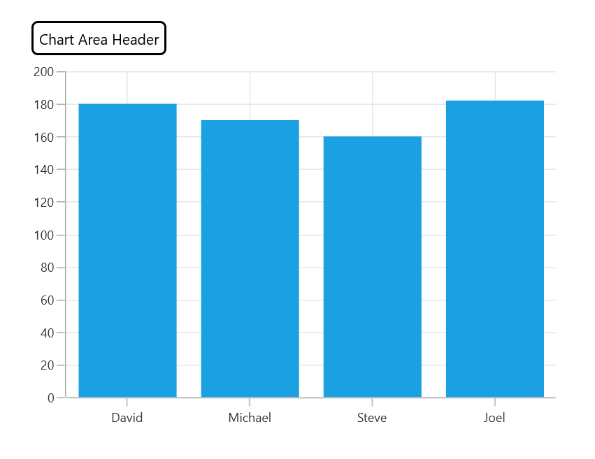

# Chart Title in WinUI Chart (SfCartesianChart)

[Header]() property is used to define the title for the chart.

   



<chart:SfCartesianChart x:Name="chart" Header="Chart Area Header">
 . . .           
</chart:SfCartesianChart>





SfCartesianChart chart = new SfCartesianChart();
chart.Header = "Chart Area Header";
. . . 
this.Content = chart;



 

## Customization

Chart provides support to add any `UIElement` as a title. The following code example defines `TextBlock` as chart header.

   



 <chart:SfCartesianChart>

    <chart:SfCartesianChart.Header>
        <Border BorderThickness="2" BorderBrush="Black" Margin="10" CornerRadius="5">
            <TextBlock FontSize="14" Text="Chart Area Header" Margin="5"/>
        </Border>
    </chart:SfCartesianChart.Header>
            
</chart:SfCartesianChart>





SfCartesianChart chart = new SfCartesianChart();
. . .
Border border = new Border()
{
    BorderThickness = new Thickness(2),
    BorderBrush = new SolidColorBrush(Colors.Black),
    Margin = new Thickness(10),
    CornerRadius = new CornerRadius(5),
};

TextBlock textBlock = new TextBlock()
{
    Text = "Chart Area Header",
    Margin = new Thickness(5),
    FontSize = 14
};

border.Child = textBlock;
chart.Header = border;
. . .
this.Content = chart;



 

## Alignment

The title text content can be aligned horizontally to the left, center or right of the chart using the [HorizontalHeaderAlignment]() property of the `SfCartesianChart`.

   



<chart:SfCartesianChart x:Name="chart" 
                HorizontalHeaderAlignment="Left">
. . .
    <chart:SfCartesianChart.Header>
        <Border BorderThickness="2" BorderBrush="Black" Margin="0, 0, 0 ,10" CornerRadius="5">
            <TextBlock FontSize="14" Text="Chart Area Header" Margin="5"/>
        </Border>
    </chart:SfCartesianChart.Header>
. . . 
</chart:SfCartesianChart>





SfCartesianChart chart = new SfCartesianChart();
chart.HorizontalHeaderAlignment = HorizontalAlignment.Left;
. . .
Border border = new Border()
{
    BorderThickness = new Thickness(2),
    BorderBrush = new SolidColorBrush(Colors.Black),
    Margin = new Thickness(0,0,0,10),
    CornerRadius = new CornerRadius(5),
};

TextBlock textBlock = new TextBlock()
{
    Text = "Chart Area Header",
    Margin = new Thickness(5),
    FontSize = 14
};

border.Child = textBlock;
chart.Header = border;
. . . 
this.Content = chart;



 

