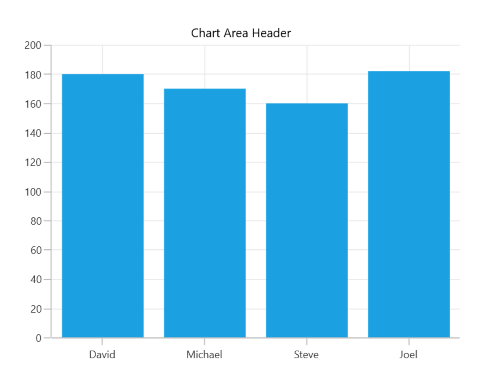
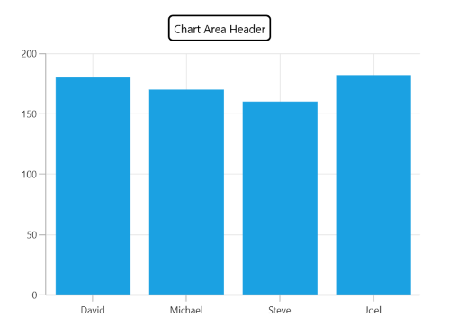
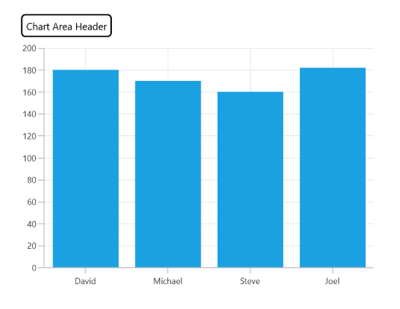

# Chart Title in WinUI Chart (SfCartesianChart)

The [Header](https://help.syncfusion.com/cr/winui/Syncfusion.UI.Xaml.Charts.ChartBase.html#Syncfusion_UI_Xaml_Charts_ChartBase_Header) property is used to define the title for the chart.

   



<chart:SfCartesianChart x:Name="chart" Header="Chart Area Header">

<!-- Configure additional chart elements -->
</chart:SfCartesianChart>





SfCartesianChart chart = new SfCartesianChart();
chart.Header = "Chart Area Header";

// Configure additional chart elements
this.Content = chart;



 

## Customization

Chart provides support to add any `UIElement` as a title. The following code example defines a `TextBlock` as the chart header.

   



<chart:SfCartesianChart>
    <chart:SfCartesianChart.Header>
        <Border 
            BorderThickness="2" 
            BorderBrush="Black" 
            Margin="10" 
            CornerRadius="5">
            <TextBlock 
                FontSize="14"		            	
                Text="Chart Area Header"
                Margin="5"/>
        </Border>
    </chart:SfCartesianChart.Header>
</chart:SfCartesianChart>





SfCartesianChart chart = new SfCartesianChart();

// Configure axes, legend, and series here
Border border = new Border()
{
    BorderThickness = new Thickness(2),
    BorderBrush = new SolidColorBrush(Colors.Black),
    Margin = new Thickness(10),
    CornerRadius = new CornerRadius(5),
};

TextBlock textBlock = new TextBlock()
{
    Text = "Chart Area Header",
    Margin = new Thickness(5),
    FontSize = 14
};

border.Child = textBlock;
chart.Header = border;

// Configure additional chart elements
this.Content = chart;



 

## Alignment

The title text content can be aligned horizontally to the left, center or right of the chart using the [HorizontalHeaderAlignment](https://help.syncfusion.com/cr/winui/Syncfusion.UI.Xaml.Charts.ChartBase.html#Syncfusion_UI_Xaml_Charts_ChartBase_HorizontalHeaderAlignment) property of the [SfCartesianChart](https://help.syncfusion.com/cr/winui/Syncfusion.UI.Xaml.Charts.SfCartesianChart.html).

   



<chart:SfCartesianChart x:Name="chart" HorizontalHeaderAlignment="Left">

    <!-- Configure additional chart elements -->
    <chart:SfCartesianChart.Header>
        <Border 
            BorderThickness="2" 
            BorderBrush="Black" 
            Margin="0, 0, 0, 10" 
            CornerRadius="5">
            <TextBlock 
                FontSize="14"
                Text="Chart Area Header"
                Margin="5"/>
        </Border>
    </chart:SfCartesianChart.Header>

    <!-- Configure additional chart elements -->
</chart:SfCartesianChart>





SfCartesianChart chart = new SfCartesianChart();
chart.HorizontalHeaderAlignment = HorizontalAlignment.Left;

// Configure additional chart elements
Border border = new Border()
{
    BorderThickness = new Thickness(2),
    BorderBrush = new SolidColorBrush(Colors.Black),
    Margin = new Thickness(0,0,0,10),
    CornerRadius = new CornerRadius(5),
};

TextBlock textBlock = new TextBlock()
{
    Text = "Chart Area Header",
    Margin = new Thickness(5),
    FontSize = 14
};

border.Child = textBlock;
chart.Header = border;

// Configure additional chart elements
this.Content = chart;



 

