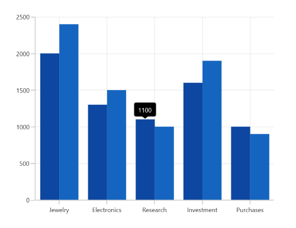
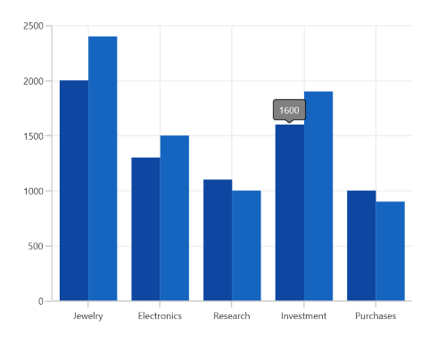
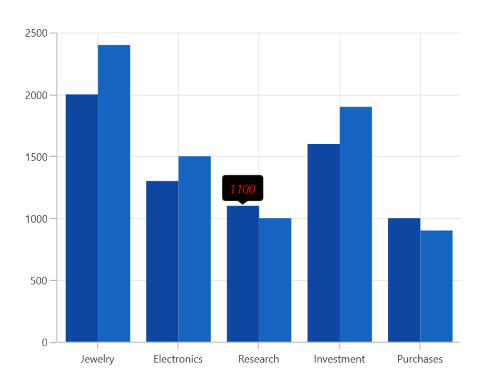
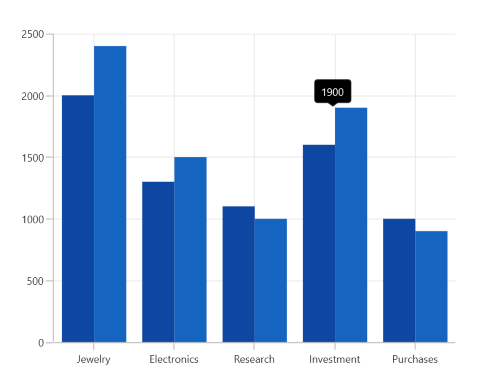
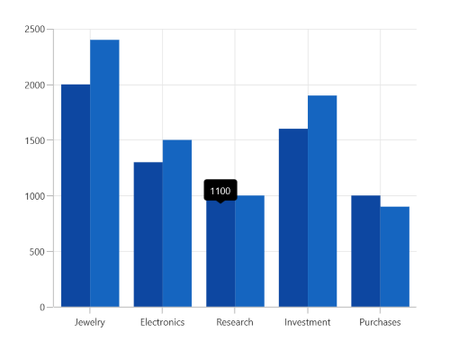
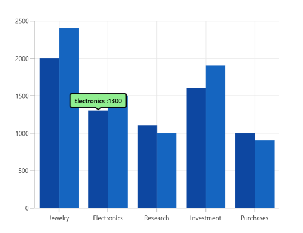

# Tooltip in WinUI Chart (SfCartesianChart)

The tooltip is used to display information over segments. It appears at the data point position when the mouse hovers over any series segment, showing the metadata of the hovered segment or data point.

## Define Tooltip

To define the tooltip in the series, set the [EnableTooltip](https://help.syncfusion.com/cr/winui/Syncfusion.UI.Xaml.Charts.ChartSeries.html#Syncfusion_UI_Xaml_Charts_ChartSeries_EnableTooltip) property to true. The default value of this property is `false`.





<chart:SfCartesianChart>
. . .
    <chart:SfCartesianChart.Series>
        <chart:ColumnSeries ItemsSource="{Binding Data}" 
                            XBindingPath="Demand"
                            YBindingPath="Year2010" 
                            EnableTooltip="True"/>

        <chart:ColumnSeries ItemsSource="{Binding Data}" 
                            XBindingPath="Demand"
                            YBindingPath="Year2011"
                            EnableTooltip="True"/>
    </chart:SfCartesianChart.Series>
</chart:SfCartesianChart>





SfCartesianChart chart = new SfCartesianChart();
. . .
ColumnSeries series1 = new ColumnSeries()
{
    ItemsSource = new ViewModel().Data,
    XBindingPath = "Demand",
    YBindingPath = "Year2010",
    EnableTooltip = true
};

ColumnSeries series2 = new ColumnSeries()
{
    ItemsSource = new ViewModel().Data,
    XBindingPath = "Demand",
    YBindingPath = "Year2011",
    EnableTooltip = true
};

chart.Series.Add(series1);
chart.Series.Add(series2);
this.Content = chart;





The [ChartTooltipBehavior](https://help.syncfusion.com/cr/winui/Syncfusion.UI.Xaml.Charts.ChartTooltipBehavior.html) is used to customize the tooltip. For customization, create an instance of [ChartTooltipBehavior](https://help.syncfusion.com/cr/winui/Syncfusion.UI.Xaml.Charts.ChartTooltipBehavior.html) and set it to the [TooltipBehavior](https://help.syncfusion.com/cr/winui/Syncfusion.UI.Xaml.Charts.ChartBase.html#Syncfusion_UI_Xaml_Charts_ChartBase_TooltipBehavior) property of the [SfCartesianChart](https://help.syncfusion.com/cr/winui/Syncfusion.UI.Xaml.Charts.SfCartesianChart.html). The following properties are used to customize the tooltip:

* [Style](https://help.syncfusion.com/cr/winui/Syncfusion.UI.Xaml.Charts.ChartTooltipBehavior.html#Syncfusion_UI_Xaml_Charts_ChartTooltipBehavior_Style) - Customize the fill and stroke of the tooltip.
* [LabelStyle](https://help.syncfusion.com/cr/winui/Syncfusion.UI.Xaml.Charts.ChartTooltipBehavior.html#Syncfusion_UI_Xaml_Charts_ChartTooltipBehavior_LabelStyle) - Customize the tooltip label.
* [HorizontalAlignment](https://help.syncfusion.com/cr/winui/Syncfusion.UI.Xaml.Charts.ChartTooltipBehavior.html#Syncfusion_UI_Xaml_Charts_ChartTooltipBehavior_HorizontalAlignment) - Align the tooltip label at the left, right, or center of the data point or cursor position horizontally.
* [VerticalAlignment](https://help.syncfusion.com/cr/winui/Syncfusion.UI.Xaml.Charts.ChartTooltipBehavior.html#Syncfusion_UI_Xaml_Charts_ChartTooltipBehavior_VerticalAlignment) - Align the tooltip label at the top, center, or bottom of the data point or cursor position vertically.
* [HorizontalOffset](https://help.syncfusion.com/cr/winui/Syncfusion.UI.Xaml.Charts.ChartTooltipBehavior.html#Syncfusion_UI_Xaml_Charts_ChartTooltipBehavior_HorizontalOffset) - Position the tooltip at a distance horizontally from the data point or cursor position.
* [VerticalOffset](https://help.syncfusion.com/cr/winui/Syncfusion.UI.Xaml.Charts.ChartTooltipBehavior.html#Syncfusion_UI_Xaml_Charts_ChartTooltipBehavior_VerticalOffset) - Position the tooltip at a distance vertically from the data point or cursor position.
* [Duration](https://help.syncfusion.com/cr/winui/Syncfusion.UI.Xaml.Charts.ChartTooltipBehavior.html#Syncfusion_UI_Xaml_Charts_ChartTooltipBehavior_Duration) - Set the duration for which the tooltip remains visible, in milliseconds.
* [EnableAnimation](https://help.syncfusion.com/cr/winui/Syncfusion.UI.Xaml.Charts.ChartTooltipBehavior.html#Syncfusion_UI_Xaml_Charts_ChartTooltipBehavior_EnableAnimation) - Enable animation when showing the tooltip.
* [InitialShowDelay](https://help.syncfusion.com/cr/winui/Syncfusion.UI.Xaml.Charts.ChartTooltipBehavior.html#Syncfusion_UI_Xaml_Charts_ChartTooltipBehavior_InitialShowDelay) - Delay the display of the tooltip in milliseconds after user interaction with the series.





<chart:SfCartesianChart.TooltipBehavior>
    <chart:ChartTooltipBehavior/>
</chart:SfCartesianChart.TooltipBehavior>





SfCartesianChart chart = new SfCartesianChart();

ChartTooltipBehavior tooltip = new ChartTooltipBehavior();
chart.TooltipBehavior = tooltip;





## Background Style

The tooltip's fill and stroke color can be customized using the [Style](https://help.syncfusion.com/cr/winui/Syncfusion.UI.Xaml.Charts.ChartTooltipBehavior.html#Syncfusion_UI_Xaml_Charts_ChartTooltipBehavior_Style) property. To define a style for the tooltip, specify the style's `TargetType` as `Path`.





<chart:SfCartesianChart>
    <chart:SfCartesianChart.Resources>
        
    </chart:SfCartesianChart.Resources>
. . .
    <chart:SfCartesianChart.TooltipBehavior>
        <chart:ChartTooltipBehavior Style="{StaticResource style}"/>
    </chart:SfCartesianChart.TooltipBehavior>

    <chart:SfCartesianChart.Series>
        <chart:ColumnSeries ItemsSource="{Binding Data}" 
                            XBindingPath="Demand"
                            YBindingPath="Year2010" 
                            EnableTooltip="True"/>
                
        <chart:ColumnSeries ItemsSource="{Binding Data}" 
                            XBindingPath="Demand"
                            YBindingPath="Year2011"
                            EnableTooltip="True"/>
    </chart:SfCartesianChart.Series>

</chart:SfCartesianChart>





SfCartesianChart chart = new SfCartesianChart();

Style style = new Style(typeof(Path));
style.Setters.Add(new Setter(Path.StrokeProperty, new SolidColorBrush(Colors.Black)));
style.Setters.Add(new Setter(Path.FillProperty, new SolidColorBrush(Colors.Gray)));
...
ChartTooltipBehavior tooltipBehavior = new ChartTooltipBehavior();
tooltipBehavior.Style = style;
chart.TooltipBehavior = tooltipBehavior;

ColumnSeries series1 = new ColumnSeries()
{
    ItemsSource = new ViewModel().Data,
    XBindingPath = "Demand",
    YBindingPath = "Year2010",
    EnableTooltip = true
};

ColumnSeries series2 = new ColumnSeries()
{
    ItemsSource = new ViewModel().Data,
    XBindingPath = "Demand",
    YBindingPath = "Year2011",
    EnableTooltip = true
};

chart.Series.Add(series1);
chart.Series.Add(series2);
this.Content = chart;





## Label Style

The tooltip label style can be customized using the [LabelStyle](https://help.syncfusion.com/cr/winui/Syncfusion.UI.Xaml.Charts.ChartTooltipBehavior.html#Syncfusion_UI_Xaml_Charts_ChartTooltipBehavior_LabelStyle) property. To define a style for the tooltip label, specify the style's `TargetType` as `TextBlock`.





<chart:SfCartesianChart>
    <chart:SfCartesianChart.Resources>
        
    </chart:SfCartesianChart.Resources>
. . .
    <chart:SfCartesianChart.TooltipBehavior>
        <chart:ChartTooltipBehavior LabelStyle="{StaticResource labelStyle}"/>
    </chart:SfCartesianChart.TooltipBehavior>

    <chart:SfCartesianChart.Series>
        <chart:ColumnSeries ItemsSource="{Binding Data}" 
                            XBindingPath="Demand"
                            YBindingPath="Year2010" 
                            EnableTooltip="True"/>
                
        <chart:ColumnSeries ItemsSource="{Binding Data}" 
                            XBindingPath="Demand"
                            YBindingPath="Year2011"
                            EnableTooltip="True"/>
    </chart:SfCartesianChart.Series>

</chart:SfCartesianChart>





SfCartesianChart chart = new SfCartesianChart();

Style labelStyle = new Style(typeof(TextBlock));
labelStyle.Setters.Add(new Setter(TextBlock.FontSizeProperty, 14d));
labelStyle.Setters.Add(new Setter(TextBlock.FontStyleProperty, FontStyles.Italic));
labelStyle.Setters.Add(new Setter(TextBlock.ForegroundProperty, new SolidColorBrush(Colors.Red)));
...
ChartTooltipBehavior tooltipBehavior = new ChartTooltipBehavior();
tooltipBehavior.LabelStyle = labelStyle;
chart.TooltipBehavior = tooltipBehavior;

ColumnSeries series1 = new ColumnSeries()
{
    ItemsSource = new ViewModel().Data,
    XBindingPath = "Demand",
    YBindingPath = "Year2010",
    EnableTooltip = true
};

ColumnSeries series2 = new ColumnSeries()
{
    ItemsSource = new ViewModel().Data,
    XBindingPath = "Demand",
    YBindingPath = "Year2011",
    EnableTooltip = true
};

chart.Series.Add(series1);
chart.Series.Add(series2);
this.Content = chart;





## Alignment

The tooltip can be aligned with respect to the cursor position using the [HorizontalAlignment](https://help.syncfusion.com/cr/winui/Syncfusion.UI.Xaml.Charts.ChartTooltipBehavior.html#Syncfusion_UI_Xaml_Charts_ChartTooltipBehavior_HorizontalAlignment) and [VerticalAlignment](https://help.syncfusion.com/cr/winui/Syncfusion.UI.Xaml.Charts.ChartTooltipBehavior.html#Syncfusion_UI_Xaml_Charts_ChartTooltipBehavior_VerticalAlignment) properties.

**HorizontalAlignment**

Tooltips can be positioned horizontally to the left, right, or center of the cursor position.





<chart:SfCartesianChart Height="388"  Width="500">
. . .
    <chart:SfCartesianChart.TooltipBehavior>
        <chart:ChartTooltipBehavior HorizontalAlignment="Left"/>
    </chart:SfCartesianChart.TooltipBehavior>

    <chart:SfCartesianChart.Series>
        <chart:ColumnSeries ItemsSource="{Binding Data}" 
                            XBindingPath="Demand"
                            YBindingPath="Year2010" 
                            EnableTooltip="True"/>
                
        <chart:ColumnSeries ItemsSource="{Binding Data}" 
                            XBindingPath="Demand"
                            YBindingPath="Year2011"
                            EnableTooltip="True"/>
    </chart:SfCartesianChart.Series>

</chart:SfCartesianChart>





SfCartesianChart chart = new SfCartesianChart();
. . .
ChartTooltipBehavior tooltipBehavior = new ChartTooltipBehavior();
tooltipBehavior.HorizontalAlignment = HorizontalAlignment.Left;
chart.TooltipBehavior = tooltipBehavior;

ColumnSeries series1 = new ColumnSeries()
{
    ItemsSource = new ViewModel().Data,
    XBindingPath = "Demand",
    YBindingPath = "Year2010",
    EnableTooltip = true
};

ColumnSeries series2 = new ColumnSeries()
{
    ItemsSource = new ViewModel().Data,
    XBindingPath = "Demand",
    YBindingPath = "Year2011",
    EnableTooltip = true
};

chart.Series.Add(series1);
chart.Series.Add(series2);
this.Content = chart;





**VerticalAlignment**

Tooltips can be positioned vertically at the top, bottom, or center of the cursor position.





<chart:SfCartesianChart Height="388"  Width="500">
. . .
    <chart:SfCartesianChart.TooltipBehavior>
        <chart:ChartTooltipBehavior VerticalAlignment="Bottom"/>
    </chart:SfCartesianChart.TooltipBehavior>

    <chart:SfCartesianChart.Series>
        <chart:ColumnSeries ItemsSource="{Binding Data}" 
                            XBindingPath="Demand"
                            YBindingPath="Year2010" 
                            EnableTooltip="True"/>
                
        <chart:ColumnSeries ItemsSource="{Binding Data}" 
                            XBindingPath="Demand"
                            YBindingPath="Year2011"
                            EnableTooltip="True"/>
    </chart:SfCartesianChart.Series>

</chart:SfCartesianChart>





SfCartesianChart chart = new SfCartesianChart();
. . .
ChartTooltipBehavior tooltipBehavior = new ChartTooltipBehavior();
tooltipBehavior.VerticalAlignment = VerticalAlignment.Bottom;
chart.TooltipBehavior = tooltipBehavior;

ColumnSeries series1 = new ColumnSeries()
{
    ItemsSource = new ViewModel().Data,
    XBindingPath = "Demand",
    YBindingPath = "Year2010",
    EnableTooltip = true
};

ColumnSeries series2 = new ColumnSeries()
{
    ItemsSource = new ViewModel().Data,
    XBindingPath = "Demand",
    YBindingPath = "Year2011",
    EnableTooltip = true
};

chart.Series.Add(series1);
chart.Series.Add(series2);
this.Content = chart;





## Offset

The tooltip can be positioned at a specific distance from the cursor using the [HorizontalOffset](https://help.syncfusion.com/cr/winui/Syncfusion.UI.Xaml.Charts.ChartTooltipBehavior.html#Syncfusion_UI_Xaml_Charts_ChartTooltipBehavior_HorizontalOffset) and [VerticalOffset](https://help.syncfusion.com/cr/winui/Syncfusion.UI.Xaml.Charts.ChartTooltipBehavior.html#Syncfusion_UI_Xaml_Charts_ChartTooltipBehavior_VerticalOffset) properties.





<chart:SfCartesianChart Height="388"  Width="500">
. . .
    <chart:SfCartesianChart.TooltipBehavior>
        <chart:ChartTooltipBehavior HorizontalOffset="40" VerticalOffset="40"/>
    </chart:SfCartesianChart.TooltipBehavior>

    <chart:SfCartesianChart.Series>
        <chart:ColumnSeries ItemsSource="{Binding Data}" 
                            XBindingPath="Demand"
                            YBindingPath="Year2010" 
                            EnableTooltip="True"/>
                
        <chart:ColumnSeries ItemsSource="{Binding Data}" 
                            XBindingPath="Demand"
                            YBindingPath="Year2011"
                            EnableTooltip="True"/>
    </chart:SfCartesianChart.Series>

</chart:SfCartesianChart>





SfCartesianChart chart = new SfCartesianChart();
. . .
ChartTooltipBehavior tooltipBehavior = new ChartTooltipBehavior();
tooltipBehavior.HorizontalOffset = 40;
tooltipBehavior.VerticalOffset = 40;
chart.TooltipBehavior = tooltipBehavior;

ColumnSeries series1 = new ColumnSeries()
{
    ItemsSource = new ViewModel().Data,
    XBindingPath = "Demand",
    YBindingPath = "Year2010",
    EnableTooltip = true
};

ColumnSeries series2 = new ColumnSeries()
{
    ItemsSource = new ViewModel().Data,
    XBindingPath = "Demand",
    YBindingPath = "Year2011",
    EnableTooltip = true
};

chart.Series.Add(series1);
chart.Series.Add(series2);
this.Content = chart;





## Duration

The [Duration](https://help.syncfusion.com/cr/winui/Syncfusion.UI.Xaml.Charts.ChartTooltipBehavior.html#Syncfusion_UI_Xaml_Charts_ChartTooltipBehavior_Duration) property is used to specify the duration in milliseconds for which the tooltip will be displayed.

N> By default, the tooltip is displayed for 1000 milliseconds.





<chart:SfCartesianChart Height="388"  Width="500">
. . .
    <chart:SfCartesianChart.TooltipBehavior>
        <chart:ChartTooltipBehavior Duration="5000"/>
    </chart:SfCartesianChart.TooltipBehavior>

    <chart:SfCartesianChart.Series>
        <chart:ColumnSeries ItemsSource="{Binding Data}" 
                            XBindingPath="Demand"
                            YBindingPath="Year2010" 
                            EnableTooltip="True"/>
                
        <chart:ColumnSeries ItemsSource="{Binding Data}" 
                            XBindingPath="Demand"
                            YBindingPath="Year2011"
                            EnableTooltip="True"/>
    </chart:SfCartesianChart.Series>

</chart:SfCartesianChart>





SfCartesianChart chart = new SfCartesianChart();
. . .
ChartTooltipBehavior tooltipBehavior = new ChartTooltipBehavior();
tooltipBehavior.Duration = 5000;
chart.TooltipBehavior = tooltipBehavior;

ColumnSeries series1 = new ColumnSeries()
{
    ItemsSource = new ViewModel().Data,
    XBindingPath = "Demand",
    YBindingPath = "Year2010",
    EnableTooltip = true
};

ColumnSeries series2 = new ColumnSeries()
{
    ItemsSource = new ViewModel().Data,
    XBindingPath = "Demand",
    YBindingPath = "Year2011",
    EnableTooltip = true
};

chart.Series.Add(series1);
chart.Series.Add(series2);
this.Content = chart;





## Animation

Animation for tooltips can be enabled using the [EnableAnimation](https://help.syncfusion.com/cr/winui/Syncfusion.UI.Xaml.Charts.ChartTooltipBehavior.html#Syncfusion_UI_Xaml_Charts_ChartTooltipBehavior_EnableAnimation) property, as demonstrated in the following code sample.





<chart:SfCartesianChart Height="388"  Width="500">
. . .
    <chart:SfCartesianChart.TooltipBehavior>
        <chart:ChartTooltipBehavior EnableAnimation="True"/>
    </chart:SfCartesianChart.TooltipBehavior>

    <chart:SfCartesianChart.Series>
        <chart:ColumnSeries ItemsSource="{Binding Data}" 
                            XBindingPath="Demand"
                            YBindingPath="Year2010" 
                            EnableTooltip="True"/>
                
        <chart:ColumnSeries ItemsSource="{Binding Data}" 
                            XBindingPath="Demand"
                            YBindingPath="Year2011"
                            EnableTooltip="True"/>
    </chart:SfCartesianChart.Series>

</chart:SfCartesianChart>





SfCartesianChart chart = new SfCartesianChart();
. . .
ChartTooltipBehavior tooltipBehavior = new ChartTooltipBehavior();
tooltipBehavior.EnableAnimation = true;
chart.TooltipBehavior = tooltipBehavior;

ColumnSeries series1 = new ColumnSeries()
{
    ItemsSource = new ViewModel().Data,
    XBindingPath = "Demand",
    YBindingPath = "Year2010",
    EnableTooltip = true
};

ColumnSeries series2 = new ColumnSeries()
{
    ItemsSource = new ViewModel().Data,
    XBindingPath = "Demand",
    YBindingPath = "Year2011",
    EnableTooltip = true
};

chart.Series.Add(series1);
chart.Series.Add(series2);
this.Content = chart;





## Template

The [SfCartesianChart](https://help.syncfusion.com/cr/winui/Syncfusion.UI.Xaml.Charts.SfCartesianChart.html) provides support to customize the appearance of the tooltip by using the [TooltipTemplate](https://help.syncfusion.com/cr/winui/Syncfusion.UI.Xaml.Charts.ChartSeries.html#Syncfusion_UI_Xaml_Charts_ChartSeries_TooltipTemplate) property.





<chart:SfCartesianChart Height="388"  Width="500">
    <chart:SfCartesianChart.Resources>
        <DataTemplate x:Key="tooltipTemplate1">
            <StackPanel Orientation="Horizontal">
                <TextBlock Text="{Binding Item.Category}"
						   Foreground="Black"
						   FontWeight="Medium" 
						   FontSize="12"
						   HorizontalAlignment="Center"
						   VerticalAlignment="Center"/>
                <TextBlock Text=" : "
						   Foreground="Black"
						   FontWeight="Medium"
						   FontSize="12" 
						   HorizontalAlignment="Center"
						   VerticalAlignment="Center"/>
                <TextBlock Text="{Binding Item.Value}"
						   Foreground="Black"
						   FontWeight="Medium"
						   FontSize="12"
						   HorizontalAlignment="Center"
						   VerticalAlignment="Center"/>
            </StackPanel>
        </DataTemplate>
        . . .
        
    </chart:SfCartesianChart.Resources>
. . .
    <chart:SfCartesianChart.TooltipBehavior>
        <chart:ChartTooltipBehavior Style="{StaticResource style}"/>
    </chart:SfCartesianChart.TooltipBehavior>

    <chart:SfCartesianChart.Series>
        <chart:ColumnSeries ItemsSource="{Binding Data}" 
                            TooltipTemplate="{StaticResource tooltipTemplate1}"
                            XBindingPath="Demand"
                            YBindingPath="Year2010" 
                            EnableTooltip="True"/>
                
        <chart:ColumnSeries ItemsSource="{Binding Data}" 
                            TooltipTemplate="{StaticResource tooltipTemplate2}"
                            XBindingPath="Demand"
                            YBindingPath="Year2011"
                            EnableTooltip="True"/>
    </chart:SfCartesianChart.Series>

</chart:SfCartesianChart>





SfCartesianChart chart = new SfCartesianChart();
. . .
ColumnSeries series1 = new ColumnSeries()
{
    ItemsSource = new ViewModel().Data,
    XBindingPath = "Demand",
    YBindingPath = "Year2010",
    EnableTooltip = true,
    TooltipTemplate = chart.Resources["tooltipTemplate1"] as DataTemplate
};

ColumnSeries series2 = new ColumnSeries()
{
    ItemsSource = new ViewModel().Data,
    XBindingPath = "Demand",
    YBindingPath = "Year2011",
    EnableTooltip = true,
    TooltipTemplate = chart.Resources["tooltipTemplate2"] as DataTemplate
};

chart.Series.Add(series1);
chart.Series.Add(series2);
this.Content = chart;
        




