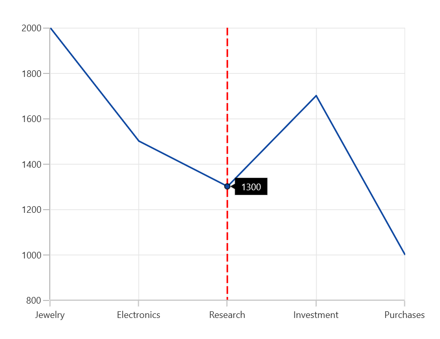
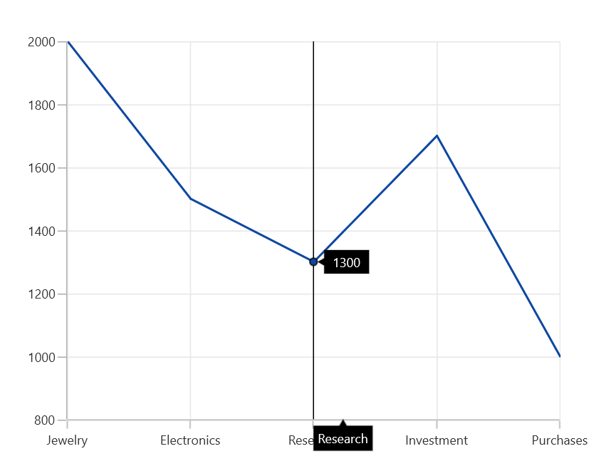
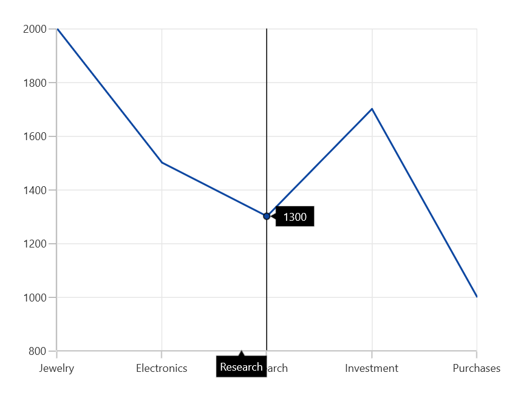
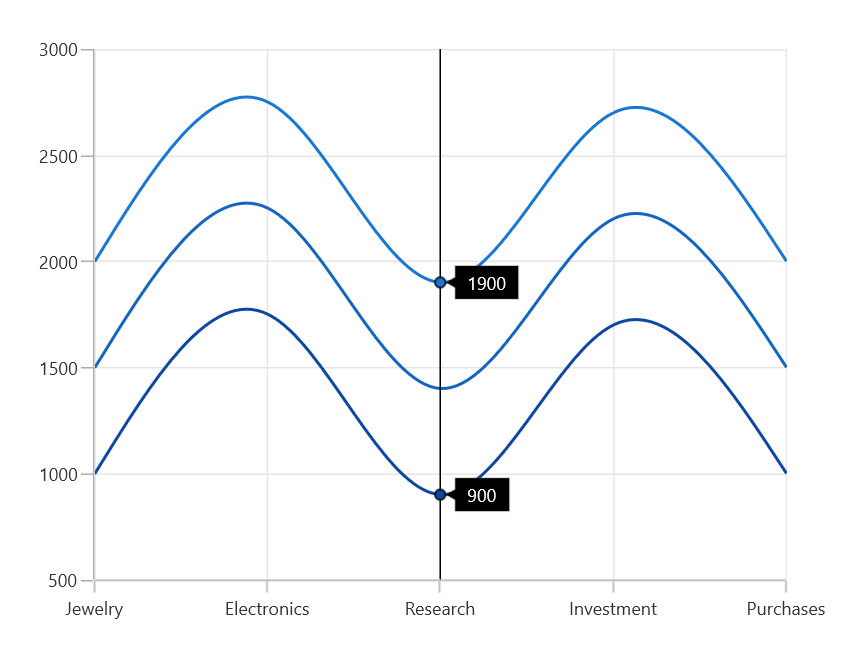
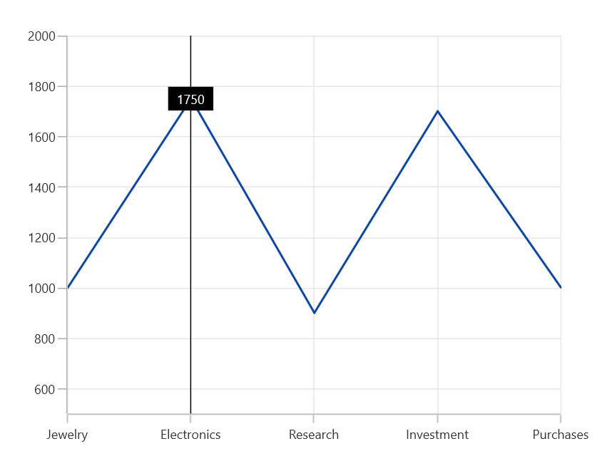
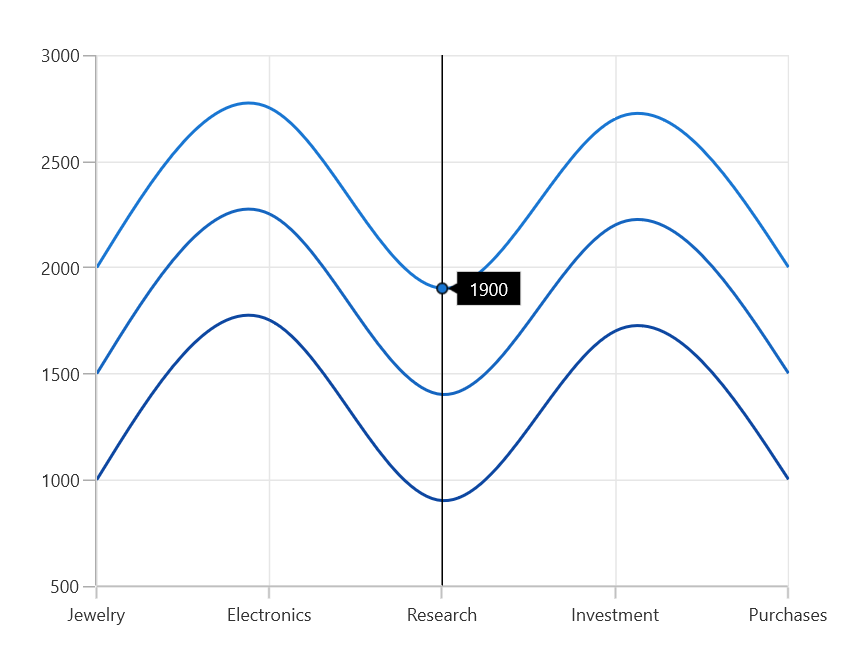
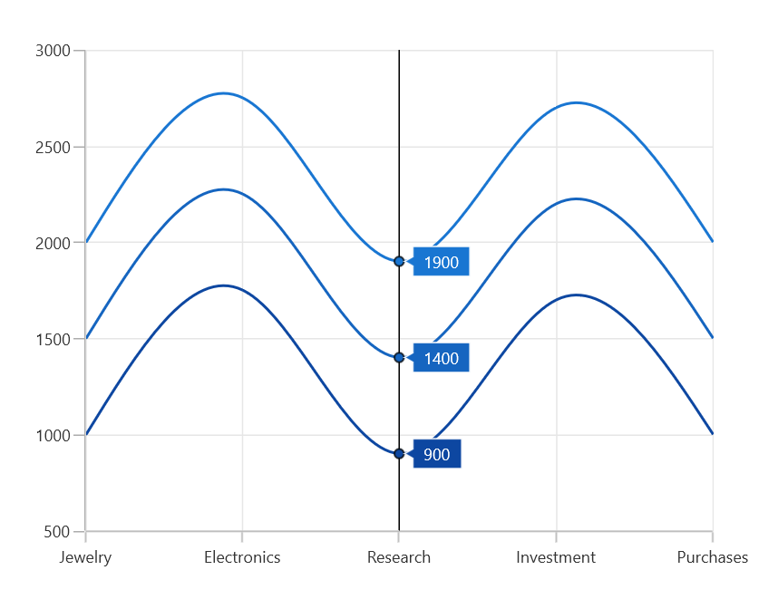

# Trackball in WinUI Cartesian Chart (SfCartesianChart)

The [ChartTrackballBehavior]() allows you to track a data point closer to the cursor position. The x values are determined from the position of the vertical line in the axis and y values are determined from the points touching the vertical line in the series.

## Define trackball

You can create an instance [`ChartTrackballBehavior`]() and add it to the [`Behaviors`]() collection.





<chart:SfCartesianChart.Behaviors>
    <chart:ChartTrackballBehavior/>
</chart:SfCartesianChart.Behaviors>





SfCartesianChart chart = new SfCartesianChart();
. . .
ChartTrackballBehavior behavior = new ChartTrackballBehavior();
chart.Behaviors.Add(behavior);





To view the Trackball in the particular Axis, you have to enable the ShowTrackballInfo property in that axis as in the following code snippet.





<chart:SfCartesianChart.PrimaryAxis>
    <chart:CategoryAxis ShowTrackballInfo="True"/>
</chart:SfCartesianChart.PrimaryAxis>
. . .
<chart:SfCartesianChart.Behaviors>
    <chart:ChartTrackballBehavior/>
</chart:SfCartesianChart.Behaviors>





ChartTrackballBehavior behavior = new ChartTrackballBehavior();
chart.Behaviors.Add(behavior);

chart.PrimaryAxis = new CategoryAxis()
{
    ShowTrackballInfo = true
};





The default appearance of the Trackball in primary axis (CategoryAxis).

The Trackball is composed of the following parts:

1. Vertical Line

2. Symbol

3. Axis Label

4. Series Label

## Vertical Line

The vertical line in the trackball is visible when you initialize the TrackballBehavior. If you want to collapse the visibility of the trackball line, then you have to set [`ShowLine`]) to false.

The following code snippet explains how to collapse the visibility of Trackball line.





<chart:SfCartesianChart.Behaviors>
    <chart:ChartTrackballBehavior ShowLine="False"/>
</chart:SfCartesianChart.Behaviors>





ChartTrackballBehavior behavior = new ChartTrackballBehavior()
{
    ShowLine = false
};

chart.Behaviors.Add(behavior);





### Customization of Trackball line

Cartesian chart allows you to customize the appearance of trackball vertical line using the [`LineStyle`]() property.

The following code snippet explains the customization of Trackball line.





<chart:SfCartesianChart Height="388"  Width="500" Palette="BlueChrome">
. . .
    <chart:SfCartesianChart.Resources>
        
    </chart:SfCartesianChart.Resources>
    . . .
    <chart:SfCartesianChart.Behaviors>
        <chart:ChartTrackballBehavior LineStyle="{StaticResource lineStyle}"/>
    </chart:SfCartesianChart.Behaviors>
. . .   
</chart:SfCartesianChart>





ChartTrackballBehavior Trackball = new ChartTrackballBehavior()
{
    LineStyle = chart.Resources["lineStyle"] as Style
};

chart.Behaviors.Add(Trackball);





## Symbol

By default, the Trackball symbol is displayed as ellipse to change the default style of the symbol using [ChartTrackballStyle]() property.





<chart:SfCartesianChart Height="388"  Width="500" Palette="BlueChrome">
. . 
    <chart:SfCartesianChart.Resources>
        
    </chart:SfCartesianChart.Resources>
    . . .
    <chart:SfCartesianChart.Behaviors>
        <chart:ChartTrackballBehavior ChartTrackballStyle="{StaticResource trackballStyle}"/>
    </chart:SfCartesianChart.Behaviors>
. . .
</chart:SfCartesianChart>





SfCartesianChart chart = new SfCartesianChart();

ChartTrackballBehavior Trackball = new ChartTrackballBehavior()
{
    ChartTrackballStyle = chart.Resources["trackballStyle"] as Style
};

chart.Behaviors.Add(Trackball);





## Axis label

The axis label will be viewed when the [`ShowTrackballInfo`]() property is set to true. If you want to collapse the visibility of axis label in trackball then you have to set ShowTrackballInfo as false.

N>By default the value of [`ShowTrackballInfo`]() is false.

### Axis label alignment 

The alignment of the axis label while moving Trackball can be defined using [`AxisLabelAlignment`]() property.

`Auto` - Axis label is aligned in Near/Far positions based on the Trackball movement.

`Far` - Axis label is positioned far from the position of Trackball.

`Near` - Axis label is near to the position of Trackball.

`Center` - Axis label is aligned to the center of the Trackball. By default, the axis label will positioned in center.

**Far**





<chart:SfCartesianChart.Behaviors>
    <chart:ChartTrackballBehavior AxisLabelAlignment="Far"/>
</chart:SfCartesianChart.Behaviors>





ChartTrackballBehavior behavior = new ChartTrackballBehavior()
{
    AxisLabelAlignment = ChartAlignment.Far
};

chart.Behaviors.Add(behavior);





**Near**





<chart:SfCartesianChart.Behaviors>
    <chart:ChartTrackballBehavior AxisLabelAlignment="Near"/>
</chart:SfCartesianChart.Behaviors>





ChartTrackballBehavior behavior = new ChartTrackballBehavior()
{
    AxisLabelAlignment = ChartAlignment.Near
};

chart.Behaviors.Add(behavior);





### Customization of axis label

You can change the default appearance of the axis label in Trackball using [`TrackballLabelTemplate`]() property in `ChartAxis` as in the below code snippet.





<chart:SfCartesianChart>

    <chart:SfCartesianChart.Resources>
        <DataTemplate x:Key="labelTemplate">
            <Border CornerRadius="4" BorderThickness="1" BorderBrush="Black"
                    Background="LightGreen" Padding="6,0,6,6">
                <TextBlock Foreground="Black" Text="{Binding ValueX}" FontSize="15"/>
            </Border>
        </DataTemplate>
    </chart:SfCartesianChart.Resources>

    <chart:SfCartesianChart.PrimaryAxis>
        <chart:CategoryAxis ShowTrackballInfo="True" TrackballLabelTemplate="{StaticResource labelTemplate}"/>
    </chart:SfCartesianChart.PrimaryAxis>
. . .
</chart:SfCartesianChart>





SfCartesianChart chart = new SfCartesianChart();

chart.PrimaryAxis = new NumericalAxis()
{
    ShowTrackballInfo = true,
    TrackballLabelTemplate = chart.Resources["labelTemplate"] as DataTemplate
};





### Series label

When the Trackball is hovered over, you can view the label is also displayed over the series in addition the axis label.

**ShowTrackballInfo**

The `ShowTrackballInfo` property of [Cartesian Series]() allows user to enable or disable the [Trackball]() label for corresponding series. By default, `ShowTrackballInfo` property is true. The property can be set as shown in the below code example:





<chart:SfCartesianChart.Series>
    <chart:SplineSeries ItemsSource="{Binding Data}" 
                        XBindingPath="Demand" 
                        YBindingPath="Year2010"/>
    <chart:SplineSeries ItemsSource="{Binding Data}" 
                        XBindingPath="Demand" 
                        YBindingPath="Year2011" ShowTrackballInfo="False"/>
    <chart:SplineSeries ItemsSource="{Binding Data}" 
                        XBindingPath="Demand" 
                        YBindingPath="Year2012">
</chart:SfCartesianChart.Series>
 




SfCartesianChart chart = new SfCartesianChart();
. . .
SplineSeries series1 = new SplineSeries();
chart.Series.Add(series1);
SplineSeries series2 = new SplineSeries()
{
    ShowTrackballInfo = false
};
chart.Series.Add(series2);
SplineSeries series3 = new SplineSeries();
chart.Series.Add(series3);





**Alignment of series label**

The trackball label displayed over the series can be aligned using the [LabelHorizontalAlignment]() and [LabelVerticalAlignment]() properties. By default, the series label will be [LabelHorizontalAlignment]() is `Left` and [LabelVerticalAlignment]() is `Top`.

The following code snippet explains how to align the series label to the center of the Trackball.





<chart:SfCartesianChart>
. . .
    <chart:SfCartesianChart.Behaviors>
        <chart:ChartTrackballBehavior LabelHorizontalAlignment="Center" LabelVerticalAlignment="Center"/>
    </chart:SfCartesianChart.Behaviors>
. . .
</chart:SfCartesianChart>





SfCartesianChart chart = new SfCartesianChart();
. . .
ChartTrackballBehavior behavior = new ChartTrackballBehavior()
{
    LabelHorizontalAlignment = ChartAlignment.Center,
    LabelVerticalAlignment = ChartAlignment.Center
};

chart.Behaviors.Add(behavior);





### Label Display Mode

When there is a multiple series, by default, the Trackball series label will be displayed only for the nearest point. If you want to display all the y values with respect to the x value then the [LabelDisplayMode]() property is set to [FloatAllPoints]().

**FloatAllPoints**





<chart:SfCartesianChart.Behaviors>
    <chart:ChartTrackballBehavior LabelDisplayMode="FloatAllPoints"/>
</chart:SfCartesianChart.Behaviors>





SfCartesianChart chart = new SfCartesianChart();
. . .
ChartTrackballBehavior behavior = new ChartTrackballBehavior()
{
    LabelDisplayMode = TrackballLabelDisplayMode.FloatAllPoints
};

chart.Behaviors.Add(behavior);





**NearestPoint**





<chart:SfCartesianChart.Behaviors>
    <chart:ChartTrackballBehavior LabelDisplayMode="NearestPoint"/>
</chart:SfCartesianChart.Behaviors>





SfCartesianChart chart = new SfCartesianChart();
. . .
ChartTrackballBehavior behavior = new ChartTrackballBehavior()
{
    LabelDisplayMode = TrackballLabelDisplayMode.NearestPoint
};

chart.Behaviors.Add(behavior);





**GroupAllPoints**

[ChartTrackballBehavior]() supports to group the multiple selected Trackball points, and allows to display the Trackball points in a single Trackball label. It can be achieved by setting the [LabelDisplayMode]()) property of [ChartTrackballBehavior]() as GroupAllPoints.





<chart:SfCartesianChart.Behaviors>
    <chart:ChartTrackballBehavior LabelDisplayMode="GroupAllPoints"/>
</chart:SfCartesianChart.Behaviors>





SfCartesianChart chart = new SfCartesianChart();
. . .
ChartTrackballBehavior behavior = new ChartTrackballBehavior()
{
    LabelDisplayMode = TrackballLabelDisplayMode.GroupAllPoints
};

chart.Behaviors.Add(behavior);





The following screenshot illustrates the Trackball label for multiple series, when the [LabelDisplayMode]() property value is `GroupAllPoints`.

### Trackball label template

[TrackballLabelTemplate]() property in [ChartSeries]() allows you to customize the appearance of series label in Trackball.





<chart:SfCartesianChart>
. . .
    <chart:SfCartesianChart.Resources>
        <DataTemplate x:Key="labelTemplate">
            <Border CornerRadius="5" BorderThickness="1" 
                        BorderBrush="Black" Background="LightGreen" Padding="5">
                <TextBlock Foreground="Black" Text="{Binding ValueY}"/>
            </Border>
        </DataTemplate>
    </chart:SfCartesianChart.Resources>
    . . .
    <chart:SfCartesianChart.Behaviors>
        <chart:ChartTrackballBehavior />
    </chart:SfCartesianChart.Behaviors>

    <chart:SfCartesianChart.Series>
        <chart:ColumnSeries ItemsSource="{Binding Data}" 
                            XBindingPath="Demand" 
                            YBindingPath="Year2010"
                            TrackballLabelTemplate="{StaticResource labelTemplate}">
        </chart:ColumnSeries>
    </chart:SfCartesianChart.Series>

</chart:SfCartesianChart>





SfCartesianChart chart = new SfCartesianChart();
. . .
ChartTrackballBehavior Trackball = new ChartTrackballBehavior();
chart.Behaviors.Add(Trackball);

ColumnSeries series = new ColumnSeries()
{
    ItemsSource = new ViewModel().Data,
    XBindingPath = "Demand",
    YBindingPath = "Year2010",
    TrackballLabelTemplate = chart.Resources["labelTemplate"] as DataTemplate,
};

chart.Series.Add(series);





### Applying palette to the series label

Palette or interior color of the Series is applied to the series label by setting [UseSeriesPalette]() to True as shown in the following code snippet.





<chart:SfCartesianChart.Behaviors>
    <chart:ChartTrackballBehavior UseSeriesPalette="True"/>
</chart:SfCartesianChart.Behaviors>





SfCartesianChart chart = new SfCartesianChart();
. . .
ChartTrackballBehavior behavior = new ChartTrackballBehavior()
{
     UseSeriesPalette = true
};

chart.Behaviors.Add(behavior);





## Events

The following events are available in ChartTrackballBehavior:

**PositionChanging**

The [PositionChanging]() event occurs when the [Trackball]() position is changing from current mouse position to new mouse position. This argument contains the following information.

* [Cancel]() - Gets or sets a value that indicates whether to show the Trackball on new mouse pointer position.
* [PointInfos]() - Gets or sets the current [ChartPointInfo]().

**PositionChanged**

The [PositionChanged]() event occurs when the [Trackball]() position is changed from current mouse position to new mouse position. This argument contains the following information.

* [PreviousPointInfos]() - Gets or sets the previous [ChartPointInfo]().
* [CurrentPointInfos]() - Gets or sets the current [ChartPointInfo]().

The [ChartPointInfo]() class contains the following properties to customize the appearance of Trackball label:

* [Axis]() - Gets the associated axis in which the Trackball is activated.
* [BaseX]() - Gets the x-initial coordinate of the Trackball label. 
* [BaseY]() - Gets the y-initial coordinate of the Trackball label.
* [BorderBrush]() - Gets or sets the border color of the Trackball label.
* [Close]() - Gets the close value of the Trackball label when it is applicable.
* [Foreground]() - Gets or sets the foreground color of the Trackball label.
* [High]() - Gets the high value of the Trackball label when it is applicable.
* [Interior]() - Gets or sets the interior color of the Trackball label.
* [Item]() - Gets the respective underlying object of the data in which the Trackball is activated.
* [Low]() - Gets the low value of the Trackball label when it is applicable.
* [Median]() - Gets the median value when it is applicable.
* [Open]() - Gets the open value of the Trackball label when it is applicable.
* [PolygonPoints]() - Gets the point collection to render Trackball.
* [Series]() - Gets the associated series in which the Trackball is activated.
* [SeriesValues]() - Gets the SeriesValues in which the Trackball is activated.
* [ValueX]() - Gets the x-value of the Trackball label.
* [ValueY]() - Gets the y-value of the Trackball label.
* [X]() - Gets the x-coordinate of the Trackball label.
* [Y]() - Gets the y-coordinate of the Trackball label.
